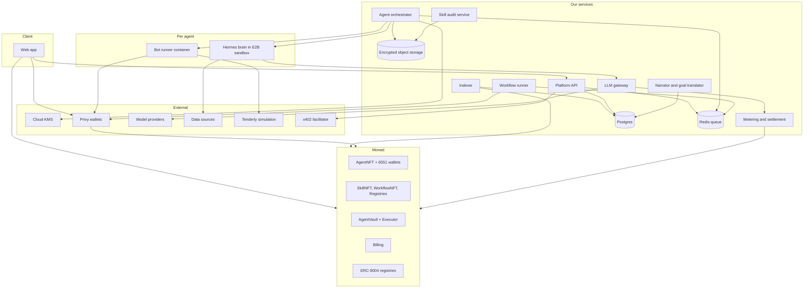
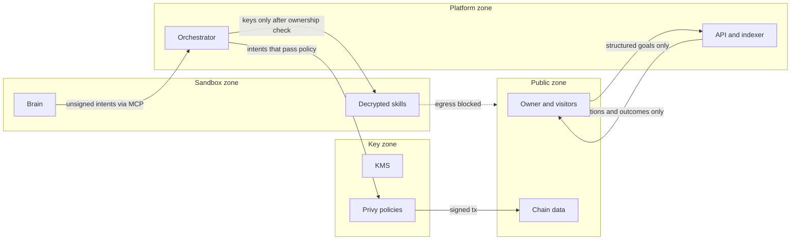
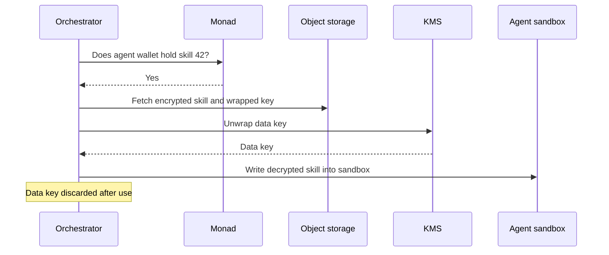
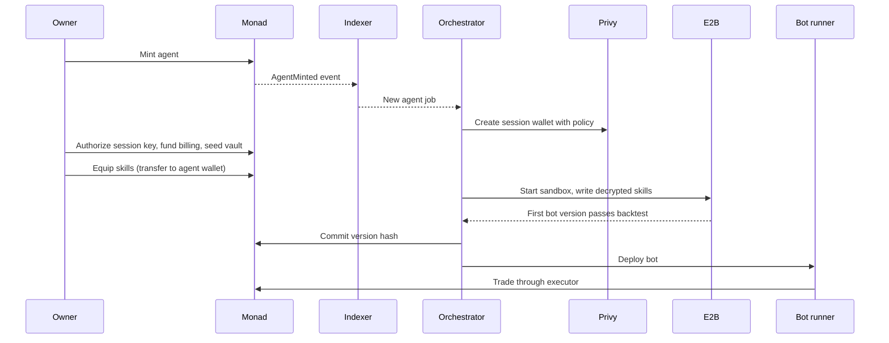
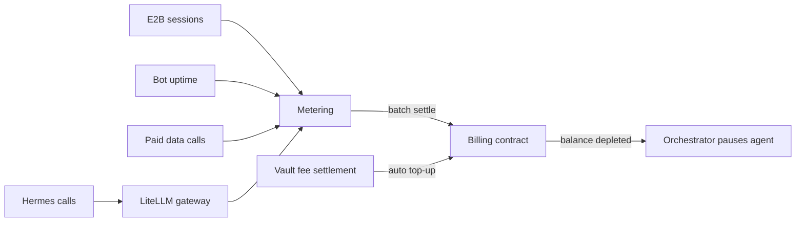
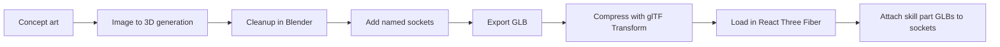

# Build Manual

*How the platform gets built, piece by piece. Revision 1, September 24, 2026.*

This manual is the working guide for building the platform. The architecture report explains what the system is; this document explains how to build it, which tools to use for each piece, and how every piece talks to every other piece.

Two labels are used throughout. **Use** means the tool is decided or is a clear default. **Research** means the choice is not settled yet, with a note on what to look for. Where a tool is marked Use, it was either confirmed during research or is a well-established default for that job.

---

## Part 1: The big picture

### 1.1 The services

The platform is made of about a dozen services. Some live onchain, some run on our servers, and some are external providers we call. The diagram below shows all of them and the lines of communication between them.



### 1.2 How the pieces talk

Everything in the system communicates through one of five channels. Keeping to these five makes the system easier to reason about and debug.

The first channel is **the chain itself**. Anything involving ownership, money, or proof is a transaction, and every important change emits an event. Offchain services never ask each other "who owns this skill" or "how much is in this vault"; they read it from the chain through the indexer. This makes the chain the single source of truth.

The second channel is **the indexer's database**. The indexer listens to contract events and writes them into Postgres tables and a GraphQL API. The frontend and most backend services read from here rather than calling the chain directly, because it is faster and cheaper.

The third channel is **the platform API**. The frontend calls it for anything that is not onchain: build cards, thesis statuses, activity feeds, backtest requests, skill uploads. It is a normal REST or GraphQL API.

The fourth channel is **the job queue**. Anything slow or scheduled goes through Redis: running a backtest, starting an agent, executing a workflow step, settling a billing batch. Services put jobs on the queue and workers pick them up. This keeps the API fast and makes retries simple.

The fifth channel is **MCP inside the agent**. The Hermes brain talks to its tools (chain tools, data tools, platform tools) through MCP servers. This is the only way the brain can affect anything outside its sandbox, which makes it the main control point for what an agent is allowed to do.

### 1.3 Trust boundaries

The most important design question is who can see what. The diagram shows four zones. Arrows crossing a boundary are the only places where data moves between zones, and each crossing has a rule.



The owner can send structured goals in and can see actions and outcomes, but nothing from the sandbox zone flows back to them directly. Skills are only decrypted into the sandbox zone after the orchestrator confirms ownership onchain. The brain can only produce unsigned transaction intents; signing happens in the key zone under policies the brain cannot change. The sandbox has no network path out except to an allowlist.

### 1.4 Environments

Three environments are needed. **Local** runs everything on a developer machine against an anvil fork of Monad mainnet, which gives real protocol contracts with fake money. **Testnet** runs on Monad testnet (chain 10143) and is where the contracts are deployed first and where judges can safely try the product. **Mainnet** (chain 143) runs the five demo agents with small real capital, because most of the protocols the agents trade on only exist on mainnet.

### 1.5 Repository layout

Use a single monorepo with a package manager that supports workspaces (pnpm is a good default). A layout like this keeps the chain-specific code isolated, which matters because the Solana build will copy everything except the chain folders.

```
/apps
  /web                 Next.js frontend
  /api                 Platform API
  /orchestrator        Agent lifecycle, key release, sandbox and bot control
  /workflow-runner     Executes workflow specs
  /metering            Usage aggregation and onchain settlement
  /audit               Skill audit service
/agent
  /hermes-config       Base Hermes configuration and system prompt
  /mcp-servers         Chain, data, and platform tools exposed to the brain
  /bot-templates       Starter bot code the brain modifies
/chain
  /monad
    /contracts         Solidity, Foundry project
    /adapters          Protocol adapters (onchain and TypeScript clients)
    /indexer           Envio config
/packages
  /chain-adapter       Interface every chain implementation satisfies
  /skill-format        SKILL.md parsing, validation, encryption helpers
  /workflow-spec       Workflow schema and validator
  /shared              Types, constants, utilities
```

---

## Part 2: Onchain layer

### 2.1 Tooling

**Use** Solidity with Foundry version 1.8 or later, which includes Monad's execution rules and can fork Monad mainnet with `anvil --fork-url https://rpc.monad.xyz`. **Use** OpenZeppelin contracts for ERC-721, ERC-1155, ERC-4626 accounting, access control, pausing, and reentrancy guards. **Use** Slither for static analysis of our own contracts before every deployment.

### 2.2 Contracts

**AgentNFT** is an ERC-721 with a tier per token. On mint it calls the canonical ERC-6551 registry at `0x000000006551c19487814612e58FE06813775758` to create the agent's token-bound account, then registers the agent in the ERC-8004 Identity Registry with a token URI that points to the agent's build card served by our API. **Use** the Tokenbound v3 account implementation and `@tokenbound/sdk`, which are already deployed on Monad. **Research** the exact ERC-8004 registry addresses on Monad in the Monad docs guide before deploying.

**SkillNFT** is an ERC-1155 where each token ID is one skill with a capped supply. **SkillRegistry** stores one record per skill: publisher, code hash, version, price, supply, creator stake, verified flag, royalty share, and the adapters the skill unlocks. Verified publishers register a signing key, and the registry checks their signature when they publish.

**WorkflowNFT** follows the same pattern as skills, with its own registry that also stores which skills a workflow requires. It can share the ERC-1155 contract with skills using separate token ID ranges, or be its own contract; separate contracts are simpler to reason about.

**AgentVault** is one vault per agent with ERC-4626 style share accounting. It tracks two separate balances: the owner's own capital, which the CFO features manage, and the public pool that depositors join. It enforces the owner's minimum stake in the public pool, charges performance fees only above a high-water mark, and splits fees between the owner and the creators of equipped skills. Withdrawals are always available after any lock period.

**Executor** is the only contract that can move vault funds, and it only accepts calls from the agent's authorized session key. Each call names an adapter and passes calldata. The executor checks the adapter is in the ProtocolRegistry and unlocked for this agent, enforces per-call size and slippage caps and a daily loss limit, and for atomic strategies checks that the agent's balance increased by at least a minimum profit or reverts. It has a pause switch controlled by the owner and an admin.

**ProtocolRegistry** is the allowlist of adapters. Each adapter is a small contract that wraps one protocol action, such as swap on Uniswap, place order on Kuru, open position on Perpl, supply or borrow on Morpho or Aave, or stake on aPriori.

**Billing** holds an allowance from each agent wallet. The metering service calls `settle(agentId, amount, usageHash)` in batches. When a balance hits zero it emits an event that the orchestrator listens for to pause the agent.

**Escrow** follows ERC-8183 for larger agent-to-agent jobs. This is lower priority than the rest.

### 2.3 Events are the interface

Every contract emits events that the offchain side depends on. Treat the event list as a public API and design it early, because the indexer, orchestrator, and frontend all build on it. The core events are agent minted, skill equipped and unequipped (which are ERC-1155 transfers into and out of a token-bound account), deposit, withdraw, trade executed, fee settled, bot version committed, billing settled, balance depleted, agent paused, and watcher followed.

### 2.4 Testing

Write Foundry tests against a mainnet fork so adapters are tested against the real Uniswap, Kuru, Morpho, and Aave contracts. **Use** Tenderly Virtual TestNets as a second option; Tenderly supports Monad with forked environments, simulation, node RPC, and alerting, which also makes it useful for sharing a persistent test environment across the team.

---

## Part 3: Keys, privacy, and the code-hiding layer

This is the most sensitive part of the build. It answers three questions: who holds keys, how skills stay hidden, and how the sandbox is kept from leaking.

### 3.1 Wallet and signing keys

**Use** Privy for user login and for server wallets. Privy supports Monad mainnet and testnet with gas sponsorship, supports Solana, and has a policy engine that enforces limits such as transfer caps, contract allowlists, recipient restrictions, and time windows at the infrastructure level. Each agent gets a Privy server wallet that acts as its session key. The owner authorizes that session key on the agent's token-bound account and vault. The Privy policy for each session key allows calls only to that agent's executor, so even if everything else failed, the key could not send funds anywhere else.

### 3.2 Hiding skill code

Skills are protected with envelope encryption. When a creator uploads a skill, the audit service generates a random data key, encrypts the skill folder with AES-256-GCM, stores the encrypted blob in object storage, and encrypts the data key itself with a master key in a cloud KMS. The encrypted data key is stored next to the blob. The plaintext data key is thrown away.

When an agent needs a skill, the orchestrator reads the chain to confirm that the agent's token-bound account holds the skill token, asks KMS to decrypt the data key, decrypts the skill, and writes it directly into that agent's sandbox. The KMS permission to decrypt is only granted to the orchestrator's service identity, so no other service and no person can decrypt skills without going through the ownership check.

**Use** a cloud KMS (AWS KMS or Google Cloud KMS) for the master key and **Use** S3-compatible object storage (AWS S3 or Cloudflare R2) for the encrypted blobs.



**A note on Lit Protocol.** Lit is a decentralized network that releases decryption keys to anyone who meets an onchain condition, such as holding an NFT. It is tempting for this job, but it has a catch in our design: the owner controls the agent's token-bound account, so a plain "holds the skill" condition would let the owner decrypt the skill themselves. Lit would only work if the condition also requires the request to come from our runtime's key, which removes most of the decentralization benefit. Envelope encryption with KMS is simpler and equally strong for the hackathon. **Research** Lit later only if creators ask for a trust model that does not depend on us holding keys, and in that case check whether Monad is on Lit's supported chains list.

### 3.3 Moving to hardware protection later

The long-term answer to "creators have to trust us with their code" is a trusted execution environment, where decryption and execution happen inside a hardware enclave that even we cannot inspect, and the enclave produces an attestation proving what code is running. **Research** Phala Cloud (dstack), AWS Nitro Enclaves, and Marlin Oyster. Look for three things: whether the enclave can run a full agent with network access, how attestation can be verified onchain or published, and cost per always-on instance. This is not needed for the hackathon.

### 3.4 Keeping the sandbox from leaking

**Use** E2B's network controls. E2B sandboxes can deny all outbound traffic and then allow a specific list of domains, IPs, or wildcards such as `*.monad.xyz`. Each agent sandbox allows only our LLM gateway, our platform API, approved data source domains, and the Monad RPC. Nothing else.

E2B also supports injecting a header at its firewall so a secret authenticates outbound requests without ever entering the sandbox. **Use** this for the LLM gateway key and any paid data API keys, so a malicious skill cannot find and steal credentials inside the sandbox.

### 3.5 Stopping leaks through the brain

The brain can still leak a skill through what it writes, even with network egress blocked. Three rules close this. The owner has no chat channel; a goal translator converts owner input into structured config, and the brain never sees raw user text. Everything the owner reads (activity feed, research notes, approval cards) is written by a separate narrator model that only sees actions and outcomes. And the bot code the brain writes stays inside the platform; the owner sees version fingerprints and metrics, never source.

---

## Part 4: The agent runtime

### 4.1 The brain

**Use** Hermes Agent from Nous Research as the brain. It is open source under the MIT license, has persistent memory, a skills system compatible with the SKILL.md format, MCP support, scheduled tasks, and works with OpenRouter, OpenAI, Anthropic, or any custom endpoint. We point its model endpoint at our LLM gateway so every call is metered. Each agent runs its own Hermes instance inside its own E2B sandbox, configured with a base system prompt, the agent's decrypted skills, and our MCP tool servers.

If Hermes turns out to be difficult to run headless in a sandbox, the fallback is to build the brain loop directly on a model SDK with a simple planner. **Research** OpenClaw as the second option, since Virtuals offers both Hermes and OpenClaw as hosted runtimes.

### 4.2 The build sandbox

**Use** E2B for the sandbox where the brain writes and tests code. E2B uses Firecracker microVMs built for AI agents. Sessions cap at 1 hour on the free tier and 24 hours on the Pro plan, so the orchestrator treats sandboxes as temporary: it starts one for a research or build session, and shuts it down afterward. Anything that must persist (thesis board, memory, bot source) is saved to our storage, not kept in the sandbox.

### 4.3 The bot runner

Live trading bots need to run all the time, so they cannot live in E2B. Each bot runs in a small always-on container that only holds the compiled bot, the executor address, and access to its Privy session key through our signing service. **Research** the host: compare Fly Machines, Railway, and a plain VPS with Docker. The deciding factor is latency to a good Monad RPC, because fast skills depend on it. Pick the region closest to your RPC provider.

**Research** a dedicated Monad RPC. The public RPC is fine for development but will rate-limit many agents. Tenderly offers Monad node RPC; check other providers listed in the Monad infra directory and compare latency and rate limits.

### 4.4 Tools the brain can use (MCP servers)

The brain only acts through MCP tools. Build three MCP servers.

The **chain tools server** reads balances, positions, prices, and protocol state, and prepares unsigned transaction intents for the executor. **Use** `monad-agent-kit` as a starting point, since it already prepares unsigned transactions without exposing keys to the agent. Wrap it with our own tools for each registry adapter. **Research** Enso: it routes interactions across many protocols through one engine and is listed in Monad's infra directory. If it covers Uniswap, Kuru, Morpho, and Aave on Monad, it could replace several hand-written adapters.

The **data tools server** exposes the discovery sources in Part 6 as simple tools like `get_pool_yields`, `get_event_history`, `search_web`, and `read_url`.

The **platform tools server** lets the brain write to its thesis board, request a backtest, propose a bot version, and read its own goals and limits.

### 4.5 Testing new bot versions

When the brain writes a new bot version, it runs a backtest inside the sandbox against an anvil fork of Monad mainnet, using Envio HyperSync for historical event data to replay market conditions. The backtest produces return, drawdown, win rate, and trade count. The orchestrator compares these against the current version, and only if the new version is better by a set margin does it commit the version fingerprint onchain and deploy the new bot.

### 4.6 Checking every transaction before signing

Before any transaction is signed, it goes through two checks. First, a simulation to confirm it does what the intent says and will not fail. **Use** Tenderly's transaction simulator, which supports Monad and can preview transactions and bundles. Second, a security screen for malicious contracts and unusual patterns. **Research** Blockaid, which is listed in Monad's docs as a real-time threat detection platform; confirm its transaction scanning API covers Monad. If it does not, fall back to our own rules: the target must be a registered adapter, and the simulated balance changes must match the intent.

### 4.7 Fast execution and MEV on Monad

Fast skills need to understand how ordering works on Monad, because it is different from Ethereum. Monad does not have a public mempool in the usual sense, so early MEV is almost entirely top-of-block competition. FastLane's MEV Protocol runs a validator sidecar that orders top-of-block and backrun bids sent to its Auction Handler contract through the normal transaction flow. bloXroute also runs its BackRunMe program on Monad. A skill that does arbitrage or backruns should integrate the FastLane Auction Handler. **Research** FastLane's searcher documentation before writing the MEV skill.

### 4.8 Agent lifecycle

The orchestrator manages each agent through a simple sequence, which is also the order to build it in.



---

## Part 5: Workflows and the onchain CFO

### 5.1 The workflow runner

Workflows are declarative specs (YAML or JSON) with a trigger, conditions, steps, guardrails, and an approval mode. The workflow runner is a worker service on the job queue. **Use** Redis with BullMQ for the queue and scheduling; it handles cron triggers, retries, and delayed jobs. Condition triggers such as "health factor below 1.6" are checked by a watcher process that reads indexed state on each block or on a short interval and enqueues the workflow when the condition is met. **Research** Temporal or Inngest only if workflows start needing long-running steps with complex retries; for the hackathon, BullMQ is enough.

Each step either calls a tool directly (for example `repay`, `supply`, `swap`), which produces an unsigned intent that goes through the same simulation, policy, and executor checks as any bot trade, or calls an LLM step when judgment is needed. Most steps should be direct calls, which keeps workflows cheap and predictable.

The workflow spec schema lives in `/packages/workflow-spec` with a validator, so the creator portal, the runner, and the audit service all use the same rules.

### 5.2 Approvals

When a workflow step needs approval, the runner writes a pending action to the database and the narrator model writes a short plain-English card from the proposed action alone. The owner approves or rejects in the web app, which calls the API, which releases or cancels the job. Approvals expire after a set time.

### 5.3 Goals engine

Goals are stored in Postgres as part of the agent's config. The goal planner workflow turns goals into buckets with target allocations. Buckets are tracked offchain as labels on the owner's capital inside the vault, not as separate contracts, which keeps the contracts simple. The rebalancer workflow compares actual holdings per bucket against targets and proposes trades when drift passes the threshold.

### 5.4 Liability manager

The liability manager reads loan positions from Aave, Morpho, and Curvance through their contracts or APIs: collateral, debt, rate, and health factor. The debt guardian workflow watches health factors. The debt refinancer compares borrow rates across markets and proposes a move when the saving over a set period beats the gas and slippage cost of moving. **Research** each lending protocol's SDK or API for reading positions on Monad; Morpho and Aave both have well-documented APIs, but confirm Monad coverage.

### 5.5 Tax lot ledger

A simple Postgres table records every lot the agent buys for the owner's own capital: asset, quantity, cost in USD, timestamp, and transaction hash. Sells consume lots in a chosen order (first in, first out by default). The tax lot tracker workflow computes unrealized gains and losses per position and flags harvest opportunities for approval. A CSV export covers reporting. Keep it at that.

---

## Part 6: Discovery and data sources

### 6.1 Sources

**Use** the DefiLlama Yields API for scanning. It covers Monad pools with base and reward APY, 30-day mean, IL risk, and TVL, and refreshes roughly hourly.

**Use** Envio HyperSync for fast historical and live event data on Monad, which feeds both discovery dives and backtests, at the endpoint `https://monad.hypersync.xyz`.

**Use** Dune for deeper analytics queries.

**Use** the CoinGecko API for prices and market data; it is listed in Monad's docs and includes onchain DEX data such as trending pools and new pools, which is useful for scanning.

**Use** the official X API on pay-per-use for social data at small scale. There are no subscription tiers anymore for new developers; it costs $0.015 per post created and $0.005 per post read, capped at 3 million reads a month. For the hackathon, keep reads low by querying a curated list of accounts and keywords, and cache aggressively since X deduplicates charges for the same post within a day. Third-party X data providers are much cheaper but carry terms-of-service risk, so avoid them for anything public.

**Research** Token Terminal: check whether it covers Monad protocols and what its API plan costs. If coverage is thin, skip it and rely on DefiLlama for protocol metrics.

**Use** a web search API for reading docs, news, and deep dives. Exa and Tavily are both built for AI agents; pick one. **Use** Firecrawl for turning documentation sites and whitepapers into clean text.

**Research** price oracles on Monad for the executor's slippage and profit checks. Chainlink provides data feeds on Monad; confirm which pairs are available and whether Pyth or RedStone cover gaps.

### 6.2 Storage of research

The thesis board is a Postgres table owned by the platform, written by the brain through the platform tools server. Evidence is stored as short text plus source links. Owners see status, confidence, and expiry through the API; the evidence text is not exposed.

### 6.3 Cadence control

The orchestrator schedules each stage. Scans run on a schedule using a cheap model. Dives, challenges, and zoom-outs use a stronger model and are limited by the agent's per-day budget in the LLM gateway, so a rabbit hole always ends when the budget does. Big market events trigger an early zoom-out through the risk sentinel workflow.

---

## Part 7: LLM gateway, metering, and billing

### 7.1 LLM gateway

**Use** LiteLLM Proxy as the gateway. It is an open-source, OpenAI-compatible proxy that supports per-key budgets, spend tracking, rate limits, and routing to many model providers. Each agent gets its own virtual key with a budget. Hermes calls the gateway with that key, never a provider key directly. Behind the gateway, route to providers directly or through OpenRouter for model choice.

### 7.2 Metering

The metering service collects four kinds of usage per agent: LLM spend from the gateway's logs, sandbox minutes from E2B session records, bot runner uptime from the container host, and paid data calls from our data tools server. Every few hours it totals each agent's usage, applies the markup, and settles one transaction per agent on the Billing contract. The usage breakdown is saved in Postgres and its hash is included in the settlement so it can be audited.

### 7.3 Pausing and top-ups

The orchestrator listens for balance-depleted events and stops that agent's sandbox, bot, and workflows. If auto top-up is on, the vault's fee settlement sends part of the owner's share to the billing balance before it runs out.



---

## Part 8: Indexing, API, and storage

### 8.1 Indexer

**Use** Envio HyperIndex to turn contract events into Postgres tables and a GraphQL API. It runs on Monad mainnet and testnet. Every event listed in Part 2.3 gets a handler that updates the relevant tables: agents, skills, holdings, vault positions, trades, versions, billing, watchers.

### 8.2 Platform API

**Use** TypeScript on Node with a lightweight framework (Hono or Fastify). The API serves build cards (which are also the ERC-8004 agent card URIs), thesis statuses, activity feeds, approvals, backtest requests, and the creator portal. It reads onchain data from the indexer's tables and platform data from its own tables, and it puts slow work on the queue.

### 8.3 Databases and storage

**Use** Postgres for everything relational (a managed service like Supabase or Neon is fine). **Use** Redis for the queue and caching. **Use** S3-compatible object storage for encrypted skills, bot source, and 3D assets. **Use** IPFS through a pinning service such as Pinata for public NFT metadata and images, so NFTs display correctly on other marketplaces.

---

## Part 9: Payments between agents

**Use** x402 for per-call payments such as real-time signals and copy trades. Monad runs an official x402 facilitator on testnet and mainnet. Two details matter: the facilitator only supports x402 version 2 and later, and for the "upto" payment scheme use `@x402/evm` version 2.12.0 or later, since versions 2.9 to 2.11 point to a proxy that is not deployed on Monad. The signal feed endpoint on our API returns HTTP 402 with payment requirements, the buying agent's tool pays from its wallet, and the facilitator verifies and settles.

For larger jobs, the ERC-8183 escrow contract from Part 2.2 holds funds until the provider delivers.

---

## Part 10: Frontend and 3D

### 10.1 App stack

**Use** Next.js with React and TypeScript. **Use** wagmi and viem for chain interaction, Privy for login and embedded wallets, and TanStack Query for data fetching and caching. **Use** a component library that is easy to restyle (shadcn/ui on Tailwind is a good default) so the custom visual style can be applied without fighting the library. **Use** Recharts or lightweight charting for equity curves and stat bars.

### 10.2 3D pipeline

The 3D agents and skill parts need a pipeline from concept art to something the browser can load quickly.



Start with concept art from the other chat. **Research** image-to-3D tools to turn that art into base models: Meshy, Tripo, and Tencent's Hunyuan3D are the main options. Look for mesh quality on hard-surface mechanical shapes, clean topology, texture quality, and whether the license allows commercial use. Expect to clean up every model by hand.

In Blender, each base agent model gets empty objects placed at each mount point and named consistently, such as `socket_head`, `socket_back`, `socket_rear`, `socket_leg_left`. Each skill part is modeled with its origin at the point where it attaches. Export both as GLB. **Use** glTF Transform to compress meshes (Draco or Meshopt) and textures, which keeps files small enough to load quickly.

In the browser, **Use** React Three Fiber with the drei helper library. Load the base agent GLB, find the socket objects by name, and parent each equipped skill's GLB to its socket. Swapping a skill is then just changing which GLB is attached, which makes drag-and-drop equipping straightforward. Add a simple glow material for empty sockets and emissive accents. Use lower-detail versions of models for gallery thumbnails.

---

## Part 11: Skill audit service

The audit service runs when a skill or workflow is uploaded, before it is encrypted and listed. It first validates the package format against the schema in `/packages/skill-format`. It then runs static checks: Semgrep rules for the languages skills are written in (look for network calls, filesystem access outside the skill folder, environment variable reads, dynamic code execution, and obfuscation), and Slither if the skill includes Solidity. Finally it runs an LLM review of the instructions and code with a prompt focused on key access, data exfiltration, hidden behavior, and attempts to override platform rules. The results are saved as an audit report, and the skill is marked approved, rejected, or needs review. For the hackathon, needs-review goes to a human (you).

The audit service is the only other service that sees plaintext skills besides the orchestrator, and it only sees them at upload time.

---

## Part 12: Observability and operations

**Use** Langfuse to trace every LLM call, tool call, and cost per agent; it is open source and integrates with LiteLLM. **Use** Sentry for errors across the API, orchestrator, and frontend. **Use** Tenderly alerts on the executor and vault contracts for unusual activity. Build a small admin page that shows every agent's status, spend, last action, and a pause button. Keep a global kill switch that pauses all executors at once.

---

## Part 13: The Solana build

The Solana repo copies everything outside `/chain` and implements the same `chain-adapter` interface with Solana tools. **Use** Rust with Anchor for programs. **Use** Metaplex Core agents, which give each agent an identity record, a built-in PDA wallet called the Asset Signer, and an execution permission the owner can revoke. Skills and workflows become Core assets held by the agent's PDA wallet. **Use** Solana Agent Kit in place of `monad-agent-kit`, since it already covers dozens of Solana protocols. **Use** Privy wallets, which support Solana with the same policy engine. **Use** a DAS provider such as Helius for indexing, since the DAS API now indexes agent fields. x402 also works with Metaplex Core agents. **Research** Solana fork testing: a local validator with cloned mainnet accounts is the usual approach, and there may be better tools worth comparing.

---

## Part 14: Build sequence

The order below is about dependencies, not timing. Each stage makes the next one possible.

The first stage is the **chain foundation**: AgentNFT with token-bound wallets, SkillNFT with the registry, the vault, the executor with two or three adapters, and the indexer. At the end of this stage, you can mint an agent, equip a skill, deposit, and execute a trade by hand through the executor on testnet.

The second stage is **one agent that thinks**: the orchestrator, one E2B sandbox running Hermes with the chain and data MCP servers, envelope-encrypted skills, the LLM gateway, and the bot runner. At the end of this stage, one agent can research, write a bot, backtest it on a fork, commit its version, and trade.

The third stage is **the CFO and workflows**: the workflow runner, the goal planner, rebalancer, idle cash sweep, and debt guardian, plus approvals. At the end of this stage, the agent manages goals and debt, not just trades.

The fourth stage is **the product surface**: the configure page with 3D models, the marketplace, agent profiles, the gallery, and the CFO dashboard.

The fifth stage is **the economy and feedback**: metering and billing, watchers, deposits from other wallets, signal feeds over x402, build cards on ERC-8004, and signed attestations.

The sixth stage is **the demo**: five agents on mainnet with small capital, seeded skills and workflows, and the demo video.

---

## Part 15: Open research list

Everything marked Research, in one place, with what to decide.

| Item | What to decide |
|---|---|
| ERC-8004 addresses on Monad | Exact registry addresses from the Monad guide |
| Bot runner host | Fly Machines, Railway, or VPS, based on latency to RPC |
| Dedicated Monad RPC | Provider with the best latency and rate limits |
| Enso | Whether it covers the registry protocols on Monad |
| Blockaid | Whether its transaction scanning covers Monad |
| FastLane searcher docs | How to integrate the Auction Handler for MEV skills |
| Lending protocol APIs | Monad coverage for reading Aave, Morpho, and Curvance positions |
| Token Terminal | Monad coverage and API cost |
| Web search API | Exa or Tavily |
| Price oracles | Which Chainlink feeds exist on Monad, and gaps |
| Image-to-3D tool | Meshy, Tripo, or Hunyuan3D, based on mechanical model quality and license |
| Temporal or Inngest | Only if BullMQ is not enough |
| OpenClaw | Fallback brain if Hermes is hard to run headless |
| TEE provider | Phala Cloud, AWS Nitro, or Marlin Oyster, for later |
| Lit Protocol | Only if creators need a trust model independent of us |
| Solana fork testing | Best tool for replaying mainnet state locally |
