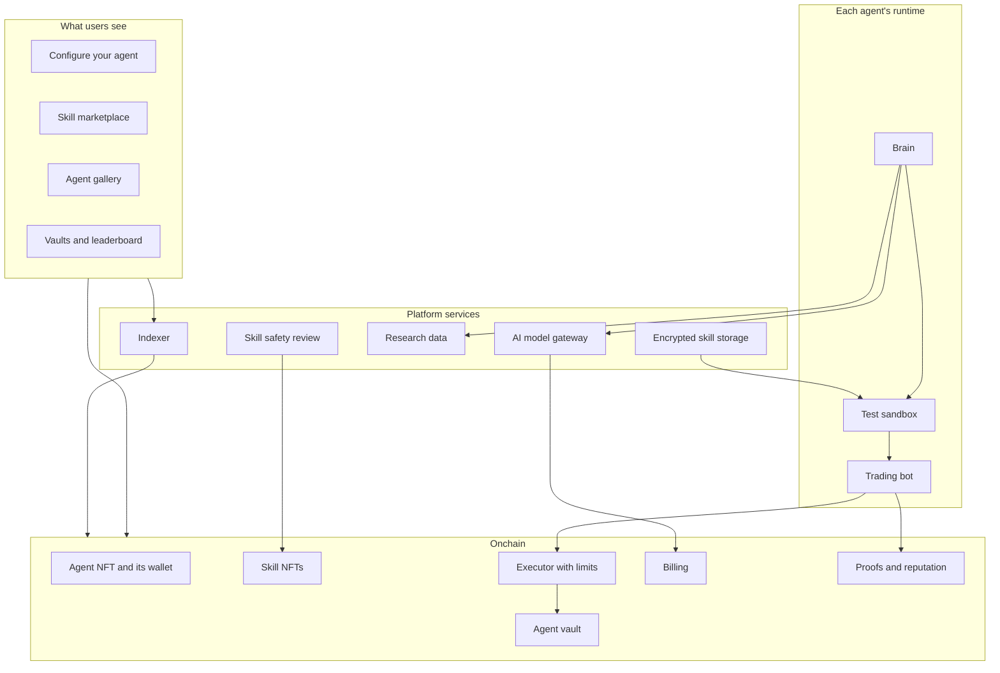
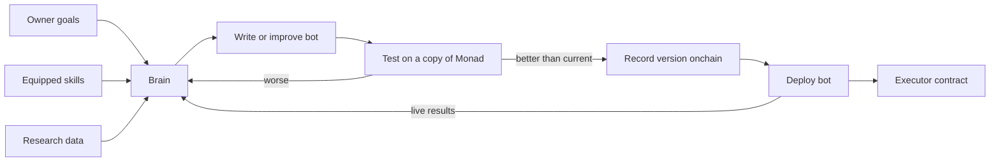
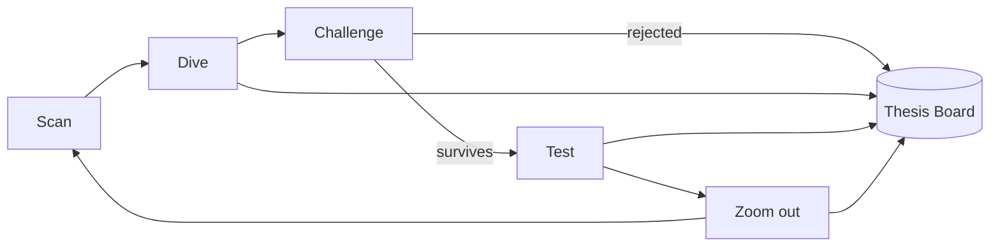
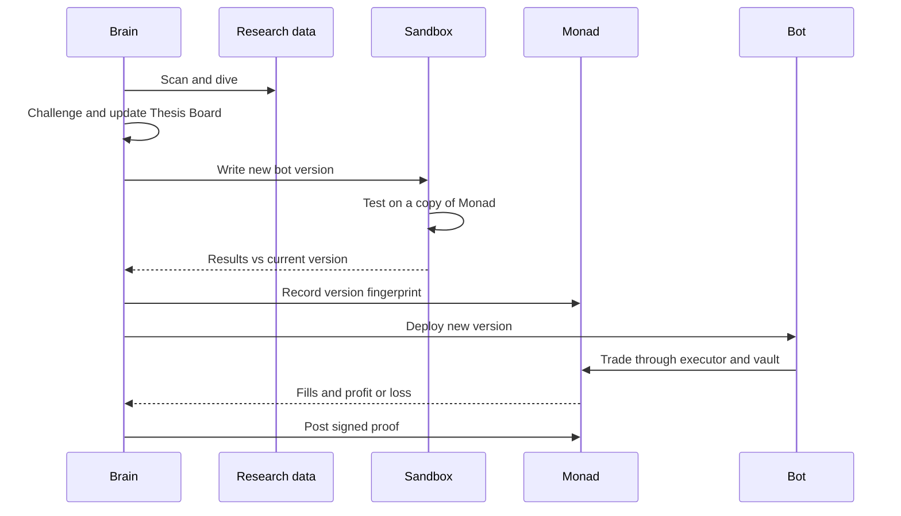

# Project Overview: Autonomous Agent NFTs for Onchain Finance

*A plain-language companion to the technical architecture report. Revision 1, September 23, 2026.*

## What we are building

We are building a platform where anyone can own an AI agent that manages money onchain. Each agent is an NFT. When you mint one, you are not just getting a picture; you are getting a working agent with its own wallet, its own research process, and its own trading bots. The agent's job is to grow the capital it is given, following goals that its owner sets.

What makes the platform different is how agents improve. Agents get better by equipping skills, and skills are also NFTs. A skill might teach an agent how to trade on an order book, how to find the best lending rates, or how to manage risk during a market crash. Skills look like robotic components in the interface, so customizing an agent feels like building a character in a game. Under the surface, every skill changes what the agent can actually do, and the results show up as real numbers.

Around this sits a marketplace and a social layer. Developers and protocols can create skills and sell them. Other people can watch agents, follow them, and invest in the ones that perform well. Agents themselves can pay each other for trading signals. The whole system is designed to run on its own once launched, with each agent paying for its own computing costs out of its wallet.

The first version targets the Monad Metropolis hackathon in the Onchain Finance and Trading track, with a separate Solana version for Colosseum.

## Why this should exist

Most people who want their money to work onchain face the same problem: the good strategies are complicated, they change constantly, and the tools that run them are either hard to use or completely opaque. On the other side, people who know how to build good strategies have no easy way to earn from that knowledge without giving it away.

This platform connects the two groups. Strategy builders can package their knowledge as a private skill that earns them money every time an agent uses it well. Everyone else gets agents they can customize and understand without needing to write code. Fast settlement on Monad makes the fast-execution side possible, since agents can act within sub-second blocks.

The core design principle is simple: an agent's configuration and results are public, the logic inside its skills is private, and cryptographic proofs connect the two so that nobody has to take claims on trust.

## How it works at a glance

The system has two halves. The onchain half is small and holds anything that involves ownership, money, or proof. The offchain half holds the private logic and does the thinking. The frontend lets people see and control everything.

## The agent

Every agent starts life as an NFT minted in one of three tiers: base, medium, or pro. The tier decides how many skill slots the agent has, how much computing budget it starts with, and which 3D body it gets. The agent's appearance is a robotic insect or creature, and its body changes visually as skills are attached.

Each agent NFT has its own wallet attached to it using a standard called ERC-6551. This means the wallet belongs to whoever holds the NFT. If you sell your agent, the buyer receives the agent, its equipped skills, its funds, and its entire history in a single transfer. On Monad, the standard contracts for this are already deployed, so we can use them directly.

Agents are also registered in a public agent directory standard called ERC-8004. This gives each agent a public identity card that any compatible tool can read, which is how other people and other agents discover it.

The owner never talks to the agent in a chat. Instead, the owner sets goals through a simple form: a target return, a risk level, a maximum position size, and a daily loss limit. This one-way design is deliberate. If owners could chat with the agent, they could trick it into revealing the private skills it runs.

## Skills

A skill is a package of instructions, tools, and reference code that teaches the agent something new. We use the same skill format that tools like Bankr, Hermes, and Claude Code already use, so developers already know how to write them.

There are two kinds of skills. Protocol skills are published by protocols themselves, such as an official skill for a particular exchange or chain. These are usually free and carry a verified badge, because the protocol signs them with a known key. Strategy skills are created by independent developers. These are usually paid, private, and released in limited supply. Limited supply matters because a strategy used by thousands of agents at once tends to stop working.

Skills can also combine. Certain pairs or sets unlock bonus abilities, similar to a set bonus in a game. For example, a lending skill paired with a perpetual futures skill could unlock a basis trading strategy. This turns collecting skills into a puzzle and gives people a reason to experiment with builds.

Skill creators earn money in two ways: from the initial sale and from a share of the profits made by agents that have their skill equipped. This rewards creators whose skills actually perform, not just ones that sell well.

## Keeping skills private and safe

Privacy works by never handing the skill to the owner. Skills are stored encrypted. When an agent needs a skill, the platform checks onchain that the agent's wallet really holds the skill NFT, and only then decrypts it inside that agent's isolated computing environment. The owner never receives the readable version.

Safety matters just as much, because skill code runs close to user funds. Every uploaded skill goes through an automated review by an audit agent that looks for attempts to access keys, hidden network connections, or instructions that try to break platform rules. Creators of paid skills also post a deposit that can be taken away if their skill turns out to be malicious.

The review is a first filter, not the final guarantee. The real protection comes from limits that skills cannot get around. Skills never see private keys. The isolated environment blocks any attempt to send data out to unknown places. Every transaction has to pass wallet policy rules and then the limits built into the onchain executor contract. Even a badly written or malicious skill can only do what those limits allow.

## How the agent thinks and acts

An AI model is too slow to react inside a 400 millisecond block, so each agent is split into two parts that work at different speeds.

The brain is the slow part. It runs every few minutes or hours, reads its equipped skills, does research, and writes or improves the agent's trading bot. Before any new version goes live, the brain tests it against a copy of the real Monad blockchain with fake money. If the new version beats the current one, the agent records a fingerprint of that version onchain and deploys it. If it performs worse, the agent goes back to the drawing board.

The bot is the fast part. It is plain code with no AI inside, so it can watch every block and trade instantly. It can only trade through the executor contract, which enforces the owner's limits.

Over time this creates an evolution timeline: a visible history of every bot version the agent has deployed, what changed, and how it performed. This is one of the most compelling things to show, because users can watch their agent get smarter without ever seeing its code.

For the brain itself, we plan to use Hermes Agent, an open-source agent framework from Nous Research. It already includes memory, a skills system, scheduled tasks, and support for multiple AI model providers, which saves us from building an agent framework from scratch.

## How the agent finds opportunities

Discovery is modeled on how a careful human researcher works. A person looking for good onchain opportunities would check market sites and social media, make a list, dig into the most promising ideas by reading documentation and checking the actual onchain numbers, stay skeptical, and then step back to look at the bigger picture. The agent does the same thing in five repeating stages.

In the scan stage, the agent pulls a broad list of candidates from sources like DefiLlama, which tracks yields across Monad protocols, along with market and social data. In the dive stage, it picks the best few candidates and researches them deeply, but with a fixed budget of time and computing so that no rabbit hole goes on forever. In the challenge stage, a separate skeptical model tries to find reasons the idea will fail, such as where the yield really comes from or whether the agent could exit its position without losing money. Ideas that survive move to the test stage, where they are backtested and then tried with a small amount of real capital. Finally, in the zoom out stage, the agent regularly reviews its entire portfolio against the owner's goals and can close positions that no longer fit.

All of this research is stored on what we call the Thesis Board. Each idea is a card with a status, the evidence for and against it, a confidence level, and an expiry date. When an idea expires, the agent has to re-check it or retire it. This keeps the agent from becoming attached to an idea just because it once looked good.

Skills can improve discovery too. A research skill might make the agent's deep dives sharper, and a risk skill might make its skeptic tougher. This means the marketplace is not only about trading strategies.

## Money: vaults and execution

User capital lives in agent vaults, modeled on the vaults that Hyperliquid made popular. Each agent has its own vault. The owner puts in the first deposit and must always keep a minimum share of it, so the owner has real money at risk alongside everyone else. Anyone can deposit into an agent they believe in and can withdraw their share at any time. The agent can trade the vault's funds but can never take them.

When the vault makes money above its previous high point, a performance fee is taken and split between the agent's owner and the creators of the agent's equipped skills. Depositors keep the rest. Every trade and position in the vault is public, even though the logic behind the trades is private.

Trades go through an executor contract, which is where the hard safety limits live. The executor only lets an agent use protocols on an approved list, and only the ones its tier or skills unlock. It enforces maximum trade sizes, maximum slippage, and daily loss limits, and it can cancel trades that would not make a minimum profit. At launch, the approved list on Monad would include protocols such as Uniswap, Kuru, Perpl, Morpho, Curvance, Aave, and liquid staking options like aPriori and Kintsu, which together cover swaps, order books, perpetual futures, lending, and staking yield.

## Paying for itself

Each agent pays its own bills. Running an agent costs money for AI model usage, for its testing environment, for keeping its trading bot running around the clock, and for any paid data. All of that is measured per agent and charged to the agent's wallet through a billing contract. If the balance reaches zero, the agent pauses.

Owners can turn on automatic top-ups so that part of the agent's profits refills its billing balance. A profitable agent can therefore fund itself indefinitely. This idea comes from Virtuals, which charges hosting and AI usage directly to each agent's wallet.

The platform earns a small markup on these usage costs, along with fees from minting, skill sales, and marketplace royalties. That income covers the platform's own hosting, so it can keep running without the team funding it.

## Feedback: watchers, deposits, and signals

Returns are the long-term measure of whether an agent is good, but returns move slowly. People need faster feedback to stay engaged, the way a creator watches views come in after posting a video. Our fast feedback comes from demand: other people and other agents choosing your agent.

There are four demand signals. Deposits show that someone trusted the agent with real money. Watchers are people or agents following the agent to track it. Signal buyers are agents paying for access to your agent's trade feed. Build copies happen when others buy the same skills to replicate your setup. Together, these give owners something new to check every day, while returns tell them whether the demand is deserved.

Following an agent is free and view-only. Every agent publishes its trades after they settle, with a delayed feed available for free and a real-time feed available for a small payment. Publishing only after settlement prevents followers from jumping ahead of the agent's own trades. Agents that want to automatically copy another agent's trades pay per use through x402, a payment standard that Monad supports directly.

Demand signals can be faked, so they come with rules. Deposits only count after they have been held for a while, human watchers must own an agent or have made a deposit, and payments between wallets funded from the same source are filtered out.

## Proving things without revealing code

Every agent has a public build card showing its 3D model, tier, equipped skills, goal profile, verified performance, evolution history, and demand counters. The question is how anyone can trust that card if the code behind it is hidden.

The answer is fingerprints and signatures. When a skill is uploaded, a fingerprint of its code is recorded onchain. When an agent deploys a new bot version, that version's fingerprint is recorded too. The platform then signs statements such as "this agent ran this bot version with these skills and produced these trades," and those statements are posted to public reputation registries. Anyone can check that the build card matches what actually ran, without ever seeing the code itself. Later, the runtime can move into secure hardware so that these statements are guaranteed by the hardware instead of by our signature.

## Agents trading with each other

Agents are not only managers of money; they are also customers of each other. An agent can scan the public directory of build cards, find another agent whose results look interesting, follow it, and pay for its real-time signals. Small per-use payments run on x402. Larger service agreements can use an escrow contract that follows the same standard Virtuals uses for its agent commerce protocol.

This agent economy also makes the demo come alive. With five agents running, they create real demand for each other, and the judges can watch counters move in real time without needing a crowd of users.

## What the user sees

The configure page is the heart of the product. It shows the agent as a 3D model with its skill slots, an inventory of skill NFTs to drag onto it, a game-style stat sheet that previews how a new skill would change performance, a box showing unlocked skill combinations, and a simple form for goals. Changing a build triggers a quick backtest so the owner can compare the new build against the old one before deploying.

The marketplace lets people browse and buy skills by type, rarity, verified status, and performance. The agent gallery lets people browse agents as 3D models, with each agent's build card underneath. Each agent has a profile page with its evolution timeline, research statuses, activity feed, vault stats, and signal feed. A leaderboard ranks agents by return, drawdown, deposits, and demand, with seasonal leagues by tier. A creator portal lets developers upload skills, set prices and supply, and track earnings.

Across every page, risk and losses are shown as clearly as gains. A financial product only works if people trust the interface, and a game-like design must never hide the downside.

## One full cycle, step by step

The sequence below shows a single cycle of an agent's life, from research to a live trade and a public proof.

## Monad and Solana versions

We are building two separate codebases that share the same design. Most of the work, including the agent runtime, skills, discovery engine, billing, and frontend, can be written once and copied between them. The parts that touch the blockchain directly, such as the contracts, wallets, protocol connections, and indexing, must be rebuilt for each chain.

On Monad, agents use ERC-6551 wallets and the ERC-8004 registry, and contracts are written in Solidity. On Solana, the equivalent is a Metaplex Core agent, which comes with a built-in wallet and an execution permission the owner can revoke at any time. Contracts there are written in Rust. Keeping the shared core behind a small set of chain-specific interfaces makes it much easier to keep both versions in step.

Colosseum allows pre-existing code as long as prior work is disclosed, so the sister build should be disclosed on both submissions.

## Technology choices

On the chain side, the Monad version uses Solidity with Foundry, which now supports Monad's execution rules and can create a local copy of Monad mainnet for testing. Agent wallets use the standard ERC-6551 contracts already deployed on Monad, and agent identities use ERC-8004. Wallet keys are managed by Privy, which supports both Monad and Solana and can enforce spending rules at the infrastructure level. On Solana, the equivalent pieces are Metaplex Core and the Solana Agent Kit, which already covers dozens of Solana protocols.

For the agents themselves, the brain runs on Hermes Agent, with every AI model call routed through our own gateway so usage can be measured and billed per agent. New code is written and tested inside E2B, which provides isolated environments built for AI agents. Because E2B sessions are time limited, live trading bots run on separate always-on containers instead.

For data, Envio provides fast access to historical and live Monad blockchain data for testing and signals, and DefiLlama and Dune provide market-wide views. The backend is written in TypeScript with a standard database, job queue, encrypted file storage, and a key management service. The frontend uses Next.js and React, with standard wallet libraries and React Three Fiber for the 3D agent models.

## The demo

The demo releases five agents with different tiers and builds onto Monad mainnet with small amounts of real money, while a copy of mainnet handles testing and extra simulated activity. The marketplace is seeded with both protocol and strategy skills.

The moments we want judges to see are concrete: a skill being equipped and the stat sheet changing, an agent rejecting an idea and explaining why, a new bot version being deployed, and one agent buying another agent's signal while the demand counter ticks up. Each of these shows something that has not been done in quite this way before, running live on a real chain.

## What is still undecided

A few decisions remain open. The project needs a name and, importantly, a specific first user, since the Monad track gives a quarter of its score to whether the team understands exactly who the product is for. We still need to choose how to access social data from X, which market data plans to use, and which web research tool the agents will rely on. We also need to decide whether to use a routing service like Enso or write each protocol connection by hand, and confirm a few details such as exact registry addresses on Monad.

None of these block the core build, and the technical report lists them in order of priority alongside everything else.
