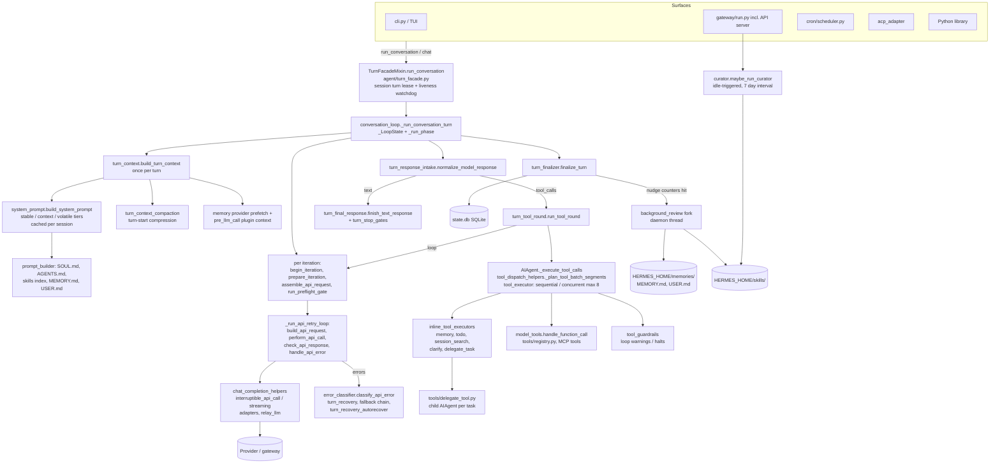

# 01. Hermes Agent: Architecture and the Core Agent Loop

| Field | Value |
|---|---|
| Commit | `085d9ee608893bb0611c2fc339c19d8848af9f2b` |
| Commit date | 2026-09-25 |
| Release tag | `v2026.9.24` (HEAD is past it) |
| License | MIT |
| Scope | `run_agent.py`, `agent/conversation_loop.py`, `agent/turn_*.py`, prompt assembly, budgets and guards, errors and retries, tool execution, delegation, MoA, background review, curator |

Labels: **Verified** = seen in code (or in-repo docs, where noted). **Inferred** = my reasoning. All paths are relative to the repo root `hermes-agent/`.

**Doc drift warning (Verified).** Several docs are stale compared with the code. `website/docs/developer-guide/agent-loop.md`, `agent/AGENTS.md` and the docstring in `agent/iteration_budget.py` all say the default turn cap is 500 and the subagent cap is 50. The code says otherwise: `AIAgent.__init__` defaults `max_iterations=sys.maxsize` (`run_agent.py`), `DEFAULT_CONFIG["agent"]["max_turns"] = None` meaning unlimited (`hermes_cli/config_defaults.py`), and `delegation.max_iterations = 250` (`hermes_cli/config_defaults.py`, `tools/delegate_tool.py::DEFAULT_MAX_ITERATIONS`). This report uses the code values.

---

## 1. Main components and how they connect

### 1.1 Shape (Verified)

- **`AIAgent`** (`run_agent.py`) is a thin facade built from mixins: `ClientLifecycleMixin`, `StreamDeliveryMixin`, `StatusOutputMixin`, `ApiRequestHooksMixin`, `ApiErrorSummaryMixin`, `InterruptControlMixin`, `TurnExplainersMixin`, `ActivityTrackingMixin`, `RateLimitCreditsMixin`, `SessionPersistenceMixin`, `CompressionFacadeMixin`, `TurnFacadeMixin`, `VisionMessagePrepMixin`, `ReasoningParamsMixin`. The constructor takes about 60 keyword arguments and forwards them all to `agent/agent_init.py::init_agent`. Many methods are lazy forwarders (`_forward("agent.x", "fn")`) into `agent/*.py` modules.
- **Entry surfaces** (CLI `cli.py`, gateway `gateway/run.py`, including the API server, cron `cron/scheduler.py`, ACP `acp_adapter/`, batch runner, Python library) all build an `AIAgent` and call `run_conversation()` or `chat()`. Platform differences live in these surfaces, not in the agent (`website/docs/developer-guide/architecture.md`, "Platform-agnostic core").
- **Turn admission**: `agent/turn_facade.py::TurnFacadeMixin.run_conversation` takes a durable per-session lease, then calls `agent/conversation_loop.py::run_conversation`.
- **Turn loop**: `agent/conversation_loop.py::_run_conversation_turn` drives phase functions spread across `agent/turn_*.py`. Loop locals live on a `_LoopState` dataclass. `_run_phase()` passes each phase the fields it names and copies the verdict fields back.
- **Prompt**: `agent/system_prompt.py::build_system_prompt` (tiers) plus `agent/prompt_builder.py` (SOUL.md, context files, skills index, guidance text). The prompt is built once per session and cached on `agent._cached_system_prompt`.
- **Model transport**: `agent/chat_completion_helpers.py` (`build_api_kwargs`, `interruptible_api_call`, `interruptible_streaming_api_call`, `try_activate_fallback`) plus adapters (`anthropic_adapter.py`, `codex_responses_adapter.py`, `bedrock_adapter.py`, `gemini_native_adapter.py`, ...) and `agent/relay_llm.py`.
- **Tools**: `run_agent.py::AIAgent._execute_tool_calls` goes to `agent/tool_executor.py`. Agent-level tools (`todo_list`, `memory`, `session_search`, `clarify`, `delegate_task`, ...) are intercepted through `agent/inline_tool_executors.py::INLINE_TOOL_EXECUTORS`. Everything else goes to `model_tools.py::handle_function_call`, then the `tools/registry.py` handlers, including MCP tools.
- **Persistence**: SQLite `state.db` under `HERMES_HOME` (`hermes_state*.py`), written through `agent/session_persistence.py` (`_persist_session`, `_flush_messages_to_session_db`).
- **Side loops**: background review fork (`agent/background_review.py`), skill curator (`agent/curator.py`), delegation (`tools/delegate_tool*.py`, `tools/async_delegation.py`), MoA (`agent/moa_loop.py`), `/review` (`agent/review_engine.py`), `/goal` (`hermes_cli/goals.py`).

### 1.2 Diagram



---

## 2. One complete turn, traced

Functions in execution order. All Verified unless noted.

### 2.1 Admission (`agent/turn_facade.py::TurnFacadeMixin.run_conversation`)

1. `background_review.cancel_background_review_for_live_turn(self)`: a running review fork for this session is cancelled so the live turn has priority.
2. `review_idle_queue.QUEUE.note_turn_started()`.
3. `turn_facade_lease.admit_durable_turn_lease(...)`: a cross-process row lease in state.db (`LEASE_TTL_SECONDS = 300`, `LEASE_WAIT_SECONDS = 1800`). If the lease is not admitted, the turn returns early and `carry_unadmitted_user_message` keeps the input.
4. `relay_runtime.SESSION_COORDINATOR.acquire_conversation` / `begin_turn`, plus accounting and portal context vars (`set_accounting_context`, `set_conversation_context`, `set_affinity_scope`).
5. `lease.start()` starts the lease refresher and the turn-liveness watchdog (`agent/turn_liveness.py`, default `agent.turn_liveness.timeout_s = 600`, `poll_s = 15`).
6. Calls `agent/conversation_loop.py::run_conversation`, which wraps `_run_conversation_turn` and then runs `turn_context.export_current_turn_boundary`.

### 2.2 Turn setup (`conversation_loop._run_conversation_turn`, then `turn_context.build_turn_context`)

1. `_decode_inline_moa_turn` (MoA opt-in per turn), `begin_fast_mode_turn`, `agent._try_refresh_env_client_credentials()` (picks up `.env` edits between turns).
2. `build_turn_context` (`agent/turn_context.py`), in this order:
   - `recover_rotated_compression_session`, `set_session_context`, `set_current_write_origin`, `agent._restore_primary_runtime()` (undoes a fallback from the previous turn), `_refresh_mcp_tools_between_turns`.
   - `_bind_turn_identity` (task_id, turn_id), `_reset_per_turn_agent_state`.
   - `messages = list(conversation_history)`, then `_stage_turn_user_message` and `append_message(messages, user_msg)`. `current_turn_user_idx` is recorded.
   - `agent._user_turn_count += 1`; `_tick_memory_nudge(agent)` (self-improvement counter, see section 7).
   - If `agent._cached_system_prompt is None`: `conversation_loop._restore_or_build_system_prompt` restores the prompt stored in the session row (byte-identical for cache reuse) or calls `system_prompt.build_system_prompt`.
   - `_ensure_session_row` (DB row created only after the prompt exists).
   - `turn_context_compaction.run_turn_start_compaction` (preflight compression when history is over threshold).
   - `_collect_pre_llm_call_context` (plugin hook) and `_merge_gateway_notes`.
   - `_memory_turn_start_and_prefetch` (external memory provider recall).
   - `_maybe_title_session_at_turn_start` (daemon thread, aux model).
   - `_stamp_api_content_sidecar`: the exact bytes sent for the user row (with injected recall and plugin context) are stored as `api_content`, so later replays are byte-stable.
   - `_persist_turn_start` writes the user row to state.db.
3. A `_LoopState` is built from the returned `TurnContext`.

### 2.3 The iteration loop (`conversation_loop._run_conversation_turn`)

```python
while (s.api_call_count < agent.max_iterations and agent.iteration_budget.remaining > 0) or agent._budget_grace_call:
    begin_iteration -> prepare_iteration -> assemble_api_request -> run_preflight_gate -> announce_api_call
    early_result = _run_api_retry_loop(agent, s)      # build_api_request, perform_api_call, check_api_response
    apply_retry_restarts
    normalize_model_response
    run_tool_round if s.assistant_message.tool_calls else finish_text_response
finalize_turn(...)
```

Per iteration:

1. `turn_iteration_prep.begin_iteration`: applies a pending `/steer`-style redirect (`_apply_active_turn_redirect`), checks `agent._interrupt_requested` (break), checks `_review_input_budget_exhausted` (review forks only), increments `api_call_count`, then either uses up `_budget_grace_call` or calls `agent.iteration_budget.consume()`. If consume fails, it breaks with `budget_exhausted`.
2. `turn_iteration_prep.prepare_iteration`: `step_callback`; `_iters_since_skill += 1` (skill nudge counter); Nous key refresh; drains pending steer text into a new user row after the newest tool result; `_maybe_inject_run_budget_wrapup` (at 80% of `agent.run_budget_seconds`).
3. `turn_request_assembly.assemble_api_request` calls `turn_context.build_api_messages`: structural clones of every message, replay of `api_content` sidecars, reasoning copy-back, strict-API sanitization, and the system message = cached prompt + `ephemeral_system_prompt` (API time only). Prefill messages come after the system prompt. It also estimates tokens for the pressure checks.
4. `turn_preflight_gate.run_preflight_gate`: mid-turn compression gate (can `continue`, `break` or `return`).
5. `announce_api_call`, then the retry loop `_run_api_retry_loop`:
   - `turn_api_call.nous_rate_limit_guard`
   - `turn_api_request.build_api_request`: prompt-cache decoration per provider (`_redecorate_prompt_cache_for_provider`), image stripping, `agent._build_api_kwargs`, middleware and hooks (`pre_api_request`).
   - `turn_api_call.perform_api_call`: streaming, using `agent._interruptible_streaming_api_call`, or non-streaming, using `relay_llm.execute(..., agent._interruptible_api_call)`. Both run the HTTP call on a worker thread so an interrupt can abandon it.
   - `turn_response_check.check_api_response`: validates the response shape (empty, truncated, etc.).
   - On exception: `turn_api_error.handle_api_error` (section 5), or `handle_api_interrupt`.
6. `turn_iteration_prep.apply_retry_restarts`: handles restart flags (fallback activated, compressed, length continuation).
7. `turn_response_intake.normalize_model_response`: converts every API mode into an OpenAI-shaped `assistant_message`.
8. Branch:
   - **Tool calls**: `turn_tool_round.run_tool_round`. It runs `turn_tool_validation.validate_tool_calls` (invalid names, truncated JSON), then `AIAgent._cap_delegate_task_calls` and `_deduplicate_tool_calls`, then `stage_tool_call_message` and `append_message`. The assistant row is persisted before any tool runs (`_flush_messages_to_session_db`; if that fails the turn ends with `session_persistence_failed`). Then `AIAgent._execute_tool_calls`, a guardrail-halt check, an `execute_code`-only refund (`iteration_budget.refund()`), and `compress_after_tool_results`. It returns `continue`.
   - **Text**: `turn_final_response.finish_text_response`. It covers the reasoning-only promotion, the empty-response ladder, length continuation, the Codex ack nudge and `turn_stop_gates` (verify-on-stop, `pre_verify` hook, kanban guard). If a gate fires, a nudge row is appended and the loop continues. Otherwise the final assistant row is appended and the loop returns or breaks.
9. Outer exceptions: `turn_loop_errors.handle_outer_loop_error`.

### 2.4 Finalization (`agent/turn_finalizer.py::finalize_turn`)

- If the budget ran out with no final response: `agent._handle_max_iterations(messages, api_call_count)` makes one extra tool-less request that asks for a summary (`turn_finalizer.py` around line 147).
- Trajectory save, persistence, diagnostics, and the result dict (`final_response`, `messages`, usage and cost, `guardrail`, `failure_reason`, `pending_steer`).
- Skill nudge check: `_iters_since_skill >= _skill_nudge_interval`.
- `agent._sync_external_memory_for_turn(...)` (external memory provider sync and next prefetch).
- `agent._spawn_background_review(...)` if the memory or skill nudge fired (section 7).
- `on_session_end` plugin hook (fired per turn despite the name).
- Back in the facade: the relay turn ends, the lease is released, and the context vars are reset.

---

## 3. State during a turn and between turns

| State | Where held | Lifetime | Evidence |
|---|---|---|---|
| Loop locals (messages, api_call_count, retry counters, compression attempts, pending verification answer, exit reason) | `conversation_loop._LoopState` | One turn | Verified, `agent/conversation_loop.py` |
| Per-turn agent flags (`_delivered_interim_texts`, `_incremental_persistence_failed`, `_tool_guardrail_halt_decision`, stream callback, interrupt) | Attributes on `AIAgent`, reset by `_reset_per_turn_agent_state` / `_run_conversation_turn` / `finalize_turn` | One turn, but on a long-lived object (gateway caches agents) | Verified, `turn_context.py`, `conversation_loop.py` |
| Cached system prompt | `agent._cached_system_prompt` (+ `_cached_system_prompt_static`), also persisted in the session row | Whole session; rebuilt only after compression (`system_prompt.invalidate_system_prompt`) | Verified |
| Transcript | In memory `messages` list; canonical copy in `state.db` (SQLite, `HERMES_HOME`), written incrementally (user row at turn start, assistant tool-call row before tools run, tool results after) | Durable | Verified, `turn_tool_round.py`, `session_persistence.py` |
| Iteration budget | `agent.iteration_budget: IterationBudget` (thread-safe counter) | One turn: recreated as `IterationBudget(agent.max_iterations)` in `turn_context._reset_per_turn_agent_state`, so `max_turns` is a per-turn cap even on a cached agent | Verified, `agent_init.py` ~2393, `turn_context.py` ~608 |
| Nudge counters | `agent._turns_since_memory`, `agent._iters_since_skill` | Live for the whole `AIAgent` object; deliberately not reset per turn | Verified, `turn_context.py` comment near line 561 |
| Memory | `MemoryStore` loaded from `HERMES_HOME/memories/MEMORY.md` and `USER.md`; a frozen snapshot is taken into the system prompt | Files are durable; the prompt snapshot is frozen until rebuild | Verified, `tools/memory_tool.py::get_memory_dir`, `tools/memory_tool_store.py` |
| Skills | `HERMES_HOME/skills/` (+ `.usage.json`, `.curator_ledger.jsonl`, `.curator_state`, `.archive/`) | Durable | Verified, `tools/skill_manager_tool.py`, `tools/skill_usage.py`, `tools/skill_ledger.py`, `agent/curator.py` |
| Gateway agent cache | Per-session `AIAgent` kept warm (`agent.agent_cache.max_size = 128`, `idle_ttl_secs = 3600`) | Process | Verified, `hermes_cli/config_defaults.py` |
| Todo list | Rehydrated from history at turn start (`AIAgent._hydrate_todo_store`) | Derived from the transcript | Verified, `run_agent.py` |

Implication: a fresh process can resume a session from `state.db` plus `HERMES_HOME` files alone (Inferred; the resume flow itself is covered in report E).

---

## 4. When tools are called, when the loop stops, and how many steps

### 4.1 Tool-call decision (Verified)

The model decides. The loop runs `run_tool_round` whenever `assistant_message.tool_calls` is non-empty, and `finish_text_response` otherwise (`conversation_loop.py`). The runtime shapes that decision through prompt text and nudges:

- `agent.tool_use_enforcement` ("auto" means GPT and Codex models get "you MUST use your tools" guidance), `agent.execution_guidance`, `agent.task_completion_guidance`, `agent.parallel_tool_call_guidance` (all in `hermes_cli/config_defaults.py`, applied in `agent/system_prompt.py::_guidance_parts`).
- `agent.intent_ack_continuation` ("auto" means codex_responses only): if the model narrates an action but emits no tool call, a "continue now" nudge is injected, at most 2 per turn.
- A skills index in the system prompt tells the model to `skill_view` a matching skill before replying (`prompt_builder.build_skills_system_prompt`).

### 4.2 Stop conditions (Verified)

The loop ends when any of these happens:
1. A text response passes every stop gate (`finish_text_response`).
2. Iteration budget: `api_call_count >= agent.max_iterations` or `iteration_budget.remaining == 0` (`begin_iteration`). Then one tool-less summary call runs (`_handle_max_iterations`).
3. Interrupt (`agent._interrupt_requested`): user `/stop`, a new message when `display.busy_input_mode = "interrupt"`, lease loss, or the liveness watchdog.
4. Tool guardrail halt (`_tool_guardrail_halt_decision`) with a canned reply (`AIAgent._toolguard_controlled_halt_response`).
5. Unrecoverable API error, compression exhaustion, or a persistence failure.
6. The review-fork input-token budget (forks only).

### 4.3 Limits, budgets and guards (defaults and config keys)

| Control | Default | Config key / constant | Evidence |
|---|---|---|---|
| Turn iteration cap (API calls per turn) | Unlimited (`sys.maxsize`) | `agent.max_turns` (null, "unlimited", 0 or -1 mean unlimited); env bridge `HERMES_MAX_ITERATIONS`; `AIAgent(max_iterations=...)` | Verified, `config_defaults.py`, `hermes_cli/config.py::resolve_turn_limit`, `gateway/run_startup.py` |
| Budget warning to the model | Off | `agent.budget_warning_ratio` (0 to 1) | Verified |
| Grace call after exhaustion | 1 tool-less call | `_budget_grace_call` (set in `turn_truncation.py`), summary via `_handle_max_iterations` | Verified |
| Wall-clock run budget | Off | `agent.run_budget_seconds`, CLI `--run-budget`; wrap-up notice at 80% | Verified |
| `execute_code`-only rounds | Refunded (do not count) | `IterationBudget.refund()` in `run_tool_round` | Verified |
| Subagent iteration cap | 250 per child (own budget) | `delegation.max_iterations`; caller-supplied values ignored | Verified, `delegate_tool.py::delegate_task` |
| Background review fork | 16 iterations; input-token budget = 75% of context window, capped at 600k (fallback 120k) | `_REVIEW_MAX_ITERATIONS`; `auxiliary.background_review.max_input_tokens` | Verified, `background_review.py` |
| Curator fork | 9999 iterations | hardcoded in `curator._run_llm_review` | Verified |
| `/goal` continuation turns | 20 | `goals.max_turns` | Verified (config) |
| `/loop` ticks | 100 | `loops.max_ticks` | Verified (config) |
| Tool loop warnings | exact_failure 2, same_tool_failure 3, idempotent_no_progress 2 | `tool_loop_guardrails.warn_after.*`, `warnings_enabled: true` | Verified |
| Tool loop hard stops | exact_failure 5, same_tool_failure 8, idempotent_no_progress 5 | `tool_loop_guardrails.hard_stop_after.*`; `hard_stop_enabled: false`; `non_interactive_hard_stop_enabled: true` (does not cover `api_server`, which is in `_ATTENDED_PLATFORMS`) | Verified, `agent/tool_guardrails.py` |
| Per-turn caps | 50 web_search, 50 subagents | `tool_loop_guardrails.loop_caps.max_web_searches`, `.max_subagents` | Verified |
| Identical-call stall notice | 3rd identical (tool, args, result); cycles up to period 4 | `agent.stall_guards: true`; `STALL_GUARD_IDENTICAL_CALL_THRESHOLD` | Verified |
| Duplicate calls in one batch | Dropped | `AIAgent._deduplicate_tool_calls` | Verified |
| Text repetition loop | Aborts continuation when repeats of 60+ chars cover at least 50% of a 400+ char fragment | `agent/repetition_guard.py::is_repetition_dominated` | Verified |
| Empty-response retries | 3, or 1 when an attempt costs at least $0.25 | `agent.empty_response_guard.{enabled,cost_threshold_usd}` | Verified |
| Verify-on-stop nudges | Off; max 3 | `agent.verify_on_stop`, `agent.max_verify_nudges` | Verified |
| Compression | Triggers at 50% of context (`threshold_tokens` cap 256k), protects last 20 and first 3 messages, max 3 attempts | `compression.*` | Verified |

---

## 5. Errors, retries and timeouts

### 5.1 API errors (Verified)

`turn_api_error.handle_api_error` handles every API exception:
1. `error_classifier.classify_api_error(...)` returns a `ClassifiedError` with a `FailoverReason` (auth, auth_permanent, billing, rate_limit, upstream_rate_limit, overloaded, server_error, timeout, context_overflow, payload_too_large, model_not_found, content_policy_blocked, format_error, role_alternation, incomplete_response, and more) plus hints: `retryable`, `should_compress`, rotate credential, fallback. Plugins and provider profiles can add verdicts (`_plugin_verdict`, `_profile_verdict`).
2. `turn_recovery.recover_after_classification` and `route_classified_error`: credential-pool rotation, compression on overflow (`turn_overflow.recover_from_overflow`), and model fallback via `AIAgent._try_activate_fallback` (walks the `fallback_providers` chain).
3. Backoff: `turn_recovery.compute_error_backoff`. A `Retry-After` header or body field wins, capped at 600 s. Otherwise `retry_utils.jittered_backoff(retry_count, base_delay=2.0, max_delay=60.0)`, with an adaptive policy for 429s. The sleep can be interrupted (`interruptible_backoff_sleep`).
4. Retry count: `agent.api_max_retries = 3` (Hermes level). The OpenAI SDK adds its own `max_retries=2` (config comment).
5. After retries and the fallback chain are spent, `turn_recovery_autorecover` parks the turn for up to `agent.auto_recovery_cycles = 5` more cycles (jittered 15/30/60/60/60 s, Retry-After up to 120 s). This applies only to overloaded, server_error and timeout, and only if nothing has been delivered yet.
6. Non-retryable classes (auth_permanent, billing, format, content policy, entitlement) end the turn with a structured `failure_reason`.

### 5.2 Timeouts (Verified)

| Timeout | Default | Key |
|---|---|---|
| Per-request timeout | 1800 s | per-model `timeout_seconds` > provider `request_timeout_seconds` > `HERMES_API_TIMEOUT` (`run_agent.py::_resolved_api_call_timeout`) |
| Non-stream stale detector | 90 s base (reasoning-model floor applies; scaled by context size) | `stale_timeout_seconds`, `HERMES_API_CALL_STALE_TIMEOUT` |
| Stream stale | 180 s (local providers 900 s) | `HERMES_STREAM_STALE_TIMEOUT`, `agent.local_stream_stale_timeout` |
| Concurrent tool batch deadline | 420 s | `timeouts.tools.concurrent_batch`, `HERMES_CONCURRENT_TOOL_TIMEOUT_S` (`tool_executor.py`) |
| Sequential tool call | same as batch; `delegate_task` and `manage_connections` exempt | `timeouts.tools.sequential_call` |
| Turn liveness watchdog | 600 s with no progress, then force interrupt | `agent.turn_liveness.timeout_s` |
| Gateway inactivity | 1800 s | `agent.gateway_timeout` |
| Clarify wait | 3600 s | `agent.clarify_timeout` |
| Subagent inactivity | off | `delegation.child_timeout_seconds` (floor 30) |
| Aux transient retries | 2 | `auxiliary.transient_retries` |

### 5.3 Tool errors (Verified)

Invalid tool names get an error tool result; valid calls in the same batch still run (`run_tool_round`, `_invalid_tool_name_error_content`). Invalid JSON arguments produce an error result without running the tool (`tool_executor._parse_tool_arguments`). Tool failures are observed by `AIAgent._append_guardrail_observation`, which appends guidance to the result or sets a halt.

---

## 6. Concurrency

### 6.1 Parallel tool calls (Verified)

`AIAgent._execute_tool_calls` runs one call sequentially. A batch goes through `tool_dispatch_helpers._plan_tool_batch_segments`, which splits it into ordered `parallel` and `sequential` segments:
- Parallel-safe: `_PARALLEL_SAFE_TOOLS` (read_file, search_files, web_search, web_extract, session_search, skill_view, skills_list, vision_analyze, image_generate, ...), plus MCP tools whose server opted in with `supports_parallel_tool_calls` (`tools/mcp_tool_discovery.py::is_mcp_tool_parallel_safe`).
- Never parallel: `clarify`, `manage_connections`, `manage_catalog`.
- File tools join a parallel run only if their paths do not overlap with a writer's.
- Workers: `DaemonThreadPoolExecutor`, `_MAX_TOOL_WORKERS = 8` (image_generate limited to 4). Results are put back in call order.
- `delegate_task` calls per turn are capped at `delegation.max_concurrent_children` (`AIAgent._cap_delegate_task_calls`).

### 6.2 Subagents (Verified)

- `delegate_task` (`tools/delegate_tool.py`) builds one child `AIAgent` per task in `_build_child_agent`. The child gets `platform="subagent"`, `skip_context_files=True`, `skip_memory=True`, `quiet_mode=True`, a fresh `IterationBudget`, the goal and context as its `ephemeral_system_prompt`, its own session row linked through `parent_session_id`, and a shared credential pool.
- Children can never use `DELEGATE_BLOCKED_TOOLS`: `delegate_task`, `clarify`, `memory`, `send_message`, `cronjob_manage` (`tools/delegate_tool_toolsets.py`). Nested delegation happens only by depth: `delegation.max_spawn_depth = 1` means flat; `delegation.orchestrator_enabled = true`.
- Concurrency: `delegation.max_concurrent_children = 10` covers both batch parallelism and concurrent background units. At capacity a background dispatch is rejected and runs synchronously instead (`delegate_tool_config._get_max_async_children`).
- Top-level model delegations always run in the background (`AIAgent._dispatch_delegate_task` forces `background=True` at depth 0). The result is pushed onto `process_registry.completion_queue` and comes back as a **new turn**, never mid-turn (`tools/async_delegation.py`).
- Approvals in children are non-interactive: `delegation.subagent_auto_approve = false` means auto-deny.
- Liveness: 30 s heartbeat to the parent; a child counts as stale after 450 s idle or 1200 s stuck on one tool (`_HEARTBEAT_STALE_CYCLES_*`).
- The parent sees only the summary, capped at `delegation.max_summary_chars = 24000`; overflow spills to `~/.hermes/cache/delegation/`.
- `delegation.model/provider/base_url/api_key` can route children to a different model.

### 6.3 MoA (Verified)

`/moa` marks one turn as MoA. Before each main-model iteration, `agent/moa_loop.py` fans out to the reference models (a thread pool, using `auxiliary_client.call_llm`) and an aggregator produces private guidance. That guidance is attached as a trailing user message (`_attach_reference_guidance`). The normal loop still owns tool calling and stopping. Presets live in `moa.presets`; traces are written only when `moa.save_traces` is set.

### 6.4 Multiple sessions (Verified)

- One process can host many sessions (the gateway). There is one `AIAgent` per session, cached (`agent.agent_cache.*`), with an optional global cap `max_concurrent_sessions` (default unbounded).
- Only one turn runs per session at a time: the durable state.db lease (`turn_facade_lease.py`) prevents two processes from running the same session. Inside the gateway, a new message during a turn is handled by `display.busy_input_mode` (`interrupt` by default, or `queue` or `steer`).
- The turn loop is synchronous (one thread per turn). Concurrency comes from worker threads (tool batches, API worker thread, review forks, title generation, async delegation executor).
- `model_tools._last_resolved_tool_names` is a process-global that `_run_single_child` saves and restores (`agent/AGENTS.md`). Treat Hermes as not fully thread-isolated across agents in one process (Inferred).
- Profiles (`HERMES_HOME` per profile) are the isolation boundary between agents. `secret_scope.get_secret` fails closed only in multiplex mode (`agent/AGENTS.md`).

---

## 7. The self-improvement loop

There are three mechanisms. All are Verified unless marked.

### 7.1 Post-turn background review (the main loop)

**Triggers** (`agent/turn_context.py::_tick_memory_nudge`, `agent/turn_iteration_prep.py::prepare_iteration`, `agent/turn_finalizer.py::finalize_turn`):
- Memory nudge: `_turns_since_memory` goes up by 1 per user turn. It fires at `memory.nudge_interval` (default **10** turns) if the `memory` tool is present and a memory store exists. The counter resets whenever the agent calls `memory` itself (`tool_executor.py`).
- Skill nudge: `_iters_since_skill` goes up by 1 per API iteration (tool-calling step). It fires at `skills.creation_nudge_interval` (default **10**; not in `DEFAULT_CONFIG` but read in `agent_init._apply_agent_section`; `cli-config.yaml.example` shows 15) if `skill_manage` is present. It resets when the agent calls `skill_manage`.
- The review spawns only if there is a final response, the turn was not interrupted, `skip_background_review` is false, and `_delegate_depth == 0`. Cron sets `skip_background_review=True` (`cron/scheduler.py`).
- Manual trigger: `/refine` (explicit, never deferred).

**Mechanism** (`run_agent.py::_spawn_background_review`, then `background_review.spawn_background_review_thread`, then `build_cache_parity_fork`):
- A daemon thread (`bg-review`) builds a forked `AIAgent`. It uses the same provider, model, credentials and cached system prompt as the parent, with the same `tools[]` for prompt-cache parity. Persistence is detached (`_persist_disabled`, `_session_db=None`) and its own nudges are set to 0.
- It replays the conversation snapshot and adds one prompt: `_MEMORY_REVIEW_PROMPT`, `_SKILL_REVIEW_PROMPT` or `_COMBINED_REVIEW_PROMPT`. The skill prompt tells the model to "Be ACTIVE, most sessions produce at least one skill update".
- The tool whitelist is enforced at dispatch time (`_review_tool_whitelist`): the `skills` toolset, plus `memory` only when the memory nudge fired, plus `read_file` and `search_files`, plus `auxiliary.background_review.extra_tools`. Terminal and write_file are denied. Dangerous commands are auto-denied (`_bg_review_auto_deny`).
- Budget: 16 iterations, and an input-token cap (section 4.3). A live turn cancels the fork (`cancel_background_review_for_live_turn`). On managed local runtimes the review can be deferred to idle (`agent/review_idle_queue.py`, `auxiliary.background_review.defer`).
- If `auxiliary.background_review.provider/model` names a different model, the review is routed there and replays a compact digest instead (`_digest_history`, last 24 messages).

**What it can change and where:**
- Memory: `HERMES_HOME/memories/MEMORY.md` (environment facts, limit `memory.memory_char_limit = 2200` chars) and `USER.md` (user profile, `memory.user_char_limit = 1375`), via `tools/memory_tool.py`.
- Skills: create, patch, edit or write support files under `HERMES_HOME/skills/<category>/<name>/` (or `skills.create_dir`) via `skill_manage`.
- Write guards for autonomous review (`tools/skill_manager_guards.py::_background_review_write_guard`, `_background_review_read_before_write_guard`): the review can only modify **curator-managed** skills (`created_by: "agent"` in `.usage.json`). Pinned, external (`skills.external_dirs`), bundled and hub-installed skills are refused, as are user-owned skills (no record fails closed). It must `skill_view` a file in the same review before overwriting it. It **can create brand-new skills** without restriction.
- Audit: every skill mutation is appended to `skills/.curator_ledger.jsonl` with before/after hashes (`skills.ledger: true`), and can be rolled back with `hermes curator rollback`.
- Effect timing: changes land on disk right away but reach the model only in the **next session**, or after a compression rebuild, because the system prompt snapshot is frozen (`system_prompt.invalidate_system_prompt`).

### 7.2 Foreground self-improvement (agent-initiated)

The main agent itself has `memory` and `skill_manage` tools, and prompt guidance (`SKILLS_GUIDANCE`, `build_memory_guidance` in `prompt_builder.py`) encourages saving procedures as skills. `/learn` (`agent/learn_prompt.py`) turns user-described material into a skill in a normal turn.

### 7.3 Curator (library maintenance)

- Trigger: `curator.maybe_run_curator()` is polled by the gateway (`gateway/run.py`, `idle_for_seconds=inf`), the web server and the TUI. It runs if `curator.enabled` is true and not paused, `last_run_at` is older than `curator.interval_hours = 168` (7 days), and the agent has been idle at least `curator.min_idle_hours = 2`. The first observation only seeds `last_run_at`. A file claim prevents concurrent runs.
- Deterministic pass (`apply_automatic_transitions`, no LLM): curator-managed skills unused for `stale_after_days = 14` become `stale`, and those unused for `archive_after_days = 30` move to `skills/.archive/`. Pinned and cron-referenced skills are skipped. Bundled skills are pruned only if `curator.prune_builtins`.
- Optional LLM consolidation (`curator.consolidate = false` by default): it takes a tar snapshot of `skills/` first (`curator_backup`, keep 2), then forks an `AIAgent` with only the `skills` toolset, `max_iterations=9999`, routed via `auxiliary.curator`, to merge overlapping skills into umbrella skills.
- Outputs: `skills/.curator_state`, a per-run REPORT.md, ledger entries, and rewrites of cron skill references.

### 7.4 Controls to disable or constrain

| Goal | Key |
|---|---|
| Disable automatic post-turn review | `auxiliary.background_review.enabled: false` (or `AIAgent(skip_background_review=True)`) |
| Disable memory nudge only | `memory.nudge_interval: 0` |
| Disable skill nudge only | `skills.creation_nudge_interval: 0` |
| Disable built-in memory entirely | `memory.memory_enabled: false`, `memory.user_profile_enabled: false`, or `AIAgent(skip_memory=True)` |
| Stage memory writes for approval | `memory.write_approval: true` (background writes staged, `/memory approve`) |
| Stage skill writes for approval | `skills.write_approval: true` (`/skills pending|approve|reject`) |
| Security-scan agent-written skills | `skills.guard_agent_created: true` (default false) |
| Route review to another model | `auxiliary.background_review.{provider,model,base_url,api_key}` |
| Cap review cost | `auxiliary.background_review.max_input_tokens` |
| Disable curator | `curator.enabled: false`, or `hermes curator pause` |
| Disable LLM consolidation | `curator.consolidate: false` (default) |
| Remove tools from the main agent | `agent.disabled_toolsets` / `disabled_toolsets` (for example `memory`, `skills`) |
| Hide chat notices | `display.memory_notifications: off` (review still runs) |

---

## Implications for our platform

1. **Always set a turn cap.** The default is unlimited. Set `agent.max_turns` (or `max_iterations`) per tier, set `agent.run_budget_seconds` to fit the sandbox session, and set `delegation.max_iterations`, `delegation.max_concurrent_children` and `delegation.max_spawn_depth` explicitly. Enable `tool_loop_guardrails.hard_stop_enabled: true`: we will likely run on `api_server` or the library, and those count as "attended", so hard stops are off by default there.
2. **Self-improvement is a private-skill leak path.** The review fork cannot edit our installed skills if they sit in `skills.external_dirs` or lack `created_by: agent`. It **can create new skills and memory entries** distilled from a session that used a private skill (Inferred from the write guards plus the "Be ACTIVE" prompt). Those files land in `HERMES_HOME/skills` and `memories/` and would be exported with the agent's state. Options: disable the automatic review (`auxiliary.background_review.enabled: false`) plus `skills.creation_nudge_interval: 0`, or allow memory-only review with our own scrubber on export. Keep `curator.consolidate: false`.
3. **The review fork makes hidden model calls.** It uses the main model and credentials, so it bills through our LiteLLM key. That is good for metering, but it is extra spend that users do not see (tens of thousands of tokens per event, per `turn_finalizer.py` comments). Budget for it or route it with `auxiliary.background_review.*` to a cheap model under a separate virtual key.
4. **Persistence set to export and restore** (Inferred): `HERMES_HOME/state.db`, `memories/`, `skills/` (including `.usage.json`, `.curator_ledger.jsonl`, `.curator_state`), and `config.yaml`. The prompt is frozen per session, so restoring into a new sandbox should start a new session to pick up new memory or skills.
5. **Owner text never reaches Hermes.** Drive turns with structured, generated user messages (our workflow runner or discovery loop). `run_conversation(user_message, system_message=...)` plus `ephemeral_system_prompt` let us inject the playbook and goals without a chat channel. Put tier playbooks in `system_message` (cached tier) or in SOUL.md, not in per-turn text, to keep prompt caching warm.
6. **The discovery loop maps to turns and delegation.** Each stage (Scan, Dive, Challenge, Test, Zoom out) can be one `run_conversation` call with its own budget. "Challenge" fits a delegated child or `/review`-style subagent on a different model. Background delegation returns results as a new turn, so our runner must drain `completion_queue` or use synchronous delegation.
7. **MCP parallelism is opt-in.** Our read-only data MCP server should declare `supports_parallel_tool_calls` so Hermes batches its reads. The chain-intent and platform-write tools should not.
8. **Disable surfaces we do not need.** Cron, the curator poll in the gateway, title generation, `/goal` and `/loop` all make aux model calls. Turn them off or route them, so every model call goes through our gateway and is accounted for.

## Open questions

1. (Resolved: the budget is reset every turn in `turn_context._reset_per_turn_agent_state`.) There is no built-in cap across turns or across a session. Caps across a session or a day must come from our orchestrator and the LiteLLM budget.
2. The exact default for `skills.creation_nudge_interval` differs: the code default is 10, `cli-config.yaml.example` shows 15, and the key is absent from `DEFAULT_CONFIG`. Confirm which value a fresh install writes.
3. Does the background review fork respect our gateway's per-agent budget signals (for example 402 from LiteLLM)? It inherits the parent runtime, but I did not trace how a billing error inside the fork is surfaced (probably logged and dropped).
4. Can the review fork be prevented from reading private skill content through `skill_view` and `read_file`? It is whitelisted for both, so it could quote an encrypted-at-rest but decrypted-in-runtime skill into a new agent-created skill. We need to verify whether `skills.external_dirs` skills are visible to `skill_view` in the fork (likely yes).
5. How does `display.busy_input_mode` apply to the API server (`gateway/platforms/api_server`)? This matters when our runner sends overlapping requests to one session.
6. Thread-safety of running several `AIAgent` instances in one Python process (process-globals like `model_tools._last_resolved_tool_names`). Relevant only if we ever multiplex agents. Our one-instance-per-sandbox design avoids it.
7. The `/goal` judge loop (`hermes_cli/goals.py`) was not read in depth. It may be a useful fit for "keep researching until the thesis is complete" but needs its own review.
