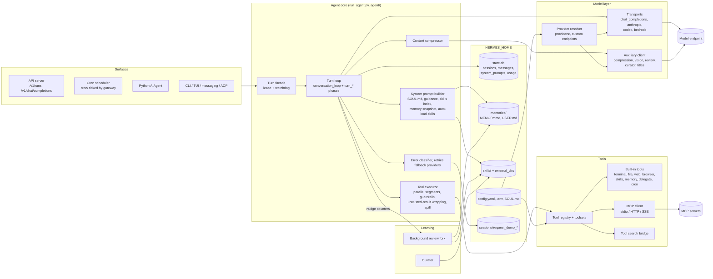

# 07. Hermes Agent: Synthesis

| Field | Value |
|---|---|
| Commit | `085d9ee608893bb0611c2fc339c19d8848af9f2b` |
| Commit date | 2026-09-25 |
| Release tag | `v2026.9.24` (HEAD is 2,142 commits past it) |
| License | MIT (Copyright (c) 2025 Nous Research) |
| Inputs | Reports 00 to 06 in this folder, plus direct code checks for section 5 |

---

## 1. What Hermes is

Hermes Agent is Nous Research's open-source, Python-based, general-purpose personal AI agent. One agent core (`AIAgent` in `run_agent.py` and `agent/`) is served through many front ends: a CLI and TUI, a messaging gateway (Telegram, Discord, Slack and about 20 more), an OpenAI-compatible API server, ACP for editors, a desktop app, and a Python library. It runs a tool-calling loop against almost any model provider, including any OpenAI-compatible endpoint. It connects to MCP servers, delegates to subagents, and runs scheduled jobs. It also "learns": it keeps small memory files and writes and refines its own skills (SKILL.md folders, compatible with agentskills.io) through a background review loop and a curator. All state lives in one directory (`HERMES_HOME`): a SQLite session store, memory files, skills and config. The project is very active and explicitly designed around two invariants: a byte-stable system prompt per session (for prompt caching), and a narrow core with capability added at the edges through skills, plugins and MCP (`AGENTS.md`).

---

## 2. How it is built

### 2.1 Main logic (Verified, report 01)

1. A **surface** (CLI, gateway incl. API server, cron, ACP, library) builds an `AIAgent` and calls `run_conversation()`.
2. **Admission** (`agent/turn_facade.py`) takes a durable per-session lease in `state.db` and starts a 600 s liveness watchdog.
3. **Turn setup** (`agent/turn_context.py::build_turn_context`) restores or builds the **system prompt once per session** (SOUL.md, guidance, context files, skills index, memory snapshot), runs compression if needed, and persists the user message.
4. **Iteration loop** (`agent/conversation_loop.py::_run_conversation_turn`): assemble messages, preflight compression gate, API call with a retry and fallback ladder, normalize the response, then either run a **tool round** (parallel for read-only tools, up to 8 workers) or **finish** with text after stop gates. Loop guards warn on repeated failures; hard stops are opt-in on attended surfaces.
5. **Finalize** (`agent/turn_finalizer.py`): persist, report usage and cost, then possibly fork a **background review** that writes memory and skills.
6. **Side systems**: curator (weekly skill maintenance), cron scheduler (ticked by the gateway), delegation (child agents), context compression (auxiliary model), and many auxiliary tasks routed through `agent/auxiliary_client.py`.

### 2.2 Combined architecture diagram

---

## 3. Strengths for our use case

| Strength | Evidence | Why it matters to us |
|---|---|---|
| Mature, well-guarded agent loop | Report 01: error classifier, retries, fallback chain, auto-recovery cycles, loop guards, repetition guard, liveness watchdog | We do not build an agent runtime |
| Any OpenAI-compatible endpoint, with per-provider headers and key commands | Report 02 §3: named `providers:` entries with `key_env`, `key_cmd`, `extra_headers`, `session_affinity_header`; keys are host-gated | LiteLLM per-agent virtual keys and agent-id headers work by config |
| Auxiliary tasks follow the main provider when one is set | Report 02 §3.4: `_discovery_chain_allowed` | No surprise traffic to other vendors (after pinning vision) |
| Full MCP client | Report 03 §3: stdio, Streamable HTTP, SSE, bearer headers, include/exclude filters, lazy start, parallel opt-in | Our three MCP servers plug in directly |
| Toolset allowlisting plus call-level rejection | Report 03 §4.4 | Minimal, auditable tool surface per agent |
| Skills in the SKILL.md format we already chose, loaded from external dirs, progressive disclosure | Report 04 §2 to 4 | Decrypt-to-folder injection works without code changes |
| Headless API server with idempotent runs, SSE events, stop and steer | Report 05 §4.3 | Clean integration point for the orchestrator |
| Everything under one `HERMES_HOME`; crash-safe persistence | Report 05 §5, §8 | Maps to one sandbox per agent with export and restore |
| Telemetry off and content-free by default; no third-party analytics | Report 06 §3 | Egress allowlist can be tiny |
| MIT license | `LICENSE` | Free to wrap, modify and ship privately |

---

## 4. Weaknesses and conflicts with our requirements

| Issue | Evidence | Severity | Handling |
|---|---|---|---|
| **No skill secrecy at all.** The agent can read skill files; skill text is persisted in `state.db`, request dumps, ledger blobs, compression summaries; it reaches the model vendor | Reports 04 §7, 06 §8 | High, partly inherent | Owner never sees raw agent output or files; narrator reads actions only; encrypt exports; zero-retention vendor terms; secret logic behind MCP tools |
| **Self-improvement launders private skills** into agent-created skills and memory | Report 01 §7, 04 §5 | High | Disable background review, nudges and curator for v1 |
| **Request dumps have no off switch** | Report 06 §4 | Medium | tmpfs for `sessions/`, never export |
| **Unlimited turn budget by default; no spend cap in Hermes** | Reports 01 §4.3, 02 §5.2 | Medium | Set `agent.max_turns`, `run_budget_seconds`; budgets in LiteLLM |
| **No structured output mode** for the main loop | Report 05 §4.5 | Medium | Deliverables are MCP tool calls with strict schemas |
| **Plain-text input only** | Report 05 §4.5 | Low | Goals fetched via MCP tool |
| **Tool search hides all MCP tools by default** | Report 03 §3.5 | Low | `tools.tool_search.enabled: off` |
| **No per-tool disable**; `skill_manage` bundled with `skill_view` | Report 03 §2 | Low to medium | Read-only mount, `skills.write_approval`, fail-closed hook |
| **Several default outbound calls** (update check, model catalog, models.dev, lazy installs, tirith, keyless web search) | Report 06 §2.2 | Low (fail soft) | Config switches plus egress allowlist |
| **Hermes's own guards are heuristics**; the OS is the only boundary | `SECURITY.md` §2.2 | Accepted | E2B microVM plus egress allowlist is our boundary |
| **Very fast release cadence and doc drift** | 2,142 commits past the latest tag; several stale docs (section 5) | Medium (operational) | Pin a version; re-verify config on each upgrade with a contract test |
| **Hidden model calls** (compression, titles, review, MCP sampling) | Reports 01 §7, 02 §8.3, 03 §3.1 | Low once configured | Disable or pin to cheap aliases on the same virtual key |

---

## 5. Contradictions between sub-agent findings, resolved in code

| # | Topic | Conflict | Resolution (checked in code) |
|---|---|---|---|
| 1 | Does `OPENAI_BASE_URL` select the custom endpoint? | Report 05 §5.3 lists `OPENAI_BASE_URL`/`OPENAI_API_KEY` as the way to point at our proxy. Report 02 §3.1 says it never selects the endpoint | **Report 02 is right.** `hermes_cli/runtime_provider_backends.py` line 121: "OPENAI_BASE_URL never picks the endpoint (config.yaml is the single source of truth ...)". It only scopes which host may receive `OPENAI_API_KEY` (line ~160). Use `providers:` in `config.yaml` |
| 2 | Retry backoff parameters | Report 01 says base 2 s, max 60 s. Report 02 says base 5 s, max 120 s | **Both are partly right.** `agent/retry_utils.py::jittered_backoff` defaults to `base_delay=5.0, max_delay=120.0`, but the main-turn error path calls it with `base_delay=2.0, max_delay=60.0` (`agent/turn_recovery.py` line 1422). Main-turn API retries use 2 s / 60 s |
| 3 | Are loop-guard hard stops on for our surface? | Report 03 §5 says hard stop is on for non-interactive platforms. Report 01 says `api_server` is excluded | **Report 01 is right.** `agent/tool_guardrails.py` line 85: `_ATTENDED_PLATFORMS = {"cli","tui","desktop","acp","subagent","api_server"}`; `non_interactive_hard_stop_enabled` only applies outside that set. Set `tool_loop_guardrails.hard_stop_enabled: true` explicitly |
| 4 | Approval behavior on the API server | Report 03 §4.2 lists `api_server` under `approvals.unattended_mode: deny`. Report 03 §4.3 also notes `api_server` keeps `is_ask` | **The ask bridge wins under the gateway.** `gateway/run.py` line 5770 sets `HERMES_EXEC_ASK=1`, and `tools/approval.py::_presence` (lines 934 to 948) keeps `is_ask` for unattended platforms "for the `/v1/runs` approval bridge". So a flagged action in a `/v1/runs` run waits for `POST /v1/runs/{id}/approval` (up to `approvals.timeout`, 300 s) rather than being denied instantly (Inferred from the docstring and presence logic; not traced end to end). With terminal, code and file tools removed this rarely matters; the orchestrator should auto-deny any approval request it sees |
| 5 | Checkpoints on by default? | Report 06 §4 says file checkpoints are written "Yes (transparent)". Report 05 §8.4 says off by default | **Report 05 is right.** `hermes_cli/config_defaults.py` line 475 to 476: `"checkpoints": {"enabled": False, ...}` |
| 6 | Skill nudge default interval | Report 01 notes code 10 vs example config 15 | **10.** `agent/agent_init.py` line 1371 reads `skills.creation_nudge_interval` with default 10; `cli-config.yaml.example` is only an example |
| 7 | Turn iteration cap | Docs and `agent/AGENTS.md` say 500 (subagents 50) | **Unlimited (subagents 250).** Reports 01 and 05 both verified `max_iterations=sys.maxsize` and `agent.max_turns: None` |
| 8 | Do cron runs load memory? | `cron/AGENTS.md` says `skip_memory=True` | **They do load memory**: `cron/scheduler.py` passes `skip_memory=False` (report 05 §2.5) |
| 9 | Bare `30m` cron schedule | `cron-internals.md` says one-shot | **Recurring** per `cron/jobs.py::parse_schedule` (report 05 §2.3). Use `in 30m` for one-shots |
| 10 | Where the skills index sits in the prompt | `prompt-assembly.md` is inconsistent | **Volatile tier** (index), with auto-load bodies in the stable tier (`agent/system_prompt.py::build_system_prompt_parts`, report 02 §8.1) |
| 11 | `hermes -z` safety | Not a contradiction but worth noting | Verified: `hermes_cli/oneshot.py` lines 278 to 279 set `HERMES_YOLO_MODE=1` and `HERMES_ACCEPT_HOOKS=1`. Never use `-z` for agent work |
| 12 | Where injected skills live | Report 06 §8 assumes `$HERMES_HOME/skills/`; report 04 recommends `skills.external_dirs` | Not a conflict in code. We adopt `external_dirs` on a read-only tmpfs (report 08 §6.2), which also keeps the background review and curator from editing them (`tools/skill_manager_guards.py::_background_review_write_guard`) |
