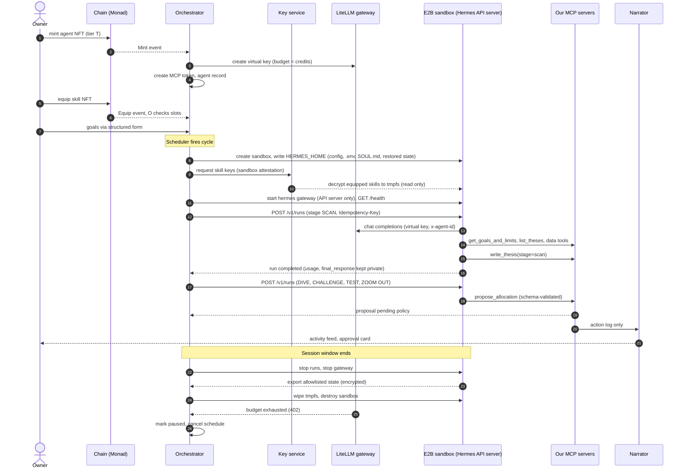

# 08. Mapping Hermes to Our Platform

| Field | Value |
|---|---|
| Commit | `085d9ee608893bb0611c2fc339c19d8848af9f2b` |
| Commit date | 2026-09-25 |
| Release tag | `v2026.9.24` (HEAD is past it) |
| License | MIT |
| Inputs | Reports 01 to 07 in this folder. Claims about Hermes cite the file that proves them; the design choices here are **Inferred** (our recommendations) unless marked **Verified**. |

This is the main deliverable. Section 6.1 classifies each platform component against Hermes. Section 6.2 walks the agent lifecycle end to end. Section 6.3 proposes a config layout. Section 6.4 covers how to make the agents good. Section 6.5 answers fork, configure, or wrap.

Fit classes: **Use as is**, **Configure**, **Wrap** (use it behind our own layer), **Build ourselves**, **Conflict** (Hermes behavior works against our requirement).

---

## 6.1 Component mapping table

| # | Our component | Matching Hermes feature | Fit | How, and why |
|---|---|---|---|---|
| 1 | **Agent brain** | `AIAgent` turn loop (`run_agent.py`, `agent/conversation_loop.py`), served headless by the gateway API server (`gateway/platforms/api_server.py`, `POST /v1/runs`) | **Wrap** | The loop, tool calling, compression, retries and loop guards are solid and we should not rebuild them (report 01). We wrap it: the orchestrator drives every run through `/v1/runs` with an `Idempotency-Key`, and owns scheduling, budgets and stage transitions. Set `agent.max_turns` and `agent.run_budget_seconds` explicitly, since the default is unlimited (Verified, `hermes_cli/config_defaults.py`). |
| 2 | **Per-agent model routing and metering** | Named custom provider under `providers:` with `key_env`, `extra_headers`, `session_affinity_header`; `auxiliary.<task>` pins; `delegation.provider/model` | **Configure** | One LiteLLM virtual key per agent in `.env`, referenced by `key_env`. That key is the meter. Add `x-agent-id` via `extra_headers` (reaches main and auxiliary calls; Verified in report 02 §7.2). Pin every auxiliary task to the gateway, because vision `auto` can fall back to other vendors if their keys exist (Verified, `agent/auxiliary_client.py::_vision_auto_route`). Keep no other provider keys in the sandbox. `OPENAI_BASE_URL` does **not** select the endpoint (Verified, `hermes_cli/runtime_provider_backends.py` line ~121). |
| 3 | **Baseline tools** (web search, X data, Dune, chain tools) | MCP client (`tools/mcp_tool*.py`), `mcp_servers:` config, per-server `tools.include` | **Configure** | Serve all baseline tools from our `chain` and `data` MCP servers over Streamable HTTP with a per-agent bearer token. Disable Hermes' own `web`, `search`, `x_search` toolsets so every external call goes through our metered, allowlisted servers. Set `tools.tool_search.enabled: off` or our tools hide behind a search bridge (Verified, `tools/tool_search.py`). |
| 4 | **Premium tier tools** | Per-agent `mcp_servers` entries and `tools.include` globs | **Configure** + server-side check | Render a `data_premium` server (or wider include list) only into pro configs. The MCP server must also check tier from the token, because config inside the sandbox is not a trust boundary. |
| 5 | **Private skills injection** | `skills.external_dirs` (scanned fresh each prompt build, never snapshotted; Verified, `agent/skill_utils.py`, `agent/prompt_builder.py`) | **Wrap** | Orchestrator decrypts equipped skills into a tmpfs dir (for example `/run/agent-skills`) mounted read-only, before the session starts. Hermes has no encryption, signing or access control for skills (Verified, report 04). The agent can always read the files it uses. Secrecy therefore depends on keeping raw agent output and sandbox files away from the owner (see row 13 and the leak table in report 06). |
| 6 | **Skill slot enforcement** | None | **Build ourselves** | Hermes loads every skill it finds. Slots are enforced by the orchestrator deciding which skills to decrypt into the folder. Namespace skill names (for example `mnd-`) because same-name skills across roots make `skill_view` refuse (Verified, `tools/skills_tool.py::_locate_skill`). |
| 7 | **Built-in playbooks** (system prompts and starter workflows per tier) | `SOUL.md` (identity slot), `skills.auto_load` (full bodies in the stable prompt tier), `instructions` on `/v1/runs` | **Configure** | Tier identity and hard rules in `SOUL.md`. Tier playbooks as `auto_load` skills in a separate read-only dir. Starter workflows live in our workflow runner, not in Hermes. Keep per-run text small; `instructions` are layered on top of the core prompt, not a replacement (Verified, report 05 §4.3). |
| 8 | **Memory and persistence** | `memories/MEMORY.md` and `USER.md` (2,200 and 1,375 chars), `state.db` (SQLite, 13 tables plus FTS), agent-created skills under `skills/` | **Wrap** | Keep built-in memory for small environment facts. Turn off `USER.md` (no owner chat). Build our own allowlist exporter (report 04 §8); the stock `hermes backup`, `--quick` and `profile export` each include too much, too little, or rewrite content. Encrypt exports; they contain skill plaintext. |
| 9 | **Thesis Board** | Nothing suitable (memory is tiny, unstructured, frozen per session) | **Build ourselves** | Platform MCP tools `write_thesis`, `update_thesis`, `list_theses`, `get_thesis`, backed by our DB. A compact digest is read at the start of each run via a tool call. Recommendation and reasons in report 04 §9. |
| 10 | **Discovery loop cadence** (Scan, Dive, Challenge, Test, Zoom out) | Cron (`cron/`), `/v1/runs`, `delegate_task`, per-job model pins | **Wrap** | The orchestrator owns the clock and the stage machine. Each stage is one `/v1/runs` call with a stage prompt, a budget, and a model choice via LiteLLM alias. Hermes cron is weak here: chaining reads the last finished output instead of waiting, and there is no per-job cost cap (Verified, report 05 §2.8). Disable the `cronjob` toolset so the agent cannot make its own schedules. |
| 11 | **Workflows** (rebalancer, idle cash sweep) | Cron and `/goal` are the nearest features | **Build ourselves** | Workflows are deterministic, need guardrails and approval modes, and run in our runner. Hermes only contributes when a workflow step needs judgment ("propose new weights"), through a `/v1/runs` call whose result is an MCP tool call. |
| 12 | **Structured goal input** | Plain text input only on every surface (Verified, report 05 §4.5) | **Wrap** | Owners fill forms. The orchestrator stores them. Hermes reads them through a platform MCP tool `get_goals_and_limits` that returns typed JSON. Hermes never receives owner free text. Any free-text form field (for example a "notes" box) should be removed or pass through a strict classifier into enums. |
| 13 | **Narrator output** | None. Hermes returns `final_response` and a transcript | **Build ourselves** | The narrator reads only our MCP action log (tool name, validated arguments, outcome) and never `final_response`, reasoning, or `state.db`. The narrator prompt forbids quoting agent internals. Treat Hermes text output as private logs. |
| 14 | **Strategy parameter tuning** | None specific | **Build ourselves** (tool) + **Configure** (prompt) | MCP tool `propose_strategy_update(template_id, params, rationale_code)` with JSON-schema bounds per approved template. Hermes proposes; our policy layer validates and queues for approval. |
| 15 | **Unsigned transaction intents** | MCP tools only; Hermes holds no keys | **Build ourselves** | `propose_allocation` and `build_intent` on the chain server return an intent id, never sign. Idempotency keys are required because a tool call in flight at a crash has unknown outcome (Verified, report 05 §8.3). Do not set `supports_parallel_tool_calls` on the chain or platform servers. |
| 16 | **Sandbox egress control** | Hermes says the OS is its only real security boundary (Verified, `SECURITY.md` §2.2); `hermes egress` (iron-proxy) is Docker-backend specific | **Configure** + E2B allowlist | Allowlist only our LiteLLM gateway and our MCP server hosts. Everything else Hermes contacts by default fails soft when blocked, and each has a config switch: `updates.check`, `model_catalog.enabled`, `security.allow_lazy_installs`, `security.tirith_enabled`, `models_dev.url`, `web.keyless_fallback`, `tools.connectors.enabled` (full table in report 06 §2). |
| 17 | **Pausing when credits run out** | HTTP 402 is classified `billing` and not retried (Verified, `agent/error_classifier.py`, `agent/turn_api_error.py`); `/v1/runs/{id}/stop` exists | **Wrap** | LiteLLM enforces the budget per virtual key. The orchestrator watches for `failure_reason` billing on the run result (and LiteLLM budget webhooks), stops in-flight runs, exports state, and stops the sandbox. Confirm LiteLLM's budget error maps to `billing` and not to `format_error` (open question in 09). |
| 18 | **Self-improvement loop** (background review, curator) | `agent/background_review.py`, `agent/curator.py` | **Conflict** (by default) | It writes new skills and memory distilled from sessions that used private skills ("skill laundering"), makes hidden model calls, and runs on its own timer. Turn off by config for v1: `auxiliary.background_review.enabled: false`, `skills.creation_nudge_interval: 0`, `memory.nudge_interval: 0`, `curator.enabled: false`. Revisit later with `skills.write_approval: true` and our review step. |
| 19 | **Owner cannot read skills** | Nothing in Hermes | **Conflict** (inherent) | Skill text reaches the model vendor (unavoidable), `state.db`, request dumps, compression summaries and the curator ledger (Verified, report 04 §7.2). We close the owner-facing channels; we cannot close the vendor channel, so the vendor must have zero data retention terms. |

---

## 6.2 Agent lifecycle design

All steps are **Inferred** designs that use **Verified** Hermes mechanisms (cited).

### Step 1. Mint

1. User connects a wallet and mints an agent NFT of tier T. Our indexer sees the mint event.
2. Orchestrator creates the agent record: `agent_id`, tier, token-bound account address, owner address.
3. Orchestrator creates a LiteLLM virtual key for the agent with budget = current credits, and per-agent MCP bearer tokens (one token, scoped to `agent_id` and tier).
4. No sandbox is started yet; the first sandbox starts on the first scheduled run.

### Step 2. Generate the Hermes configuration

The orchestrator renders a fresh `HERMES_HOME` (Verified: all state lives under one directory, `hermes_constants.py::get_hermes_home`):

| File | Source | Differs by |
|---|---|---|
| `config.yaml` | base template + tier overlay + agent overrides, merged by the orchestrator | Tier: `mcp_servers` list, `agent.max_turns`, `agent.run_budget_seconds`, `delegation.*` limits, model aliases. Agent: `extra_headers` agent id |
| `.env` | generated | Agent: `AGENT_LLM_KEY`, `AGENT_MCP_TOKEN`, `API_SERVER_KEY` (32+ chars; startup guard needs 16+, Verified `api_server.py::_api_key_passes_startup_guard`), `API_SERVER_ENABLED=true` |
| `SOUL.md` | tier playbook identity | Tier |
| `.no-bundled-skills` | marker file | Same for all (Verified, `tools/skills_sync.py::NO_BUNDLED_SKILLS_MARKER`) |
| `memories/`, `state.db`, `skills/` (agent-created only) | restored from our encrypted snapshot, if any | Agent |

Private skills and tier playbooks do **not** go in `HERMES_HOME`. They are decrypted into `/run/agent-skills/equipped/` and `/run/agent-skills/playbooks/` (tmpfs, read-only after write), referenced by `skills.external_dirs`.

### Step 3. Equip skills

1. User equips skill NFT S to agent A. Orchestrator checks ownership onchain and free slots for the tier.
2. Orchestrator records the loadout. If a sandbox is running, the change applies at the **next session**, because the system prompt is frozen per session (Verified, `agent/system_prompt.py::build_system_prompt`, report 04 §7.1). We do not use `/skills ... --now`; we start the next run with a new `session_id`.
3. At sandbox start, the key service releases the decryption key for each equipped skill **only to the sandbox** (attested by sandbox id), and the bootstrap writes the files into the tmpfs dir, then remounts it read-only.
4. Unequip = the skill is not decrypted into the next sandbox. Our exporter drops agent-created skills flagged as derived from it (policy decision, report 04 implication 4).

### Step 4. First research cycle

1. Trigger: the orchestrator's scheduler (tier cadence) or an event (new token listed, price move). Not Hermes cron.
2. Orchestrator starts the E2B sandbox from our template image, writes `HERMES_HOME`, decrypts skills, starts `hermes gateway run` with only the API server enabled. Waits for `GET /health`.
3. Orchestrator calls `POST /v1/runs` with `Idempotency-Key: <agent>:<cycle>:<stage>`, a new `session_id` per stage, and `input` = a short stage prompt such as "Stage: SCAN. Call get_goals_and_limits, then list_theses, then scan per your playbook. Record candidates with write_thesis(stage='scan')."
4. Structured goals never go into `input` as owner text. The agent pulls them from `get_goals_and_limits`, which returns typed JSON (risk budget, max drawdown, allowed assets, horizon).
5. Subsequent stages (Dive, Challenge, Test, Zoom out) are separate runs, started by the orchestrator when the previous stage has written its outputs to the Thesis Board. Challenge runs with a different model alias and a skeptic playbook skill.

### Step 5. Proposing an allocation

1. The agent calls `mcp__platform__propose_allocation({weights: [{asset, bps}], max_drawdown_bps, rationale_ref: thesis_ids, valid_until})`. The MCP tool's JSON schema is the output contract.
2. The platform server validates against goals and limits, stores a proposal, and returns `{proposal_id, status: "pending_policy"}`.
3. Policy checks, simulation and approval proceed outside Hermes. The executor bot acts on approved proposals. Hermes never sees keys.
4. The run's `final_response` is stored privately for debugging only. The narrator reads the proposal record and outcome, not the agent's text.

### Step 6. Sandbox shutdown, export, restore

1. At the end of the session window, the orchestrator stops accepting new runs, waits for in-flight runs (or calls `/v1/runs/{id}/stop`), then stops the gateway. Active runs are recorded `interrupted` (Verified, report 05 §8.2).
2. Export (allowlist, encrypted with the agent's storage key):
   - `state.db` copied with `sqlite3.backup()` (Verified approach, `hermes_cli/backup_sqlite.py`)
   - `memories/MEMORY.md`
   - `skills/` agent-created skills only, plus `skills/.usage.json`, `skills/.archive/`
   - `logs/` shipped to our private observability, not restored
3. Never export: `.env`, `config.yaml` (regenerated), `SOUL.md`, the injected skill dirs, `sessions/request_dump_*`, `pending/`, `.curator_backups/`, lock and pid files.
4. Wipe the tmpfs and destroy the sandbox.
5. Restore = step 2 in reverse, before the gateway starts.

### Step 7. NFT sold

The agent keeps its skills (skill NFTs are equipped to the agent; whether they transfer with it is a product choice) and its history. The new owner must start clean on anything owner-specific:

| Item | Action |
|---|---|
| Goals and limits | Reset to defaults; new owner fills the form |
| Pending proposals and approvals | Cancel |
| MCP tokens, LiteLLM virtual key, `API_SERVER_KEY` | Rotate (new key tied to the new owner's credits) |
| `memories/USER.md` | Delete (should already be disabled) |
| `memories/MEMORY.md` | Keep entries about environment and markets; drop any about the prior owner's goals. Simplest v1: keep, since there is no owner chat |
| Thesis Board | Keep (it is agent history) but mark items created before transfer |
| `state.db` transcripts | Keep for agent continuity, or archive and start fresh. They never reach the owner either way |
| Activity feed | New owner sees the feed from transfer onwards |

### Step 8. Credits run out

1. LiteLLM rejects the next call for the virtual key. Hermes classifies 402 as `billing` and ends the turn without retrying (Verified, `agent/turn_api_error.py`, report 02 §6).
2. The orchestrator sees `failure_reason` billing on the run (or the LiteLLM budget alert), marks the agent `paused_no_credits`, cancels scheduled stages, stops any other runs, exports state (step 6) and stops the sandbox.
3. Workflows that do not need the LLM (the rebalancer's deterministic part) can keep running in our runner, by product choice.
4. On top-up, raise the virtual key budget and resume the schedule.

### Sequence diagram



---

## 6.3 How to organize agent configurations

### Layers

1. **Base template** (same for every agent, versioned with the pinned Hermes version): provider wiring shape, disabled toolsets, security and egress settings, self-improvement off, approvals deny, tool search off, auxiliary pins.
2. **Tier overlay** (base, medium, pro): MCP servers list, turn and time budgets, delegation limits, model aliases per stage, `SOUL.md` and playbook skills, slot count (enforced by orchestrator, not Hermes).
3. **Per-agent overrides** (generated, never hand edited): agent id headers, secrets in `.env`, restored state.
4. **Runtime inputs**: equipped skills (decrypted at start), stage prompts per run.

Merge rule: deep merge maps, replace lists (so a tier overlay's `mcp_servers` fully defines the servers). The orchestrator validates the merged result against a JSON schema before writing it.

### Example layout (in our repo)

```
agent-templates/
  hermes-version.txt              # pinned commit or tag
  base/
    config.yaml
    SOUL.base.md
  tiers/
    base/
      config.overlay.yaml
      SOUL.tier.md
      playbooks/                   # encrypted like skills, decrypted to /run/agent-skills/playbooks
        mnd-playbook-core/SKILL.md
    medium/ ...
    pro/
      config.overlay.yaml
      SOUL.tier.md
      playbooks/
        mnd-playbook-core/SKILL.md
        mnd-playbook-pro-rotation/SKILL.md
  stages/                          # stage prompts used by the orchestrator in /v1/runs input
    scan.md  dive.md  challenge.md  test.md  zoomout.md
```

Rendered in the sandbox:

```
/opt/data/                         # HERMES_HOME
  config.yaml  .env  SOUL.md  .no-bundled-skills
  memories/MEMORY.md               # restored
  state.db                         # restored
  skills/                          # agent-created only (restored), plus hermes-agent essential skill
/run/agent-skills/                 # tmpfs, read-only after bootstrap
  playbooks/mnd-playbook-core/SKILL.md
  equipped/mnd-skill-<id>/SKILL.md ...
```

### Base `config.yaml` sketch (Inferred composition of keys Verified in reports 01 to 05)

```yaml
model:
  provider: "custom:gw"
  default: "research-strong"
providers:
  gw:
    base_url: "https://llm.internal.example/v1"
    key_env: AGENT_LLM_KEY
    api_mode: chat_completions
    discover_models: false
    models:
      research-strong: { context_length: 200000, prompt_caching: true }
      scan-cheap:      { context_length: 128000 }
    extra_headers: { x-agent-id: "${AGENT_ID}", x-agent-tier: "${AGENT_TIER}" }
    session_affinity_header: x-litellm-session-id

auxiliary:
  compression:       { provider: "custom:gw", model: "scan-cheap" }
  vision:            { provider: "custom:gw", model: "scan-cheap" }
  web_extract:       { provider: "custom:gw", model: "scan-cheap" }
  session_search:    { provider: "custom:gw", model: "scan-cheap" }
  title_generation:  { enabled: false }
  background_review: { enabled: false }

agent:
  max_turns: 60                  # tier overrides
  run_budget_seconds: 900
  disabled_toolsets: [terminal, code_execution, file, browser, web, search, x_search,
                      delegation, cronjob, connections, computer_use, clarify, image_gen,
                      video, video_gen, tts, vision, kanban, session_search]
platform_toolsets:
  api_server: [todo, memory, skills, chain, data, platform]
tool_loop_guardrails: { hard_stop_enabled: true }   # api_server counts as attended (Verified, agent/tool_guardrails.py line 85)
tools:
  tool_search: { enabled: off }
  connectors:  { enabled: false }

skills:
  external_dirs: ["/run/agent-skills/playbooks", "/run/agent-skills/equipped"]
  auto_load: [mnd-playbook-core]
  creation_nudge_interval: 0
  write_approval: true           # backstop; the dir is also read-only
  ledger: false
memory:
  user_profile_enabled: false
  nudge_interval: 0
curator: { enabled: false }

approvals: { mode: manual, unattended_mode: deny, cron_mode: deny, single_query_mode: deny }
security: { allow_lazy_installs: false, tirith_enabled: false, redact_secrets: true }
updates:  { check: false }
model_catalog: { enabled: false }          # gateway polls a Nous catalog every 20 min otherwise (report 06 §2.2)
models_dev: { url: "https://llm.internal.example/models-dev.json" }   # or leave blocked; fails soft
web: { keyless_fallback: false }
telemetry: { shared_metrics: { enabled: false, send: false } }
hooks: { outbound: [] }
cron:     { allow_agent_scheduling: false }

mcp_servers:
  chain:    { url: "https://chain.internal.example/mcp",    headers: { Authorization: "Bearer ${AGENT_MCP_TOKEN}" }, sampling: { enabled: false }, elicitation: { enabled: false }, tools: { resources: false, prompts: false } }
  data:     { url: "https://data.internal.example/mcp",     headers: { Authorization: "Bearer ${AGENT_MCP_TOKEN}" }, supports_parallel_tool_calls: true, sampling: { enabled: false }, elicitation: { enabled: false }, tools: { resources: false, prompts: false } }
  platform: { url: "https://platform.internal.example/mcp", headers: { Authorization: "Bearer ${AGENT_MCP_TOKEN}" }, sampling: { enabled: false }, elicitation: { enabled: false }, tools: { resources: false, prompts: false } }
```

Notes:
- `skill_manage` shares the `skills` toolset with `skill_view`. There is no config key to drop one tool (Verified, report 03 §2: `custom_toolsets` is documented but unused). Block it with the read-only mount, `skills.write_approval: true`, and a fail-closed `pre_tool_call` hook.
- Put the security-relevant keys above into Managed Scope (root-owned `/etc/hermes/config.yaml`, `website/docs/user-guide/managed-scope.md`) so nothing inside the sandbox can override them. The agent cannot edit config once `terminal` and `file` are removed, but config is read-denied, not write-denied, for file tools (Verified, `agent/file_safety.py`, report 06 §7).
- `sessions/request_dump_*.json` is written automatically on non-retryable 4xx errors and has no off switch (Verified, report 06 §4). Mount `HERMES_HOME/sessions/` on tmpfs and never export it.
- `todo` and `memory` are kept because they are local and cheap. Drop `memory` if the spike shows it adds nothing.
- The pro overlay adds `data_premium` to both `mcp_servers` and `platform_toolsets.api_server`.

---

## 6.4 Making agents genuinely good

Recommendations grounded in how Hermes assembles context (report 02 §8, report 04 §3 to 4). All **Inferred** unless cited.

### System prompt structure

- **Keep the stable tier stable.** Hermes caches the system prompt for the whole session and only rebuilds it after compression (Verified). Put everything that does not change per run in `SOUL.md` and the auto-loaded playbook skill: role ("research analyst for a risk-limited onchain portfolio"), hard rules (never recommend assets outside `allowed_assets`; every claim needs a source; outputs go through tools only), and the stage definitions.
- **Keep per-run text short and structured.** The `/v1/runs` `input` names the stage, the budget, and what "done" means ("done when you have called write_thesis for each candidate or recorded none_found").
- **Do not rely on `instructions` to replace Hermes defaults.** They are layered on top (Verified). Our `SOUL.md` replaces the default identity (Verified: `SOUL.md` is slot 1).
- **Trim default guidance.** With terminal, file and browser tools removed, Hermes drops most tool-specific guidance automatically (`agent/system_prompt.py::_guidance_parts` adapts to present tools). Keep `.no-bundled-skills` so the skills index lists only our skills.

### Writing skills Hermes uses well

- **The 60-character description is the trigger.** The index shows only `name: description`, truncated at 60 chars (Verified, `extract_skill_description`). Lead with the situation: "Use for: stablecoin depeg risk checks" beats "A comprehensive framework for ...".
- **Model-driven selection.** The prompt tells the model to `skill_view` any relevant skill before replying (Verified). Distinct, non-overlapping descriptions reduce wasted loads.
- **Keep SKILL.md bodies short (under ~8k chars) and move depth into `references/`.** The body loads whole with no pagination; `references/*` load only on request (Verified, report 04 §4).
- **Write procedures, not essays.** Numbered steps that name our MCP tools exactly (`mcp__data__dune_query`), with the output tool to call at the end.
- **Put truly secret logic behind MCP tools.** A skill that says "call `mcp__data__premium_signal_x`" leaks nothing even if quoted. This is the only real protection against the agent quoting a skill (report 04 §7.3).
- **No `scripts/`** in v1: we remove `terminal` and `execute_code`, so scripts cannot run.

### Structuring research tasks for the discovery loop

| Stage | Session shape | Model | Budget | Output tool |
|---|---|---|---|---|
| Scan | New session per run; reads goals and last theses digest | cheap alias | `max_turns` ~20, 5 min | `write_thesis(stage=scan, candidates[])` |
| Dive | One session per candidate, parallel sandboxes or sequential runs | strong alias | `max_turns` ~60, 15 min; the "Dive budget" | `update_thesis(stage=dive, evidence[], confidence)` |
| Challenge | Fresh session, skeptic playbook, sees only the thesis record, not the Dive transcript | different strong alias | ~30 turns | `update_thesis(stage=challenge, objections[], verdict)` |
| Test | Orchestrator runs the backtest; Hermes only requests it | cheap alias | ~10 turns | `request_backtest(template_id, params)`; result is read in Zoom out |
| Zoom out | Weekly, reads board and backtest results | strong alias | ~40 turns | `propose_allocation(...)` or `no_change(reason_code)` |

Fresh sessions per stage keep context small and give the Challenge stage independence. The orchestrator, not the model, moves a thesis between stages.

### Keeping context lean

- Remove unused toolsets: every tool schema is sent on every call (Verified, `AGENTS.md` invariant).
- Keep MCP results compact and paginated server-side, under 30k chars. Without `read_file`, a spilled result shrinks to a 1,500-char preview (Verified, report 03 §5).
- Short stage sessions mean compression rarely fires; when it does, it is an extra model call (Verified, report 02 §5.3).
- Serve digests: `list_theses` returns one line per thesis; details via `get_thesis(id)`.

### Reliable structured outputs

- The deliverable **is** a tool call. Hermes has no main-loop `response_format` (Verified, report 05 §4.5), but MCP tool input schemas are sent to the model and our server validates them.
- Return actionable validation errors from our tools ("weights must sum to 10000 bps; got 9800") so the model can retry within the same turn.
- Require a terminal "done" tool per stage (`complete_stage(status, summary_code)`), so the orchestrator knows the stage finished properly, whatever `final_response` says.
- Use enums and reason codes instead of free text in anything the narrator shows.

---

## 6.5 Fork, configure, or wrap

**Recommendation: Wrap an unmodified, pinned Hermes build, configured per agent. Do not fork for v1.** Keep a small patch list ready in case the spike shows a config gap.

Why:
- Everything we need is reachable by configuration or by our own layers: custom endpoint, auxiliary pins, toolset allowlist, MCP servers, external skill dirs, self-improvement off, headless API server with idempotent runs (reports 01 to 05).
- Hermes moves very fast (2,142 commits between the `v2026.9.24` tag and the analyzed HEAD, and daily calendar tags; Verified via `git rev-list`). A fork would carry a heavy rebase cost.
- The conflicts that remain (skill text reaches the vendor and the agent can read skills) are not fixable in Hermes code at all; they are handled by our narrator, storage encryption and vendor terms.

Wrapper components we build: orchestrator (lifecycle, scheduler, stage machine), sandbox bootstrap (render config, decrypt skills, start gateway, health check, export), config renderer with schema validation, the three MCP servers, narrator, and our exporter.

### Changes a fork would need (only if config proves insufficient)

| Change | Why | Workaround without a fork |
|---|---|---|
| Config key to disable single tools (for example `skill_manage`) | Keep `skill_view` without write ability | Read-only mount + `skills.write_approval: true` + `pre_tool_call` hook |
| Carry provider `extra_body` into auxiliary calls | Per-call `user`/`metadata` for LiteLLM | `extra_headers` (already reach aux) and per-task `auxiliary.<task>.extra_body` |
| Remove the skills index preamble line telling the agent to patch skills | Stop edit attempts on read-only skills | Read-only mount; wording in `SOUL.md` ("skills are read-only; never edit them") |
| Per-run toolset narrowing on `/v1/runs` | Stage-specific tools | One config per stage is not practical; rely on the stage prompt and server-side checks |
| Hard disable of request dumps on API errors (`sessions/request_dump_*`) | They hold full prompts | Keep `HERMES_HOME/sessions` on tmpfs and exclude it from export |
| Strip reasoning and final text from `state.db` | Reduce plaintext at rest | Encrypt the exported `state.db`, never expose it |

### License obligations (Verified: `LICENSE`, MIT, Copyright (c) 2025 Nous Research)

- Keep the copyright notice and MIT text in any distribution of Hermes code, including our sandbox image (put it in `/opt/hermes/LICENSE` and our third-party notices).
- No copyleft: we may modify privately and do not have to publish changes.
- Check licenses of bundled dependencies and optional skills separately if we redistribute them. Some `optional-skills` and `optional-mcps` entries carry their own license fields (not audited).
- Do not use the Nous or Hermes names or branding in a way that implies endorsement (MIT grants no trademark rights).
