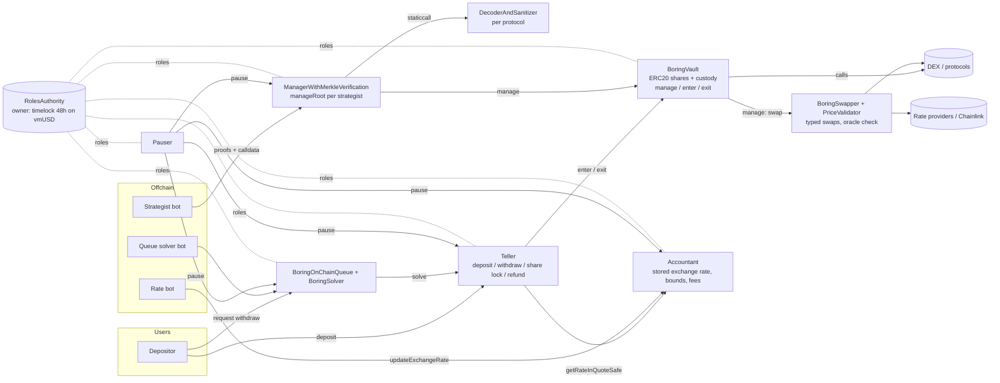
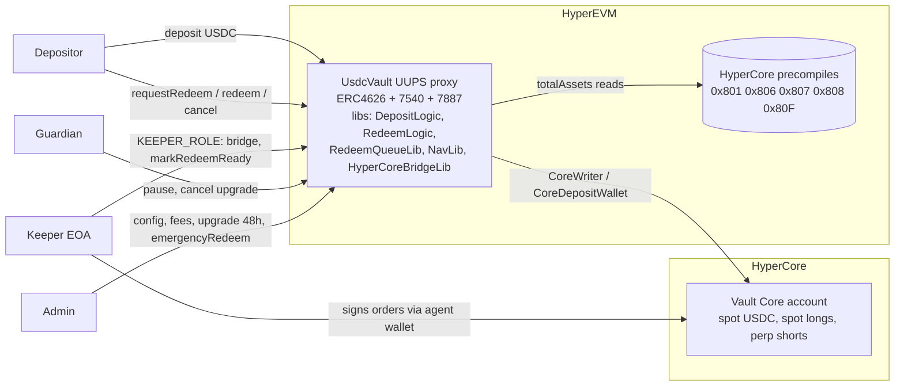

# Report 1: How BoringVault and hypurrquant HyperVault are built

Research date: 2026-09-25. Read-only review. Working notes with fuller citations: `research/managed-vaults/notes/` (`00-phase0-orientation.md`, `A-custody-modules.md`, `B-strategy-restrictions.md`, `C-accounting.md`, `D-deposits-withdrawals.md`).

Labels used throughout: **Verified** (read in code, or read live onchain and stated as such), **Inferred** (reasoning from code). Portability: **Portable** (any EVM chain including Monad), **Adaptable** (idea transfers, implementation changes), **Chain-specific**.

Paths prefixed `BV/` are in the BoringVault clone; paths prefixed `HQ/` are in the hypurrquant repository.

---

## 1. Versions, licenses, audit status, summaries

| | BoringVault (Veda, primary) | HyperVault (hypurrquant, secondary) |
|---|---|---|
| Source | https://github.com/Veda-Labs/boring-vault, not present locally, cloned read-only to the session scratchpad | https://github.com/hypurrquant/hyperliquid-vault, the working directory |
| Commit | `c9c221f97eaac686a98d625ddb0955ba50363815` | `79e41cdccbc6b2d60479d44a3bc04930e4415b9c` |
| Last commit date | 2026-09-17 | 2026-04-21 (single squashed commit, "HyperVault public release") |
| Version or tag | No release tags. Only tag: `merkle-root-creation-pre-2026-05-25`. Module natspec versions such as Teller "Base V0.2" | None |
| License | **Software Evaluation License 1.0 (SPDX `SEL-1.0`)**, added 2025-06-05 in commit `24c42f7cc`. Before that, files were `UNLICENSED`. It permits only internal non-commercial evaluation and test-only deployments. **We may study the patterns but must not copy code into production.** | Apache 2.0 (permissive) |
| Audits | 62 PDFs in `BV/audit/`: 0xMacro (sevenSeas, veda, boring-vault, arctic series), Certora (boring-vault 0 to 3, boring-swapper 0 to 1), Sigma Prime (boring-vault-0), Spearbit (boring-vault-arctic-0). Source files carry `Last audited:` header lines naming a commit and PDF. Certora specs in `BV/certora/`. | No audit reports in the repo. Test names refer to audit findings (`test_audit_M04_minDelay`, "Finding 6", "3rd-round Finding #4"), so some review happened, but none is published here. **Treat as unaudited.** |
| Size | About 80 MB excluding `lib/` and `.git`, mostly audits, leaf files and logs. Core modules are 141 to 758 lines each. 3,931 commits. | 7,882 lines across `src/`, `test/`, `script/` |
| Toolchain | Foundry, Solidity 0.8.21 | Foundry, Solidity 0.8.28, `via_ir`, `optimizer_runs = 1`, cancun |
| Tests run? | **No.** Foundry is not installed on this machine. All test observations come from reading test code. | **No**, same reason |

**BoringVault in one paragraph (Verified).** BoringVault is a 141-line ERC-20 share token that also holds every asset and can make arbitrary calls (`manage`), mint (`enter`) and burn (`exit`). All three are gated by solmate `Auth`, and all intelligence sits in external modules that hold roles in a shared `RolesAuthority`. The **ManagerWithMerkleVerification** lets strategists call `manage` only for calls whose (decoder, target, value flag, selector, address arguments) appear as a leaf in that strategist's Merkle root. The **TellerWithMultiAssetSupport** mints and burns shares for deposits and withdrawals, locks new shares for up to 3 days, and can refund deposits. The **AccountantWithRateProviders** stores an exchange rate pushed by an offchain bot and pauses itself when an update moves too far or comes too early. A **BoringOnChainQueue** plus **BoringSolver** handle delayed withdrawals, and a **BoringSwapper** with **PriceValidator** provides a typed, oracle-checked swap entry point. BoringVault is in production on Monad: the vmUSD vault `0x1C8a336051D2024E318A229d01F9F6CF96efD316` held 34,243,164.83 shares at a rate of 1.017009 at Monad block 108,054,709 (Verified live).

**hypurrquant HyperVault in one paragraph (Verified).** A single UUPS-upgradeable `UsdcVault` (ERC-4626 plus ERC-7540 async redeem plus ERC-7887 cancel) for HyperEVM (chain 999). It auto-bridges deposits to the vault's own HyperCore account, where an offchain keeper trades a delta-neutral spot and perp position through a HyperCore "agent wallet" that can trade but not withdraw. `totalAssets()` is read live from HyperCore precompiles. Redemptions are two-phase (`requestRedeem`, keeper `markRedeemReady`, user `redeem`). A 10% per-user performance fee is charged at redemption against each user's cost basis. Logic is split into delegatecalled external libraries only to fit under the 24 KB contract size limit.

---

## 2. Architecture

### 2.1 BoringVault (Arctic Architecture)



Valuation path: offchain bot computes NAV, pushes `updateExchangeRate(rate)`; Teller prices deposits and withdrawals from that stored rate. Vault balances never enter the onchain price (Verified, `BV/src/base/Roles/AccountantWithRateProviders.sol`).

### 2.2 hypurrquant HyperVault



Valuation path: `totalAssets() = usdc.balanceOf(vault) + coreNAV (precompiles) + inflight bridge buffer - accruedFees`, computed live on every call (Verified, `HQ/src/vault/UsdcVault.sol` `totalAssets`, lines 278 to 282).

---

## 3. Custody and module separation (Sub-agent A)

### 3.1 The BoringVault core (Verified, `BV/src/base/BoringVault.sol`)

| Function | Gate | Behavior |
|---|---|---|
| `manage(target, data, value)` and batch version | `requiresAuth` | Arbitrary call from the vault. Any target, calldata, native value |
| `enter(from, asset, assetAmount, to, shareAmount)` | `requiresAuth` | Pull asset, mint `shareAmount` chosen by caller. The vault does no pricing |
| `exit(to, asset, assetAmount, from, shareAmount)` | `requiresAuth` | `_burn(from, shareAmount)` with **no allowance check**, then send assets |
| `setBeforeTransferHook(hook)` | `requiresAuth` | External `view` hook called on `transfer` and `transferFrom` only, not on mint or burn |
| `receive()`, ERC721 and ERC1155 receivers | public | Accept native token and NFTs |

```solidity
// BV/src/base/BoringVault.sol exit(), lines 98-109
function exit(address to, ERC20 asset, uint256 assetAmount, address from, uint256 shareAmount)
    external requiresAuth
{
    _burn(from, shareAmount);
    if (assetAmount > 0) asset.safeTransfer(to, assetAmount);
    emit Exit(to, address(asset), assetAmount, from, shareAmount);
}
```

Not upgradeable: plain constructor, no proxy, no delegatecall (Verified). No pricing, no pause, no limits. **The vault's safety is entirely a function of who holds `manage`, `enter` and `exit`.** A MINTER can dilute everyone and a BURNER can destroy anyone's shares (Verified). Portable.

### 3.2 Permission wiring (Verified)

- solmate `Auth.isAuthorized` asks the authority first, then checks `user == owner`. A reverting authority bricks every gated function, and `setAuthority` swaps the whole permission table in one call (`lib/solmate/src/auth/Auth.sol`, read from solmate at the pinned commit `c892309`).
- `RolesAuthority.canCall = isCapabilityPublic[target][sig] || (userRoles & rolesWithCapability[target][sig]) != 0`. Roles are per (contract, selector). No argument checks, **no built-in delay**.
- The deploy script `BV/script/ArchitectureDeployments/DeployArcticArchitectureWithConfig.s.sol` (`_setupRoles`, `_finalizeSetup`) grants: Manager holds MANAGER (1) and MANAGER_INTERNAL (4); Teller holds MINTER (2) and BURNER (3); QueueSolver holds SOLVER (12) and CAN_SOLVE (31); OWNER (8) controls `setManageRoot`, `setBeforeTransferHook`, `setAuthority` and fee setters; PAUSER (5) controls pause and unpause. It then sets every module's `owner` to `address(0)`, so **the owner of the RolesAuthority is the real root of trust**.

### 3.3 Live Monad vmUSD wiring (Verified by `eth_call` to `https://rpc.monad.xyz`, block about 108.05M)

| Fact | Value |
|---|---|
| Vault, Manager, Teller, Accountant, Queue, Pauser, Solver `owner()` | `0x0`; all use RolesAuthority `0xA1299741...` |
| RolesAuthority `owner()` | `0x16ba7650...`, a contract with `getMinDelay() = 172,800 s` (48 h). Inferred to be an OpenZeppelin `TimelockController`. It also holds OWNER_ROLE |
| Teller role bitmap | MANAGER + MINTER + BURNER + undocumented role 35. The Teller holds MANAGER because `TellerWithYieldStreaming` inherits `TellerWithBuffer`, whose hooks call `vault.manage` with helper-built calldata, **a second path to `manage` that bypasses Merkle verification** |
| Public capabilities | Teller `deposit` and `withdraw` **public**; `bulkWithdraw` not; Queue `requestOnChainWithdraw` and `cancelOnChainWithdraw` public; `BoringSolver.boringRedeemSelfSolve` not public |
| Teller `shareLockPeriod` | 15 seconds |

The repo's Monad config says the timelock is not deployed (`shouldDeploy: false`, `minDelay 43200`) and records `Timelock: 0x0`, yet a 48 h timelock owns the authority live. **Repo config does not match live state** (Verified). Whether any other address holds OWNER_ROLE could not be enumerated because the public RPC rejected full-range log queries (open question).

### 3.4 Timelocks are a convention, not a contract property (Verified)

No BoringVault contract enforces a delay. The delay exists only if the RolesAuthority owner and every OWNER_ROLE holder is a timelock. Observed delays: 0 s (`BV/script/DeployTimelock.s.sol`, Plasma), 300 s (`BV/TimelockTxs/ebtc-timelock-tx-1.json`, `setRoleCapability` batch), 48 h (live vmUSD).

### 3.5 What can block an exit in BoringVault (Verified)

| Blocker | Code | Who |
|---|---|---|
| Teller paused | `_withdraw`: `if (isPaused) revert` | PAUSER (instant) |
| Accountant paused, including auto-pause on an out-of-bounds rate | Teller uses `getRateInQuoteSafe`, which reverts when paused | PAUSER, or the rate bot by posting an out-of-bounds rate |
| Asset withdrawals disabled | `if (!asset.allowWithdraws) revert` | OWNER or STRATEGIST_MULTISIG |
| User deny-listed | `withdraw` calls `beforeTransfer(msg.sender, address(0), msg.sender)` | Deny role (50 on vmUSD) |
| Teller loses BURNER, authority swapped, hook set to revert | RolesAuthority or `setAuthority` | Authority owner / OWNER_ROLE |

There is no in-kind exit and no exit that avoids the Accountant.

### 3.6 hypurrquant structure (Verified, `HQ/src/vault/`)

- `UsdcVault is VaultStorage, ERC20Upgradeable, PausableUpgradeable, ReentrancyGuardUpgradeable, UUPSUpgradeable`: the vault is token, accountant, teller and queue in one contract (1,138 lines).
- `VaultStorage` is append-only with `uint256[28] __gap`. External `public` library functions (`DepositLogic`, `RedeemLogic`, `RedeemQueueLib`, `NavLib`, `HyperCoreBridgeLib`) are linked and delegatecalled only to fit EIP-170.
- Roles: `DEFAULT_ADMIN_ROLE`, `ADMIN_ROLE`, `KEEPER_ROLE`, `GUARDIAN_ROLE`. Guardian pauses; admin unpauses.
- **Upgrade timelock enforced in code**: `proposeUpgrade` then `_authorizeUpgrade` requires the exact implementation and `block.timestamp >= upgradeProposedAt + UPGRADE_TIMELOCK` (48 hours, line 60 and lines 1110 to 1137). `guardianCancelUpgrade` lets the guardian veto.
- Weaknesses: role grants through OZ AccessControl are **instant**, so an admin can revoke the guardian before proposing an upgrade. Both deploy scripts set admin = keeper = guardian = deployer (`HQ/script/DeployUsdcVaultMainnet.s.sol`). `redeem` is `whenNotPaused`, and the redeem timelock can be set up to `MAX_REDEEM_TIMELOCK = 7 days`, longer than the 48 h upgrade window.

### 3.7 What the tiny-custody split buys (Inferred from structure)

Small, stable, audited custody while modules change (Veda ships many Teller, Accountant and queue variants against unchanged vaults); no proxy storage risk; least privilege per module; an onchain audit trail of role changes. The cost is that the generic `manage` and caller-trusted `enter`/`exit` push all safety into mutable role wiring whose delay is only a convention.

---

## 4. Strategy restrictions and Merkle verification (Sub-agent B)

### 4.1 The Merkle model (Verified, `BV/src/base/Roles/ManagerWithMerkleVerification.sol`)

Call path: strategist calls `manageVaultWithMerkleVerification(proofs[], decoders[], targets[], data[], values[])`; for each call, the Manager checks the proof against `manageRoot[msg.sender]` and then calls `vault.manage`.

```solidity
// _verifyManageProof, lines 284-287
bool valueNonZero = value > 0;
bytes32 leaf =
    keccak256(abi.encodePacked(decoderAndSanitizer, target, valueNonZero, selector, packedArgumentAddresses));
return MerkleProofLib.verify(proof, root, leaf);
```

| Leaf field | Size | Meaning |
|---|---|---|
| decoderAndSanitizer | 20 bytes | Pinned in the leaf so the strategist cannot choose a lenient decoder |
| target | 20 | Contract called |
| valueNonZero | 1 | Only zero or non-zero native value; the amount is never bound |
| selector | 4 | Function |
| argument addresses | 20 x N | Whatever the decoder returns, in order |

- **Decoders** mirror the target function's ABI, are `staticcall`ed with the real calldata, and return `abi.encodePacked` of every sensitive address. Unknown selectors hit `BaseDecoderAndSanitizer`'s `fallback` and revert (fail closed). Some also sanitize shapes (the Uniswap V3 path must be `20 mod 23` bytes; the V4 decoder accepts only one swap plus `SETTLE_ALL`/`TAKE_ALL`).
- **Post-call invariant:** the only check after the batch is that `vault.totalSupply()` is unchanged (lines 150 to 160).
- **Pause** blocks only strategist management, not deposits or withdrawals.
- **Flash loans:** inner calls are verified against `manageRoot[address(manager)]`, a shared root, not the strategist's.

### 4.2 Recipient, tokens and native value (Verified)

`BV/src/base/DecodersAndSanitizers/Protocols/UniswapV3DecoderAndSanitizer.sol` `exactInput` returns every path token and then `recipient`. The helper `_addUniswapV3OneWaySwapLeafs` in `BV/test/resources/MerkleTreeHelper/MerkleTreeHelper.sol` builds a leaf with `canSendValue = false`, `argumentAddresses = [tokenIn, tokenOut, boringVault]`. So a leaf **can** force recipient = vault, pin the tokens and direction, and forbid native value. It **cannot** bind `amountIn`, `amountOutMinimum` (slippage), fee tier, deadline, or approval amount (the Uniswap V3 decoder says so explicitly in lines 30 to 38).

### 4.3 Per-strategist permission sets (Verified)

`manageRoot` is per address. Veda scripts build several roots per vault (53 `generateStrategistMerkleRoot`, 52 `generateAdminStrategistMerkleRoot`, narrow "sniper" roots). **Micro-managers** (`BV/src/micro-managers/`) hold STRATEGIST_ROLE with their own narrow root; a bot gets a role on the micro-manager, which builds calldata itself. `DexSwapperUManager` hardcodes `recipient: boringVault`, approves exactly `amountIn`, measures the output balance delta, checks it against a `PriceRouter` value within `allowedSlippage` (default 5 bps), and revokes leftover allowance.

### 4.4 What Merkle cannot express, and Veda's patches (Verified)

| Limit | Leaf | Veda patch |
|---|---|---|
| % of vault per trade, max % per asset, USDC floor | No | None |
| Oracle price and freshness | No | `PriceValidator` on realized output; freshness in `GenericRateProviderWithStalenessCheck` |
| Slippage | No | BoringSwapper per-route cap; micro-manager global cap |
| Rate limit | No | `UManager.enforceRateLimit` (broken, below); BoringSwapper per-route volume token bucket |
| Deadline | No | None (adapters ignore deadlines) |
| Epochs | Partial (replacing a root kills old proofs) | None |
| Exact approval | No | Micro-managers and BoringSwapper approve exact, then reset |

**UManager rate limit is broken (Verified code, Inferred consequence):**

```solidity
// BV/src/micro-managers/UManager.sol lines 44-55
uint256 currentCallCountForPeriod = callCountPerPeriod[block.timestamp % period] + 1;
if (currentCallCountForPeriod > allowedCallsPerPeriod) revert UManager__CallCountExceeded();
callCountPerPeriod[block.timestamp % period] = currentCallCountForPeriod;
```

The key is the second offset inside the period, not the period index, and counters never reset. It allows up to `allowed` calls per second, and each offset eventually fills and blocks forever. `period` is `uint16`, so 24 h cannot be configured. Tests only exercise one timestamp.

**BoringSwapper** (`BV/src/base/Periphery/BoringSwapper.sol`, `adapters/price/PriceValidator.sol`) is Veda's typed swap layer and is already deployed on Monad (test swapper `0x6b01D470...`, Verified live):

1. Merkle leaf binds `tokenIn`, `tokenOut`, `receiver = vault`.
2. `_swapPreFlightCheck`: adapter must be registered, approved and unpaused; the adapter parses router calldata and must agree with the typed `SwapConfig` (for example `UniswapV3Adapter.exactInput` requires router recipient = swapper and path endpoints = tokenIn and tokenOut).
3. `_consumeRateLimit`: per-directed-route token bucket (capacity, continuous refill).
4. `_swapPostFlightCheck`: pull exactly `amount` from the vault, approve exactly, call router, reset approval, measure realized output delta, `PriceValidator.validate` requires **every** oracle valuation of the output to be at least **every** valuation of the input times `(1 - slippageBps)`, then send output to `receiver`.

Gaps: no deadline, no % of NAV, oracle staleness left to the rate provider (6 h in the Monad test script `BV/script/Test/DeployBoringSwapper.s.sol`), `setRouteConfig` refills the rate-limit bucket, and limit orders escrow principal inside the swapper, outside the vault.

### 4.5 Root updates (Verified)

`setManageRoot(strategist, root)` is `requiresAuth` (OWNER_ROLE in the deploy script) and takes effect immediately. On live vmUSD the OWNER_ROLE holder found is the 48 h timelock. "Owned" decoders (`OneInchOwnedDecoderAndSanitizer.setOneInchExecutor`) hold mutable state that changes permissions without a root update.

### 4.6 hypurrquant keeper restrictions (Verified)

Trading is offchain through a HyperCore agent wallet registered by `registerAgentWallet` (ADMIN). The contract enforces **no** trade size, asset, slippage, count or loss limits. Onchain keeper actions only move USDC between the vault's own EVM, spot and perp accounts, cannot touch `reservedEvmBalance` (funds reserved for ready redemptions), and `depositToHyperCore` requires `NavLib.checkPriceSanity` (5% divergence bound). Chain-specific apart from the reserved-balance idea.

---

## 5. Accounting, exchange rate, and fees (Sub-agent C)

### 5.1 AccountantWithRateProviders (Verified)

- `updateExchangeRate(uint96)` is called by UPDATE_EXCHANGE_RATE_ROLE (an offchain bot). The contract never reads balances.
- Bounds: `minimumUpdateDelayInSeconds`, `allowedExchangeRateChangeUpper/Lower` (bps of the previous rate). **An update that violates them is not rejected. It is stored, fee accrual is skipped, and the Accountant pauses** (lines 334 to 355):

```solidity
if (shouldPause) {
    // Instead of reverting, pause the contract.
    state.isPaused = true;
} else {
    _calculateFeesOwed(state, newExchangeRate, currentExchangeRate, currentTotalShares, currentTime);
}
newExchangeRate = _setExchangeRate(newExchangeRate, state);
```

- While paused, `getRate()` still returns the stored rate, but `getRateSafe` and `getRateInQuoteSafe` revert. The Teller and Queue use only the safe variants, so **deposits, withdrawals, new queue requests and `claimFees` all stop** until PAUSER unpauses.
- The bound is per update, not per unit of time: any true move larger than the band forces a pause and a human decision.
- Multi-asset: `getRateInQuote(quote) = 10^quoteDecimals * rate / rateProvider.getRate()` unless `isPeggedToBase`. The share price is still a single pushed number.

### 5.2 Fees (Verified, lines 541 to 621)

```
S_use         = min(totalSupply_now, totalSharesLastUpdate)
platformFee   = S_use * min(R_old, R_new) / ONE * platformFeeBps / 1e4 * dt / 365 days
if R_new > HWM: performanceFee = (R_new - HWM) * S_use / ONE * performanceFeeBps / 1e4; HWM = R_new
feesOwedInBase += platformFee + performanceFee
```

Caps: platform 20%, performance 50%. The high-water mark is **global** on the share price. `resetHighwaterMark` (OWNER) lowers it to the current rate after a drawdown. Fees owed are a separate liability that is **not** subtracted from the rate onchain; the bot must net them (Inferred). `claimFees` must be called by the vault itself.

### 5.3 Variants (Verified)

- **AccountantWithYieldStreaming** (what live vmUSD uses): the strategist posts `vestYield(amount, duration)`; the price rises linearly; `postLoss` applies losses immediately and pauses when a loss exceeds `maxDeviationLoss`. It overrides `updateExchangeRate(uint96)` to revert, **so the configured ±0.2% bounds are inert on vmUSD**. Live reads: `platformFee = 0` and `performanceFee = 0`, although the repo config says 50 bps platform fee.
- **AccountantWithFixedRate**: price capped at 1.0, excess yield claimed separately. Not relevant.
- **FeeRegistry** is swap fees for BoringSwapper, not vault fees; its `maxFeeBps` can be set up to 100%.

### 5.4 hypurrquant live NAV (Verified)

- `totalAssets() = _evmBalance() + _coreNAV() + _inflightBuffer() - accruedFees` (floored at 0).
- Precompile reads return `(false, 0)` on failure and **count as zero** rather than reverting (`HQ/src/vault/NavLib.sol` lines 56 to 146, 296 to 315). A failed read understates NAV, so deposits mint too many shares.
- Virtual offset `VIRTUAL_SHARES = VIRTUAL_ASSETS = 1e6`, both conversions `Math.Rounding.Floor` (lines 76 to 77, 336, 341). Cost-basis moves round up in the user's favor to avoid fee overcharge.
- Deposits revert if perp oracle vs mark, or spot vs perp oracle, diverge by more than 5% (`NavLib.checkPriceSanity`). No check on redemption pricing.
- Performance fee: default 10%, max 30%; per-user `userDeposits` cost basis that migrates pro rata on share transfers; fee rate snapshotted at `markRedeemReady`; fee changes wait 24 h (`FEE_CHANGE_TIMELOCK`) and activate permissionlessly; `fee = max(0, released - principal) * feeBpsSnapshot / 10000` per request; no loss carry-forward. Accrued fees are excluded from NAV until claimed.

---

## 6. Deposits, withdrawals, queues, locks, and tests (Sub-agent D)

### 6.1 BoringVault Teller (Verified, `BV/src/base/Roles/TellerWithMultiAssetSupport.sol`)

- `deposit(asset, amount, minimumMint, referral)`: public if configured. `shares = amount * ONE_SHARE / getRateInQuoteSafe(asset)`, then a per-asset `sharePremium` haircut (max 10%), `minimumMint` check, optional share-supply `depositCap`, then `vault.enter`.
- The overload `deposit(..., to, referral)` is role-gated because a third party depositing to `to` would reset the victim's share lock.
- **Share lock:** `_afterPublicDeposit` sets `shareUnlockTime = now + shareLockPeriod` for the whole address (not per lot) and stores a hash of the deposit for refunds. `MAX_SHARE_LOCK_PERIOD = 3 days`. It stops deposit-then-exit arbitrage against a stale pushed rate (Inferred).
- **Refunds:** `refundDeposit` (STRATEGIST_MULTISIG) burns the minted shares and returns the original deposit while the lock is active.
- **Withdraw:** `withdraw(asset, shares, minAssets, to)` is `requiresAuth`. The deploy script never makes it public (only tests do), **but on live Monad vmUSD it is public** (Verified live). `_withdraw` reverts if the Teller is paused, the asset disallows withdrawals, or the Accountant is paused. Single-asset payout at the stored rate. A withdrawal larger than idle balance just reverts, unless a `TellerWithBuffer` helper pulls from a lending buffer.
- `TellerWithRemediation` can freeze a user and, after 3 days, burn their shares and mint them to an admin-chosen address.

**No BoringVault exit is guaranteed operator-free.** Where public withdraw is enabled, it still depends on unpaused Teller and Accountant, the asset flag, the deny list and idle liquidity (Verified).

### 6.2 Queues (Verified)

- **BoringOnChainQueue** (current): `requestOnChainWithdraw(asset, shares, discount, secondsToDeadline)` escrows shares and fixes `amountOfAssets` at request time using the current rate minus the user's discount (max 30%). Solve window is `[creation + maturity, + deadline]` (maturity and minimum deadline up to 30 days each). Only a hash is stored. Users can cancel (not pause-gated) or replace. `withdrawCapacity` throttles exits. Solvers need CAN_SOLVE and SOLVER_ORIGIN. `boringRedeemSelfSolve` lets a user solve their own request if made public (it is not public on vmUSD), with no deficit cover.
- **Archived** `DelayedWithdraw`: user-completable after maturity, pays `shares * min(rateAtRequest, rateNow)`. `AtomicQueue`: approval-based OTC requests filled by a solver.
- **hypurrquant ERC-7540:** `requestRedeem` (requires `controller == owner`, max 50 active requests, redeem timelock snapshotted), 10-minute grace for cancellation, keeper `markRedeemReady` reserves `convertToAssets(shares)` from free EVM USDC and snapshots the fee rate, user `redeem` claims FIFO across ready requests with partial consumption of the last, operators must send proceeds to the controller. Cancel is ERC-7887 two-step and not pause-gated. `emergencyRedeem` (ADMIN) pays at most principal. **Ready shares stay in `totalSupply` and reserved USDC stays in `totalAssets` until claim, so remaining holders carry NAV moves in between (Inferred).**

### 6.3 Test suites (Verified by reading)

| | BoringVault | hypurrquant |
|---|---|---|
| Style | Mostly mainnet forks (`_startFork`), about 100 integration tests exercising leaves against real protocols | Local unit tests; HyperCore mocked with `vm.mockCall` at fixed precompile addresses (`HQ/test/mocks/MockPrecompiles.sol`) |
| Fuzz / invariants | `BV/test/fuzzing/` Foundry and Medusa handlers (Teller, Accountant), invariants such as `noFreeAssets`, `dustFavorsTheHouse`, `vaultSolvencyMulti`, `tellerPaused_methodsRevert`, `zeroAllowanceOnAssets`, `highwaterMarkNeverDecreases`. No queue invariants | About 157 tests, 2 fuzz tests (`testFuzz_deposit`, `testFuzz_convertRoundTrip`), no invariants |
| Notable | `ManagerWithMerkleVerification.t.sol`, `MerkleTreeChecker.t.sol`, `BoringSwapper.t.sol`, `PriceValidator.t.sol`, micro-manager tests (single-timestamp only) | Audit-finding regressions: `test_userDeposits_capBypass_blocked`, `test_pause_blocksReadyRedeem`, `test_redeem_stillWorksWhenFeeRecipientBlacklisted` |

---

## 7. Mechanism portability table

| # | Mechanism | Source | Label | Portability |
|---|---|---|---|---|
| 1 | Minimal immutable custody + share token with `manage`/`enter`/`exit` | `BV/src/base/BoringVault.sol` | Verified | Portable |
| 2 | Selector-level roles via RolesAuthority, owner set to zero | solmate `RolesAuthority`; deploy `_setupRoles`, `_finalizeSetup` | Verified | Portable |
| 3 | Timelock by ownership convention (0 s to 48 h) | `BV/script/DeployTimelock.s.sol`, `TimelockTxs/`, live vmUSD | Verified | Portable |
| 4 | In-code upgrade timelock + guardian veto | `HQ/src/vault/UsdcVault.sol` `proposeUpgrade`, `_authorizeUpgrade`, `guardianCancelUpgrade` | Verified | Portable |
| 5 | UUPS + append-only storage + delegatecalled libraries | `HQ/src/vault/VaultStorage.sol`, `*Logic.sol` | Verified | Portable |
| 6 | Separate pause and unpause keys, sender-scoped pause | `BV/src/base/Roles/Pauser.sol` | Verified | Portable |
| 7 | Merkle leaf over (decoder, target, value flag, selector, addresses) | `ManagerWithMerkleVerification._verifyManageProof` | Verified | Portable |
| 8 | Protocol decoders, fail closed | `BaseDecoderAndSanitizer`, `Protocols/*` | Verified | Adaptable (per-protocol ABIs and addresses) |
| 9 | Per-strategist roots, micro-managers | `manageRoot`, `src/micro-managers/*` | Verified | Portable |
| 10 | totalSupply-unchanged post-check | `manageVaultWithMerkleVerification` | Verified | Portable |
| 11 | `timestamp % period` call limit | `UManager.enforceRateLimit` | Verified (buggy) | Portable, do not copy |
| 12 | Typed swap + adapter calldata validation | `BoringSwapper._swapPreFlightCheck`, `UniswapV3Adapter` | Verified | Portable |
| 13 | Pull exact, approve exact, reset, realized-delta oracle check | `BoringSwapper._swapPostFlightCheck`, `PriceValidator.validate` | Verified | Portable |
| 14 | Directed per-route slippage caps and volume token buckets | `maxSlippageBpsPerRoute`, `_consumeRateLimit` | Verified | Portable |
| 15 | ERC-1271 limit orders with swapper escrow | `BoringSwapper.submitOrder`, `isValidSignature` | Verified | Portable pattern, venues Chain-specific |
| 16 | Staleness-checked rate provider wrapper | `BV/src/helper/GenericRateProviderWithStalenessCheck.sol` | Verified | Portable |
| 17 | Pushed exchange rate with per-update bounds, store-and-pause | `AccountantWithRateProviders.updateExchangeRate` | Verified | Portable |
| 18 | Platform fee on min(shares), min(rate); global HWM | `_calculatePlatformFee`, `_calculateFeesOwed` | Verified | Portable |
| 19 | Yield streaming, instant losses, TWAS cap | `AccountantWithYieldStreaming` | Verified | Adaptable |
| 20 | Live NAV from chain state | `HQ/src/vault/NavLib.sol` `coreNAV` | Verified | Chain-specific reads; idea Adaptable |
| 21 | Failed reads counted as zero | `NavLib` safe reads | Verified | Anti-pattern |
| 22 | Price-divergence gate on deposits | `NavLib.checkPriceSanity` | Verified | Adaptable |
| 23 | Inflight bridge buffer | `UsdcVault._inflightBuffer` | Verified | Chain-specific |
| 24 | Virtual offset, floor both ways; ceil on fee basis | `UsdcVault.convertToShares/Assets`, `NavLib.migrateCostBasisOnTransfer` | Verified | Portable |
| 25 | Per-user cost-basis performance fee, rate snapshot, 24 h fee timelock | `RedeemLogic`, `RedeemQueueLib.markReady`, `setConfig` | Verified | Portable |
| 26 | Accrued fees excluded from NAV | `UsdcVault.totalAssets` | Verified | Portable |
| 27 | Share lock after deposit, max 3 days; role-gated third-party deposit | Teller `_afterPublicDeposit`, `setShareLockPeriod` | Verified | Portable |
| 28 | Deposit refund within lock | Teller `refundDeposit` | Verified | Portable |
| 29 | Per-asset share premium | Teller `sharePremium` | Verified | Portable |
| 30 | Deny lists / transfer hook / ShareWarden | Teller `beforeTransfer`, `ShareWarden.sol` | Verified | Portable |
| 31 | Remediation (forced share move) | `TellerWithRemediation.sol` | Verified | Portable |
| 32 | Hash-set onchain withdrawal queue + solver | `BoringOnChainQueue.sol`, `BoringSolver.sol` | Verified | Portable |
| 33 | ERC-7540 async redeem with FIFO, reservation, ERC-7887 cancel | `HQ/src/vault/RedeemLogic.sol`, `RedeemQueueLib.sol` | Verified | Adaptable (bridge/keeper parts Chain-specific) |
| 34 | receiver = controller for operator actions | `UsdcVault.redeem`, `claimCancelRedeemRequest` | Verified | Portable |
| 35 | Per-user deposit cap including locked principal | `DepositLogic`, `maxUserDeposit` | Verified | Portable |
| 36 | Keeper agent wallet trading on HyperCore | `registerAgentWallet`, `CoreWriterLib` | Verified | Chain-specific |
| 37 | Reserved balance for ready redemptions | `reservedEvmBalance` | Verified | Adaptable |
