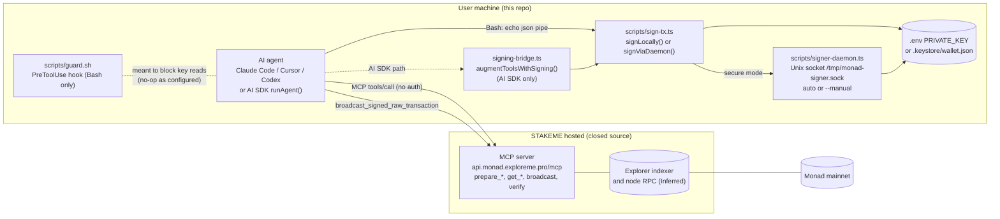
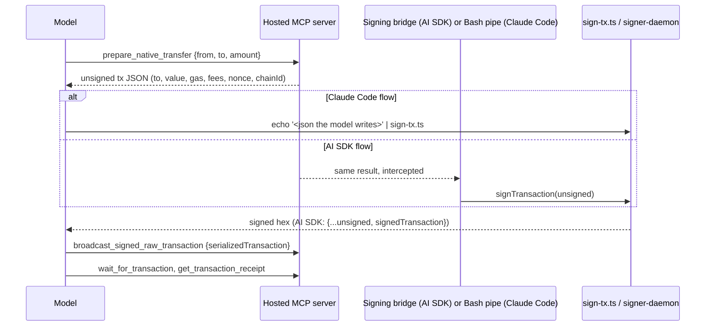

# Report 1: Monad Agent Kit, codebase report

Subject: `stakeme-team/monad-agent-kit`, cloned at `/home/dhrupatel/agent_tool/agent-kit`.
Research date: 2026-09-25/26. Method: reading only. Nothing was installed or run against the chain. `.env` and `.keystore/` were not read.
Labels: **Verified** means confirmed in code, config, git, or the GitHub API. **Inferred** means reasoning from docs, names, library conventions, or the MCP spec.
Working notes: `research/monad-agent-kit/notes/00-phase0-orientation.md`, `A-mcp-structure.md`, `B-tools-transactions.md`, `C-data-reliability-security.md`.

---

## 1. Versions, license, maintenance, summary

| Item | Value | Label |
|---|---|---|
| Commit analysed | `b0f0a09120e09026a08e146ee7366c98073fb7b6` ("Update README.md") | Verified |
| Version | `0.1.0` in `package.json`. No tags, no releases | Verified |
| First and last commit | Both on 2026-04-28 (8 commits in about 5 hours) | Verified |
| Contributors | 1 (`dracovis0x7`) | Verified |
| Stars, forks, issues | 0, 0, 0 (no issue ever filed), checked 2026-09-25 | Verified |
| License | README says "MIT", but there is no `LICENSE` file and GitHub reports `license: null` | Verified |
| Activity | No commits for about 5 months. The same org publishes near-identical kits for Arc, Sei, Celestia, ZetaChain, Somnia, Pharos and 0G, some updated in September 2026. The Monad kit looks like a one-time template instance | Verified (dates), Inferred (template) |
| Language and runtime | TypeScript, ESM, Node 20 or later, run through `tsx` with no build step | Verified |
| Key dependencies (lockfile) | `viem` 2.47.18, `@ai-sdk/mcp` 1.0.36, `ai` 4.3.19, `@ai-sdk/anthropic` 1.2.12, `@ai-sdk/openai` 1.3.24, `dotenv`. No `ethers`. No `@modelcontextprotocol/sdk` | Verified |
| Size | About 1,700 lines across `src/`, `scripts/`, `examples/`, `docs/` | Verified |

**Summary.** The kit is **a client-side starter kit, not an MCP server**. It configures Claude Code, Cursor, Codex, or a Vercel AI SDK agent to talk to a **hosted, closed-source MCP server** run by STAKEME at `https://api.monad.exploreme.pro/mcp`. That server holds every chain tool, and none of its source is in the repo. The repo's own code does four things. It generates a wallet and stores the key in `.env` or an encrypted keystore. It signs whatever unsigned transaction JSON it is given, either locally or through a Unix socket daemon. It tries to stop Claude Code from reading `.env` with a regex hook. It wraps the remote tools so that `prepare_*` results are signed automatically in the AI SDK flow. It supports only transfers, arbitrary contract calls and deployment, contract verification, and explorer reads. There are no swaps, quotes, oracles, staking, or lending. The signing path has no policy at all: no chain ID pin, no destination or value checks, and no calldata inspection.

**Network note (Verified).** From the research machine, the hosted server's domain fails TLS, and plain HTTP is redirected by a safe-browsing filter to `safebrowse.io/warn.html`. The Claude Code `monad` MCP connection also failed. We did not try to bypass the filter, so the live tool list and schemas were not inspected.

### Repository map

| Path | Purpose |
|---|---|
| `src/` | AI SDK library: `mcp-client.ts` (client factory), `agent.ts` (`runAgent` loop), `signing-bridge.ts` (auto-signs `prepare_*` results), `wallet.ts` (address and signer), `utils.ts` (env and logging) |
| `scripts/` | `wallet-manager.ts` (generate or import), `sign-tx.ts` (stdin JSON in, signed hex out), `signer-daemon.ts` (Unix socket signer, auto or manual approval), `keystore-utils.ts` (V3 keystore), `guard.sh` (Claude Code hook), `security-test.ts` |
| `examples/` | Two AI SDK demos: send MON, and deploy then verify a contract |
| `.claude/` | Hook config (`settings.json`) and skills `/wallet`, `/send`, `/deploy` |
| `.mcp.json`, `.cursor/`, `.codex/` | MCP client configs, all pointing at the hosted server |
| `contracts/` | `SimpleStorage.sol` and its compiled artifact |
| `docs/` | Architecture, setup guide for each IDE, sample prompts |
| `Dockerfile`, `docker-compose.yml`, `Makefile`, `bin/dev` | Optional Docker isolation (the signer container runs with `network_mode: none`) and make shortcuts |

---

## 2. Architecture



Key properties:
- **The server prepares and the client signs.** Unsigned JSON comes from the server. A local process holding the key signs it. The model then passes the signed hex back to the server to broadcast (Verified in `CLAUDE.md` "Transaction Signing Flow" and `src/signing-bridge.ts`).
- **The model decides what gets signed.** In the Claude Code flow, the model writes the JSON it pipes into `sign-tx.ts` itself. In the AI SDK flow, the bridge signs every `prepare_*` result automatically. Neither path applies a policy (Verified, section 4).

---

## 3. MCP server structure (from sub-agent A)

### 3.1 Transports (Verified)

| Where | Transport |
|---|---|
| `.mcp.json` (Claude Code) | `"type": "http"`, which is Streamable HTTP |
| `.cursor/mcp.json` | `url` only, so the client chooses |
| `.codex/config.toml` | stdio through `npx mcp-remote <url>` (unpinned npm package) |
| `src/mcp-client.ts` `getMonadMCPClient()` | `createMCPClient({ transport: { type: "sse", url } })` |
| `docs/ARCHITECTURE.md` | "HTTP transport" |

The AI SDK client asks for legacy SSE, while everything else uses Streamable HTTP. The HTTP+SSE transport was replaced by Streamable HTTP in the 2025-03-26 MCP spec and remains only for backward compatibility. The AI SDK demos therefore work only if the hosted server still serves legacy SSE on `/mcp` (Inferred, could not test).

### 3.2 Tool registration and schemas

**Verified: the repo registers no MCP tools.** `getMCPTools()` returns `client.tools()`, so the remote server decides every name, description, and input schema at runtime. There are no local types. The only locally defined tool is `get_wallet_address`, which `augmentToolsWithSigning()` adds (`src/signing-bridge.ts` lines 78 to 84). It returns `WALLET_ADDRESS` from the environment.

We cannot show a real server-side tool definition. Sub-agent A wrote an illustrative example using the official SDK, which is the pattern we would use. It is **not from the kit**:

```ts
server.registerTool("get_remaining_limits", {
  description: "Remaining trades and allocation headroom for the calling agent's account.",
  inputSchema: { account: z.enum(["personal", "vault"]) },
  outputSchema: { tradesLeft24h: z.number().int(), maxTradeUsd: z.string(), asOfBlock: z.number().int() },
}, async ({ account }, extra) => {
  const agentId = agentFromAuth(extra.authInfo);   // never from args
  const out = await limits.forAgent(agentId, account);
  return { content: [{ type: "text", text: JSON.stringify(out) }], structuredContent: out };
});
```

### 3.3 Errors (Verified)

- Nothing in the client reads MCP `isError`.
- When signing fails, `augmentToolsWithSigning()` returns a **successful** tool result with ad hoc fields `_signingError` and `_note` (lines 63 to 70). The error code is not typed.
- `runAgent()` has no `try/catch` around tool execution, only a `finally` that closes the client. In `ai` 4.x, a thrown tool error probably ends the whole `generateText` call instead of reaching the model (Inferred).
- `getEnv()` calls `process.exit(1)` when a required variable is missing. So a missing `PRIVATE_KEY` during a tool call kills the agent process (`src/utils.ts`, called from `src/wallet.ts` `signLocally()`).

### 3.4 Authentication, sessions, identity (Verified)

There is none. No config or client code sets an `Authorization` header, token, or `authProvider`. The server is anonymous. The wallet address reaches the model only through the system prompt (`examples/01-send-tokens.ts`) or by reading `.env` with grep (`CLAUDE.md`). It goes back to the server as a model-supplied tool argument (`from=...`). That is the exact pattern we must avoid: **identity supplied by the model as a parameter.**

### 3.5 Per-client tool control (Verified)

There is none. `getMCPTools()` passes through every tool. `.claude/settings.json` has only a Bash hook and no `permissions.deny` entries for `mcp__monad__*` tools. The dangerous `generate_disposable_test_wallet` is kept out only by prose in `CLAUDE.md`, the skills, and example prompts.

### 3.6 How Hermes would connect (Inferred)

Hermes could point at the hosted URL as an HTTP MCP server, or at `npx mcp-remote <url>` as stdio (the Codex pattern). It could exclude `generate_disposable_test_wallet` in its per-server tool list. But the server's model is "prepare it, then sign it yourself", which conflicts with our rule that the agent never signs. At most it could serve as a read-only data source, and section 5 argues against even that.

### 3.7 Two likely defects (Inferred, need a run to confirm)

1. `@ai-sdk/mcp` tool `execute` returns a `CallToolResult` object (`{content:[{type:"text",text}], isError}`). The bridge only calls `JSON.parse` on strings (`src/signing-bridge.ts` lines 45 to 46). With an object, it would pass the wrapper itself to `normalizeTx()`. `normalizeTx()` finds no transaction fields, and signing would fail with `_signingError`. **The AI SDK demos probably cannot sign as shipped.**
2. The lockfile pairs `ai` 4.3.19 (built on `@ai-sdk/provider` 1.x) with `@ai-sdk/mcp` 1.0.36 (built on provider 3.x). Their tool shapes differ.

---

## 4. Tools and the transaction path (from sub-agent B)

### 4.1 Tool inventory

The documented lists do not agree. README lists 15 tools. `CLAUDE.md` adds `get_evm_compiler_versions` and `get_erc721_token_by_address`. The skills and examples use `get_transaction_receipt`. `PREPARE_TOOLS` in `src/signing-bridge.ts` names four more (Verified). Descriptions below are Inferred from names and usage unless marked.

**Read**

| Tool | Description |
|---|---|
| `get_balance` | Native MON balance of an address |
| `get_token_balance` | ERC-20 balance of an address |
| `list_evm_blocks` | Recent blocks, takes `limit` (Verified from `send/SKILL.md`) |
| `get_evm_block_by_height` | One block with its transactions |
| `read_evm_contract` | View call with `address`, `abi`, `functionName` (Verified from `deploy/SKILL.md`) |
| `get_evm_compiler_versions` | Solidity versions available for verification |
| `list_erc20_tokens`, `get_erc20_token_by_address`, `get_erc721_token_by_address` | Explorer token metadata |
| `explorer_search`, `get_account_by_address` | Free-text explorer search, account view |
| `wait_for_transaction`, `get_transaction_receipt` | Poll until mined, fetch receipt (with `contractAddress`) |
| `get_wallet_address` | **Local**, added by the bridge (Verified) |

**Prepare** (return unsigned transaction JSON)

| Tool | Description |
|---|---|
| `prepare_native_transfer` | Takes `from`, `to`, `amount` in human units such as "0.001" (Verified args) |
| `prepare_erc20_transfer` | ERC-20 `transfer` |
| `prepare_transaction` | **Arbitrary** `to` and `data`. Leaving out `to` deploys a contract (Verified args) |
| `prepare_erc721_transfer`, `prepare_erc1155_transfer`, `prepare_token_approval`, `prepare_contract_write` | Wrapped by the bridge. Whether they exist on the server is unconfirmed |

**Sign, send, or write**

| Tool or mode | What it does |
|---|---|
| `broadcast_signed_raw_transaction` | Server broadcasts a signed raw tx (arg `serializedTransaction`, Verified from `send/SKILL.md`) |
| `verify_evm_contract_standard_json` | Explorer source verification, an offchain write |
| `generate_disposable_test_wallet` | Returns a new private key to the model (Inferred from the kit's warnings about it) |
| `scripts/sign-tx.ts`, `make sign` | Local signer: stdin JSON in, signed hex out |
| `scripts/signer-daemon.ts` | Socket signer, auto mode by default, `--manual` for a y/n prompt |
| `src/wallet.ts` `signTransaction()` | Exported library signer |
| Bridge-wrapped `prepare_*` | Automatic signing in the AI SDK flow |

### 4.2 Transaction path, end to end



What the signer does (Verified). The same field copy appears three times: `sign-tx.ts` `signLocally()`, `src/wallet.ts` `normalizeTx()`, and the `sign_transaction` case of `signer-daemon.ts` `handleRequest()`:

```ts
if (tx.to) txData.to = tx.to;
if (tx.value) txData.value = BigInt(tx.value as string);
if (tx.data) txData.data = tx.data;
if (tx.gas) txData.gas = BigInt(tx.gas as string);
if (tx.nonce !== undefined) txData.nonce = Number(tx.nonce);
if (tx.chainId) txData.chainId = Number(tx.chainId);
const signed = await account.signTransaction(txData);
```

- **No chain ID pin.** A missing `chainId` on a legacy transaction likely produces an unprotected pre-EIP-155 signature that is valid on any chain (Inferred from viem's serializer).
- **No `from` check, no destination allowlist, no value cap, no calldata or selector checks.** A missing `to` is signed as a deployment.
- **Nothing ties the signed transaction to what was prepared.** In the Claude Code flow the model writes the piped JSON, so `sign-tx.ts` will sign anything the model asks for. In the AI SDK flow the bridge signs whatever the **server** returned, without comparing it to the model's arguments. A compromised server could substitute `approve(attacker, max)`.
- **Daemon.** Auto mode (the default) signs immediately. `--manual` shows a y/n prompt, labels every call with a `to` as "TRANSFER" (approvals included), and shows only the first 20 hex characters of calldata (`logTransaction()`).

**Can the key reach the agent?**
- In secure mode with the daemon in Docker (`network_mode: none`, keystore mounted read-only), no code path returns the key (Verified). The agent can still get any transaction signed.
- In simple mode (the default), the key is in `.env`, readable by any process the agent starts. In the AI SDK flow it is loaded into the agent's own process (`src/utils.ts` `config()`).
- The only barrier is `guard.sh`, which does nothing as configured (section 5.3).
- `generate_disposable_test_wallet` puts a key directly into model context by design.

### 4.3 Protocols and chain handling (Verified)

- Grep for `uniswap|kuru|swap|quote|stake|lend|router|oracle|deadline|decimals` finds nothing apart from the org name `stakeme`. **No swaps, quotes, oracles, pool prices, staking, lending, wrapping, or portfolio valuation.**
- **No chain configuration in the client.** There is no `viem/chains`, no chain ID constant, no RPC URL, and no token addresses. The network is chosen only by the MCP URL (`getMcpUrl()`, overridable with `MONAD_MCP_URL`).
- **Gas and nonce come from the server's JSON.** There is no local estimation, no nonce tracking, and no concept of deadlines. A signed transaction stays valid until its nonce is used.
- `signer-daemon.ts` `formatValue()` assumes 18 decimals and uses `Number(wei) / 1e18`, which loses precision on large values.

---

## 5. Data sources, reliability, and security (from sub-agent C)

### 5.1 Data sources and external services

The repo reads no chain data itself (Verified). viem is used only for key generation and signing. Every read goes to the hosted server, which probably wraps STAKEME's explorer indexer and a node RPC. Freshness, block tag, and RPC provider are not documented (Inferred).

| Service | Where | Notes |
|---|---|---|
| `api.monad.exploreme.pro/mcp` | `.mcp.json`, `.cursor/mcp.json`, `.codex/config.toml`, `src/utils.ts` `getMcpUrl()` | Third party, anonymous. Sees every address, query, prepared tx, and signed tx. Currently flagged by a safe-browsing filter on the research network |
| npm registry | `.codex/config.toml` `npx mcp-remote` (unpinned) | Supply chain risk at runtime |
| Anthropic and OpenAI APIs | `src/agent.ts` `getModel()` | AI SDK flow only |
| Docker Hub, Alpine mirrors | `Dockerfile` | Build time |
| Monad RPC | none | The client never talks to a node. Broadcast goes through the hosted server |

### 5.2 Reliability (Verified)

- Grep for `retry|timeout|backoff|rate` finds no handling code.
- Socket calls in `signViaDaemon()` have no timeout and no size limit.
- With concurrent manual approvals, answers could be matched to the wrong transaction (Inferred).
- No staleness fields anywhere.
- `process.exit` inside library paths.

### 5.3 Input validation, injection, secrets

- **Validation.** None on addresses, amounts, or symbols in the client. There is no symbol-to-address registry, so a lookalike "USDC" returned by `list_erc20_tokens` is indistinguishable from the real one (Verified that no registry exists).
- **Prompt injection.** Token names and symbols, `explorer_search` results, contract read output, and block data go to the model unfiltered (Verified that there is no sanitization in `mcp-client.ts` or the bridge). Chain data is attacker-controlled: anyone can deploy a token whose name contains instructions.
- **Shell injection.** The skills tell the model to run `echo '<json>' | make sign` with server-returned JSON. A single quote in any string field breaks out of the shell quoting (Verified pattern in `CLAUDE.md` and `.claude/skills/send/SKILL.md`).
- **Guard hook is a no-op (Verified).**
  - `.claude/settings.json` runs `bash scripts/guard.sh '$TOOL_INPUT'`. The single quotes stop expansion, so `guard.sh` always receives the literal string `$TOOL_INPUT` and exits 0.
  - Claude Code delivers hook input as JSON on stdin, not in that variable.
  - Observed in this session: a read-only `cat package.json .env.example ...` matched the guard's `cat.*\.env` pattern and was not blocked.
  - The hook matcher covers only `Bash`, so the Read and Grep tools are never checked.
  - `security-test.ts` calls `guard.sh` directly with a real argument, which is why it reports 26/26 while the real integration does nothing.
  - Even if it were wired correctly, the regex denylist misses cases such as `tac .env`, `cut -d= -f2 .env`, glob paths, `/proc/self/environ`, and `grep WALLET_ADDRESS .env; tac .env` (the allow rule only checks the command prefix).
- **Keystore.** scrypt with N=8192 (`keystore-utils.ts`) is 32 times weaker than geth's default of 262144. The password file `.keystore/.password` is plaintext. The socket `/tmp/monad-signer.sock` has no client authentication.

### 5.4 Security table

| # | Issue | What the code does | Severity for us | Why |
|---|---|---|---|---|
| 1 | Signer signs anything | `normalizeTx()`, `sign-tx.ts` `signLocally()`, daemon `handleRequest()` copy fields with no checks | **High (design requirement)** | Our signer must sign only Executor calls rebuilt from a validated intent, with the chain ID pinned |
| 2 | Automatic signing of every `prepare_*` result | `augmentToolsWithSigning()` | **High (design requirement)** | Intent tools must never return a signable blob or calldata |
| 3 | Generic call and approve tools | `prepare_transaction`, `prepare_contract_write`, `prepare_token_approval` | **High** | Expose no generic call, approve, transfer, or broadcast tool. The Executor makes exact approvals internally |
| 4 | Identity from model parameters | `from=<address>` in tool args, address in the system prompt | **High** | Identity must come from the authenticated connection |
| 5 | No token registry, symbol lookups | nothing maps symbols to addresses | **High** | Assets must be an enum of allowlisted addresses in schemas, policy, and the Executor |
| 6 | Third-party server sees all activity, no auth, no SLA | `.mcp.json`, `getMcpUrl()` | **High if used** | Privacy and front-running exposure, availability risk, currently flagged by a network filter |
| 7 | No timeouts, retries, or freshness data | grep finds none | **High (design requirement)** | Our tools need timeouts, idempotency keys, and `asOf` block and time fields |
| 8 | Prompt injection through chain strings | no sanitization | **Medium** | Funds are protected by the Executor, but intent choice and narrator output can be steered. Return enums and numbers, not free-text chain strings |
| 9 | Server-substituted transaction goes undetected | the bridge ignores the model's args after the call | **Medium** | Any external quote or router API that builds calldata must be checked against the intent before signing |
| 10 | Unstructured errors | `_signingError`, `isError` ignored, `process.exit` | **Medium** | Typed error codes are needed for model reasoning and the narrator |
| 11 | Approval UI mislabels calls | `logTransaction()` shows "TRANSFER" | **Medium (UX lesson)** | Any human approval screen we build must decode calldata and show the simulated effect |
| 12 | Unpinned `npx mcp-remote` | `.codex/config.toml` | Low | Pin anything that runs in a sandbox |
| 13 | Guard hook no-op, regex denylist | `.claude/settings.json`, `guard.sh` | Not applicable (lesson: High) | We keep secrets out of the sandbox entirely. Test the real integration, not the script alone |
| 14 | Key in the same process as the LLM loop | `src/wallet.ts` `signLocally()` | Not applicable | Privy session keys sign outside the agent |
| 15 | Weak scrypt, plaintext password file, unauthenticated socket | `keystore-utils.ts`, `signer-daemon.ts` | Not applicable | Not our custody model |
| 16 | Shell injection through `echo '<json>'` | `CLAUDE.md`, skills | Not applicable | We never pipe tool output through a shell |

### 5.5 What is worth keeping as a pattern (Verified that each exists in the kit)

1. Separating preparation from signing, with the key in a separate, network-isolated process (`docker-compose.yml` `signer` service with `network_mode: "none"` and the keystore mounted read-only).
2. A remote MCP server that clients reach through one line of config (`.mcp.json`), with no local code needed to use the tools.
3. Read tool naming and granularity (`get_balance`, `get_token_balance`, `wait_for_transaction`, and `get_transaction_receipt`, which folds into intent status), plus skill files that script multistep flows for the model.
