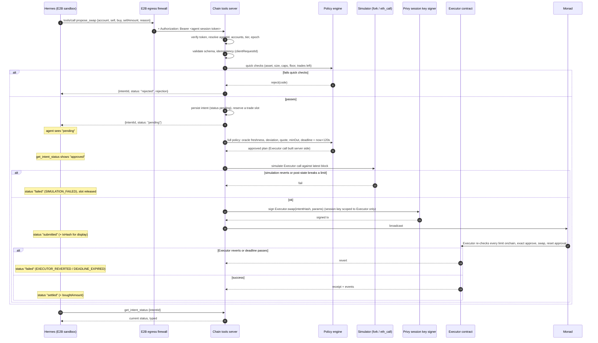

# Report 2: Platform mapping, how to build our chain tools server

Inputs: Report 1 (`01-codebase-report.md`) and the notes in `notes/`. Facts about the kit are labeled **Verified** or **Inferred** as in Report 1. Everything else in this document is design **recommendation**. Specifics about Hermes, E2B, Privy, and Solana tooling are Inferred from our earlier research and must be confirmed in the spike (Report 3).

**Headline.** The kit has no server code to reuse (Verified). The hosted server behind it prepares arbitrary transactions for the model to sign, which is the opposite of our intent model. We should **write our own chain tools server** with the official MCP TypeScript SDK and viem, **run it on the platform side**, and borrow only the kit's patterns: prepare and sign are separate, the key sits in an isolated process, clients connect through one line of config, and flows are scripted as skills. Almost every kit tool that exists is one we must remove. Every tool we need does not exist in the kit.

---

## 2.1 Tool mapping table

Fit values: **Use as is**, **Adapt**, **Build ourselves**, **Remove** (must not exist in our server).

### Tools our server must provide

| Our tool (Part 1 need) | Closest kit tool | Fit | Notes |
|---|---|---|---|
| `whoami` (identity, bound accounts, tier) | `get_wallet_address` (local, `src/signing-bridge.ts`) | Adapt | Derive everything from the authenticated session, never from the environment or args |
| `get_portfolio` (balances, positions, value) | `get_balance`, `get_token_balance` | Adapt | Kit tools take any address. Ours takes only `account: "personal" \| "vault"`, applies decimals, prices with the oracle, and adds `asOf` |
| `get_prices` (oracle) | none | Build ourselves | The kit has no oracle code (Verified). We need an oracle adapter plus a pool mid-price for the deviation check |
| `get_quote` (pool quote) | none | Build ourselves | No swap or quote code in the kit (Verified). Venue adapter for Uniswap v3, v4, or Kuru |
| `get_limits` (remaining limit headroom) | none | Build ourselves | Read from Executor state plus the policy engine |
| `propose_swap` | none (closest in spirit: `prepare_transaction`, but it must be removed) | Build ourselves | Returns `intentId` and status, never calldata |
| `propose_rebalance` | none | Build ourselves | Expands a target allocation into one or more swap legs server side |
| `get_intent_status` | `wait_for_transaction`, `get_transaction_receipt` | Adapt | The agent tracks intents, not tx hashes. Receipt lookup becomes internal |
| `list_intents` (recent intents) | `get_account_by_address` (history, Inferred) | Build ourselves | Scoped to the calling agent |
| `cancel_intent` | none | Build ourselves | Allowed only before `submitted` |
| `get_assets` (allowlisted asset registry) | `list_erc20_tokens`, `get_erc20_token_by_address` | Adapt, narrowed | Return only USDC and WMON with fixed addresses and decimals. No lookup of arbitrary tokens |

### Kit tools and components that must not exist in our version

| Kit tool or component | Fit | Reason |
|---|---|---|
| `prepare_native_transfer`, `prepare_erc20_transfer` | Remove | Moves funds outside the Executor |
| `prepare_transaction` | Remove | Arbitrary `to` and `data`, including deployment. Bypasses every Executor limit |
| `prepare_contract_write`, `prepare_token_approval` | Remove | Arbitrary calls and unlimited approvals. The Executor makes exact approvals itself |
| `prepare_erc721_transfer`, `prepare_erc1155_transfer` | Remove | Could move the agent NFT and break ERC-6551 identity |
| `broadcast_signed_raw_transaction` | Remove | The agent never holds signed transactions |
| `generate_disposable_test_wallet` | Remove | Returns key material to the model |
| `verify_evm_contract_standard_json`, `get_evm_compiler_versions` | Remove | Deployment tooling, not an agent capability |
| `read_evm_contract` | Remove (replace) | A generic ABI call surface. Replaced by specific typed reads |
| `list_evm_blocks`, `get_evm_block_by_height`, `explorer_search`, `get_account_by_address`, `get_erc721_token_by_address` | Remove at launch (possible premium "research" tier later, returning typed, sanitized fields only) | Not needed for portfolio management, and a prompt injection channel |
| `signing-bridge.ts` automatic signing pattern | Remove | The exact anti-pattern: the model triggers, the signer signs, and no policy runs |
| `sign-tx.ts`, `signer-daemon.ts`, `guard.sh` | Remove | No policy hooks. Privy session keys and an agent-free sandbox replace them |

### Premium tier candidates (Build ourselves, tier-gated)

| Tool | Why premium |
|---|---|
| `get_price_history` | Paid data API (metered) |
| `get_pool_depth` | Extra RPC load for tick and liquidity scans |
| `simulate_rebalance` | Dry run with simulation cost but no intent created |
| `get_vault_analytics` | Depositor flows and performance attribution, heavier indexer queries |

---

## 2.2 Build approach

**Recommendation: write our own server, borrowing the kit's patterns.** Neither "use the kit with configuration" nor "fork and trim" is available in any real sense.

| Factor | Finding | Effect on the decision |
|---|---|---|
| Server code | None in the repo (Verified). The hosted server is closed source | We cannot fork or trim a server we do not have. "Use directly" would mean depending on a third party's anonymous endpoint |
| Fit of the hosted tool surface | Every write tool is a prepare, sign, and broadcast primitive (Verified from docs and `PREPARE_TOOLS`) | All of them must be removed. None of our intent, quote, oracle, or limit tools exist |
| Reusable client code | About 360 lines in `src/`, built on `@ai-sdk/mcp` and Vercel AI SDK. Hermes does not use it | Nothing to reuse at runtime. The signing bridge is an anti-pattern for us |
| Quality | Signing bridge likely broken (`CallToolResult` not parsed), SSE and HTTP transport mismatch, guard hook no-op, no retries or timeouts, triplicated signer code (Verified or Inferred per Report 1) | Low. Even the good ideas need a rewrite |
| Maintenance | 1 contributor, 8 commits in one day, no activity for about 5 months, no releases, no issues. The org treats it as a template copied to other chains | No upstream to track |
| License | README claims MIT, but there is no `LICENSE` file and GitHub reports none (Verified) | Copying code verbatim carries legal ambiguity. Borrowing ideas does not |
| Hosted server as a data source | Anonymous, third party sees every query, no SLA, flagged by a safe-browsing filter on our research network (Verified) | Do not depend on it, even for reads |

**Our stack (recommendation):**
- `@modelcontextprotocol/sdk` (TypeScript), Streamable HTTP transport, `outputSchema` and `structuredContent` on every tool.
- `viem` for reads and for building Executor calldata server side (the kit's viem use shows it works with Monad, Verified).
- zod schemas shared between MCP tool schemas, the policy engine, and the intent store.
- Postgres for intents, limits cache, and the metering ledger. A job queue for the intent pipeline.
- Our own Monad RPC provider or providers, plus an oracle provider. These are the metered upstreams.

**Patterns we borrow from the kit:**
1. Keep "prepare" apart from "sign", and keep the signer in a separate process with no model access (`docker-compose.yml` `signer`, `network_mode: none`). For us that process is the Privy-backed executor service.
2. A single remote MCP endpoint that clients reach with one line of config (`.mcp.json`).
3. Skills or system prompt files that script multistep flows (`.claude/skills/*/SKILL.md`). For us that means Hermes skills such as "rebalance to target", which call only our tools.
4. The inverse lesson from `guard.sh`: never rely on filtering what the agent may do inside a box that holds secrets. Keep secrets out of the box and test the real integration end to end.

---

## 2.3 Where the server runs

**Recommendation: platform side, as a shared multi-tenant service.** The sandbox holds only the server URL. This confirms our current lean.

| Factor | Inside each sandbox | Platform side (recommended) |
|---|---|---|
| Tampering | The agent can run code in its sandbox. It could modify, kill, or bypass the server, or call the RPC directly if egress allows it. Any policy check in the sandbox is advisory | The agent reaches the server only through MCP calls. Code, policy, and data are out of reach |
| Identity binding | The server would have to trust something inside the sandbox to say which agent it is | Identity comes from a credential the sandbox never sees (E2B-injected header), verified by the server |
| Secrets | RPC keys, oracle API keys, and database credentials would need to be inside or reachable from the sandbox | All upstream credentials stay on the platform. The sandbox holds none |
| Egress allowlist | Must allow the RPC, oracle, and data APIs for every sandbox | Allow exactly one host: the chain tools server (plus the model API) |
| Metering | Reported by an untrusted process | Recorded at the server, where the paid call happens |
| Shared caching | Each sandbox fetches prices and quotes separately | One price and quote cache for all agents, which cuts paid calls |
| Latency | Lowest (local stdio) | One network hop per tool call, roughly tens of milliseconds in the same region (Inferred). Small next to model latency and the 2-minute deadline |
| Blast radius | A server bug affects one agent | A server bug affects all agents. Mitigate with tenant isolation in code, tests, and rate limits (section 2.8) |
| Upgrades | Every sandbox image must be rebuilt | Deploy once. Pin the tool schema version per agent config epoch |

**How E2B fits (Inferred, verify in the spike):**
- Sandbox egress policy: deny by default. Allow `chain-tools.<platform>` and the model provider only.
- For requests to `chain-tools.<platform>`, the E2B firewall injects `Authorization: Bearer <agent session token>`. The token never exists in the sandbox filesystem, environment, or Hermes config. Prompt injection therefore cannot exfiltrate it.
- As a second factor, the server also requires the request to come through E2B egress. Options are an egress IP allowlist, mTLS from the firewall, or a second injected header holding an HMAC over the sandbox ID. A leaked token alone is then not enough.
- The Hermes config in the sandbox contains a single HTTP MCP entry with the URL and an include list mirroring the tier. The include list is a convenience only. The server remains the authority.

---

## 2.4 Tool design

### Conventions for every tool

- **Identity is implicit.** No tool accepts an address, agent ID, or account address. Account selection is `account: "personal" | "vault"`, resolved on the server from the session.
- **Assets are an enum.** Launch set: `"USDC" | "WMON"`. Each maps server side to a fixed address and decimals. There is no free-text symbol field anywhere.
- **Amounts are decimal strings in token units** (for example `"125.5"`), validated with a regex and a maximum number of decimals. Output carries both `amount` (decimal string) and `amountRaw` (base-unit integer string). JSON numbers are used only for small integers and basis points.
- **Freshness on every read.** `asOf: { block: number, timestamp: string (ISO 8601) }`.
- **Structured output.** Every tool declares `outputSchema` and returns `structuredContent`, plus the same JSON as text for clients that ignore structured content.
- **Errors.** Every tool returns `isError: true` with `structuredContent: { error: { code, message, retryable, details? } }`. `code` comes from a closed enum, listed below. The server never throws raw exceptions to the transport.
- **No free-text chain strings.** Token names or symbols fetched from the chain are never returned. Only our registry values are.

**Error codes:** `UNAUTHENTICATED`, `TIER_NOT_ALLOWED`, `RATE_LIMITED`, `INVALID_INPUT`, `ASSET_NOT_ALLOWED`, `ACCOUNT_NOT_AVAILABLE`, `UPSTREAM_UNAVAILABLE`, `STALE_DATA`, `INTENT_NOT_FOUND`, `INTENT_NOT_CANCELLABLE`, `DUPLICATE_REQUEST`, `INTERNAL`.

**Rejection reason codes** (in intent status, not tool errors): `ASSET_NOT_ALLOWED`, `VENUE_NOT_ALLOWED`, `TRADE_SIZE_EXCEEDED` (over 10% of account value), `CONCENTRATION_CAP` (non-USDC over 40% after trade), `USDC_FLOOR` (USDC under 10% after trade), `SLIPPAGE_TOO_HIGH` (over 50 bps), `DAILY_TRADE_LIMIT` (20 per rolling 24 h), `ORACLE_STALE` (over 5 minutes), `ORACLE_POOL_DEVIATION` (over 2%), `INSUFFICIENT_BALANCE`, `CIRCUIT_BREAKER_ACTIVE`, `EPOCH_MISMATCH` (ownership or config epoch changed), `SIMULATION_FAILED`, `DEADLINE_EXPIRED`, `EXECUTOR_REVERTED`.

### Enforcement map

| Rule | Tool schema (model sees) | Server validation | Policy engine (pre-sign) | Simulation | Executor (onchain, final authority) |
|---|---|---|---|---|---|
| Identity and account binding | no address params | session to agent to accounts | yes | n/a | owner and epoch checks |
| Tier gating | tools hidden | `tools/list` and `tools/call` checks | n/a | n/a | n/a |
| Allowed assets USDC, WMON | enum | yes | yes | n/a | **yes** |
| Single venue | not a parameter | n/a | yes | yes | **yes** (venue allowlist) |
| Max 10% of account value per trade | described | pre-check with warning | yes | n/a | **yes** |
| Max 40% non-USDC, at least 10% USDC | described | pre-check | yes (post-trade projection) | post-state check | **yes** |
| Max 0.5% slippage | `maxSlippageBps` max 50 | yes | yes (sets `minOut`) | output check | **yes** (`minOut`) |
| Exact approvals, reset after swap | not exposed | n/a | n/a | yes | **yes** |
| 20 trades per rolling 24 h | shown in `get_limits` | pre-check | yes (with reservation) | n/a | **yes** |
| 2-minute deadline | not a parameter | n/a | sets `deadline = now + 120s` | yes | **yes** |
| Oracle fresh (5 min) and within 2% of pool | shown in `get_prices` | n/a | yes | yes | **yes** |
| Circuit breaker, epochs | shown in `get_limits` | n/a | yes | n/a | **yes** |
| Idempotency | `clientRequestId` | dedupe key | n/a | n/a | nonce |

The Executor is the only authority that cannot be bypassed. The server and the policy engine repeat its checks so they can **fail fast with a typed reason** and avoid gas-wasting reverts. Their thresholds must be read from the same config epoch the Executor uses, not hard-coded.

### Launch tool specifications

Schemas are written as TypeScript-style types for brevity. Implement them as zod schemas, which the SDK converts to JSON Schema.

#### `whoami` (baseline)

- **Description for the model:** "Returns who you are on the platform: your agent ID, the accounts you manage, your tier, and which tools you can use. Call this first in a session. Takes no input."
- **Input:** `{}`
- **Output:**
```ts
{ agentId: string; agentTokenId: string; tokenBoundAccount: `0x${string}`;
  accounts: { personal: { address: `0x${string}`; enabled: boolean };
              vault:    { address: `0x${string}`; enabled: boolean } };
  tier: "base" | "premium"; tools: string[]; configEpoch: number; chainId: number }
```

#### `get_portfolio` (baseline)

- **Description:** "Returns the balances, USD values, and allocation percentages of one of your accounts, valued with oracle prices. Use it before proposing any trade. `account` is 'personal' (your owner's funds) or 'vault' (depositors' funds you manage)."
- **Input:** `{ account: "personal" | "vault" }`
- **Output:**
```ts
{ account: "personal" | "vault"; address: `0x${string}`;
  totalValueUsd: string;
  holdings: Array<{ asset: "USDC" | "WMON"; amount: string; amountRaw: string;
                    priceUsd: string; valueUsd: string; allocationPct: number }>;
  pendingIntents: number;
  asOf: { block: number; timestamp: string } }
```

#### `get_prices` (baseline)

- **Description:** "Returns the oracle price and the current pool price for each allowed asset, how old the oracle price is, and whether trading is currently allowed on that price (oracle under 5 minutes old and within 2% of the pool)."
- **Input:** `{ assets?: Array<"USDC" | "WMON"> }` (default: all)
- **Output:**
```ts
{ prices: Array<{ asset: "USDC" | "WMON"; oraclePriceUsd: string; oracleUpdatedAt: string;
                  oracleAgeSeconds: number; poolPriceUsd: string; deviationBps: number;
                  tradable: boolean; reason?: "ORACLE_STALE" | "ORACLE_POOL_DEVIATION" }>;
  asOf: { block: number; timestamp: string } }
```

#### `get_quote` (baseline)

- **Description:** "Gets an indicative quote from the platform's swap venue for selling one allowed asset for another. It does not reserve a price or create a trade. Use `propose_swap` to actually trade. Also reports whether a trade of this size would pass your limits."
- **Input:** `{ account: "personal" | "vault"; sell: "USDC" | "WMON"; buy: "USDC" | "WMON"; sellAmount: string }` (`sell` must differ from `buy`)
- **Output:**
```ts
{ sell: "USDC" | "WMON"; buy: "USDC" | "WMON"; sellAmount: string;
  expectedBuyAmount: string; minBuyAmountAtMaxSlippage: string;
  priceImpactBps: number; venue: string; feeBps: number;
  limitCheck: { wouldPass: boolean; failingRules: string[] };   // rejection reason codes
  quoteValidSeconds: number; asOf: { block: number; timestamp: string } }
```

#### `get_limits` (baseline)

- **Description:** "Shows how much room you have under each trading limit for one account: trades left in the rolling 24 hours, the largest trade allowed now, room before the 40% cap on each non-USDC asset, the amount of USDC above the 10% floor, and whether the circuit breaker is active."
- **Input:** `{ account: "personal" | "vault" }`
- **Output:**
```ts
{ account: "personal" | "vault";
  tradesUsed24h: number; tradesLeft24h: number; nextTradeSlotFreesAt: string | null;
  maxTradeValueUsd: string;                                   // 10% of account value
  concentration: Array<{ asset: "WMON"; currentPct: number; capPct: 40; headroomUsd: string }>;
  usdcFloor: { currentPct: number; floorPct: 10; spendableUsdcAboveFloor: string };
  maxSlippageBps: 50; deadlineSeconds: 120;
  circuitBreaker: { active: boolean; reason?: string; since?: string };
  configEpoch: number; asOf: { block: number; timestamp: string } }
```

#### `propose_swap` (baseline)

- **Description:** "Proposes a swap from one of your accounts. This does NOT execute immediately and returns no transaction. The platform checks your limits, simulates the trade, and executes it if it passes. You get an intent ID. Check progress with `get_intent_status`. Provide a `reason` in one or two sentences for the owner's activity log."
- **Input:**
```ts
{ account: "personal" | "vault"; sell: "USDC" | "WMON"; buy: "USDC" | "WMON";
  sellAmount: string;                       // token units, e.g. "250"
  maxSlippageBps?: number;                  // 1..50, default 50
  reason: string;                           // max 280 chars, stored, shown to owner, never executed
  clientRequestId?: string }                // idempotency key, uuid
```
- **Output:**
```ts
{ intentId: string; status: "pending" | "rejected";
  rejection?: { code: RejectionCode; message: string; details?: Record<string, string> };
  expiresAt: string;                         // intent TTL, not the onchain deadline
  createdAt: string }
```
- Cheap, deterministic checks (asset, size, cap, floor, trade count) run synchronously, so obvious violations return `rejected` immediately. Simulation and execution are asynchronous.

#### `propose_rebalance` (baseline)

- **Description:** "Proposes moving an account toward a target allocation, for example 60% USDC and 40% WMON. The platform works out the swaps needed, checks every limit, and executes if allowed. The result is one intent, which may contain several swap legs. Targets must add up to 100, keep USDC at 10% or more, and keep WMON at 40% or less."
- **Input:**
```ts
{ account: "personal" | "vault";
  targets: Array<{ asset: "USDC" | "WMON"; pct: number }>;   // sum 100, integers or one decimal
  toleranceBps?: number;                                     // skip if already within, default 100
  maxSlippageBps?: number; reason: string; clientRequestId?: string }
```
- **Output:** as for `propose_swap`, plus `legs: Array<{ sell; buy; sellAmount; }>` (the planned legs) and `noopReason?: "WITHIN_TOLERANCE"`. When a rebalance needs more than 10% of value in one trade, the policy engine either splits it into legs, which count against the 20 per 24 h limit, or rejects it with `TRADE_SIZE_EXCEEDED`. The choice between the two is an open product decision (Report 3).

#### `get_intent_status` (baseline)

- **Description:** "Returns the current status of an intent you created: pending, approved, rejected (with a reason code), submitted, settled, failed, expired, or cancelled. For settled trades it includes the amounts actually received."
- **Input:** `{ intentId: string }`
- **Output:**
```ts
{ intentId: string; kind: "swap" | "rebalance"; account: "personal" | "vault";
  status: "pending" | "approved" | "rejected" | "submitted" | "settled" | "failed" | "expired" | "cancelled";
  rejection?: { code: RejectionCode; message: string };
  failure?: { code: "SIMULATION_FAILED" | "EXECUTOR_REVERTED" | "DEADLINE_EXPIRED" | "SUBMISSION_FAILED"; message: string };
  legs: Array<{ sell; buy; sellAmount: string; minBuyAmount?: string; boughtAmount?: string;
                txHash?: `0x${string}`; status: string }>;
  history: Array<{ status: string; at: string }>;
  updatedAt: string }
```
- An intent owned by another agent returns `INTENT_NOT_FOUND`, never `forbidden`, so its existence is not leaked. `txHash` is returned for display only. The agent has no tool that can act on it.

#### `cancel_intent` and `list_intents` (baseline)

- `cancel_intent { intentId }` works only while the status is `pending` or `approved`. It returns the new status or `INTENT_NOT_CANCELLABLE`.
- `list_intents { account?, status?, limit? (max 50) }` returns summaries for the calling agent only.

---

## 2.5 Intent flow



Implementation notes:
- The Executor call is **built by the server from the stored intent**, never taken from the model or from an external API unchecked. If a routing API is ever used, its calldata is decoded and checked against the intent (the kit's missing check, Report 1, section 5.4 item 9).
- The session key's Privy policy should allow only `to = Executor` and only the Executor's intent entrypoints (Inferred Privy capability, verify).
- A trade slot is reserved at `pending` so concurrent intents cannot overshoot 20 per 24 h. The slot is released on reject, fail, expire, or cancel.
- Nonce management lives in the signer service, per session key, serialized. That fixes the kit's missing nonce tracking (Report 1, section 4.3).

---

## 2.6 Identity, tiers, and metering

### Identity binding

1. When the platform starts an agent sandbox, it mints a short-lived **agent session token**. This is a JWT signed by the platform, with claims `{ sub: agentId, tokenId, tba, personal, vault, tier, configEpoch, ownershipEpoch, sandboxId, exp }`, lifetime of about 1 hour, refreshed by the platform.
2. The token is registered with the E2B firewall as an injected header for the chain tools host only. It never enters the sandbox.
3. **Middleware** on the Streamable HTTP endpoint verifies the signature, expiry, and audience. It also checks the second factor, which proves the request came through E2B egress for that `sandboxId`. It then loads the agent record and checks that `ownershipEpoch` and `configEpoch` still match the chain and the database. It attaches `authInfo` to the request.
4. The MCP session (`Mcp-Session-Id`) is bound to that `agentId` when it is created. A request carrying a session ID with a different principal is rejected. `Mcp-Session-Id` is **never** treated as authentication.
5. Handlers get identity only from `extra.authInfo`. A lint rule and code review enforce that no tool schema contains `address`, `agentId`, `owner`, or `wallet`.
6. Every data access goes through a repository layer keyed by `agentId`. For example, `intents.get(agentId, intentId)` has no unscoped variant. Postgres row-level security keyed on `agent_id` backs this up.
7. When the NFT changes hands, the ownership epoch increases. That revokes live tokens and makes the Executor reject older intents (`EPOCH_MISMATCH`).

### Tier-based tool sets

- **Build one `McpServer` instance per authenticated session**, registering only the tools in `tierTools[tier]`. `tools/list` then naturally hides premium tools, and `tools/call` for an unregistered tool fails at the protocol level.
- Check the tier again inside each premium handler (defense in depth).
- A tier change mid-session triggers `notifications/tools/list_changed`, or the session is closed and the agent reconnects. Whether Hermes honours `list_changed` is an open question.
- Hermes' per-server include list mirrors the tier, so the model is not shown tools it cannot call. It is not a security control.

### Metering

- All paid upstreams (RPC provider, oracle or price API, quote API, simulation) are wrapped in a `meteredClient(provider)` that requires a `MeterContext { agentId, tool, requestId }`. Upstream calls without a context fail in tests.
- Each paid call appends a ledger row: `{ ts, agentId, tool, requestId, provider, method, units, unitCostMicros, cacheHit }`. It is append-only and reconciled daily against provider invoices.
- **Billing basis (recommendation):** charge per tool call from a price table (for example, `get_quote` = N credits). Keep the raw upstream ledger for cost analysis. Shared caches make exact per-agent upstream attribution arbitrary. Record `cacheHit` so the price table can be tuned.
- **Budgets:** check a per-agent credit balance before paid tools run. When it is exhausted, return `RATE_LIMITED` with `retryable: false`. Apply rate limits per agent (token bucket) on all tools, and a tighter one on `propose_*`.
- The operating wallet pays gas for Executor calls. Record gas used per intent in the same ledger, keyed by `intentId`.

---

## 2.7 Solana note

| Part of the design | On Solana |
|---|---|
| MCP server shape, Streamable HTTP, platform-side placement, E2B header injection | Carries over unchanged |
| Identity tokens, epochs, per-session tier servers, metering ledger, rate limits | Carries over unchanged |
| Tool names and schemas (`get_portfolio`, `get_limits`, `propose_*`, `get_intent_status`) | Carry over. Asset enum changes (USDC, wSOL or SOL, possibly an LST). `address` types become base58 |
| Intent state machine and rejection codes | Carries over. Adds Solana specifics (`BLOCKHASH_EXPIRED` replaces deadline handling, compute budget failures) |
| Executor contract | Replaced by an Anchor program enforcing the same limits. Accounts become PDAs |
| ERC-6551 token-bound account | Replaced by an NFT-owned PDA or Metaplex Core asset with an authority PDA (Inferred, design needed) |
| viem, Uniswap, oracle adapter | Replaced by `@solana/kit` or `@solana/web3.js`, Jupiter or a single AMM, and Pyth or Switchboard |
| Privy session key signing EVM calls | Privy Solana wallets with a policy restricted to our program ID (Inferred, verify) |
| Simulation | `simulateTransaction` RPC |
| `solana-agent-kit` | Useful **server side only** as a library of protocol adapters (Jupiter quote, Pyth reads). Its action and tool layer signs with a local keypair and exposes transfer and trade actions, so it needs the same trimming this kit needs. Do not expose its MCP adapter to the agent (Inferred from its public design, not researched here) |

---

## 2.8 Risks, ranked

| # | Risk | Likelihood / impact | Mitigation |
|---|---|---|---|
| 1 | **Cross-agent access** (confused deputy): a bug lets agent A read or act for agent B | Medium / Critical | Identity only from verified token, `agentId`-scoped repositories plus Postgres row-level security, no address parameters, spike test 4 as a permanent CI test, fuzz tests over `intentId` |
| 2 | **Policy drift** between server pre-checks and Executor limits, so trades that "pass" revert (gas wasted) or the Executor is misconfigured | Medium / High | Executor is the only authority. The server reads thresholds from the Executor or config epoch at runtime, never constants. Simulation before signing. Invariant tests run against a fork |
| 3 | **Thin Monad liquidity and oracle-pool deviation** cause frequent `ORACLE_POOL_DEVIATION` or slippage rejections, so the agent looks broken | High / Medium | Surface `tradable` and deviation in `get_prices` so the agent avoids pointless proposals. Choose the venue (v3, v4, Kuru) by measured depth. `get_quote` includes `limitCheck` |
| 4 | **Session key or signer compromise** | Low / Critical | Privy policy restricted to Executor entrypoints. The Executor caps any single call's damage. Circuit breaker. Signer service on a separate network segment with no MCP access |
| 5 | **Prompt injection** from chain data or tool text steering intents or the narrator | Medium / Medium | Only enums, numbers, and our own strings reach the model. `reason` is stored as data and never rendered as instructions. The narrator gets typed JSON |
| 6 | **Intent spam or cost blowup** (looping agent, many quotes) | Medium / Medium | Per-agent rate limits, credit budgets, idempotency keys, trade slot reservation |
| 7 | **Stale or unavailable upstream data** (RPC, oracle) | Medium / Medium | `asOf` on every read, `STALE_DATA` and `UPSTREAM_UNAVAILABLE` errors with `retryable`, two RPC providers, timeouts on every call |
| 8 | **Shared service blast radius** (outage or bad deploy affects all agents) | Medium / Medium | Stateless replicas, canary deploys, schema version pinned per config epoch, circuit breaker that pauses intents platform-wide |
| 9 | **Hermes and E2B integration assumptions** (header injection per host, `structuredContent`, `list_changed`, include lists) turn out wrong for our pinned versions | Medium / Medium | Spike steps 1, 5, and 6 prove them before build. Fall back to a text JSON body and reconnect on tier change |
| 10 | **Latency versus the 2-minute deadline** (policy, simulation, signing, inclusion) | Low / Medium | Deadline set at signing time, not at proposal time. Quick checks are synchronous and the rest runs on a queue. Measure p95 in the spike |
| 11 | **Borrowing from an unlicensed repo** | Low / Low | Borrow ideas only, copy no code. The license question is noted in Report 3 |
