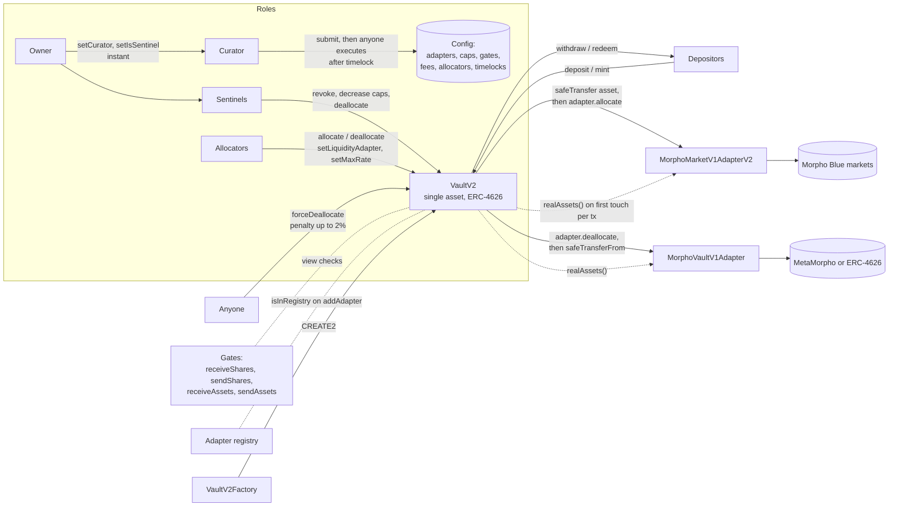

# Report 1: How Morpho Vault V2 Works

Labels used throughout: **Verified** means read in the code, tests, audit text, or onchain at the cited location. **Inferred** means reasoning, general knowledge, or a design judgment. Line numbers refer to `src/VaultV2.sol` unless another file is named. Working notes with more detail are in `research/morpho-vault/notes/` (A: roles, B: accounting, C: exits, D: adapters and security).

---

## 1. Versions, licenses, and Monad deployment status

| Item | Value |
|---|---|
| Repository | `morpho-org/vault-v2` (origin `https://github.com/morpho-org/vault-v2.git`) |
| Commit | `9ee4dbdcc9b261eef60768e3997e328224b68395` (merge of PR #1010) |
| Last commit date | 2026-09-25 11:01:44 +0200. Last change to `src/VaultV2.sol`: `640c6b54`, 2026-08-31 |
| Version / tag | `git describe`: `2026-08-13-85-g9ee4dbdc`. Tags are dates: `2025-12-04`, `2026-07-08`, `2026-07-29`, `2026-08-12`, `2026-08-13` |
| License | `GPL-2.0-or-later` (SPDX header on all 39 files in `src/`, `LICENSE` is GPL v2 text). **Verified** |
| Compiler | Solidity 0.8.28, `via_ir`, `evm_version = cancun` (`foundry.toml`). Uses transient storage (EIP-1153) |
| MetaMorpho (V1) | Present only as uninitialized submodules (`lib/metamorpho`, `lib/metamorpho-v1.1` are empty). V1 comparisons below come from general knowledge and are **Inferred** |
| Tooling in this environment | Foundry is not installed, so the test suite was read, not run. Audit PDFs were read with `pypdf` |

**Monad (chain 143) deployment status.** The RPC `https://rpc.monad.xyz` returns `eth_chainId = 0x8f` (143). The addresses below come from `docs.morpho.org/get-started/resources/addresses` (fetched 2026-09-25). For each one, `eth_getCode` confirmed that bytecode exists. **Verified.** I did not check that the deployed bytecode matches this exact commit.

| Contract | Address | Code size |
|---|---|---|
| Morpho (Blue) | `0xD5D960E8C380B724a48AC59E2DfF1b2CB4a1eAee` | 15,582 bytes |
| VaultV2Factory | `0x8B2F922162FBb60A6a072cC784A2E4168fB0bb0c` | 23,124 bytes |
| MorphoVaultV1AdapterFactory | `0x9f3c0999425656fD189C69a8aD68cB64986D644A` | 5,775 bytes |
| MorphoMarketV1AdapterV2Factory | `0xa00666E86C7e2FA8d2c78d9481E687e098340180` | 13,633 bytes |
| Morpho adapter registry | `0x6a42f8b46224baA4DbBBc2F860F4675eeA7bd52B` | 1,377 bytes |
| Blue Public Allocator | `0x0A503aB026EFACBC0F7feE7795F34B80b5B9a662` | 7,697 bytes |
| MetaMorpho Factory V1.1 | `0x33f20973275B2F574488b18929cd7DCBf1AbF275` | 24,400 bytes |

---

## 2. One-paragraph summary

Vault V2 is an immutable, single-asset ERC-4626 vault. It never trades. It moves its one `asset` into trusted **adapters**, which hold positions in lending markets and report their value through `realAssets()`. Depositor protection comes from three things:

- **Role separation with timelocks.**
  - An owner appoints a curator and sentinels.
  - A curator proposes risk-increasing changes behind per-function timelocks, and can permanently **abdicate** a function.
  - Allocators move funds only into already-approved adapters, within caps.
  - Sentinels can only reduce risk.
- **A permissionless exit.** `forceDeallocate` lets anyone pull assets out of an adapter back into the vault for a capped penalty (at most 2%). Combined with a flash loan, this gives an "in-kind" exit that needs no role holder.
- **Conservative share accounting.**
  - Virtual shares and virtual assets.
  - Rounding always in the vault's favor.
  - Interest and losses counted once per transaction.
  - Gains capped by `maxRate`.

The design is a strong template for "managers can steer but cannot take". Its valuation model and exit mechanics, however, are built around lending positions valued by deterministic interest math, not around volatile spot tokens.

---

## 3. Architecture



| Component | File | Role |
|---|---|---|
| Vault | `src/VaultV2.sol` (945 lines) | ERC-4626 and ERC-2612 share token, roles, timelocks, caps, gates, fees, accrual, `forceDeallocate` |
| Factory | `src/VaultV2Factory.sol` | `createVaultV2(owner, asset, salt)` with CREATE2, records `isVaultV2` |
| Adapter interface | `src/interfaces/IAdapter.sol` | `allocate`, `deallocate` (both return `ids` and a signed `change`), `realAssets` |
| Adapters | `src/adapters/MorphoMarketV1AdapterV2.sol`, `MorphoVaultV1Adapter.sol` (+ factories) | Hold lending positions for the vault |
| Gates | `src/interfaces/IGate.sol`, `src/periphery/gates/*` | Optional view contracts that allow or deny share and asset movements |
| Registries | `src/periphery/registries/*` | Restrict which adapters can be added (add-only list pattern) |
| Public allocator | `src/periphery/blue-public-allocator/BluePublicAllocator.sol` | A contract that holds the allocator role and lets anyone reallocate within its own limits, for a fee |
| Libraries | `src/libraries/*` | `MathLib` (mulDiv up/down), `ConstantsLib` (fee, rate, penalty maxima), `SafeERC20Lib`, errors, events |

---

## 4. Roles and timelocks

### 4.1 Roles (Verified, lines 203-211 and 315-649)

| Role | How assigned and removed | What it can do | Timelocked |
|---|---|---|---|
| Owner (one address) | Constructor, then `setOwner` (line 315). One step, no accept | `setOwner`, `setCurator`, `setIsSentinel`, `setName`, `setSymbol`. Never touches assets (NatSpec line 173) | No |
| Curator (one address) | Owner calls `setCurator` (321), instant | `submit(data)` (349), `revoke` (372), `decreaseAbsoluteCap`, `decreaseRelativeCap` (537, 558). Everything else it wants goes through `submit` | Its proposals are |
| Allocators (set) | `setIsAllocator` (383), which is timelocked | `allocate` (577), `deallocate` (605), `setLiquidityAdapterAndData` (633), `setMaxRate` (640, up to 200% APR) | No |
| Sentinels (set) | Owner calls `setIsSentinel` (327), instant | `revoke`, decrease caps, `deallocate`. Nothing that adds risk | No |
| Anyone | n/a | Execute any matured timelocked call, `accrueInterest`, `forceDeallocate`, and deposit or withdraw subject to gates | n/a |

Outside the vault (Verified): `MorphoVaultV1Adapter.setSkimRecipient` (adapter line 51) can be called by the vault owner, and `skim` sweeps any token except the underlying vault shares. Gate contracts have their own admin roles (`roleSetter`, `whitelister`), which are **not** timelocked.

### 4.2 How timelocks work (Verified, lines 349-482)

```solidity
function submit(bytes calldata data) external {
    require(msg.sender == curator, ErrorsLib.Unauthorized());
    require(executableAt[data] == 0, ErrorsLib.DataAlreadyPending());
    bytes4 selector = bytes4(data);
    uint256 _timelock =
        selector == IVaultV2.decreaseTimelock.selector ? timelock[bytes4(data[4:8])] : timelock[selector];
    executableAt[data] = block.timestamp + _timelock;
}
function timelocked() internal {
    require(executableAt[msg.data] != 0, ErrorsLib.DataNotTimelocked());
    require(block.timestamp >= executableAt[msg.data], ErrorsLib.TimelockNotExpired());
    require(!abdicated[bytes4(msg.data)], ErrorsLib.Abdicated());
    executableAt[msg.data] = 0;
}
```

- Pending actions are keyed by their **exact calldata** and never expire. Once matured, **anyone** can execute them: `timelocked()` has no caller check (`test/SettersTest.sol:208`).
- The curator or any sentinel can cancel with `revoke`. The owner cannot revoke directly, but can make itself a sentinel instantly and then revoke.
- `decreaseTimelock(sel, d)` waits for **`timelock[sel]`**, so a long timelock cannot be shortcut. Certora `EarliestTime.spec` proves the earliest execution time never moves backward.
- `abdicate(sel)` is permanent. Afterwards `sel` can never execute (Certora `AbdicatedFunctions.spec`).
- **All timelocks start at zero** (NatSpec 187-189). Until they are raised, the curator can submit and execute in one transaction.

**Timelocked:** `setIsAllocator`, the four gate setters, `setAdapterRegistry`, `addAdapter`, `removeAdapter`, `increaseTimelock`, `decreaseTimelock`, `abdicate`, both fees, both fee recipients, `increaseAbsoluteCap`, `increaseRelativeCap`, `setForceDeallocatePenalty`.

**Instant:** all owner functions, `submit`, `revoke`, cap decreases, all allocator functions, all user functions.

### 4.3 Every path by which assets leave the vault (Verified)

The vault never grants token approvals (the only `approve` is the share token's, line 889). It has no `sweep`, `rescue`, or generic `execute`.

| # | Path | Code | Who triggers | Protection |
|---|---|---|---|---|
| 1 | `withdraw` / `redeem` to receiver | `exit`, transfer at 827 | Share owner or approved spender | Burns shares at current price. Gates at 812-813 |
| 2 | `allocate` to adapter | transfer at 587 | Allocator, or any depositor if a liquidity adapter is set (791) | Adapter must be added (timelocked). Caps are checked (595-600) |
| 3 | `forceDeallocate` | 840-849 | Anyone | Moves adapter to vault. The penalty is withdrawn **to the vault itself** (`withdraw(penaltyAssets, address(this), onBehalf)`) |
| 4 | Fees | 653-662 | Anyone triggers accrual | Paid as **minted shares**, not assets. Rates are timelocked and capped |
| 5 | Adapter internals | adapter code | Adapter | Fully trusted. Adapters approve the vault for max so it can pull funds back |

**What stops theft (Inferred from the above):** every indirect theft route needs a timelocked step. Examples are adding a malicious adapter and raising its caps, a gate that blocks exits, and maximum fees. Depositors see a `Submit` event and can leave before it takes effect. The main residual risk is an adapter that over-reports `realAssets()`. That inflates the share price and fees, bounded only by `maxRate`, which an allocator can raise to 200% APR instantly.

### 4.4 Emergency role (Verified)

The sentinel can only reduce risk:

- `revoke` pending actions;
- lower caps (an absolute cap of 0 blocks any allocation to that id, line 595);
- `deallocate` back to the vault.

It cannot allocate, submit, or change roles. The weakness is that the owner can remove a sentinel instantly, so the sentinel is only as independent as the owner (`setIsSentinel`, 327).

---

## 5. Accounting, share price, and fees

### 5.1 Total assets (Verified, `accrueInterestView`, lines 670-699)

```solidity
if (firstTotalAssets != 0) return (_totalAssets, 0, 0);          // once per tx
uint256 elapsed = block.timestamp - lastUpdate;
uint256 realAssets = IERC20(asset).balanceOf(address(this));
for (uint256 i = 0; i < adapters.length; i++) realAssets += IAdapter(adapters[i]).realAssets();
uint256 maxTotalAssets = _totalAssets + (_totalAssets * elapsed).mulDivDown(maxRate, WAD);
uint256 newTotalAssets = MathLib.min(realAssets, maxTotalAssets);
```

- **Valuation:** idle balance plus each adapter's self-reported value. There is no oracle in the vault. Adapters value lending positions with interest math, for example `expectedSupplyAssets` in `MorphoMarketV1AdapterV2.sol:251-283`.
- **Gains:** recognized up to `maxRate` (per second, WAD, at most 200% APR, `ConstantsLib.sol`). The default is **0**, so a new vault recognizes no gains until an allocator sets it. Excess gains stay in the vault as an unrecognized buffer.
- **Losses:** recognized in full, immediately, through the same `min`. There is no separate `realizeLoss` in this version.
- **Once per transaction:** `firstTotalAssets` is transient (line 224) and freezes the valuation after the first accrual. This blocks flash-loan share shorting and relative-cap bypass. The cost is that a loss created inside a transaction is invisible until the next one (Blackthorn H-1, acknowledged).

### 5.2 Share price protection (Verified)

- **Virtual shares:** `virtualShares = 10^max(0, 18 - decimals)`, which is 1e12 for USDC, plus 1 virtual asset (lines 305-309, 705).
- **Rounding:** deposit and redeem round down; mint and withdraw round up (lines 702-727). Certora `ExchangeRate.spec` and `RoundTrip.spec` prove rounding favors the vault and that no round trip creates value.
- **Donations:** not recognized in the same block (`elapsed = 0`), and never recognized while `_totalAssets == 0` (line 677). Combined with virtual shares, this defeats the first-depositor inflation attack. Morpho still advises seeding the vault (NatSpec 40-46, Zellic 3.1).

### 5.3 Fees (Verified, lines 681-696)

- **Performance fee:** at most 50%, charged on "distributed interest" `newTotalAssets - _totalAssets`.
- **Management fee:** at most 5% a year, charged on `newTotalAssets` per second, including during losses.
- **Minting:** both are paid by minting shares using `feeAssets * (supply + V) / (assets - fees + 1)`.
- **Governance:** fee changes are timelocked and accrue first, so they never apply retroactively.
- **Gate interaction:** if the fee recipient fails `canReceiveShares`, that period's fee is skipped.
- **No high-water mark.** The base is the previous `_totalAssets`, which falls after a loss, so recovering a loss is charged again.

---

## 6. Deposits, withdrawals, liquidity, caps, and exits

### 6.1 Entry points (Verified)

| Function | Line | Notes |
|---|---|---|
| `deposit(uint256 assets, address onBehalf) returns (uint256 shares)` | 766 | accrue, `previewDeposit` (round down), `enter` |
| `mint(uint256 shares, address onBehalf) returns (uint256 assets)` | 774 | round up |
| `withdraw(uint256 assets, address receiver, address onBehalf) returns (uint256 shares)` | 795 | round up |
| `redeem(uint256 shares, address receiver, address onBehalf) returns (uint256 assets)` | 803 | round down |
| `forceDeallocate(address adapter, bytes data, uint256 assets, address onBehalf)` | 840 | permissionless |
| `maxDeposit/maxMint/maxWithdraw/maxRedeem` | 743-761 | **always return 0**, because gate calls might revert |

The ABI matches ERC-4626; the parameter is named `onBehalf` instead of `owner`. The preview functions are exact and include pending fee shares (Certora `PreviewFunctions.spec`).

### 6.2 Paying withdrawals (Verified, `exit`, 811-829)

`exit` pays from idle first, then pulls the shortfall from a single **liquidity adapter**. If that is not enough, the withdrawal **reverts**: there is no partial fill, no queue, and no other fallback (`test/integration/MorphoMarketV1IntegrationWithdrawTest.sol:52-104`).

### 6.3 forceDeallocate and in-kind redemption (Verified)

```solidity
bytes32[] memory ids = deallocateInternal(adapter, data, assets);
uint256 penaltyAssets = assets.mulDivUp(forceDeallocatePenalty[adapter], WAD);
uint256 penaltyShares = withdraw(penaltyAssets, address(this), onBehalf);
```

- **Who and how much:** anyone can call it. The penalty is set per adapter behind a timelock, is at most 2%, and defaults to 0.
- **How the penalty is charged:** by burning `onBehalf`'s shares while the assets stay in the vault, which acts as a donation to the remaining holders.
- **Allowance:** a caller other than `onBehalf` needs a share allowance covering the penalty. With a 0% penalty, anyone can force-deallocate for gas only.
- **In-kind redemption** (`MorphoMarketV1IntegrationIkrTest.sol:63-94`):
  1. Flash-loan liquidity.
  2. Supply it to the same lending market.
  3. `forceDeallocate` that amount back to the vault.
  4. `withdraw` it.
  5. Repay the flash loan.

  The user ends up holding the underlying market position directly. No allocator, curator, or keeper is needed.

### 6.4 Caps (Verified, 582-603)

- **What they are:** absolute and relative (WAD) caps per `id`, where ids are returned by adapters and can be shared across positions (for example, per collateral).
- **When checked:** only on `allocate`, against `firstTotalAssets`. Never on withdraw, redeem, deallocate, or forceDeallocate. Relative caps are "soft" and can be exceeded through withdrawals, interest, or losses.
- **Zero caps:** allocation to an id with absolute cap 0 is impossible.

### 6.5 Gates (Verified, 929-944, NatSpec 151-166)

| Gate | Checked on | Risk |
|---|---|---|
| `receiveSharesGate` | deposit `onBehalf`, transfer `to`, **and fee recipients inside accrual** | If it reverts, it bricks every call that accrues, including withdrawals |
| `sendSharesGate` | exit `onBehalf`, transfer `from` | Can block exits |
| `receiveAssetsGate` | exit `receiver` (the vault itself is always allowed) | Can block exits |
| `sendAssetsGate` | deposit `msg.sender` | Deposits only; "cannot block users' funds" |

Gate *addresses* are timelocked, but a gate contract's internal state is not. For example, `WhitelistReceiveSharesGate.setIsWhitelisted` is instant.

---

## 7. Adapters, audits, pitfalls, and invariants

### 7.1 Adapter model (Verified)

- **Allocate:** `allocateInternal` pushes `asset` to the adapter **before** calling `allocate`.
- **Deallocate:** `deallocateInternal` calls `deallocate` **then** pulls `asset` with `safeTransferFrom`, so the adapter must have approved the vault.
- **What the adapter sees:** the vault passes `msg.sig` and `msg.sender`, so an adapter can tell who called and through which entry point. This is useful for applying stricter rules on `forceDeallocate`.
- **Accounting:** the same `change` is applied to every returned id.
- **Adding and removing:** `addAdapter` and `removeAdapter` are timelocked and optionally checked against an add-only registry.
- **The loose adapter specification** (NatSpec 70-92) says adapters must:
  - accept calls only from the vault;
  - not re-enter;
  - keep entry and exit losses negligible;
  - always allow deallocation;
  - never revert in `realAssets`.

### 7.2 Audits (Verified from PDF text; detail in notes D section 3)

15 reports. All Critical, High, and Medium findings:

| Report | C/H/M | Key items and status |
|---|---|---|
| Spearbit 2025-05 | 0/1/6 | H: donation side effects (fixed; donations now clamped by maxRate). M: penalty rounding bypass (fixed, `mulDivUp`); decimal offset (fixed); zero penalty lets anyone deallocate (acknowledged); loss dodging via forceDeallocate (superseded by automatic loss realization) |
| Zellic 2025-07 | 0/0/1 | First-deposit attack through interest truncation: acknowledged, "seed the vault" comment |
| Cantina competition 2025-07 | 0/0/3 | All in code since removed (VICs, `realizeLoss`) |
| Spearbit fix reviews 2025-08, 2025-09 | 0/0/0 | Low and info only |
| Blackthorn 2025-09 | 0/1/5 | H-1: frozen totalAssets within a tx lets users dodge bad debt (**won't fix**). M-4: adapters with entry fees used as the liquidity adapter let attackers push losses onto others (acknowledged). M-5: delayed yield can be stolen (acknowledged). Others resolved by comments |
| ChainSecurity 2025-09 | 1/0/5 | Critical CS-016: fake loss via a donated position plus forceDeallocate(0) (**fixed**: zero-cap and zero-allocation checks, lines 595 and 621). CS-001: users can escape predictable losses (**risk accepted**). CS-019, CS-020, CS-002 fixed |
| Market V1 Adapter V2 (Blackthorn, Certora, Cantina) 2025-12 | 0/0/0 | Low: sandwiching scheduled `burnShares` (acknowledged) |
| Fee wrapper (Spearbit) | 0/0/0 | Parent VaultV2 over child VaultV2 for fees |
| Arbitrary ERC4626 via V1 adapter (Spearbit) | 0/0/4 | No slippage checks in adapters, no inflation check, no balance-delta checks, no atomic approvals: **all acknowledged, none fixed** |
| Gates (Blackthorn 2026-07) | 0/0/0 | One Low, docs fix |
| Blue Public Allocator (Blackthorn, Spearbit 2026-08) | 0/1/4 | H-1: exposure can exceed caps via oracle compromise (won't fix). M: instant risk-raising settings, liquidity griefing (acknowledged) |

**Formal verification:** 39 Certora specs (`certora/README.md`). They cover:

- supply and balance invariants;
- exact `_totalAssets` changes;
- share price monotonicity and rounding;
- previews equal to actual results;
- no profitable round trips;
- timelock earliest time and abdication;
- caps;
- gate rules;
- sentinel and owner liveness;
- `forceDeallocate(0)` liveness;
- reentrancy (the only external calls go to a trusted set).

Assumptions: fee-on-transfer and reentrant tokens are unsupported, and loops are bounded.

### 7.3 Security table

| Issue | What the code does | Relevance to us |
|---|---|---|
| Reentrancy | No guard. Relies on trusted adapters and token (NatSpec 78-79, 118). Certora proves a closed call set | We call Uniswap and oracles, and v4 hooks can call back. **Add a guard** and allow only hookless pools |
| Rounding | Always in the vault's favor, proven | Copy directly |
| First-depositor inflation | Virtual shares (1e12 for USDC), 1 virtual asset, donations not counted at `_totalAssets == 0` or in the same block | Copy. The leader's 5% stake doubles as the seed |
| Donations | Counted via `balanceOf` but clamped by `maxRate` | With oracle pricing, donated tokens would count instantly. Count only allowlisted tokens and accept donations as gifts, or track internal balances |
| Fee-on-transfer and rebasing | Unsupported by assumption | Allowlist only standard tokens. Use a non-rebasing LST |
| Oracle dependence | None in the vault | **Our biggest new risk.** Valuation must never block the oracle-free exit |
| Front-running share price updates | Gains clamped. Losses realized on first touch, so predictable losses can be dodged (CS-001, H-1 accepted) | Worse for spot: prices move constantly. Needs lockup, directional price bands, or exit fee |
| Flash-loan manipulation | `firstTotalAssets` freezes valuation per tx | Copy: compute NAV once per transaction |
| Withdrawal griefing by allocator | Allocator can drain idle; users still have `forceDeallocate` | Our Executor must keep the USDC floor, and an in-kind exit must always exist |
| Gate griefing | Exit gates can trap funds; a reverting receive-shares gate blocks all accrual | **Have no exit-side gates at all** |
| Zero-penalty forceDeallocate | Anyone can force deallocation (acknowledged) | For spot tokens this would be a forced market sale. Do not copy for swaps |
| Bad adapter | Fully trusted; only timelock and registry protect | Our equivalent is the Executor and router allowlist; keep them timelocked |
| Multicall | Delegatecall to self only | Safe pattern to copy |
| Zero timelocks at creation | Curator can act instantly until raised | Set timelocks in the constructor, never zero |

### 7.4 Invariants worth copying (from tests and Certora; notes D section 6)

1. `totalSupply == sum(balances)` and `balanceOf(0) == 0`.
2. Rounding direction on all four ERC-4626 operations, and no profitable round trip.
3. Previews equal the executed result.
4. `totalAssets` changes by exactly the deposited or withdrawn amount, and otherwise only through accrual or trades.
5. Donations never raise the share price within the same transaction.
6. Allocation never exceeds caps after a risk-increasing action; zero-cap assets never gain exposure.
7. The emergency role can always reduce risk, whatever the manager's state.
8. Timelocked calls never execute before their earliest time; abdication is permanent.
9. The only external calls go to an allowlisted set.
10. **New for us:** a depositor can always exit with the platform, Executor, oracle, and DEX offline.

The test suite has 373 test functions. They are fuzzed unit and integration tests; there are no stateful `invariant_` tests. **Verified.**
