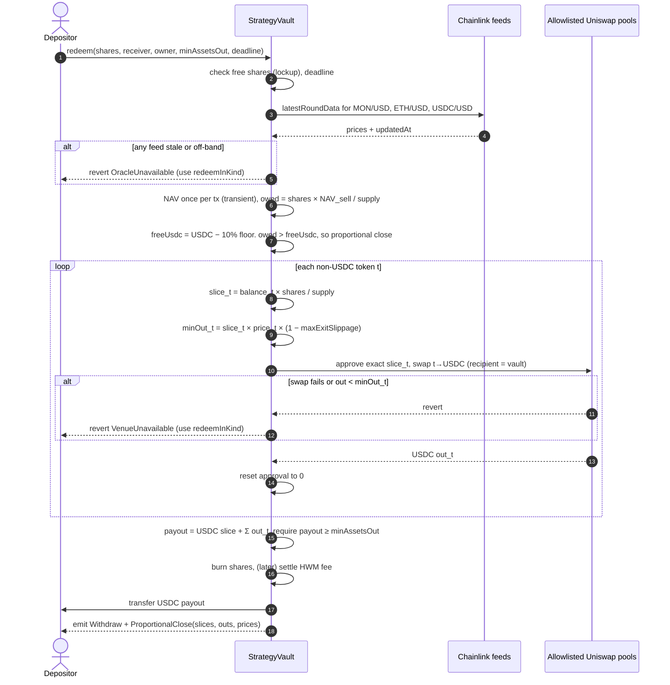

# Report 2: Building Our StrategyVault

Source basis: Morpho Vault V2 at commit `9ee4dbdc` (see Report 1), sub-agent notes in `research/morpho-vault/notes/`, and read-only Monad mainnet checks made on 2026-09-25. Everything in this report is a design proposal, so it is **Inferred** unless it says **Verified**. Morpho line numbers refer to `src/VaultV2.sol`.

**Monad facts this design relies on (Verified onchain, 2026-09-25, block 108050802).** Addresses come from `monad-crypto/token-list` and `monad-crypto/protocols`. For each, `eth_getCode` or `eth_call` was checked.

| Item | Address | Observation |
|---|---|---|
| USDC (6 dec) | `0x754704Bc059F8C67012fEd69BC8A327a5aafb603` | has code |
| WMON (18 dec) | `0x3bd359C1119dA7Da1D913D1C4D2B7c461115433A` | has code |
| WETH (18 dec) | `0xEE8c0E9f1BFFb4Eb878d8f15f368A02a35481242` | 177-byte proxy |
| Chainlink ETH/USD proxy | `0x1B1414782B859871781bA3E4B0979b9ca57A0A04` | 8 decimals, last update 99 s before the check |
| Chainlink MON/USD proxy | `0xBcD78f76005B7515837af6b50c7C52BCf73822fb` | 8 decimals, last update 19 s before the check |
| Chainlink USDC/USD, sMON/MON, shMON/MON, gMON/MON, aprMON/MON | listed in `monad-crypto/protocols/mainnet/chainlink.jsonc` | SVR variants also listed |
| Uniswap v3 factory | `0x204faca1764b154221e35c0d20abb3c525710498` | has code |
| Uniswap SwapRouter02 | `0xfe31f71c1b106eac32f1a19239c9a9a72ddfb900` | has code |
| Uniswap v4 PoolManager | `0x188d586ddcf52439676ca21a244753fa19f9ea8e` | has code |
| v3 USDC/WMON 0.3% pool | `0x659bd0bc4167ba25c62e05656f78043e7ed4a9da` | about 608,500 USDC in the pool |
| v3 USDC/WETH 0.3% pool | `0x25ef1a210ff55bcee9f8fee979aaff6bd1be5bf1` | **about 5,700 USDC in the pool.** The 0.05% and 1% pools hold about 0 |

Uniswap v3 USDC/WETH liquidity on Monad is very thin. I did not check v4 pools. This affects the asset list and the withdrawal design (section 2.5 and Risk 2).

---

## 2.1 Hyperliquid behavior coverage

| Hyperliquid behavior | How our StrategyVault implements it | Morpho pattern borrowed | What we build ourselves |
|---|---|---|---|
| **Leader keeps at least 5% of the vault** | `leaderShares * 10000 >= 500 * totalSupply` is checked after (a) any deposit by anyone and (b) any withdrawal or transfer by the leader. Deposits that would break it revert, and `maxDeposit` reports the headroom. Only deposits and leader exits can lower the leader's share, so those are the only places to check. Relaxed in handover and wind-down (2.6) | None directly. Rounding and "check after the state change" style (`allocateInternal` cap checks, lines 590-601) | Leader stake accounting, `maxDeposit` headroom, the handover and wind-down exceptions |
| **Leader earns 10% of profits** | Deferred. Designed as a per-depositor high-water mark (cost basis per account) crystallized on withdrawal, paid as shares to the leader (2.4.5). Shares are non-transferable at launch, so per-account cost basis is sound | Fee share minting formula `feeAssets * (supply + V) / (assets - fees + 1)` (lines 693-696). Accrue before any fee change (lines 489, 501). Timelocked fee changes with hard caps | HWM logic (Morpho has none: its base is last `_totalAssets`, line 679) |
| **Leader can trade but never withdraw depositor funds** | The vault holds all tokens itself. The only function that moves non-USDC tokens out, other than user exits, does not exist. `executeSwap` is callable only by the Executor. The vault builds the Uniswap call itself (fixed router, recipient = vault, exact approval then reset) and checks balance deltas and an oracle floor. There is no generic `execute`, no `sweep`, and no approvals outside a swap | Vault never grants approvals and has no execute or sweep (Verified, Report 1 section 4.3). Allocator cannot send to EOAs, only to timelocked adapters. Adapter trust minimized via registry | Vault-internal swap function with hard backstops. The Executor policy engine |
| **Lockup: 1 day default, leader can extend** | Per-account lock bucket: `lockedShares`, `unlockAt`. Duration is in `[1 day, 7 days]`. Increases are timelocked and apply only to new deposits. Decreases are instant. Waived in handover, wind-down, and guardian pause | Timelock submit / execute / revoke pattern (lines 349-379) | All lockup logic. Morpho has none, and gates cannot express it (gates are `view` and see only the account, `IGate.sol`) |
| **Withdrawals: free balance first, otherwise proportional close** | `redeem` pays USDC from the free USDC above the 10% floor. Otherwise it sells the withdrawer's pro-rata slice of each token through allowlisted pools with oracle-bounded minimum outputs, plus a user `minAssetsOut` and deadline. If a venue fails, the call reverts and the user can use `redeemInKind` | Idle-first withdrawal (`exit`, lines 815-818). Soft caps not checked on exit (NatSpec 55). Penalty-stays-in-vault accounting (lines 845-846) | Proportional sell engine, oracle floors, `redeemInKind` |
| **Leader can close to new deposits** | `setDepositsOpen(false)`, instant, manager only. Reopening is also instant (it adds no risk to existing depositors) | `sendAssetsGate` concept: deposit-side gating "cannot block users' funds" (NatSpec 166) | A simple flag, not an external gate |
| **Leader can always close positions on withdrawal** | `setAlwaysProportional(true)`: `redeem` skips the USDC-first rule and always sells pro-rata | None | Flag plus logic |
| **Transparency: trades, positions, drawdown, leader share** | Events on every swap (tokens, amounts, oracle prices, NAV before and after), deposit, withdrawal, lock, fee, and handover. Views: `navBreakdown()`, `leaderShareBps()`, `peakNav7d()`, `drawdownBps()` | Rich event design (`EventsLib.sol`). Previews exact and non-reverting (Certora `PreviewFunctions.spec`) | Indexer and UI. NAV and drawdown views |
| **Depositors can always withdraw (our rule, stronger than Hyperliquid)** | `redeemInKind` needs no oracle, DEX, Executor, platform, NFT call, or session key, and cannot be paused | Morpho's non-custodial guarantee: permissionless `forceDeallocate` plus timelocks (README "Non-custodial guarantees"). Idea only; the flash-loan in-kind trick does not carry over to spot tokens | Native multi-token in-kind redemption |

---

## 2.2 Build approach

**Recommendation: write our own vault that borrows specific Morpho patterns. Do not use Vault V2 directly, and do not fork it.**

| Option | Fit for spot trading | License | Audit burden | Verdict |
|---|---|---|---|---|
| **A. Use Vault V2 directly** (deployed factory on Monad, our Executor as sole allocator, one oracle-priced swap adapter per token) | Poor. (1) `maxRate` clamps gains at 200% APR (about 0.55% a day) while losses hit instantly (lines 677-678), so a 4% NAV rally takes about a week to show and new depositors capture the backlog (Blackthorn M-5). (2) No HWM, so fees are charged on recoveries. (3) No lockup, no leader stake, no proportional close. (4) Swap adapters make every allocate and deallocate a lossy trade, which Morpho warns against (NatSpec 87-89, Blackthorn M-4). (5) `forceDeallocate` becomes a permissionless forced market sale. (6) Oracle-priced `realAssets()` must never revert or it blocks every withdrawal (liveness rule, NatSpec 124) | No license issue for deploying through the factory. Our adapters are our code | We audit only adapters and Executor, but they carry the hardest risk (oracle and swaps), and the product gaps remain | Rejected |
| **B. Fork and modify Vault V2** | Could fix (1) to (3) by rewriting accrual, adding lockup and in-kind multi-token exits. By then most of the core has changed | GPL-2.0-or-later. The fork and anything compiled with it must be GPL-2.0-or-later, and the source must be published. **Inferred**; get legal advice | The audits and 39 Certora specs no longer apply to the changed accrual and exit paths. Full re-audit needed anyway | Rejected: all of the audit cost with little of the audit benefit |
| **C. Purpose-built StrategyVault borrowing patterns** | Designed for multi-token NAV, lockup, leader stake, in-kind exits, and handover from the start | We can use an MIT base (OpenZeppelin `ERC4626` with `_decimalsOffset`) and re-implement Morpho's *ideas* (timelock by calldata, abdication, sentinel, soft caps, once-per-tx valuation) in our own code. If we copy Morpho source verbatim, that file must be GPL-2.0-or-later. **Inferred**; confirm with counsel | Full audit of a smaller, single-purpose contract. We can reuse Morpho's invariant list and Certora rule shapes as the test plan | **Recommended** |

**Why C.** Morpho's value to us is its *security architecture*, not its code path:

- **Constrained roles:** managers can steer but not take.
- **Timelocks** that exceed the depositor exit time.
- **Abdication** of dangerous setters.
- **A risk-only emergency role.**
- **Once-per-transaction valuation.**
- **Virtual shares.**
- **An exit** that needs no role holder.

All of these transfer as patterns. The parts that do not transfer are the lending-specific pieces:

- adapters as position holders;
- `realAssets()` trust;
- `maxRate` smoothing;
- the flash-loan in-kind trick;
- the single-asset assumption.

Those are exactly what we would have to rewrite in a fork. Option A remains a sensible **later** product: a separate USDC lending vault that uses Morpho V2 unmodified.

---

## 2.3 Role design

Principles borrowed from Morpho:

- Nobody who can steer funds can also change the rules instantly.
- Every risk-increasing change waits longer than the longest possible lockup plus a notice buffer, so every depositor can exit first.
- The emergency role can only reduce risk.

New principles for us:

- The **manager is resolved live** from `AgentNFT.ownerOf(agentId)`, never stored.
- Manager actions are **bound to the ownership epoch**.

Constants used below (proposed): `MAX_LOCKUP = 7 days`, `NOTICE = 2 days`, so `RISK_TIMELOCK = MAX_LOCKUP + NOTICE = 9 days`. Unlike Morpho (NatSpec 187), timelocks are set in the constructor and never start at zero.

| Role | Who | Can do | Cannot do | Timelock |
|---|---|---|---|---|
| **Depositor** | Any address that passes no gate (deposits are open unless closed) | `deposit`, `mint` (while deposits are open, no handover, oracle fresh). `redeem` / `withdraw` (USDC path). `redeemInKind` (always) | Transfer shares (disabled at launch) | None |
| **Manager (agent owner)** | `AgentNFT.ownerOf(agentId)` when `ownershipEpoch == acceptedEpoch` | Open or close deposits. Toggle `alwaysProportional`. Lower the lockup. Propose a lockup increase. Propose fee changes (later). Own the leader stake. Direct trading **only through the Executor** (policy lives there) | Call `executeSwap`. Move assets. Change the Executor, tokens, pools, or oracles. Withdraw leader stake below 5%. Act during handover | Lockup increase: new duration plus `NOTICE`. Fee increase: `RISK_TIMELOCK`. Closing deposits, lowering the lockup, and lowering fees: instant |
| **Executor** | Our contract (immutable reference, replaceable only by timelock) | `executeSwap(params)` with epoch arguments. Nothing else | Transfer any token out. Approve anything. Deposit or withdraw. Act when `paused`, when epochs are stale, or with risk-increasing trades in reduce-only mode | n/a (its own policy changes bump the config epoch in the Executor) |
| **Platform admin** (timelocked multisig) | Platform governance | Propose: replace Executor, add a token, oracle, or pool (add-only registry), change backstop bounds, appoint or remove guardian. Execute after the timelock. Abdicate selectors | Move assets. Add exit gates (none exist). Shorten a timelock faster than that timelock. Pause withdrawals | `RISK_TIMELOCK` for all. Removing a token or pool from the *trade* allowlist is instant (it only reduces risk). Removal never affects in-kind redemption of existing balances |
| **Guardian** (sentinel; platform security key, separate from admin) | Platform | Instant: `pause()` (no trading, no deposits), `setReduceOnly(true)`, `revoke(pending)`, lower backstop bounds (tighter only) | Unpause (admin, short timelock, e.g. 1 day). Trade. Move assets. Block any withdrawal path. Appoint itself | Appointing or removing the guardian: `RISK_TIMELOCK`. This fixes Morpho's weakness where the owner can remove a sentinel instantly |
| **Handover (new) owner** | New `ownerOf(agentId)` after an NFT transfer | During handover: nothing except `acceptManagement()` once the handover period has elapsed and they hold at least 5% | Trade (vault is reduce-only), open deposits, change the lockup | `HANDOVER_PERIOD` (proposed 3 days) counted from `AgentNFT.epochStartedAt(agentId)` |
| **Anyone** | Keeper or user | Execute matured timelocked actions (Morpho: `timelocked()` has no caller check, line 362). `poke()` NAV and peak tracking | Everything else | n/a |

**Pending actions are epoch-scoped.** Every manager submission stores the `ownershipEpoch` at submit time. `timelocked()` rejects execution if the epoch has changed. This closes the Morpho gap where an old curator's pending actions survive a role change.

**Abdication at launch:** none of the exit paths have setters, so nothing needs abdicating there. We should, however, abdicate "replace oracle adapter for USDC" (USDC is the unit) and consider abdicating "add token" once the launch set is final.

---

## 2.4 Accounting design

### 2.4.1 Total assets (NAV) from multiple spot tokens

```
NAV = USDC.balanceOf(vault)
    + Σ_t∈{WMON, WETH, LST} balanceOf_t(vault) * price_t / 10^dec_t
price_t (USDC per token) = feed_t/USD ÷ feed_USDC/USD   (Chainlink push feeds on Monad)
LST price = LST/MON feed × MON/USD feed               (Chainlink sMON/MON, shMON/MON etc. exist)
```

- **Token list:** fixed and allowlisted, at most 5 tokens, add-only through `RISK_TIMELOCK`. Only allowlisted tokens count toward NAV, so non-allowlisted donations are ignored (Morpho's "donated shares are ignored" idea, `MorphoMarketV1AdapterV2.sol:30`).
- **Balances:** read live with `balanceOf`. A donation of an allowlisted token is a gift to all holders. That is harmless because a donor cannot profit from it: virtual shares plus the leader seed mean it only raises everyone's price.
- **Once per transaction:** NAV is computed **once per transaction** and cached in transient storage, like `firstTotalAssets` (lines 224, 657, 671). A flash swap cannot change the NAV seen between two calls in one transaction.
- **Share math:** OpenZeppelin-style virtual shares with `_decimalsOffset = 12` for USDC, the same as Morpho's `virtualShares = 1e12`. Rounding follows Morpho's table exactly: deposit and redeem round down, mint and withdraw round up.
- **No `maxRate`.** Spot prices move both ways. Upside smoothing would create a backlog that new depositors capture. Mark to market symmetrically and handle fairness with directional pricing instead.

### 2.4.2 Manipulation defenses at deposit and withdrawal time

| Threat | Defense |
|---|---|
| Stale oracle (market moved, feed has not) | Deposits require every feed to be fresher than `MAX_STALENESS` (5 minutes, matching the Executor) **and** within 2% of a pool TWAP (at least 30 minutes, from the allowlisted pool). Otherwise `deposit` reverts and `maxDeposit` returns 0 |
| Directional arbitrage within the oracle's deviation band | **Directional NAV:** `NAV_buy = NAV × (1 + s)` for deposits and `NAV_sell = NAV × (1 − s)` for the USDC withdrawal path. `s` is roughly the feed deviation threshold times the non-USDC share, e.g. 0.25%. The spread stays in the vault, as Morpho's penalty does. This is Morpho's "round in favor of the vault" widened from 1 wei to the oracle uncertainty band |
| Deposit before a known oracle update, withdraw after | 1-day lockup blocks the round trip. Directional spread covers most of the one-way drift. If this proves insufficient, add asynchronous deposits (ERC-7540 style) that settle at the next oracle round |
| Pool manipulation to move NAV | NAV uses Chainlink, never pool spot. The pool TWAP is only a sanity band. The Executor's own trades are bounded by an oracle-derived `minOut` |
| Manager inflating NAV for fees | HWM fees crystallize on `NAV_sell`, only after the lockup, and with a per-period fee cap. The manager cannot trade during handover |
| First-depositor inflation | Virtual shares (1e12) plus 1 virtual asset. The leader's 5% seed deposit is required before `depositsOpen` can be set. Seeding is mandatory in the constructor flow (Morpho NatSpec 40-46, Zellic 3.1) |
| Oracle down | Deposits pause. The USDC withdrawal path reverts. **`redeemInKind` is unaffected** because it uses no prices. This avoids Morpho's rule that a reverting valuation bricks every exit (NatSpec 124) |

### 2.4.3 Leader 5% minimum

- `leaderShares = balanceOf(currentManager)` while not in handover.
- **Invariant:** `!handover && !windDown ⇒ leaderShares × 10000 ≥ 500 × totalSupply`.
- **Checked** at the end of `deposit` and `mint` for any receiver, and at the end of any leader `redeem`, `withdraw`, or `redeemInKind`.
- **Not checked** on other depositors' exits. These only raise the leader's share, like Morpho's soft relative caps (NatSpec 55).
- `maxDeposit(x)` returns `max(0, (leaderShares × 20 − totalSupply))` converted to assets, so integrators see the limit.
- The leader stake is subject to the same lockup as everyone else. This prevents a flash deposit-and-withdraw by the leader to game the check.
- **Wind-down:** the manager calls `closeVault()`. Deposits close, the vault goes reduce-only, and after `MAX_LOCKUP` the 5% check is lifted so the leader can exit last or alongside everyone.

### 2.4.4 Share transfers

Disabled at launch (`transfer` and `transferFrom` revert). This keeps the lockup, the leader stake, and per-depositor HWM simple and matches Hyperliquid, where vault positions are not tokens. We can enable transfers later behind a timelock, with rules that move locks and cost basis.

### 2.4.5 Later: 10% performance fee above a high-water mark

Hyperliquid-matching design: **per-depositor HWM, charged on withdrawal.**

- Track `costBasisPerShare[account]`, a weighted average entry price updated on each deposit.
- On any exit of `n` shares at price `p` (`NAV_sell` per share for USDC exits; the oracle mid or last good price for in-kind exits):

```
profit = max(0, p − basis) × n
feeShares = profit × 10% × (supply + V) / (NAV − profit×10% + 1)   // Morpho's formula, lines 693-696
```

- `feeShares` are moved from the exiter to the leader, not minted, so other depositors are never diluted.
- Losses never reset the basis downward, so this is a true high-water mark per account.
- Alternative: a global HWM on price per share, crystallized weekly. It is simpler, but a depositor who enters during a drawdown rides the recovery fee-free.
- Guardrails copied from Morpho:
  - fee changes are timelocked (`RISK_TIMELOCK`) and capped (e.g. at most 20%);
  - fees are settled before any parameter change;
  - rounding goes against the fee recipient.
- **In-kind exits:** if the oracle is down, fees on in-kind exits use the last good price stored at the most recent successful NAV. The exit still never needs a live oracle.

---

## 2.5 Withdrawal and exit design

### 2.5.1 Three exit functions

| Function | Pays | Depends on | Can be blocked by |
|---|---|---|---|
| `redeem(shares, receiver, owner)` / `withdraw(assets, …)` (ERC-4626) and `redeem(shares, receiver, owner, minAssetsOut, deadline)` (safe overload) | USDC | Fresh oracle, allowlisted Uniswap pools (only if USDC is insufficient) | Lockup. Oracle stale. Venue failure. None of these touch funds: the call just reverts |
| `redeemInKind(shares, receiver, skipMask)` | Pro-rata slice of **every** held token | ERC-20 `transfer` only | Lockup only, and lockups are bounded (at most 7 days) and waived in pause, handover, and wind-down |
| Periphery `ExitZap` (optional) | USDC | User's own chosen route and slippage | Nothing in the vault. It calls `redeemInKind`, then swaps in the user's context |

### 2.5.2 Normal USDC withdrawal (Hyperliquid style)

1. **Checks:** lockup (free shares only). Compute NAV once for the transaction (fresh oracle required).
2. **Amount owed:** `owed = shares × NAV_sell / supply` (rounded down, like `previewRedeem`, line 726).
3. **Free USDC:** `freeUsdc = USDC balance − floor`, where `floor = 10% × (NAV − owed)`. Keeping the floor preserves the buffer for the next withdrawer and the Executor's 10% rule.
4. **If `owed ≤ freeUsdc` and `!alwaysProportional`:** pay USDC. Positions are untouched.
5. **Otherwise (proportional close):**
   - For each non-USDC token, `slice_t = balance_t × shares / supply`.
   - Sell each slice through its allowlisted pool with `minOut_t = slice_t × oraclePrice_t × (1 − maxExitSlippage)`, where `maxExitSlippage` is 0.5% plus the pool fee.
   - Use an exact approval, reset afterwards.
   - Pay the USDC slice plus the swap proceeds.
   - The withdrawer bears their own slippage, so no cross-subsidy.
6. **Final checks:** total paid ≥ `minAssetsOut` and `block.timestamp ≤ deadline`. Otherwise revert.
7. **Caps and limits:** not checked on exit (Morpho: relative caps are soft on exit, NatSpec 55). If the exit leaves the portfolio outside its limits, the Executor becomes reduce-only until they are restored.

**If a venue is unavailable:** any leg that fails or misses `minOut` reverts the whole call. There is no partial fill at a bad price. The UI then offers `redeemInKind` or `ExitZap`.

**Size guard:** if a slice is larger than a set fraction of the pool's liquidity (say 2%, read from the pool), the USDC path reverts early with `UseInKind()`. With about 5,700 USDC in the WETH v3 pool today, that makes any WETH slice above roughly 100 USDC use in-kind. This is a strong reason to launch with **USDC plus WMON only**, and add WETH or an LST once pool depth is proven.

### 2.5.3 Offline exit (no platform involvement)

`redeemInKind(shares, receiver, skipMask)`:

- Burns shares and transfers `floor(balance_t × shares / supply)` of each allowlisted token.
- Makes **no** oracle, DEX, Executor, AgentNFT, or platform call. There is one exception: when the lockup is active and the user claims a handover waiver, the vault reads the NFT epoch inside `try/catch`, and a failed call counts as "handover", which waives the lock.
- Cannot be paused by the guardian or admin. There is no setter that can disable it: the whole function is non-configurable, which is stronger than abdication.
- `skipMask` lets a user skip a token whose transfer reverts, for example if USDC is blacklisted for their address. The skipped slice is forfeited to remaining holders, like Morpho's penalty-as-donation (line 846). Users can also pick another `receiver`.
- A fee (later) is settled at the last good price, so fees cannot be dodged by exiting in-kind, and settlement never needs a live oracle.
- Gas is bounded by at most 5 tokens. **Inferred:** Monad is reported to charge by gas limit rather than gas used, so the UI should set tight limits. Needs verification.

This is the spot-token equivalent of Morpho's in-kind redemption through `forceDeallocate`. It needs no flash loan because the user receives the tokens directly.

### 2.5.4 Lockups

- **State:** per account, `lockedShares` and `unlockAt`. Globally, `lockupDuration` in `[1 day, 7 days]`.
- **On deposit:**
  - If `now ≥ unlockAt`: `lockedShares = new`, `unlockAt = now + d`.
  - Otherwise: `lockedShares += new`, `unlockAt = max(unlockAt, now + d)`.
- **Anti-griefing:**
  - A deposit `onBehalf` of an account with an active lock reverts, so nobody can extend someone else's lock with dust.
  - Changes to `lockupDuration` never move existing `unlockAt` values.
  - An increase waits new duration plus `NOTICE`; a decrease is instant.
- **Free shares:** `balance − (now < unlockAt ? lockedShares : 0)`. All exits spend only free shares.
- **ERC-4626 functions:**
  - `maxRedeem(owner)` = free shares.
  - `maxWithdraw(owner)` = `previewRedeem(free)`, or 0 if the oracle is stale. It never reverts.
  - `preview*` ignore lockups, as ERC-4626 requires previews to ignore per-user limits.
  - `maxDeposit` and `maxMint` return 0 when deposits are closed, in handover, paused, or the oracle is stale, and otherwise the leader-stake headroom.

This improves on Morpho's constant 0 (lines 743-761), which exists only because Morpho's gate calls might revert. We have no gates.

### 2.5.5 Sequence: withdrawal when USDC is insufficient



---

## 2.6 Agent sale handover

**Detection is automatic and needs no platform action.** `AgentNFT` increments `ownershipEpoch[agentId]` and records `epochStartedAt[agentId]` on every transfer. The vault stores `acceptedEpoch`. Handover is active when `AgentNFT.ownershipEpoch(agentId) != acceptedEpoch`, whether the transfer went through our escrow or not.

**Handover mode:**

| Actor | Can | Cannot |
|---|---|---|
| Depositors | Every exit, with **lockups waived** | Deposit (deposits closed automatically) |
| Old owner | Exit their former leader stake freely (no longer bound by the 5% rule) | Any manager action. Pending actions they submitted fail the epoch check |
| Executor | Reduce-only swaps (non-USDC → USDC) when the guardian or the Executor's own circuit breaker requires it. Otherwise no trades | Risk-increasing swaps. Any swap whose epoch argument is not the new epoch |
| New owner | Deposit their leader stake through `stakeAsIncomingLeader()` (a deposit exempt from the "deposits closed" rule, locked like any other) | Trade, open deposits, change parameters |
| Guardian | Pause, reduce-only, revoke | Anything that raises risk |

**Sequence.**

1. Escrow settles the sale and the NFT transfers. The epoch changes, so handover starts at `epochStartedAt`.
2. Optional escrow step: the escrow can call `vault.noteSale()` just to emit an event for the UI. Correctness does not depend on it.
3. For `HANDOVER_PERIOD` (3 days, at least the 1-day default lockup plus notice), depositors can leave with no lock. Positions stay as they are unless the circuit breaker or guardian triggers reduce-only selling.
4. After the period, the new owner calls `acceptManagement()`. It requires `balanceOf(newOwner)` to be at least 5% of supply. It then sets `acceptedEpoch = current`, reopens trading, and leaves deposits closed until the new owner opens them.
5. (Later, fees) Performance fees due to the old owner are crystallized at the moment handover starts. Per-depositor HWM makes this simple: nothing is owed until depositors exit, so the fee recipient switches with the epoch.

**Open design choice.** The escrow could bundle the old leader's shares with the NFT sale, so the new owner inherits the 5% stake instead of depositing fresh capital. That needs a one-off `transferLeaderStake` path callable only by the escrow during handover.

---

## 2.7 Interface sketch

```solidity
// SPDX-License-Identifier: TBD (our code; MIT base from OpenZeppelin ERC4626)
pragma solidity 0.8.28;

interface IStrategyVault /* is IERC4626 (asset = USDC) */ {
    // ---- Exits (never pausable) ----
    function redeem(uint256 shares, address receiver, address owner, uint256 minAssetsOut, uint256 deadline)
        external returns (uint256 assets);
    function redeemInKind(uint256 shares, address receiver, uint256 skipMask)
        external returns (address[] memory tokens, uint256[] memory amounts);

    // ---- Trading: Executor only ----
    struct SwapParams {
        address tokenIn; address tokenOut; uint256 amountIn; uint256 minAmountOut;
        bytes32 poolId;            // must be in the timelocked pool allowlist for (tokenIn, tokenOut)
        uint256 deadline;          // <= block.timestamp + 2 minutes (checked by Executor, backstopped here)
        uint64 ownershipEpoch;     // must equal acceptedEpoch and AgentNFT.ownershipEpoch(agentId)
        uint64 configEpoch;        // must equal Executor policy epoch recorded at call time
    }
    /// @dev Vault builds the router call itself: recipient = this, exact approval, reset to 0 after,
    /// checks balance deltas, oracle floor (value out >= value in * (1 - backstopSlippage)),
    /// trade size <= backstopTradeBps of NAV, and in reduce-only mode requires tokenOut == USDC.
    function executeSwap(SwapParams calldata p) external returns (uint256 amountOut);

    // ---- Manager (AgentNFT.ownerOf(agentId), epoch-bound) ----
    function setDepositsOpen(bool open) external;
    function setAlwaysProportional(bool on) external;
    function decreaseLockup(uint32 newDuration) external;       // instant, >= 1 day
    function submitLockupIncrease(uint32 newDuration) external; // executes after newDuration + NOTICE
    function closeVault() external;                              // wind-down
    function acceptManagement() external;                        // new owner after HANDOVER_PERIOD, needs >= 5%
    function stakeAsIncomingLeader(uint256 assets) external returns (uint256 shares);

    // ---- Governance (Morpho-style timelock: submit / execute by anyone / revoke) ----
    function submit(bytes calldata data) external;               // admin (and manager for its own selectors)
    function revoke(bytes calldata data) external;               // admin or guardian
    function setExecutor(address newExecutor) external;          // timelocked RISK_TIMELOCK
    function addToken(address token, address priceFeed, address pool) external; // timelocked, add-only
    function setBackstops(uint16 maxTradeBps, uint16 maxAssetBps, uint16 minUsdcBps, uint16 maxSlippageBps) external; // timelocked if loosening
    function abdicate(bytes4 selector) external;                 // timelocked, permanent

    // ---- Guardian (risk-reducing only, instant) ----
    function pause() external;             // stops deposits and executeSwap, never exits
    function setReduceOnly(bool on) external; // on: instant; off: admin timelock
    function tightenBackstops(uint16 maxTradeBps, uint16 maxAssetBps, uint16 minUsdcBps, uint16 maxSlippageBps) external;

    // ---- Views ----
    function navUsdc() external view returns (uint256 nav, bool fresh);
    function navBreakdown() external view returns (address[] memory t, uint256[] memory bal, uint256[] memory valueUsdc);
    function inHandover() external view returns (bool);
    function freeShares(address account) external view returns (uint256);
    function leaderShareBps() external view returns (uint256);
    function drawdownBps() external view returns (uint256); // vs 7-day peak (Executor also tracks)
}

interface IExecutor {
    /// Called by the platform session key. Enforces full policy then calls vault.executeSwap.
    /// Policy: <=10% NAV per trade, <=40% per non-USDC asset after trade (risk-increasing only),
    /// >=10% USDC, <=0.5% slippage vs oracle, oracle <5 min old and within 2% of pool,
    /// <=20 trades / rolling 24h, 2-minute deadline, circuit breaker (10% dd => reduce-only,
    /// 20% dd => pause pending owner review), ownership + config epochs.
    function swap(address vault, IStrategyVault.SwapParams calldata p, bytes calldata sessionAuth)
        external returns (uint256 amountOut);
}

interface IAgentNFT {
    function ownerOf(uint256 agentId) external view returns (address);
    function ownershipEpoch(uint256 agentId) external view returns (uint64);
    function epochStartedAt(uint256 agentId) external view returns (uint64);
}
```

**Split of limits.**

- **The vault** enforces the depositor-protecting backstops, which hold even if the Executor or session key is compromised:
  - token, pool, and router allowlists;
  - recipient is the vault;
  - oracle floor on every swap;
  - maximum trade size;
  - concentration on risk-increasing trades;
  - reduce-only and pause.
- **The Executor** enforces operating policy: trade count, deadlines, oracle-to-pool deviation, circuit breaker, epochs, and per-agent configuration.

The vault's backstops should be set equal to or slightly looser than the Executor limits (e.g. 12% per trade, 45% per asset, 1% slippage). A mismatch then shows up as an Executor bug rather than a silent loss.

---

## 2.8 Risks (ranked)

| # | Risk | Impact | Mitigation |
|---|---|---|---|
| 1 | **Oracle-priced entry and exit lets informed users extract value** (stale feed, known updates; Morpho's CS-001 and H-1 made daily) | Slow bleed from honest depositors | Directional NAV spread, fresh plus TWAP-band checks on deposits, 1-day lockup, optional async deposits, in-kind exits that use no price. Monitor spread capture in the spike |
| 2 | **Thin Monad DEX liquidity** (v3 USDC/WETH about 5.7k USDC) | Executor trades and proportional sells move price or fail. NAV marked at oracle overstates what is realizable | Launch with USDC and WMON only. Allowlist a token only after measured depth. Cap trade size relative to pool liquidity. `UseInKind` guard. Measure v4 pools in the spike |
| 3 | **Executor or session key compromise** | Bad trades inside the vault | Vault backstops independent of the Executor. Executor replacement timelocked. Guardian pause. Epochs. No path moves tokens out |
| 4 | **New, unaudited vault code** | Loss of funds | Small, immutable contract. Port Morpho's invariants and Certora rule shapes. External audit. TVL cap for early weeks. Mandatory leader seed |
| 5 | **In-kind exit blocked by a token** (USDC blacklist or pause, WMON or LST upgrade) | A user cannot exit a slice | `skipMask`, choice of `receiver`, token allowlist limited to well-understood tokens. Document the forfeit semantics |
| 6 | **Handover edge cases** (transfer outside escrow, stale pending actions, leader stake gap) | Old or new owner acts with the wrong authority | Epoch-based detection read from `AgentNFT`. Epoch-scoped pending actions. `try/catch` treating NFT failure as handover. Deposits closed until acceptance |
| 7 | **MEV on Executor swaps and proportional exits** | Up to the slippage bound per trade | Oracle-derived `minOut`, 0.5% bound, 10% trade cap. Investigate Monad private order flow and Chainlink SVR feeds |
| 8 | **Governance abuse by platform admin** | Adding a bad token or oracle, or a malicious Executor | `RISK_TIMELOCK` longer than max lockup plus notice. Guardian can revoke. Add-only registries. Abdicate what is final. No exit gates to add |
| 9 | **LST depeg and exchange-rate versus market price** | NAV overstates value | Price LSTs by market feeds (LST/MON times MON/USD market), not the redemption rate. Lower per-asset cap for the LST, or defer the LST |
| 10 | **Fee gaming, later** (leader pumps NAV, round-trip fees) | Unfair fees | Per-depositor HWM, fee on `NAV_sell`, fee cap per period, fee changes timelocked |
| 11 | **Gas and cost model on Monad** (reportedly gas-limit-based charging) | Expensive in-kind exits and proportional sells | Bounded token list. Measure in the spike |
| 12 | **License** | GPL obligations if Morpho code is copied | Re-implement patterns on an MIT base. Legal review before copying any Morpho file |
