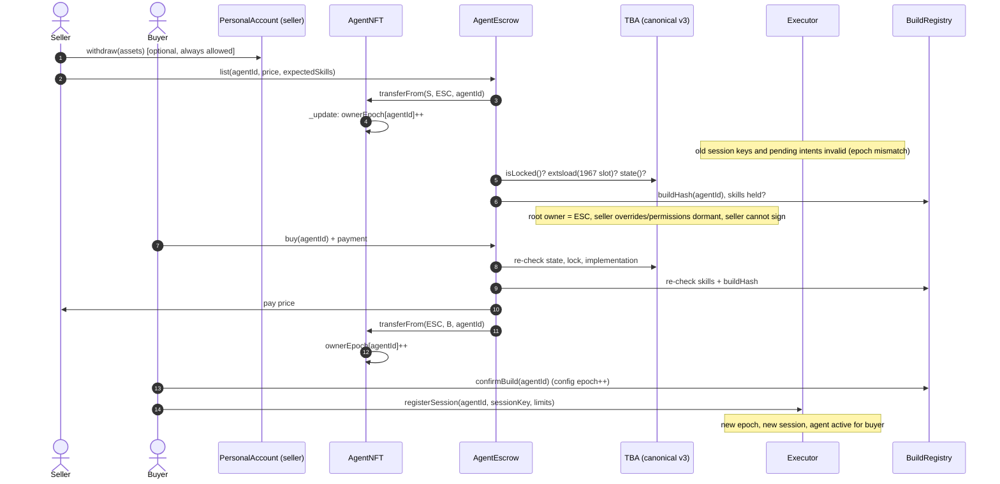
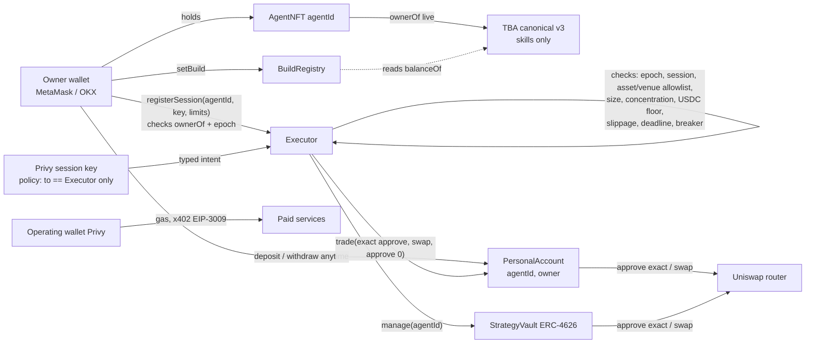

# Report 2: How Tokenbound fits our platform

Research date: 2026-09-25. Sources: tokenbound/contracts `bce75f9` (v0.3.1 plus 15 commits, 2024-03-11, MIT), erc6551/reference `da16a63` (2023-10-24, MIT), tokenbound/sdk `6244f1e` (0.5.5, 2024-10-22, ISC per package.json). Onchain facts come from read-only calls to Monad mainnet (143) and testnet (10143). Code facts are cited in Report 1 and in `notes/`. Here **Verified** means backed by code or chain data, and **Inferred** means a design judgment.

---

## 2.1 Role decision

**Recommendation: at launch the TBA is the agent's skill inventory and identity anchor. It is not the personal capital account.**

The TBA will:
- hold equipped SkillNFTs
- be the stable address bound to the AgentNFT and to the ERC-8004 identity
- optionally sign ERC-1271 messages for identity purposes, with the owner as the signer

The TBA will not:
- hold the owner's trading capital
- hold vault assets
- pay operating costs

Personal capital goes in a separate `PersonalAccount` contract that we write. Vault capital goes in the `StrategyVault`, and operating funds go in a Privy-managed operating wallet.

### Why

1. **Canonical permissions cannot be restricted exactly.** A permission is a single boolean per `(owner, caller)`. It grants arbitrary execution, ERC-1271 signing, ERC-4337 signing, and upgrades (Report 1 section 4.5, **Verified**). The only way to restrict it is to grant it to a contract whose code is the restriction, which would be our Executor. That works, but then the Executor is the policy and a TBA adds nothing to it. The risk review asked for exact restriction, and the TBA only provides it by pointing to our own contract (**Inferred**).
2. **Capital in the TBA moves with the NFT.** Our requirement is that the seller keeps personal funds and the buyer gets the agent. If personal funds sit in the TBA, every sale depends on the seller sweeping first, and a forgotten balance goes to the buyer. A PersonalAccount tied to the owner who funded it gets this right by construction (**Inferred**).
3. **The TBA has four channels that move assets around its own lock and `state()`:** overrides, ERC-1271 signatures, earlier approvals, and upgrades (Report 1 section 7, S1-S3 and S7). Monad USDC exposes the FiatToken v2.2 signature entry points (**Verified**). So an owner, or anyone the owner permissioned, can move USDC out of a TBA by signature alone, even while the account is locked (**Inferred**). A skills-only TBA limits that exposure to skills, and our SkillNFT can close it (section 2.4).
4. **Trust.** A TBA's logic can change to any implementation the Tokenbound Safe trusts, if an authorized executor opts in. Today nothing is trusted on Monad (**Verified**). Keeping capital out of the TBA keeps that third-party trust away from user funds (**Inferred**).
5. **Account abstraction fit.** The TBA only speaks EntryPoint v0.6. Privy's paymaster stack is expected to be v0.7 or later (open question), so gas sponsorship is easier on our own contracts called by a Privy wallet (**Inferred**).

### Can the TBA safely hold the owner's personal trading capital?

**Not with the canonical v3 account used naively. It could with conditions, but we do not recommend it for launch.** It is acceptable only if all of the following hold:

| # | Condition | Why |
|---|---|---|
| C1 | The only permissioned address is our audited Executor. The session key is never permissioned | Permissions are all-or-nothing (S4) |
| C2 | The Executor never forwards raw calldata, never calls `upgradeTo`, uses only op 0, and does not implement `isValidSignature` | A permissioned contract's code is the whole restriction; a permissioned ERC-1271 contract becomes a signer through the `v == 0` path (`AccountV3.sol` lines 196-208) |
| C3 | The Executor checks an ownership epoch that AgentNFT bumps on every transfer | Grants come back if the NFT returns to a previous owner (S5) |
| C4 | Every token approval is exact and cleared in the same transaction. Permit2 is never approved | Approvals outlive transfers and locks (S3) |
| C5 | Sales go through our escrow, which requires personal assets to be swept, no overrides, no lock, and the expected implementation | S1, S2, S6, S7 |
| C6 | We accept Tokenbound guardian trust over user capital and monitor guardian events on Monad | S7 |

C1 to C4 are all enforced by our own contracts anyway. At that point the TBA only adds risk (S1, S2, S6, S7), and its one benefit is that the owner can exit through `execute` without us. A PersonalAccount can offer the same direct exit (section 2.4). So a separate PersonalAccount is the lower-risk choice (**Inferred**).

---

## 2.2 Component mapping

Fit: **Use as is**, **Configure**, **Wrap** (use behind our own contract), **Build ourselves**, **Conflict**.

| Our need | Tokenbound feature | Fit | Notes |
|---|---|---|---|
| Agent wallet created on mint | Registry `createAccount(AccountProxy, salt, 143, AgentNFT, id)` plus `AccountProxy.initialize(0x41C8...)` | **Wrap** | AgentNFT's mint calls both in the same transaction. `initialize` is permissionless, so doing it atomically prevents a front-run and avoids an uninitialized window in which 1155 transfers revert (**Inferred**) |
| Deterministic TBA address | `registry.account(...)`, SDK `getAccount` | **Use as is** | Pure function of the inputs; salt 0; verified against live Monad (**Verified**) |
| Skill inventory | ERC1155Holder receive hooks in AccountV3 | **Use as is** | Equipping means the owner transfers SkillNFT into the TBA |
| Skill slot enforcement | None | **Build ourselves** | Anyone can push tokens into the TBA (S9). Slots are enforced in BuildRegistry at equip time, never by counting balances |
| Active build separation | None (`state()` does not track holdings) | **Build ourselves** | BuildRegistry stores `(agentId, epoch, buildHash, skills[], versions[])`, set only by the current owner, and checks that the TBA holds each listed skill at activation |
| Session key authorization | `setPermissions` | **Conflict** (for the session key itself) | A permissioned key has full power (S4). The session key is authorized in our Executor instead, keyed by `(agentId, epoch)` |
| Restricting the session key to our Executor | Nothing in Tokenbound; Privy policies | **Build ourselves** plus **Configure** Privy | Privy policy: the key may only call `Executor`. The Executor checks its own session registry |
| Typed and bounded execution | None; `execute` is arbitrary | **Build ourselves** | The Executor enforces assets, venue, size, concentration, USDC floor, slippage, deadline and exact approvals |
| Owner withdrawals | `execute` by owner for TBA contents; nothing for capital | **Use as is** (skills), **Build ourselves** (capital) | `PersonalAccount.withdraw` is owner-only, always available, and has no Executor dependency |
| Owner emergency exit without our platform | Owner calls `TBA.execute` directly (**Verified**) | **Use as is** (skills) plus **Build ourselves** (capital) | PersonalAccount has no pause on withdrawals and no admin gate |
| Old permissions stop on transfer | Permissions keyed by owner go dormant (**Verified**); but they come back on return | **Wrap** | AgentNFT `_update` bumps `ownerEpoch[agentId]`. Executor, BuildRegistry and PersonalAccount require the current epoch |
| Seller drain protection | `lock()` plus `state()` | **Conflict** (not sufficient on its own) | Overrides, signatures and approvals bypass them (S1-S3). Use escrow custody plus settlement-time checks (section 2.3) |
| Unsolicited token handling | Overrides could reject tokens; the default accepts everything | **Configure nothing; Build ourselves** | Do not set overrides. Indexers and BuildRegistry only recognise our SkillNFT contract |
| ERC-1271 signing for x402 | `isValidSignature`, owner or permissioned signers, raw hash | **Conflict** for agent-autonomous payments | Autonomous x402 signing by the TBA would need a permissioned signer, which has full power. Pay x402 from the operating wallet (EOA-style EIP-3009, the normal x402 path). Use TBA 1271 only for owner-signed identity messages |
| ERC-4337 and gas sponsorship | EntryPoint v0.6 only; signers are owner, root or permissioned | **Conflict**, partial | Sponsor the Privy wallets (owner and session key) calling our contracts, not the TBA as the UserOp sender. Confirm Privy's EntryPoint version |
| ERC-8004 identity binding | None | **Build ourselves** | Register the agent with `tokenId`, AgentNFT and TBA address as its agent wallet. If ERC-8004 checks the wallet's signature, the TBA's 1271 accepts the owner's signature (**Inferred**; check against the ERC-8004 spec) |
| Interaction with the strategy vault | None | **Build ourselves** | The vault's manager role is the Executor acting for `agentId` at the current epoch. The TBA gets no vault role and never custodies vault assets |
| Transfer of history | None | **Build ourselves** | History is indexed by `agentId`, which is unchanged by transfer; BuildRegistry keeps an epoch log |
| SDK for the frontend | `TokenboundClient` with a custom `chain` | **Configure** plus **Wrap** | Pass `chain: monad`. Add our own viem helpers for `setPermissions`, `lock`, `state`, `extsload` and `overrides` reads |

---

## 2.3 Transfer design

Goals: the buyer gets the agent, skills and history; old authority dies at transfer; the seller cannot drain skills during the sale; the seller keeps personal funds; open positions stay exitable.

### Key idea

**While listed, the AgentNFT sits in our `AgentEscrow` contract.** The TBA's root owner is then the escrow, so the seller's permissions and overrides are keyed to the wrong address and go dormant (**Verified** keying). The seller can no longer execute from or sign for the TBA (**Verified**: `_isValidSigner` resolves to the escrow, which has no `isValidSignature`).

Settlement then checks everything again atomically. That closes S1 (overrides) and S2 (signatures) during the listing. S3 (approvals) is closed by SkillNFT refusing operator transfers out of agent TBAs. S6 and S7 are closed by checks at listing time.

### Steps

**Before listing (seller)**
1. Seller calls `PersonalAccount.withdraw` for any funds they want, or keeps them. Their PersonalAccount is keyed to them, not to the NFT, so the funds never go to the buyer (section 2.4).
2. Seller closes or unwinds strategy positions as needed. With no leverage or lending at launch, holdings are spot tokens that can be withdrawn in kind.
3. Seller calls `AgentEscrow.list(agentId, price, expectedSkills)`.

**At listing (`AgentEscrow.list`, one transaction)**

4. The NFT moves into escrow. AgentNFT `_update` bumps `ownerEpoch[agentId]`. From then on the Executor rejects every session key, pending intent and PersonalAccount trading action for the old epoch.
5. The escrow checks and reverts if any fail:
   - `tba.isLocked() == false`
   - `tba.extsload(ERC1967_SLOT) == 0x41C8...` (expected implementation)
   - the TBA holds `expectedSkills`
   - `BuildRegistry.buildHash(agentId)` matches the listing

   It snapshots `tba.state()`.

**During the listing**

6. Nobody can execute from the TBA: the owner is the escrow, and the escrow never calls it. Seller overrides and permissions are dormant.
7. Skills cannot be pulled by earlier approvals, because SkillNFT refuses transfers out of an agent TBA unless `msg.sender == from`.
8. The seller can cancel. The NFT goes back to them and the epoch bumps again, so the Executor does not revive old sessions even though Tokenbound's own grants come back. The seller must grant a new session.

**At settlement (`AgentEscrow.buy`, one transaction)**

9. Check again: `state()` unchanged, not locked, implementation unchanged, skills present, build hash unchanged. Pay the seller, transfer the NFT to the buyer, and bump the epoch.

**After the buyer receives it**

10. The TBA is controlled by the buyer at once, through live `ownerOf` (**Verified**). The buyer has an empty permission and override space, because both are keyed by owner (**Verified**).
11. To activate, the buyer:
    - (a) confirms or re-sets the build in BuildRegistry, which bumps the config epoch
    - (b) creates their PersonalAccount
    - (c) registers a new session key in the Executor for the new epoch, with the Privy key policy set to call the Executor only

    If we ever permission the Executor on the TBA (not needed in the recommended design), the buyer would call `setPermissions` themselves, because it requires a direct `msg.sender`.

**Positions stay exitable.** The seller's PersonalAccount stays theirs, and `withdraw` works regardless of epoch. Strategy vault depositors keep `redeem` at all times. A manager change puts the vault into a cooldown (section 2.4).

**Sales outside our escrow** (for example, generic marketplaces) are not protected against seller drain. We must say so in the UI. We can also restrict AgentNFT transfers to approved operators; that is a product decision.



---

## 2.4 Recommended contract design

### Components

| Contract | Owner of truth for | Talks to TBA? |
|---|---|---|
| `AgentNFT` (ERC-721) | Tier, `ownerEpoch[agentId]` (bumped in `_update`), blocks transfers to any agent TBA (stops ownership cycles, S8), creates and initializes the TBA at mint | Yes, only at mint (registry plus initialize) |
| `SkillNFT` (ERC-1155) | Skill supply and versions. Refuses `safeTransferFrom` out of an agent TBA unless `msg.sender == from` (no operator pulls), and refuses `setApprovalForAll` when the owner is an agent TBA | No; it recognises TBAs through `registry.account(...)` or a mapping set by AgentNFT |
| `BuildRegistry` | Active build per `(agentId, configEpoch)`, slot limits by tier, equip log | Reads `SkillNFT.balanceOf(tba, id)` |
| `Executor` | Session keys per `(agentId, ownerEpoch)`, typed actions, all trade limits, circuit breaker state | No, in the recommended design |
| `PersonalAccount` (one clone per `(agentId, owner)`) | The owner's capital. Only the Executor can trade, and only for the matching epoch; only `owner` can withdraw | No |
| `StrategyVault` (ERC-4626) | Depositor shares. Manager is `Executor` for `agentId`; no withdrawal path for the manager | No |
| `AgentEscrow` | Listings and settlement checks | Reads `isLocked`, `extsload`, `state` |
| Operating wallet (Privy) | Gas, inference credits, x402 via EIP-3009 | No |

### Permission flow



### Which contract enforces each hard limit

| Limit | Enforced in | How |
|---|---|---|
| Allowed assets (USDC, MON, WETH, one LST) | Executor (allowlist) and PersonalAccount (rejects other tokens in `trade`) | Checked twice |
| One venue (Uniswap) | Executor | Fixed router address; typed `swapExactIn` only |
| At most 10% of account value per trade | Executor | Values holdings with an oracle (TWAP or Chainlink-style; to be chosen) |
| At most 40% in any non-USDC asset; at least 10% in USDC | Executor | Post-trade check computed from PersonalAccount balances after the swap; reverts if broken |
| Max 0.5% slippage | Executor | `minOut` from oracle price and 50 bps; the router enforces it |
| Exact approvals only | PersonalAccount | `approve(router, amountIn)`, swap, then `approve(router, 0)` in one call; no Permit2 |
| 2-minute deadline | Executor | Intent `deadline <= block.timestamp + 120` and passed to the router |
| Circuit breaker at 10% and 20% drawdown | Executor | High-water mark per `(agentId, epoch)`; at 10% pause new risk, at 20% only allow moving into USDC |
| No leverage or lending | Executor | No such action types exist |
| Withdrawals always work | PersonalAccount and StrategyVault | Owner or depositor calls directly; no pause, no Executor dependency |
| Session key can only reach the Executor | Privy policy plus Executor session registry | Two layers |
| Ownership and config epochs | AgentNFT (`ownerEpoch`), BuildRegistry (`configEpoch`), checked by Executor | Every intent includes both |
| Skill slots | BuildRegistry | Tier from AgentNFT |

### Interface sketches (illustrative, not final)

```solidity
interface IAgentNFT {
    function ownerEpoch(uint256 agentId) external view returns (uint64);
    function tbaOf(uint256 agentId) external view returns (address);
    function tier(uint256 agentId) external view returns (uint8);
}

interface IBuildRegistry {
    function setBuild(uint256 agentId, uint256[] calldata skillIds, uint32[] calldata versions) external; // owner only, checks slots + balances
    function buildHash(uint256 agentId) external view returns (bytes32);
    function configEpoch(uint256 agentId) external view returns (uint64);
}

interface IExecutor {
    struct SwapIntent { uint256 agentId; uint64 ownerEpoch; uint64 configEpoch; address tokenIn; address tokenOut;
                        uint256 amountIn; uint256 minOut; uint256 deadline; uint256 nonce; }
    function registerSession(uint256 agentId, address key, uint64 expiry) external;  // msg.sender == ownerOf
    function revokeSession(uint256 agentId, address key) external;
    function executeSwap(SwapIntent calldata intent) external;                       // msg.sender == session key
}

interface IPersonalAccount {  // clone per (agentId, owner)
    function owner() external view returns (address);                     // fixed at creation
    function withdraw(address token, uint256 amount, address to) external; // owner only, always on
    function trade(address router, address tokenIn, uint256 amountIn, bytes calldata swapData) external; // executor only, epoch checked
}
```

`PersonalAccount.trade` requires `msg.sender == executor`, `AgentNFT.ownerOf(agentId) == owner`, and a matching epoch. When the NFT changes hands, trading stops by itself, and the old owner can still `withdraw` (**Inferred** design).

StrategyVault on manager change: when `ownerEpoch` changes, the vault pauses new manager actions for a cooldown (for example 48 hours; policy to decide) and depositors can redeem. The new owner must accept the manager role.

---

## 2.5 Use unmodified, extend, or replace

| Option | What it means | Cost to us | Risk |
|---|---|---|---|
| **A. Canonical v3 as is, TBA for skills and identity only** (recommended) | Use Monad's deployed registry, proxy and implementation. Grant no permissions, set no overrides. Capital lives in our contracts | Build AgentNFT hooks, SkillNFT restrictions, BuildRegistry, Executor, PersonalAccount, AgentEscrow, and a small viem wrapper. No custom account audit | Remaining: guardian trust over skills (not capital), seller-lock griefing (checked at listing), sales outside escrow unprotected |
| B. Canonical v3 as the personal account | Grant the Executor a permission; conditions C1-C6 | Same contracts minus PersonalAccount, plus escrow sweep logic and Executor hardening; seller must sweep before a sale | Executor bug means full custody of all TBAs; S1, S2, S7 apply to capital; guardian trust over capital |
| C. Custom ERC-6551 implementation | Our own account: ownership epoch, scoped executor module, no overrides, lock-aware and domain-separated ERC-1271, no upgradability or our own guardian | New implementation plus audit (weeks of work plus an audit budget); SDK only works with a custom `implementationAddress` (no auto-initialize) | Our own code risk; loses canonical tooling and marketplace recognition. Could come later if we want capital in the TBA |
| D. No TBAs at all | Skills recorded in BuildRegistry, held by AgentNFT or an escrow contract | Less ERC-6551 integration; loses "agent owns its skills" composability | Fewer moving parts; weaker composability with the ERC-6551 ecosystem |

**Recommendation: Option A for launch.** Revisit Option C if we later want the agent's personal capital to sit in the agent's own account.

---

## 2.6 Risks, ranked

| Rank | Risk | Mitigation |
|---|---|---|
| 1 | Seller drains skills through an override, a signature or an approval before a sale (S1-S3) | Escrow custody during the listing; settlement re-checks; SkillNFT blocks operator pulls and approvals from TBAs; UI warning for sales outside escrow |
| 2 | Executor bug (it has authority over every PersonalAccount and vault) | Minimal typed actions; audit; per-agent caps; circuit breaker; pausing new risk never blocks withdrawals |
| 3 | Session key compromise | Privy policy to the Executor only; Executor limits; short expiry; owner can revoke; epoch invalidation on transfer |
| 4 | Old grants come back when an agent returns to a previous owner (S5) | Our epoch model; never rely on Tokenbound's owner-keyed grants |
| 5 | Tokenbound guardian trusts a new implementation and TBAs get upgraded (S7) | Grant no permissions (only the owner can upgrade); escrow checks the implementation slot; watch guardian `TrustedImplementationUpdated` on Monad |
| 6 | Seller lock griefs the buyer for up to 365 days (S6) | Escrow rejects locked TBAs at listing and settlement |
| 7 | Ownership cycles brick an agent (S8) | AgentNFT rejects transfers to any TBA of an AgentNFT, and to the token's own TBA |
| 8 | Spam or look-alike skills in the TBA (S9) | Builds come only from BuildRegistry and our SkillNFT address; indexer allowlist |
| 9 | Assets sent to the TBA address on another chain fall under Tokenbound's trusted executors | UI and docs: the TBA is Monad-only; never show its address for other chains |
| 10 | Canonical SDK drift (unmaintained since 2024; no Monad; V2 exports) | Pin the version, pass a custom chain, wrap in our module, keep our own address constants |
| 11 | Stale audit coverage (35 later commits unaudited; no seller-as-attacker model) | Our design keeps capital out of the TBA; the spike tests confirm behavior on a fork |
| 12 | Uninitialized TBA window | AgentNFT mint does create plus initialize atomically; a test asserts the implementation slot is set after mint |
