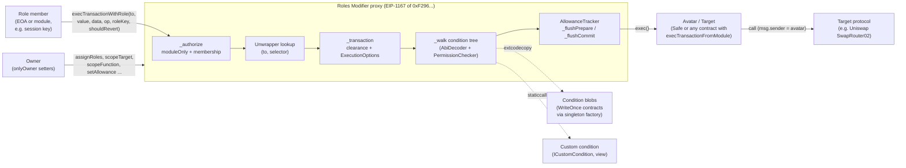

# Report 1: How the Zodiac Roles Modifier works

Labels: **Verified** = read in code, git history, or observed with a read-only RPC call in this study. **Inferred** = reasoning or outside knowledge not confirmed in this repo. Contract paths are relative to `packages/evm/contracts/` unless stated. Working notes with fuller citations are in `notes/A-*.md` to `notes/D-*.md`.

---

## 1. Versions, licenses, packages, Monad status

### 1.1 Versions (Verified)

| Item | Value |
|---|---|
| Repository | `gnosisguild/zodiac-modifier-roles` |
| Checked out | `main` at `820e5bc975d1817bdd4bc4a95226f553f7b67b68`, committed 2026-08-25 17:37 +0200 ("chore(main): release zodiac-roles-sdk 4.1.3") |
| Latest tag | `zodiac-roles-sdk-v4.1.3` |
| Last change to contracts on `main` | 2026-02-23, `1ddde84d fix: Simplify Loop Bounds (#448)` |
| Roles v1 | Legacy, separate repo `gnosisguild/zodiac-modifier-roles-v1` (per `README.md`). Not studied. |
| Roles v2 (current, deployed) | **2.1.1**, built from branch `origin/v2` at `218a5164` (2026-06-08). Mastercopy `0xF2964CE6161ce0e75964Fe7927cE114cb0B283D5`. |
| Roles v2 on `main` | `packages/evm/package.json` says 2.1.0, but the source is an unaudited 2025 refactor (`557b17d5`: new `AbiDecoder.sol`, EIP-712 periphery). It does **not** contain the 2.1.1 fixes and is not what is deployed. |
| Roles v3 (unreleased) | Branch `origin/contracts-v3` at `47dd69bd` (2026-07-20), evm package 3.0.0. No audit in repo. |

**Which code to trust.** The deployed mastercopy is 2.1.1 = the audited code at `a19c0ebd` (2023-11-29) plus three small 2026 bug fixes (`git show 218a5164`). `main` is a different, unaudited code line. This report describes behavior that is common to both unless a difference is called out; the three 2.1.1 fixes are listed in section 7. **Verified.**

### 1.2 Licenses (Verified)

| Code line | License |
|---|---|
| `main` and `origin/v2` (v2) | LGPL-3.0+ (root `LICENSE`, `package.json`) |
| `origin/contracts-v3` (v3) | BUSL-1.1, "Copyright (c) 2026 GG DAO LLC ... Converts to LGPL-3.0-or-later on 2030-03-01" (header of `origin/contracts-v3:packages/evm/contracts/Roles.sol`) |

Inferred: copying v2 source into our own contracts creates LGPL obligations; reimplementing the patterns does not. v3 code must not be copied or deployed in production without legal review of the BUSL terms.

### 1.3 Packages (Verified, `packages/*/package.json`)

| Package | Name / version | What it does |
|---|---|---|
| `packages/evm` | `@gnosis-guild/zodiac-core-modifier-roles` 2.1.0 | Solidity contracts (Hardhat), tests, 4 audit PDFs in `docs/`, `mastercopies.json`, deploy/verify tasks |
| `packages/sdk` | `zodiac-roles-sdk` 4.1.3 | TypeScript: condition builders (`c.*`), permission processing, integrity checks, ABI, typed `kit` (deprecated), annotations, CoW swap helpers, license lookup |
| `packages/app` | `zodiac-roles-app` 0.1.0 | Next.js app (roles.gnosisguild.org): view roles, diff and apply updates |
| `packages/docs` | `zodiac-roles-docs` 0.1.0 | Docs site content (`content/general`, `content/sdk`, `content/tutorials`) |
| `packages/integration-tests` | `zodiac-roles-integration-tests` | Hardhat integration tests |

`README.md` also lists `subgraph` and `deployments` packages; they are not in this checkout (the deployments package was sunset in `3a05b490`, SDK v4). There is **no presets or permission library** for Uniswap or any other protocol in the repo (section 6.5).

### 1.4 Monad deployment status (Verified by read-only RPC to `https://rpc.monad.xyz`, `eth_chainId` = `0x8f` = 143)

The repo never mentions Monad, and chain 143 is not in `packages/sdk/src/main/chains.ts`. Even so, the canonical deployments exist on Monad mainnet:

| Contract | Address | On Monad |
|---|---|---|
| Roles 2.1.1 mastercopy | `0xF2964CE6161ce0e75964Fe7927cE114cb0B283D5` | Yes. Runtime matches recorded build; initialized and inert (`owner()` = `0x1`; `setUp` reverts `InvalidInitialization()`) |
| Roles 2.1.0 mastercopy (has the 3 bugs) | `0x9646fDAD06d3e24444381f44362a3B0eB343D337` | Yes. Do not use. |
| Integrity library | `0x6a6Af4b16458Bc39817e4019fB02BD3b26d41049` | Yes |
| Packer 2.1.1 library | `0x869718c939652084bc491fbc5ce0d3c1d5b309f0` | Yes |
| MultiSendUnwrapper 2.1.1 | `0xB4Cd4bb764C089f20DA18700CE8bc5e49F369efD` | Yes |
| Singleton factory (used by `WriteOnce`) | `0xce0042b868300000d44a59004da54a005ffdcf9f` | Yes |
| Zodiac ModuleProxyFactory | `0x000000000000aDdB49795b0f9bA5BC298cDda236` | Yes (not byte-compared) |
| Safe 1.4.1 singleton / SafeL2 / proxy factory | `0x4167...461a` / `0x29fc...C762` / `0x4e1D...ec67` | Yes |
| MultiSend / MultiSendCallOnly 1.4.1 | `0x3886...B526` / `0x9641...02e2` | Yes |
| Poster (annotations) | `0x000000000000cd17345801aa8147b8D3950260FF` | **No** |

Sub-agent C recomputed each CREATE2 address from `mastercopies.json` (both branches) and found the on-chain runtime inside the recorded creation bytecode for every Roles-family contract (`notes/C-admin-deploy-sdk.md` section 3.3). **Verified.**

Uniswap v3 on Monad (from Uniswap's deployment docs, then **Verified** by RPC): SwapRouter02 `0xfe31f71c1b106eac32f1a19239c9a9a72ddfb900` (its `WETH9()` returns WMON `0x3bd359C1119dA7Da1D913D1C4D2B7c461115433A`, `factory()` returns `0x204faca1764b154221e35c0d20abb3c525710498`), UniversalRouter `0x0d97dc33264bfc1c226207428a79b26757fb9dc3`, Permit2 `0x000000000022D473030F116dDEE9F6B43aC78BA3`. USDC `0x754704Bc059F8C67012fEd69BC8A327a5aafb603` (`symbol()` = "USDC"). USDC/WMON pools exist at fee tiers 100, 500 and 3000 (`factory.getPool`). Liquidity depth was not checked.

---

## 2. Summary

The Roles Modifier is a Zodiac module that sits between one or more "member" addresses and an account (the avatar, usually a Safe). A member submits a transaction to the modifier with a role key; the modifier checks the call against that role's permissions (which target addresses, which function selectors, which parameter values, whether native value or delegatecall is allowed, and how much of a metered allowance it consumes) and, if everything passes, asks the account to execute it via `execTransactionFromModule`. Permissions are expressed as trees of conditions over ABI-decoded calldata, stored cheaply as contract bytecode, and can express allowlists, exact equality, numeric bounds, "recipient must be the account itself", and rate-limited budgets. It cannot read prices, balances or the clock inside conditions (other than through a custom checker contract you write), has no post-execution checks, no epochs and, in v2, no membership expiry. The owner of the modifier has unrestricted power to change permissions, so it is effectively a full controller of the account's funds.

---

## 3. Architecture



### 3.1 Inheritance (Verified)

`Roles` (`Roles.sol`) inherits `Modifier` (zodiac-core), `AllowanceTracker`, `PermissionBuilder`, `PermissionChecker`, `PermissionLoader`. `Core` (`_Core.sol`) holds storage (`roles`, `allowances`) and extends zodiac `Modifier`, which extends `Module` and `FactoryFriendly` (OpenZeppelin `OwnableUpgradeable`). `Periphery` (`_Periphery.sol`) holds the transaction unwrapper registry. `Integrity` and `Packer` are external linked libraries; `BufferPacker`, `Topology`, `AbiDecoder`, `Consumptions`, `WriteOnce` are internal.

### 3.2 Roles of each address (Verified, `Roles.setUp`, zodiac-core `Module.exec`)

| Address | Meaning |
|---|---|
| **Owner** | Single `Ownable` admin; every setter is `onlyOwner`. One-step `transferOwnership`, `renounceOwnership`. |
| **Avatar** | Only *read*: the value that `EqualToAvatar` compares against (`PermissionLoader._load`). |
| **Target** | Only *called*: `IAvatar(target).execTransactionFromModule[ReturnData]`. Usually equals the avatar. |
| **Member / module** | Address allowed to submit transactions under a role (`roles[key].members[module]`). Must also be an enabled module on the modifier (`assignRoles` enables it automatically). |
| **Role** | `bytes32` key mapping to `Role { members, targets, scopeConfig }` (`Types.sol`). |

### 3.3 Call flow (Verified, `Roles.sol` lines 103-205, `PermissionChecker._authorize`)

```solidity
Consumption[] memory consumptions = _authorize(roleKey, to, value, data, operation);
_flushPrepare(consumptions);                 // write allowance debits BEFORE exec
success = exec(to, value, data, operation);  // target.execTransactionFromModule(...)
if (shouldRevert && !success) revert ModuleTransactionFailed();
_flushCommit(consumptions, success);         // on failure restore balances
```

1. `moduleOnly` (zodiac-core `Modifier`): `msg.sender` must be an enabled module, or the calldata must carry an appended EIP-712 signature (`salt` + sig) from one. The signed payload has **no deadline**.
2. `roleKey == 0` reverts; `members[sender]` must be true.
3. If an unwrapper is registered for `(to, selector)`, each inner transaction is checked separately (`_multiEntrypoint`); otherwise `_transaction` checks the call once.
4. `_transaction`: target clearance, then `_executionOptions`, then function header, then the condition tree.
5. Any failure reverts `ConditionViolation(status, info)`.

Entry points: `execTransactionFromModule[ReturnData]` use `defaultRoles[msg.sender]` and never revert on inner failure; `execTransactionWithRole[ReturnData]` take an explicit role and a `shouldRevert` flag. v2 has no reentrancy guard; allowances are debited before the external call (v3 adds `nonReentrant`).

---

## 4. Permission model and conditions (Sub-agent A)

### 4.1 Scoping layers (Verified, `PermissionBuilder.sol`, `PermissionChecker._transaction`)

| Layer | Setter | Effect |
|---|---|---|
| Target `None` | default, `revokeTarget` | All calls to that address denied |
| Target `Target` | `allowTarget(role, to, options)` | **Any** selector and parameters, only ExecutionOptions checked |
| Target `Function` | `scopeTarget(role, to)` | Only selectors with a stored header |
| Function wildcard | `allowFunction(role, to, sel, options)` | Selector allowed, parameters not inspected |
| Function scoped | `scopeFunction(role, to, sel, ConditionFlat[], options)` | `Integrity.enforce`, store tree, check on each call |
| Revoke function | `revokeFunction` | Deletes header |

Empty calldata is treated as selector `0x00000000`. `revokeTarget` does not delete function headers, so a later `scopeTarget` silently restores old function scopes (**Verified**, `test/Clearance.spec.ts`). Permissions are keyed by `_key(target, selector)` (`_Core._key`), with no code-hash check.

### 4.2 Parameter types (Verified, `Types.sol` `AbiType`, `AbiDecoder`)

`None` (logical nodes), `Static` (one word), `Dynamic` (`bytes`/`string`), `Tuple`, `Array` (all elements decoded with the first child's type), `Calldata` (selector + ABI params; nested selector is skipped, not checked), `AbiEncoded` (ABI params without selector). The root must be `Calldata`.

### 4.3 Operators (Verified, `Types.sol` `Operator`, `PermissionChecker._walk`)

| Operator | Applies to | Semantics |
|---|---|---|
| `Pass` | any | Always passes (structure only) |
| `And` / `Or` / `Nor` | None | All / first-passing / none of children. `Nor` gives "not equal" |
| `Matches` | Tuple, Array, Calldata, AbiEncoded | Positional; child count must equal payload count (pins array length) |
| `ArraySome` | Array | Intended "some element matches". **Bug in 2.1.0 and `main`: only element 0 is checked** (`_arraySome` loops `condition.children.length`, which Integrity forces to 1). Fixed in 2.1.1. |
| `ArrayEvery` | Array | Every element matches; empty array passes |
| `ArraySubset` | Array | Each element matches a distinct child; up to 256 children |
| `EqualToAvatar` | Static | Rewritten at load time to `EqualTo(keccak256(abi.encode(avatar)))` |
| `EqualTo` | Static, Dynamic, Tuple, Array | `keccak256(value) == stored hash`; pins length and every byte for dynamic values |
| `GreaterThan` / `LessThan` | Static | Unsigned strict comparison to a constant |
| `SignedIntGreaterThan` / `SignedIntLessThan` | Static | Signed strict comparison to a constant |
| `Bitmask` | Static, Dynamic | 15-byte mask and expected value at a byte shift |
| `Custom` | any | STATICCALL to `ICustomCondition.check(to, value, data, operation, location, size, extra)`; `extra` is 12 bytes |
| `WithinAllowance` | Static | Consumes the parameter's value from an allowance |
| `EtherWithinAllowance` | None (child of Calldata) | Consumes `msg.value` |
| `CallWithinAllowance` | None (child of Calldata) | Consumes 1 per call |

No operator compares two fields to each other, reads `block.timestamp`, reads a balance or reads a price, other than through `Custom`. **Verified** by the operator list.

### 4.4 Storage and limits (Verified)

Condition trees are submitted flat in BFS order (`ConditionFlat { parent, paramType, operator, compValue }`), checked by `Integrity` (single root, BFS order, per-operator type and compValue rules, sibling type compatibility), packed at 2 bytes per node plus 32 bytes per comparison value (`Packer`, `BufferPacker`), and deployed as contract bytecode via the singleton factory with salt 0 (`WriteOnce`). Identical trees dedupe to the same address across all Roles instances, because `EqualToAvatar` is resolved at load time. v2 has no explicit node or depth cap; practical limits come from the `uint8` parent index, the 16-bit count and max contract size. v3 adds explicit caps.

### 4.5 Recipient must equal the account (Verified mechanism; Uniswap ABI Inferred)

Yes. `EqualToAvatar` on the recipient field. For SwapRouter02 `exactInputSingle((address tokenIn, address tokenOut, uint24 fee, address recipient, uint256 amountIn, uint256 amountOutMinimum, uint160 sqrtPriceLimitX96))`, selector `0x04e45aaf` (present in the router bytecode on Monad):

```
Calldata Matches
  Tuple Matches
    tokenIn           Or( EqualTo USDC, EqualTo WMON, EqualTo WETH, EqualTo LST )
    tokenOut          Or( same four )
    fee               Or( EqualTo 500, EqualTo 3000 )
    recipient         EqualToAvatar
    amountIn          WithinAllowance(key per token)  or LessThan(cap)
    amountOutMinimum  Pass  (v2 cannot relate it to amountIn or a price)
    sqrtPriceLimitX96 Pass
  CallWithinAllowance(tradesPerDay)
```

This also excludes SwapRouter02's special recipients `address(1)` and `address(2)` (Inferred). `exactInput` with a packed `path` can be constrained safely only with `Or` of `EqualTo` exact paths; `Bitmask` cannot bind path length. Universal Router `execute(bytes,bytes[],uint256)` can be constrained in v2 only for one fixed command shape (for example `commands == 0x00`), because all array elements decode with one layout; mixed sequences need v3's variant arrays. **Assessment (Inferred): SwapRouter02 is the only practical Uniswap target for v2.**

### 4.6 Execution options (Verified, `PermissionChecker._executionOptions`)

`ExecutionOptions { None, Send, DelegateCall, Both }` stored per target (for `Clearance.Target`) or per function header. `None` forbids both native value and delegatecall. There is no role-wide switch; each grant must pass `None`.

### 4.7 Batches (Verified, `PermissionChecker._multiEntrypoint`, `periphery/MultiSendUnwrapper.sol`)

The owner registers an unwrapper with `setTransactionUnwrapper(to, selector, adapter)` (global to all roles). For a registered MultiSend address, each inner transaction is checked exactly like a direct call and allowances accumulate across the batch, so a batch cannot smuggle a forbidden call. The outer delegatecall itself is trusted. Unwrapping is one level only; a nested MultiSend delegatecall is a plain call that is denied unless the role grants delegatecall on MultiSend (never do that). Without an unwrapper, a delegatecall to MultiSend is an ordinary call and is denied by default. `MultiSendUnwrapper` ignores its `to` argument, so registering it for anything other than a genuine MultiSend is dangerous.

---

## 5. Allowances and state (Sub-agent B)

### 5.1 Mechanics (Verified, `Types.sol` `Allowance`, `AllowanceTracker._accruedAllowance`)

`Allowance { uint128 refill; uint128 maxRefill; uint64 period; uint128 balance; uint64 timestamp; }` in a flat per-instance mapping `allowances[bytes32]`. Only the owner sets them (`PermissionBuilder.setAllowance`). Refill is discrete and **fixed-window**: after each whole `period` since the anchor `timestamp`, `balance += refill`, capped at `maxRefill`. `period = 0` means one-time. No rolling window.

```solidity
uint64 elapsedIntervals = (blockTimestamp - allowance.timestamp) / allowance.period;
balance = allowance.balance + allowance.refill * elapsedIntervals;
balance = balance < allowance.maxRefill ? balance : allowance.maxRefill;
timestamp = allowance.timestamp + elapsedIntervals * allowance.period;
```

Units are unitless `uint128`: raw token units for `WithinAllowance`, wei for `EtherWithinAllowance`, call count for `CallWithinAllowance`. One key can be referenced by any role and function, so it can be a shared budget (and a shared griefing target). Consumption accumulates within a transaction and across batch entries (`Consumptions.merge`); failing `Or` branches discard their consumption.

### 5.2 What allowances can and cannot express

| Our need | v2 |
|---|---|
| Absolute max trade size | Native, `LessThan` on `amountIn` (per token, raw units) |
| Daily turnover per token | Native, `WithinAllowance` with daily refill |
| Daily turnover in USD across tokens | Not supported (v3 priced allowances only) |
| 20 trades per day | Partial: `CallWithinAllowance` with `refill = maxRefill = 20`, `period = 86400`. Fixed windows allow up to 40 trades around a boundary |
| Any percentage of account value | Not supported (no balance or price reads) |

### 5.3 Oracles, post-trade checks, time, epochs (Verified)

- **Oracles:** none in v2 core. A `Custom` condition is a view call that can read oracles, pool state, balances and `block.timestamp` (Inferred), so freshness, deviation, NAV and deadline checks are buildable by us.
- **Post-trade checks:** none. After `exec`, only `_flushCommit` runs (`Roles.sol`).
- **Time:** no operator compares with `block.timestamp`. SwapRouter02 `exactInputSingle` has no deadline field; deadlines only exist through `multicall(uint256 deadline, bytes[])` (selector `0x5ae401dc`, present on Monad), and even then Roles can only compare the deadline to a constant.
- **Epochs, expiry:** none in v2. Membership is a boolean.

### 5.4 v3 additions (Verified on `origin/contracts-v3`, unaudited, BUSL-1.1)

- `core/Membership.sol`: membership packed as `start | end | usesLeft`, with automatic revoke at 0 uses. Useful for session-key expiry.
- `WithinRatio` (`core/evaluate/WithinRatioChecker.sol`): compares two plucked calldata values after pricing, in basis points. It fits slippage (`amountOutMinimum` vs `amountIn` at oracle prices) but cannot see balances or NAV.
- Priced allowances via `IPricing` adapters (`common/PriceLoader.sol`). Core has no staleness logic. No production adapter on the v3 head; `ChainlinkPricing` (with `maxAge`) and `ConsensusPricing` / `UniswapPricing` (V3 TWAP) exist only on unmerged branches.
- Custom conditions get variable-length `extra`, plucked values, and can return allowance consumptions.
- `nonReentrant` entry points, allowances persisted only after success, typed `execTransactionWithSignature` (still no deadline), and new permissive `allowFunctionGlobally`.

---

## 6. Administration, deployment, SDK, presets (Sub-agent C)

### 6.1 Administration (Verified)

All setters are `onlyOwner`: `assignRoles`, `setDefaultRole`, `allowTarget`, `scopeTarget`, `revokeTarget`, `allowFunction`, `scopeFunction`, `revokeFunction`, `setAllowance`, `setTransactionUnwrapper`, `enableModule`, `disableModule`, `setAvatar`, `setTarget`, `transferOwnership`, `renounceOwnership`. There is no built-in delay. The owner can be any address, so a delay is added by making the owner a timelock or a custom policy contract (Inferred). `assignRoles` auto-enables the module but never disables it. The owner can grant itself or anyone `allowTarget` with delegatecall, so **the Roles owner effectively controls every asset the target holds** (Inferred).

### 6.2 Applying changes (Verified)

v2 has no batch function; owners batch through MultiSend. SDK v4 removed the plan/diff/apply API (`3a05b490`); diffing now lives in the external `@zodiac-os/sdk` (`push()`, needs a Zodiac org and API key) and in an inlined copy in the app (`packages/app/utils/plan/planApplyRole.ts`, `diff/*`, `encodeCalls.ts`) that reads Gnosis Guild's Subsquid indexer. No Monad indexing is evident. For us, the chain-agnostic authoring parts (`c.*`, `processPermissions`, `flattenCondition`, `targetIntegrity`, `rolesAbi`, `encodeKey`) are enough to build calls ourselves.

### 6.3 Deployment (Verified)

Mastercopies are CREATE2-deployed through the singleton factory with salt 0 and constructed with `(0x1, 0x1, 0x1)` so they are inert. Instances are EIP-1167 proxies from `ModuleProxyFactory.deployModule(masterCopy, setUp(abi.encode(owner, avatar, target)), saltNonce)`, initialized atomically. On Monad everything needed is already deployed (section 1.4); we would only deploy proxies of `0xF2964...`.

### 6.4 Avatar requirements (Verified)

A Safe is not required (`test/TestAvatar.sol`). Roles only calls `execTransactionFromModule(address,uint256,bytes,uint8)` and `execTransactionFromModuleReturnData(...)` on the target. The target must itself restrict those functions to the Roles proxy, because that is the only gate.

### 6.5 SDK and presets (Verified)

`zodiac-roles-sdk` exports `.`, `./kit`, `./annotations`, `./swaps`, `./typechain`. Permissions are `{ targetAddress, selector | signature, condition?, send?, delegatecall? }` (`src/main/permission/types.ts`). Builders: `c.calldataMatches(scopings, abiTypes, { callWithinAllowance })`, `c.matches`, `c.or`, `c.and`, `c.eq`, `c.gt/gte/lt/lte`, `c.avatar`, `c.withinAllowance`, `c.bitmask`, `c.every`, `c.pass`, `c.abiEncodedMatches`, `c.avatarIsOwnerOfErc721`. `c.some` and `nor` are not exposed. The typed `kit` is deprecated. `fetchLicense` (`src/main/licensing.ts`) calls `app.zodiac.eco`; it gates only SDK CoW swap fees (25 bps partner fee without an Enterprise plan, `src/swaps/appData.ts`) and the app's apply flow, nothing on-chain. **No Uniswap preset exists in the repo**; DeFi Kit (karpatkey) is external and its Monad coverage is unknown. We would write our own.

### 6.6 Gas (Inferred; no measurements committed)

`hardhat.config.ts` enables a gas reporter but no results are committed, and `test/utils.ts:logGas` has no callers. Cost drivers from code: 3 cold SLOADs (membership, target, header), one cold `extcodecopy` of the condition blob, linear decoding and tree walk, 2 SLOADs + 1 SSTORE per allowance used, then the call into the target. Estimated 25k to 40k gas overhead for a simple scoped call and 40k to 70k for a Uniswap-style tree with an allowance, on Ethereum pricing. Must be measured on a Monad fork (spike plan).

---

## 7. Security and audits (Sub-agent D)

### 7.1 Audits (Verified, `packages/evm/docs/*.pdf`)

| Audit | Scope | Findings | Status |
|---|---|---|---|
| G0 Group, Apr 2023 | All contracts at `5d218a4b` | 4 Medium, 1 Minor (allowances undecidable in `Or`, `maxBalance` check, 65,536-condition limit, single root, ArraySubset bound) | All fixed at `c824d7b2` |
| Omniscia, May 2023 | 17 files, `a9f65e8f05` to `23b782f781` | 2 Medium (XOR semantics, Topology root assumption), 2 Minor, 27 Informational | Medium/Minor fixed (XOR removed); 13 Informational acknowledged |
| Omniscia, Nov 2023 | Delta only (PR#206); `AllowanceTracker` out of scope | 3 Medium (AbiEncoded inline handling in Packer and Topology; `setAllowance` balance semantics), 7 Informational | Mediums fixed |
| G0 Group, Nov 2023 | All contracts at `d4b6539b` | 1 Minor (custom condition lacked `operation`) | Fixed at `a19c0ebd` |

Not audited: the 2.1.1 fixes (small, regression-tested), `MorphoBundler3Unwrapper`, the MultiSendUnwrapper loop-bound change (#448), the whole `main` refactor, and all of v3.

### 7.2 Issues and pitfalls

| Issue | What the code does | Severity for us |
|---|---|---|
| `main` is not the deployed or audited code | Deployed 2.1.1 is on `origin/v2`; `main` is an unaudited refactor without the 2.1.1 fixes | High (process): audit and test against `origin/v2@218a5164` |
| ArraySome only checks element 0 (2.1.0, `main`) | Fail-closed alone, fail-open under `Nor` | Low if we use 2.1.1 and avoid `ArraySome` |
| Bitmask on dynamic values counts padding (2.1.0, `main`) | Slightly permissive | Low with 2.1.1 |
| ERC-1271 signer that reverts with magic value accepted (zodiac-core 3.0.1) | Signature bypass for contract members | Low (our member is an EOA); fixed in 2.1.1 |
| `allowTarget`, `allowFunction`, `Pass` root | Any params pass | Critical if used on tokens or the router |
| Delegatecall option | Arbitrary code in the account's context | Critical |
| Avatar or Roles itself as a target | Member can re-enable modules or rewrite its own permissions | Critical (configuration) |
| `revokeTarget` keeps function scopes | Re-scoping restores old permissions | High for our epoch rule; use fresh role keys |
| Allowance keys are global, `setAllowance(0)` keeps refilling | Shared budgets, "zero" is not revocation unless `refill = 0` | Medium |
| No price awareness | `amountOutMinimum` unconstrained unless `Custom` | Critical for a compromised key (near-total loss per trade) |
| No deadline on signed module transactions | Salt only | Medium; do not use the relayed path |
| No reentrancy guard (v2) | Debits before exec; edge case can erase a reentrant consumption when `shouldRevert=false` | Low |
| Target upgrades | Keyed on address + selector only | Medium; monitor or pin immutable targets (SwapRouter02 is immutable, Inferred) |
| Non-canonical ABI encoding | Decoder follows offsets like Solidity; no canonicality checks | Low for static-tuple `exactInputSingle` |
| Revocation timing | Plain storage write, effective for later transactions in the same block; can be front-run | Medium |
| Worst case under tight Uniswap scope without oracle | Sandwich or thin-pool routing takes most of each `amountIn`; with 10% trades and 20/day the account can be drained in a day | Critical without an oracle check; with oracle min-out and fee pinning, about 1.1% of account per day through churn (Inferred arithmetic) |
