# Build Plan

*What has to be built, in what order. Revision 2. Revision 1 reconciled `Planv1/PHASES.md` with the planning answers; revision 2 applies the owner decisions and fixes from the orientation session of 2026-09-27. The Phase 3 planning session of 2026-10-07 rewrote Phase 3 (D-277 to D-296) and added the Gallery, Leaderboard and Dashboard options in section 4.5.*

Companion to `FINAL_PLAN.md` (what we are building) and `DECISIONS_AND_OPEN_QUESTIONS.md` (the record). Order is by dependency only; there are no time estimates anywhere in this document. The October 13, 2026 hackathon deadline is a constraint on the definition of the hackathon beta (`FINAL_PLAN.md > 2.1`), not a schedule. The project is Alpha Agents. This repository is the code repository: code, plan documents and tracking files all live here (owner decision, orientation).

---

## 1. Build rules

Carried from `PHASES.md > How every phase works`, `> Unit prompt template` and `> Rules for every Claude Code session`, amended by the planning answers and the orientation decisions.

**One unit at a time.** Each unit has its own prompt, is built and tested alone in its own session, and is reviewed by the owner before the next unit starts. No session builds more than one unit and no prompt describes a whole phase. The prompts of the units built before P0-U4 are stored in `Planv2/units/`, one file per unit (`Assumption` A-25). From P0-U4 on, unit prompts are not saved there; the unit's `LOGS.md` entry and commits are its record (D-158, which supersedes A-25).

**Every phase runs five steps.** Build (one unit per session, in the order of section 4), stabilize (the phase's tests pass together, bugs logged and fixed), mid-phase playtest (once the core pieces are built and connected; terminal output is acceptable), end-of-phase playtest (once the feature is fully assembled; the owner uses it as a real user and writes notes), tune (small adjustments, no new features). Section 3 and section 4 mark where each playtest falls. A phase is locked before the next starts, with one exception for the hackathon beta: a phase is beta-locked when its beta units (section 4) have passed their playtests; its remaining units are built after Phase B in phase order, and the phase is fully locked then.

**Tracking files.** Two append-only files at the repository root, created in the orientation session:

- `LOGS.md`: one entry after every unit and every playtest, newest at the bottom, so it reads as a chain of development. Each entry carries the date, the unit ID or "Playtest", a short name, a status (done, partial or blocked), a two-to-four-sentence summary including anything left open, the lesson IDs of bugs found and fixed, and the commit hash.
- `LESSONS.md`: one entry for every bug found and fixed, newest at the bottom: the unit, what happened, the root cause, the fix, and a one-sentence rule to avoid it next time.

`DECISIONS_AND_OPEN_QUESTIONS.md` stays the plan record and is updated only when a decision changes. There is no `plans/` directory and no `STATUS.md`, `BUGS.md` or `PLAYTEST.md`. Status claims live in `LOGS.md`; the README describes the product and states "unaudited beta" until public launch.

**Unit prompt template.** `UNIT`, `GOAL`, `READ FIRST` (always begins with `LESSONS.md`, then `DECISIONS_AND_OPEN_QUESTIONS.md` and the `FINAL_PLAN.md` sections the unit touches), `DEPENDS ON`, `IN SCOPE`, `OUT OF SCOPE`, `DELIVERABLES`, `ACCEPTANCE TESTS`, `HOW THE OWNER TESTS IT`, `WHEN DONE`. Every prompt ends with the same two lines: add a `LOGS.md` entry, and add a `LESSONS.md` entry for every bug fixed.

**Session rules.** Read `LESSONS.md` first, then the unit prompt and the decision record, before writing code; read `Reference/` only when its lessons (section 8) are relevant to the unit, and never add entries to it; stay inside the unit's scope and put extras in the `LOGS.md` entry as suggestions; all units commit directly to `main` in small commits, with no unit branches (owner decision, D-147); tests with the code, not after; reproduce, log, fix and record every bug; never put real private keys or real funds anywhere before Phase B, except the throwaway mainnet canary of P2-EC within the limits of D-252; end every session by updating `LOGS.md` and, for every bug fixed, `LESSONS.md`.

**Rules added during planning and orientation:**

- Clean room: no code copied from BoringVault (SEL-1.0), Morpho Vault V2 (GPL-2.0-or-later), Zodiac Roles (LGPL-3.0 and BUSL-1.1) or monad-agent-kit (no license); patterns only, on an MIT base; a reviewer checklist item on every contract PR (`planning answer`).
- Labels for every dependency: PROPOSED, DOCUMENTED, SPIKE_PASSED, INTEGRATED, RELEASED. Evidence advances a label; a source link is never a substitute for observed output (`preview.html > Revised build manual > 1`).
- Every spike is unverified until it passes, including E2B egress injection (`planning answer`). A unit that depends on a spike cannot close before the spike passes.
- A new security boundary or capital permission requires an entry in `DECISIONS_AND_OPEN_QUESTIONS.md` before implementation (`preview.html > Revised build manual > 1`).
- Every record carries an environment ID: `fork`, `testnet` or `mainnet-beta` during the build and beta, with `mainnet` added in Phase 9 (D-149); a fork RPC is never wired to a mainnet signer (`preview.html > Revised technical plan > 11`).
- Never mark a mocked, fork-only or testnet-only integration as mainnet complete (`preview.html > Revised build manual > 1`).
- Pin versions and image digests that passed; do not use unbounded "latest" (`preview.html > Revised build manual > 1`). Pinned means locked to a tested version, not reduced: Hermes may be re-pinned to a newer commit once the Hermes spike (H-01 to H-16 and H-45) passes again on that commit, and P0-U2 pins the Foundry release and the fork block at the time it runs and records both in `LOGS.md` (owner decision, orientation).
- Demo and simulated activity is labeled at origin and excluded from external demand totals (`PHASES.md > Phase 5`).
- Set a spending cap on every paid key before it is used (the Phase 0 checklist in section 3).
- The hackathon beta is a guarded mainnet deployment: allowlisted wallets, small caps and an "unaudited beta" label everywhere. Nothing in the beta weakens custody, accounting, emergency handling or data provenance (section 7.2).
- At the end of every phase, before the end-of-phase playtest, run a seam sweep: for every unit in the phase, name what calls its output by a route a real user would take. If the only caller is a test or a demo script, that is a finding (section 8, lesson 16).

---

## 2. Dependency graph

Solid arrows are build dependencies. Phase 3 is revised by the Phase 3 planning session (D-277): P3-U9, P3-U8 and P3-U10 are new, and the Phase 3 build order is P3-U1, P3-U2, P3-U9, P3-U3, P3-U7, P3-U4, P3-U6, P3-U8, P3-U10, all nine in Pass 1, each in its own session (D-301). P2-EC, built in two sessions (part 1 testnet, part 2 the mainnet canary, D-303), follows P2-U7 and comes before Phase 3 in the build order (D-247); nothing in Phase 3 needs its output, and PB-U1 uses its lessons. The Pass 1 and Pass 2 units of section 4 form the path to PB-U1 (D-159); the rest are built in the post-beta completion pass and Phase 9. P1-U8 is folded into P3-U4 (D-160).

```mermaid
flowchart TB
  DOM[Shared domain and policy packages P0-U5]
  DS[Web foundation and design system P0-U6]
  DEV[Dev console P0-U4]
  TUNE[Design tuning P0-U7]
  ENV[Local environment and fork P0-U2]
  HERM[Hermes and E2B spike P1-U1]
  NFT[AgentNFT and token-bound accounts P1-U3]
  PORT[Prototype port: portal, 3D model, NFT connector P1-U11]
  IDX[Indexer and API P1-U4]
  PROV[Agent provisioning P1-U5]
  CRED[Credits: funding address and metering P1-U6]
  TOOLS0[Minimal tool servers and narrator P1-U7]
  PAGES1[Landing and mint pages P1-U10]
  SPIKE2[Venue and oracle spikes P2-U0]
  CUST[Custody core and PersonalAccount P2-U1]
  ORA[Oracle adapter and breaker P2-U3]
  EXE[Executor, ProtocolRegistry, adapter P2-U2]
  SIGN[KMS signer, grants, ledger P2-U4]
  CT[Chain tools server P2-U5]
  TRADE[Trade flow P2-U6]
  PUI[Portfolio UI P2-U7]
  EC[Early chain check P2-EC]
  ADAPT[Chain adapter interface P2-U8]
  GOALS[Goal form and translator P3-U1]
  DT[Data tools: market data P3-U2]
  DT2[Data tools: research sources P3-U9]
  TPL[Strategy templates and template runner P3-U3]
  SKF[Launch skills as folders P3-U7]
  DISC[Discovery loop engine P3-U4]
  TB[Thesis Board P3-U5]
  PROP[Parameter proposals P3-U6]
  ACT[Activation sweep P3-U8]
  LOOP[Autonomous loop and Research page P3-U10]
  WFR[Workflow runner and coordinator P4-U1]
  SENT[Risk Sentinel service P4-U2]
  WFB[Built-in workflows P4-U3]
  CFO[CFO dashboard P4-U4]
  WFPAGE[Workflows page P4-U8]
  DIR[Directory, build cards, profile page P5-U1]
  MSG[Structured messages P5-U2]
  SIG[Signal feed P5-U3]
  X402[x402 payer P5-U4]
  BUY[Buyer agent P5-U5]
  ART[3D asset pipeline P6-U1]
  SKC[SkillNFT, registries, BuildRegistry P6-U2]
  SKP[Packaging, privacy, loader P6-U3]
  AUD[Audit pipeline and creator upload P6-U4]
  SKN[Launch skills as NFTs P6-U5]
  CFG[Configure page P6-U6]
  VLT[StrategyVault core P7-U1]
  VEX[Vault Executor integration P7-U2]
  VSP[Vault invariants and spikes P7-U3]
  VUI[AccountFactory, caps, allowlists, vault UI P7-U4]
  WATCH[Watchers and demand signals P7-U5]
  LB[Leaderboard P7-U6]
  GAL[Agent gallery P7-U7]
  ESC[AgentEscrow and item escrow P8-U1]
  MKT[Marketplace and creator portal P8-U2]
  SALE[Agent sale flow P8-U3]
  ECON[Agent economy for users P8-U4]
  BETA[Beta guard and mainnet beta deployment PB-U1]
  SUB[Hackathon submission deliverables PB-U2]
  SAFE[Safety modes and reserve P9-U1]
  MON[Monitoring, kill switch, runbooks P9-U2]
  REV[External reviews and legal gate P9-U3]
  MAIN[Public launch deployment P9-U4]
  PUB[Public deposits P9-U5]
  SOL[Solana track S-U1 to S-U5]
  DOM --> DS
  DS --> DEV
  DS --> TUNE
  TUNE --> PORT
  NFT --> PORT
  PORT --> PAGES1
  PORT --> ART
  PORT --> CFG
  DS --> PAGES1
  DS --> PUI
  DOM --> NFT
  DOM --> CUST
  DOM --> CT
  ENV --> HERM
  ENV --> NFT
  NFT --> IDX
  IDX --> PROV
  HERM --> PROV
  PROV --> CRED
  CRED --> TOOLS0
  SPIKE2 --> ORA
  SPIKE2 --> EXE
  CUST --> ORA
  ORA --> EXE
  CUST --> EXE
  EXE --> SIGN
  SIGN --> CT
  TOOLS0 --> CT
  CT --> TRADE
  TRADE --> PUI
  PUI --> EC
  EC --> BETA
  CT --> ADAPT
  TRADE --> GOALS
  TOOLS0 --> DT
  DT --> DT2
  DT --> TPL
  CT --> TPL
  GOALS --> TPL
  TPL --> SKF
  TPL --> DISC
  SKF --> DISC
  DT2 --> DISC
  DISC --> TB
  DISC --> PROP
  PROP --> ACT
  ACT --> LOOP
  PROP --> WFR
  TRADE --> SENT
  SIGN --> SENT
  WFR --> WFB
  SENT --> WFB
  WFB --> CFO
  WFB --> WFPAGE
  DISC --> DIR
  TB --> DIR
  PUI --> DIR
  DIR --> MSG
  DIR --> SIG
  SIG --> X402
  SIGN --> X402
  X402 --> BUY
  NFT --> SKC
  SKC --> SKP
  PROV --> SKP
  SKP --> AUD
  AUD --> SKN
  SKF --> SKN
  SKN --> CFG
  ART --> CFG
  CUST --> VLT
  ORA --> VLT
  EXE --> VEX
  VLT --> VEX
  VEX --> VSP
  VSP --> VUI
  DIR --> WATCH
  WATCH --> LB
  DIR --> GAL
  SKC --> ESC
  VLT --> ESC
  ESC --> MKT
  AUD --> MKT
  MKT --> SALE
  X402 --> ECON
  MKT --> ECON
  CFG --> BETA
  VUI --> BETA
  MKT --> BETA
  X402 --> BETA
  DIR --> BETA
  SENT --> BETA
  BETA --> SUB
  SENT --> SAFE
  SALE --> MON
  VUI --> MON
  MON --> REV
  REV --> MAIN
  MAIN --> PUB
  ADAPT --> SOL
  VUI --> SOL
```

---

## 3. Phases, reconciled with PHASES.md

Each phase lists its goal, build units (ID, name, components touched, dependencies, acceptance tests), the two playtests, and what changed from `PHASES.md` and why. Units are built one at a time in the order of section 4, which also marks the hackathon cut line.

### Phase 0: Environment, accounts and repo scaffolding

**Goal.** Every account, key and tool the full build needs exists with a spending cap, and every later unit starts from a working base (`PHASES.md > Phase 0`, owner decision, orientation).

**Owner setup checklist.** Done by the owner before P0-U1 starts, except where the "First used by" column names a later unit; everything is recorded in `LOGS.md` as the first entry. Set a spending cap on every paid key, and keep every key out of the repository.

| Item | Kind | First used by | Notes |
|---|---|---|---|
| Node.js LTS and pnpm | tool | P0-U1 | |
| GitHub repository (this one) with Actions CI | account | P0-U1 | Public access for the hackathon reviewers is granted at PB-U2 |
| Foundry, latest stable release with Monad execution support (v1.8 or later) | tool | P0-U2 | Exact version pinned in P0-U2 and recorded in `LOGS.md` |
| Docker, for local Postgres and Redis | tool | P0-U2 | |
| Two Monad RPC providers with keys, one archive-capable for the fork | account, key | P0-U2 fork; P1-U3 testnet; P2-U4 mainnet | Spending cap. Q-23. P2-EC needs a keyed testnet endpoint (`MONAD_TESTNET_RPC_URL`), ideally a second from another provider (`MONAD_TESTNET_RPC_URL_SECONDARY`, D-254) |
| Monad testnet MON from the faucet and test USDC | funds | P1-U3 | P2-EC: about 20 MON from https://faucet.monad.xyz and about 40 USDC from Circle's faucet (Circle's testnet USDC `0x534b...43A3`, D-248) |
| Deployer key, admin multisig (a Safe on Monad), guardian key, sentinel key | keys | P1-U3 on testnet; PB-U1 on mainnet | Hardware-held or KMS-held; the sentinel key is separate from the guardian key (D-138) |
| Cloud KMS (AWS KMS or GCP Cloud KMS) | account | P1-U5 | Funding addresses, the signer and the skill key broker. Spending cap |
| E2B account on a plan with egress rules and header injection | account, key | P1-U1 | Spending cap. Q-04 |
| Model provider accounts with zero-retention terms, behind LiteLLM | account, key | P1-U1 | Spending cap on every provider key. Q-08 |
| Privy app with MetaMask and OKX enabled | account, key | P1-U2 | |
| Envio HyperIndex and HyperSync | account, key | P1-U4 | Spending cap |
| Sentry | account, key | P1-U4 for errors; PB-U1 for alerts | |
| Web search API (Exa or Tavily) | key | P1-U7 | Spending cap. Q-24 |
| X API, pay per use | key | P3-U9 | Spending cap |
| Dune API | key | P3-U9 | Spending cap |
| CoinMarketCap API (D-321) | key | P3-U2 | Free Basic plan: 15,000 credits a month |
| Wallet data provider for `wallet_portfolio`, `wallet_positions`, `wallet_pnl` and `holders` | key | W-2 (wallet data, holders) | Chosen in Q-24. Spending cap. `unlocks` is deferred for the beta (D-302) |
| Hosting: a long-running host for the orchestrator, tool servers, sentinel and bot runner; managed Postgres and Redis; a web host | account | P1-U4 for the API; PB-U1 for mainnet | Serverless function ceilings silently kill long model calls (section 8, lesson 18) |
| Domain name | account | PB-U1 | |
| IPFS or Arweave pinning (Pinata or equivalent) | account, key | P6-U5 | Q-26 |
| Image-to-3D tool with a commercial license, Blender, glTF Transform | tool | P1-U11 | Q-25, resolved for the bee model by D-157 (Meshy, UniRig) |
| x402 facilitator on Monad, testnet and mainnet endpoints | endpoint | P5-U4 testnet; P8-U4 mainnet | Q-20 |
| Mainnet funds: small MON and USDC for the canary and the founders' dry run | funds | P2-EC (throwaway canary); PB-U1 | P2-EC: about 10 MON and about 5 USDC (Q-49), at most 10 of each, returned at the end (D-252). PB-U1: bounded by the beta caps |
| Canary keys: a fresh canary owner, guardian and session key, used nowhere else | keys | P2-EC | Throwaway, in `.env` only, emptied at the end (D-252, Q-50) |
| Block explorer verification: Sourcify (no key) and optionally an Etherscan API v2 key for Monadscan | key | P2-EC | D-256 |
| Hackathon registrations: Monad Metropolis (Onchain Finance and Trading track) and Colosseum | account | PB-U2 | Deadline October 13, 2026 |
| Legal counsel for pooled discretionary management | service | P9-U3 | Q-19; not needed for the beta |
| External reviewers for the custody core, Executor, adapters, oracle adapter and escrow | service | P9-U3 | Booked early; not needed for the beta |

| Unit | Name | Components touched | Depends on | Acceptance tests |
|---|---|---|---|---|
| P0-U1 | Repo, tooling and tracking files | Monorepo layout (`apps/web`, `apps/control-api`, `services/*`, `packages/*`, `chains/monad`, `chains/solana`, `infra`, `evidence`, `docs/adr`), pnpm workspaces, lint, format, CI; README stating "Alpha Agents, unaudited beta"; `LOGS.md` and `LESSONS.md` at the root (already created); `Planv2/units/` with the unit prompt template | none | CI runs lint, typecheck and an empty test suite; the README carries the beta label; the first `LOGS.md` entry records the setup checklist |
| P0-U2 | Local environment | Foundry pinned at the latest stable release with Monad support (v1.8 or later), anvil fork script of Monad mainnet at a pinned block, local Postgres and Redis, one command that starts everything; the pinned Foundry version and fork block recorded in `LOGS.md` | P0-U1 | The fork answers `eth_chainId` 143, the canonical ERC-6551 registry has code at the fork block, Postgres and Redis reachable, one command boots all; `LOGS.md` names the version and block |
| P0-U3 | Config, secrets and environment IDs | Three environments, `local` (the mainnet fork), `testnet` and `beta` (labeled `mainnet-beta`), with the public `mainnet` environment added in P9-U4 (D-149); secrets out of the repo; an environment ID stamped on every record type in the domain package | P0-U1 | No secret in git history; every environment template validates; a fork environment cannot load a mainnet signer reference |
| P0-U5 | Shared domain and policy packages | `packages/domain` (IDs, integer base-unit amounts with the scale in the type name, epochs, action and event types, the canonical account modes and agent states from `FINAL_PLAN.md > 4.12`, environment labels), `packages/policy` (the hard-limit semantics as pure functions with fixtures shared by the server pre-checks and the contract tests), `packages/skills` (manifest schema; the canonical tool registry from `FINAL_PLAN.md > 4.4.5` is defined in `packages/domain` and re-exported here, D-153), `packages/workflows` (spec schema), `packages/accounting` (journal and valuation types) | P0-U1 | Schemas validate the fixtures; the policy package rejects each hard-limit breach fixture; amounts never pass through floating point; a skill manifest naming a tool outside the registry fails validation |
| P0-U6 | Web foundation and design system | `apps/web` (Next.js App Router, TypeScript, Tailwind CSS, shadcn/ui, self-hosted fonts); design tokens defined once as CSS variables (dark theme, structured for a light theme later); base components with every state, including the domain-driven StatusPill, ReasonMessage, AmountDisplay and AddressDisplay and the BetaBanner; the app shell; a `/design` page showing every token and component (D-150) | P0-U1, P0-U3, P0-U5 | `/design` shows every token and component in every state; no component uses a raw color, size or font value; StatusPill and ReasonMessage render every canonical mode and reason code from `packages/domain`; Playwright screenshot tests at desktop and 380px pass in the pinned Playwright image; no serious axe violation |
| P0-U4 | Dev console | Internal admin page, local only: environment health, fork controls, test funds, address book, policy sandbox; kill switch placeholder wired in PB-U1; built only from the P0-U6 design system components (D-150). The agents panel is an extension point: listing agents from the database with status, spend and last action is delivered in P1-U4, resetting an agent in P1-U5, and triggering a no-op task in P3-U4, which absorbs P1-U8 (D-160) | P0-U1, P0-U6 | Console loads every panel; test funds and fork controls work on the fork; the console refuses non-local environments. Agent listing, reset and the no-op task trigger are tested in P1-U4, P1-U5 and P1-U8 |
| P0-U7 | Design tuning | The token changes of `Planv2/notes/prototype-review.md` section 2.3 applied to `packages/ui` (D-154): the palette and semantic tokens (cool graphite, off-white, ash, lime, lime-dim, red, brass, amber, steel; `primary-muted`, `warning`, `rare`, `viewer-glow`), flat cards and the new shadow set, the type scale shifted down with the `2xs` step and label tracking, a 13px body with tabular numbers, the new radii, motion tokens with the `slot-pulse` and `status-pulse` keyframes and the reduced-motion rule; Inter and JetBrains Mono through `next/font/google`, served from our origin, in `apps/web` and `apps/console`; `COLOR_TOKENS` and `SHADOW_SCALE` updated; Button sizes 28, 36 and 40px, a `secondary-accent` Button variant, `Tag` and `SectionLabel`; `/design` updated; every web and console screenshot re-baselined. Built after P1-U1 and before P1-U2 | P0-U6, P0-U4 | The token guard passes; `/design` shows every new token and component in every state; no serious or critical axe violation on `/design` or any console page, and any token that fails AA on a surface it appears on is adjusted and the change recorded (L-9); web and console screenshot tests pass in the pinned Playwright image after re-baselining, and a one-unit change to a token fails them (L-7); no font is fetched from a third-party origin at runtime |

**Playtests.** Mid-phase after P0-U2: one command boots the stack and the fork answers chain 143, in the terminal. End-of-phase after P0-U4: the stack boots, the fork runs, the dev console loads in the browser.

**What changed and why.** Phase 0 now starts with the owner setup checklist so no later unit stalls on a missing account or key (owner decision, orientation). P0-U5 is new: the revised technical plan and every research note assume shared domain, policy, skill and workflow schemas that the server, the contracts' tests and the audit service all use; without them the "read limits from the Executor, never hard-code" rule has no place to live (`preview.html > Revised build manual > 2`, `notes/monad-agent-kit.md > 4`). P0-U3 gains environment IDs on every record (`preview.html > Revised technical plan > 11`). Tracking moved from `plans/` to `LOGS.md` and `LESSONS.md` (owner decision, orientation). P0-U7 is new: the Apiary prototype became the visual spec, and its token values and fonts are applied to the design system before the Phase 1 pages are built (D-154).

### Phase 1: The agent comes alive

**Goal.** Connect a wallet, mint an agent, fund it with credits, watch it use them (`PHASES.md > Phase 1`).

| Unit | Name | Components touched | Depends on | Acceptance tests |
|---|---|---|---|---|
| P1-U1 | Hermes and E2B spike | E2B template with Hermes at `085d9ee` pinned (source checkout, lockfile, image digest), bootstrap supervisor, base `config.yaml` with every switch from `FINAL_PLAN.md > 4.3.2` including the enabled in-sandbox toolsets (terminal, code execution, file operations in `/workspace`), LiteLLM proxy with a virtual key, a minimal platform tools server (`get_goals_and_limits`, `propose_allocation` stub, `complete_stage`), one skill folder mounted read-only, egress deny-by-default, egress header injection | P0-U2 | Spikes H-01 to H-06, H-08 to H-14, H-16, H-21, H-22, H-33 pass; MK-S1a and MK-S1b (egress injection) pass or the fallback proxy is chosen; B-04 marker leak table produced; the run's deliverable is a schema-valid tool call; replaying the idempotency key returns the same run; a script run inside the sandbox cannot reach any host but the gateway and the tool servers, and cannot write to the skill mount |
| P1-U2 | Wallet login | Privy login with MetaMask and OKX in the web app; API session bound to address, current ownership and epoch | P0-U1 | Login works with both wallets on testnet; a session cannot act for an agent the address does not own |
| P1-U3 | AgentNFT and token-bound accounts on testnet | AgentNFT (free mint with no price (D-173), a hard cap of 1,000 agents (D-172), one mint per wallet (D-183), two-step mint with a reveal that assigns tier and species from a deck of exact counts using randomness no one can predict or reroll (D-178 to D-180), an EIP-712 claim from the platform signer while claim-required mode is on (D-184), atomic TBA create plus initialize, `ownerEpoch` bump on every `_update`, no-agent-in-TBA guard, no burn, transfers restricted to the escrow address which is unset until P8-U1 completes after the beta, onchain metadata with Tier and Species traits and a freezable image link (D-181, D-186), 5% ERC-2981 royalties to the treasury (D-185)), the species list in `packages/domain`, a deploy script | P0-U5, P0-U2 | Spikes TB-1, TB-2, TB-3, TB-5, TB-8, TB-9b, TB-9c pass on the fork; mint emits `AgentMinted`; the implementation slot equals AccountV3Upgradable after mint; a transfer by anyone but the escrow reverts; the epoch bumps on every transfer path (ZR-Z17); a mint without a valid claim reverts while claim-required mode is on; the 1,001st mint reverts; a wallet that has minted cannot mint again; minting all 1,000 yields exactly the species counts; a minter cannot predict or reroll a reveal |
| P1-U4 | Indexer and API basics | Envio HyperIndex handlers for `AgentMinted`, `OwnerEpochBumped`, Tokenbound guardian `TrustedImplementationUpdated`, `PermissionUpdated` and `OverrideUpdated`, and USDC `Transfer` events into every agent's funding address; API returns a user's agents with the projection watermark; every event each deployed contract emits has a handler; the dev console agents panel lists agents from the database with status, spend and last action (P0-U4 extension point); the real mint claim signer (KMS or a dedicated key, with the beta allowlist) replacing P1-U11's local dev route (D-194) | P1-U3 | Indexer stores block height and hash per record; a gap or reorg is detected and reported; API lists agents for a connected address; a USDC transfer to a funding address appears as a credit within one indexer interval |
| P1-U5 | Agent provisioning | Orchestrator: agent record, LiteLLM virtual key, KMS funding address key, per-agent tool token, config renderer (base, tier overlay, agent overrides, JSON-schema validated), sandbox start and stop, state export and restore (encrypted); the dev console's reset an agent action (P0-U4 extension point); the AgentNFT reveal keeper, batching reveal requests on a short timer (D-191, replacing P1-U11's dev reveal path) | P1-U1, P1-U4 | Two agents run in two sandboxes with different keys and tokens; export then restore continues a session (H-14); tokens rotate on demand; a second sandbox for the same agent is refused by the lease; a run started after a hard kill first removes the earlier run's tagged sandboxes, secrets and tunnels, and teardown deletes the run's LiteLLM keys (D-165, L-19) |
| P1-U6 | Credits | The funding address model from `FINAL_PLAN.md > 4.1.10`: credits equal USDC sent to the agent's funding address, attributed automatically from the indexed transfers; metering ledger v1 (LiteLLM spend, sandbox minutes, gas) with the price table; available credits computed as balance minus unsettled usage minus reservations; the settlement sweep (the signer moves accrued usage from the funding address to the platform treasury under a period ceiling with a sequence and usage hash); the gas top-up from the platform gas treasury metered against credits; the refund action; LiteLLM budgets set from available credits; the zero-credits rule (D-129): LLM activity stops, deterministic services keep running | P1-U5 | Sending test USDC to the funding address shows as credits with no other action; usage sweeps settle under the period ceiling; a repeated sweep cannot charge twice; at zero the gateway returns 402, the run ends with a billing reason (H-10), the orchestrator sets the agent RESTRICTED and exports state; a refund pays only the current owner; the funding address never sends USDC anywhere but the treasury, an x402 payee or the current owner |
| P1-U7 | Minimal tool servers and narrator | Data tools server with `web_search` and `read_url` only (metered), platform tools server with `get_goals_and_limits` (goal stub), `complete_stage`, `write_thesis` stub; narrator v1 that renders action log entries with a boundary validator that rejects any digit in narration text not taken from the action log or ledger; shared conventions from `FINAL_PLAN.md > 4.4.1` (identity from the token, error shapes, structured output, lint rule) | P1-U6 | MK-S4 tenant isolation and MK-K01 fuzz pass for the servers that exist; a call without the injected token gets 401; every paid call has a ledger row with `cacheHit`; a narration containing a number not in the source record is rejected |
| P1-U8 | First task | Folded into P3-U4's Scan stage and no longer a session of its own (D-160): a scheduled Scan-style task using `web_search`, driven by the orchestrator, ending in `complete_stage`; the narrator writes an activity entry; the dev console triggers a no-op task (P0-U4 extension point) | P1-U7 | The task runs on schedule, spends credits visibly, produces one feed entry, and stops when credits reach zero |
| P1-U9 | My Agents page | Status and agent state, the single "Fund your agent" action showing two balances (Credits at the funding address, Trading in the PersonalAccount once it exists) with the funding address and a QR code, spend breakdown by kind, refund unspent credits, activity feed, pause | P1-U7 (D-160) | Page shows live values from the ledger and the chain projection with their watermark; sending USDC to the shown address updates Credits with no further action |
| P1-U10 | Landing page and mint page | Landing page with live counters (agents minted, credits funded, trades settled once Phase 2 exists) from the indexer with their watermark and the "unaudited beta" banner; mint page with the three tiers (slots 3, 5, 8) and their odds (the tier is assigned at reveal, D-178; no 3D body on this page, D-182), free mint, the supply left of 1,000, claim state, the reveal state, and the mint transaction through P1-U11's mint flow. The landing page and its counters are cut from the beta and built after PB-U2 (D-160) | P1-U3, P1-U11; the landing counters also P1-U4 | Counters match the indexer; a wallet without a claim sees why it cannot mint; a mint from the page produces an agent that appears in the portal card and on My Agents
| P1-U11 | Prototype port: agent portal, 3D model and NFT connector | Exactly the scope of D-155, with the prototype as the visual spec and nothing else from it (D-156). The agent portal in `apps/web`: the Configure page layout, panels and cards, rebuilt on `packages/ui`. The visual style: outlines, borders and panel framing (corner marks, readouts) as tokens and design-system components, added to `/design` first. The 3D model: three, React Three Fiber and drei, loaded with `next/dynamic` and `ssr: false` only on routes that show the model; the rigged body with its animations, the scene (lights, environment, platform shader with colors read from tokens), a species asset manifest in `packages/domain` (one entry per species: tier, 2D image, model and sockets, with a tier-styled placeholder for unknown art; D-188) and an asset checker that validates every model against size, triangle, socket and scale limits, the bee as the only 3D model in this unit (D-189), the scene cloned per viewer, no production logging, the tuning panel in development only, a static fallback without WebGL; the asset pipeline documented (image-to-3D, UniRig, Blender, glTF Transform), with named socket empties parented to the body, head and abdomen bones, unused skin attributes pruned and a file size budget set. Skill slots: the prototype's hexagon slot markers, each anchored with drei `Html` to a named socket so it follows the model, or placed on the 2D image when the species has no model, the count taken from the agent's tier (3, 5, 8), empty until skills exist. AgentNFT gains a collection-level `contractURI` (D-192). The NFT connector: wallet connection through Privy (P1-U2); the mint flow on AgentNFT (P1-U3) with its button states (idle, signing, minting, waiting for reveal, revealed, rejected in wallet, error, claim refusal with its reason), a minimal local-only claim route that verifies the Privy session and signs with a dev key, and a dev reveal path for the fork (D-194) and the new agent parsed from `AgentMinted`, then its tier and species from `AgentRevealed`; the ownership check (a fresh `ownerOf` read before owner controls show, re-read on account or chain change); the agent NFT in its card (token ID, tier, owner, token-bound account, environment label) | P0-U7, P1-U2, P1-U3 | The bee loads with its named sockets and passes the asset checker, and a broken model fails it; a species without a model shows its 2D image with slots on it; and each slot marker stays on its socket while the model orbits and animates; the slot count matches the tier; a mint from the portal on the fork produces an agent that, after the dev reveal, is shown in its card with its tier, species and token-bound account; the claim route refuses outside the local environment and its key never reaches the browser; every mint button state renders, a rejected signature shows "Rejected in wallet", and a wallet without a claim sees why it cannot mint; a wallet that does not own the agent sees no owner controls, and an account switch removes them; three, React Three Fiber and drei are absent from the bundles of routes without the model; the static fallback renders without WebGL; the GLB is within the budget; the token guard, screenshots at 1440px and 380px and axe pass; no prototype contract, RainbowKit, mock data, backtest button or unlabeled number is present |

**Playtests.** Mid-phase after P1-U6: mint an agent on testnet from the dev console, send test USDC to its funding address, watch credits appear and a metered call debit them, in the terminal. End-of-phase after P1-U10: connect a wallet, mint from the mint page, open the agent portal and see the agent's card, its tier body animating and its empty slots on their sockets, fund from My Agents, see a metered call debit the balance and the agent pause when credits run out; the scheduled task and its feed entry arrive with P3-U4 (D-160). Look at minting feel, the portal and 3D model, credit display, spend breakdown clarity, feed wording, step latency (`PHASES.md > Phase 1`).

**What changed and why.** P1-U7 is split out of the old P1-U7 "First task" so that the tool servers (which every later phase extends) are a unit of their own; the old first task becomes P1-U8 and the page P1-U9. P1-U3 gains the epoch bump, the escrow-only transfer restriction and the no-nesting guard now, because retrofitting them into a deployed NFT is impossible (`planning answer`, `notes/tokenbound.md > 3.2`), and the beta mint allowlist (D-133). P1-U4 indexes Tokenbound guardian events because the public RPC caps `eth_getLogs` (`notes/tokenbound.md > 6`), and USDC transfers because credits are now attributed from them. P1-U5 uses a KMS funding address rather than a Privy server wallet (`planning answer`). P1-U6 replaces the Billing contract and its allowance and batch-settlement flow with the funding address model (owner decision, orientation; D-144). P1-U10 is new so the landing and mint pages have an owning unit (D-139). P1-U11 is new: it ports the Apiary prototype's portal, 3D model, socket-anchored slots and NFT connector onto our design system, Privy and AgentNFT, takes over the body, scene and sockets of the reduced P6-U1, and gives P1-U10 its mint flow and tier bodies (D-155, D-156).

### Phase 2: First trades

**Goal.** The agent makes its first real trades on test funds, safely (`PHASES.md > Phase 2`).

| Unit | Name | Components touched | Depends on | Acceptance tests |
|---|---|---|---|---|
| P2-U0 | Venue and oracle spikes | Depth measurement on Uniswap v3, Uniswap v4 and Kuru for a trade of 10% of a typical account inside 0.5% slippage (MK-K05, M-32, plus Kuru); Chainlink MON/USD and USDC/USD heartbeat and deviation over a sample window (M-33); Permit2 route dependency (TB-T04); anvil fork fidelity for Monad gas, reserve rules and timestamps (TB-0, MV-V26); EIP-1153 availability (ZR-Z12) | P0-U2 | A venue is chosen with recorded depth; per-feed staleness bounds are set from measured heartbeats; if no feed meets the 5-minute target the asset list and rule are escalated as an open question; fork differences that affect timing tests are documented |
| P2-U1 | Custody core and PersonalAccount | The custody core contract in single-owner mode: held-asset list, owner deposit and withdraw always on, Executor-only `executeSwap` and `pullForSwap`, post-trade invariants, internal units for flow-adjusted valuation, `poke()`, the canonical account mode (`FINAL_PLAN.md > 4.12`) with `setReduceOnly`, `pause` and `closeDeposits` callable by the owner, the guardian and the sentinel key and `unpause` by the owner only, a per-account deposit cap read from AccountFactory, no `receive()`, reentrancy guard, events with old and new values; one clone per `(agentId, owner)` deployed by AccountFactory on first deposit | P0-U5, P1-U3 | M-06 no-escape-paths on the personal mode; withdraw works with every other contract etched to revert and in every mode; a stale-epoch trade reverts; MV-S5 vault-side invariants catch a buggy Executor; the sentinel key can tighten and cannot unpause; a deposit above the per-account cap reverts |
| P2-U3 | Oracle adapter and circuit breaker | Chainlink wrapper per feed with staleness (MON/USD 300 s, USDC/USD 3,900 s for the depeg guard only, D-168; 7,200 s since D-317), decimals and sign checks, USDC as 1 with a depeg guard, pool spot read and pairwise deviation, `tradable` with reasons, asset drop; per-share peak tracking and the REDUCE_ONLY (10%) and PAUSED (20%) transitions in the account; reduce-only exemption for USDC output; internal units for flow-adjusted valuation and `poke()`, moved from P2-U1 (D-227) | P2-U0, P2-U1 | MV-S11 fail-closed reads; M-25, M-26, M-27, M-29, M-30; M-35 peak basis replay without false triggers; a 3% pool move blocks trades; a stale feed blocks trades but never withdrawals |
| P2-U2 | Executor, ProtocolRegistry and one venue adapter | Executor with the full check list from `FINAL_PLAN.md > 4.1.7`, session grants, ring buffer, turnover cap, policy sets by hash, timelocked loosening, guardian tighten and pause-all; ProtocolRegistry with code-hash pinning and statuses; the chosen venue's adapter (the hookless Uniswap v4 MON/USDC 0.05% pool, D-166) with pinned pool, recipient set to the account, no side doors, unwrapping WMON, swapping and rewrapping atomically in one Executor call so accounts never hold native MON (D-167) | P2-U0, P2-U1, P2-U3 | ZR-3, ZR-4a to 4j (adapted), ZR-4n, ZR-4o, ZR-4p inverted, ZR-4q, ZR-4r inverted, ZR-5, ZR-Z01, ZR-Z05, ZR-Z06, ZR-Z16, ZR-Z17, ZR-Z18; MV-S6 swap path and MV-S7 counter; M-04 and M-05; gas measured (ZR-6A, ZR-6E, ZR-Z04); MK-K02 policy versus Executor invariants |
| P2-U4 | KMS signer, session grants and the execution ledger | Signer service (KMS keys, chain ID pin, an allowlist of exactly four transaction kinds: Executor calls, x402 EIP-3009 authorizations to a pinned payee, credit settlement transfers from a funding address to the platform treasury under the period ceiling, refunds from a funding address to the agent's current owner; no contract creation, gas cap per tier, fenced nonce writer, replacement policy), transactional outbox, submission states (unknown is not failed), receipt finality policy, full balance reconciliation, revert reasons fetched for every failed transaction, simulation through `eth_call` with state overrides (anvil if MK-S2 shows it reliable); a second RPC provider that serves wide `eth_getLogs` ranges (D-171) | P2-U2 | MK-K03 adapted: the signer refuses any call to another address, selector or transaction kind; crash after send and before write reconciles rather than spends twice; duplicate queue jobs converge on one action (`preview.html > Revised build manual > 5`); every failed submission carries its revert reason |
| P2-U5 | Chain tools server | All tools in `FINAL_PLAN.md > 4.4.2` with schema bounds generated from Executor views per session, the intent pipeline, reservations, rejection codes; every address through the environment's address book, nothing assuming `local` (D-255) | P2-U4, P1-U7 | MK-S2, MK-S3, MK-S5 (with the hard-coded literals replaced by read bounds), MK-K02; no schema field named `address`, `agentId`, `owner`, `wallet`, `to`, `data`; a repeated `clientRequestId` returns the same intent |
| P2-U6 | Trade flow | Arming approval for the first trade (registering the grant from the owner's wallet), automatic trades within limits afterward, settlement only after the receipt reaches the environment's finality setting (A-40) and reconciliation, "why the agent did not trade" from reason codes, a funding address without MON for gas as its own reason off the fork, activity feed entries, the 30-day session grant renewal reminder (D-240); the signer's real caller on testnet (D-255) | P2-U5 | Deposit, trade, exit and withdraw reconcile; duplicate, reordered and missing events, a dropped RPC response, a process restart and a stale indexer all produce correct state or "unknown" (`preview.html > Revised build manual > 5`); a blocked trade shows its reason |
| P2-U7 | Portfolio UI | Positions, trade history, deposit and withdraw, the arming card with deterministic financial fields, blocked-trade explanations, environment and account labels; copy and checks that name the environment and work on testnet unchanged (D-255) | P2-U6 | The owner can do every checkpoint action; the card shows account, chain, asset addresses, max input, min output, expiry |
| P2-EC | Early chain check | Throwaway deployments to Monad testnet (AgentNFT, `TestnetFeed`, the oracle adapter, Executor, ProtocolRegistry, the v4 adapter with Q-48, AccountFactory) and a labeled mainnet canary of the trading contracts with `CanaryAgent`; the stack pointed at testnet; one real swap through the signer and the Executor on mainnet; source verification; the real-chain checklist. Specified below (D-247 to D-256); built in two sessions, part 1 on testnet and part 2 the mainnet canary (D-303) | P2-U7 | The acceptance tests of the specification below |
| P2-U8 | Chain adapter interface and conformance suite | `ChainAdapter` interface over the domain package (ownership, account scope, epochs, action idempotency, precision, receipts, position reads); Monad implementation; the conformance test suite that Solana must later pass; capability flags | P2-U5 | The Monad implementation passes the suite; the suite fails on a stub that fakes a receipt |

**Playtests.** Mid-phase after P2-U2: on the fork, a script deposits USDC into a PersonalAccount, swaps through the Executor, sees a limit breach revert with its reason code and withdraws, in the terminal. End-of-phase after P2-EC for the beta (it uses P2-EC's testnet deployment) and again after P2-U8: deposit test USDC, see the agent propose a trade, approve it (arming), watch it settle, see the position update, try a trade that breaks a limit and see it blocked with a reason, withdraw directly. Look at the card's clarity, position and PnL display, blocked-trade explanations, cycle speed (`PHASES.md > Phase 2`). Trades run on the mainnet fork, and on testnet only through the pool P2-EC creates if Q-48 chooses it; testnet has no MON/USDC pool of its own (D-248).

**What changed and why.** P2-U0 is new because the Executor's adapter and the oracle wrapper cannot be specified before a venue is chosen and heartbeats are measured (`planning answer`). P2-U1 becomes the custody core that Phase 7 extends (`planning answer`) and gains the sentinel-key tighten path and the per-account cap (D-138, D-133). P2-U3 is built before P2-U2 because the Executor reads the oracle adapter and the account mode; the table order now matches the build order and the dependency graph (orientation fix 3). P2-U2 adds the turnover cap, the reduce-only exemption, code-hash pinning and timelocked loosening (`planning answer`, `notes/zodiac-roles.md > 4`). P2-U4 replaces the Privy session wallet with the KMS signer and absorbs the deterministic execution and reconciliation work package from the revised build manual's G2 (`planning answer`); its transaction allowlist grows by the two credit transfers that the funding address model needs (D-144). P2-U6 keeps the owner's first approval as arming and makes later trades automatic (`planning answer`). P2-U8 is new so the Solana branch starts from a tested interface rather than a copy (`PHASES.md > Phase 2` Solana note, `preview.html > Revised build manual > 11`); it is not on the beta path. P2-EC is new (D-247): the first deployments to real chains, made right after Phase 2 and kept throwaway, so differences between the fork and the real chains are found while there is time to fix them rather than at PB-U1.

#### P2-EC: Early chain check (unit specification)

Owner decision D-247. Chain facts from read-only calls and official documentation on 2026-10-07 (D-248; the addresses are in `FINAL_PLAN.md > 4 > Address book on Monad testnet`). Every decision this unit relies on is D-247 to D-256; the questions it needs answered first are Q-48 to Q-50.

**UNIT.** P2-EC Early chain check.

**GOAL.** Find the differences between the local fork and the real chains while there is time to fix them. Deploy the built contracts to Monad testnet and verify real behavior there; deploy the trading contracts to Monad mainnet as a labeled throwaway canary and run one real swap through the signer and the Executor; measure every item of the real-chain checklist below and record each difference as a lesson. Nothing deployed here carries into the beta (D-249).

**TWO SESSIONS (D-303).** Part 1, testnet: in-scope items 1 (the testnet facts), 2, 5, 6, 7 (the testnet configuration), 8, 9 and 10 for testnet, plus adding the owner's testnet wallet to the testnet mint allowlist and the AccountFactory allowlist for the playtest; acceptance tests 1 to 5 and 7 to 10 as they apply to testnet. Part 2, the mainnet canary, in a session of its own afterwards: items 1 (the mainnet facts), 3, 4, 7 (the `canary` environment), 8, 9 and 10 for mainnet; acceptance tests 1, 2 and 6 to 10 as they apply to the canary.

**READ FIRST.** `LESSONS.md`, starting with "Wallets and networks: read first"; `DECISIONS_AND_OPEN_QUESTIONS.md` (D-247 to D-256, A-39, A-40, Q-48 to Q-51); `FINAL_PLAN.md` 4.1.1, 4.1.6 to 4.1.9, 4.1.13, 4.2.2, 4.2.3 and the address books; the P2-U1 to P2-U4 and P2-U5 to P2-U7 `LOGS.md` entries; `evidence/p1-u3/RANDOMNESS.md` and the `GAS.md` files.

**DEPENDS ON.** P2-U7 (and so P2-U1 to P2-U6), with the owner's answers to Q-48, Q-49 and Q-50 and the owner prerequisites below in place.

**What exists on each chain, and what that allows.**

| Needed | Testnet (10143) | Mainnet (143) |
|---|---|---|
| USDC | Circle's, `0x534b...43A3`, 6 decimals | Circle's, `0x7547...b603` |
| WMON | `0xFb8b...C541` (not the mainnet address) | `0x3bd3...433A` |
| ERC-6551 registry and Tokenbound v3 | At the mainnet addresses | Yes |
| Pyth Entropy v2 | `0x825c...3c07`, fee 0.128 MON | `0xD458...F134`, fee 1.4 MON |
| Chainlink MON/USD and USDC/USD | None | Yes; MON/USD about every 30 s |
| Uniswap v4 MON/USDC 0.05% pool | No pool; an unofficial v4 deployment exists (PoolManager `0x451D...643d`) | The launch pool, live |
| Uniswap v3 USDC/WMON 0.3% | None | Yes, about 561,000 USDC |
| x402 facilitator | Monad Foundation's | Monad Foundation's (not used in this unit) |

Can be verified on testnet: deploying contracts above 24 KB; AgentNFT's mint with a signed claim and the atomic Tokenbound account; a real Entropy request, callback and reveal by the keeper, and how long delivery takes; PersonalAccount creation, deposit and withdrawal by a real wallet through the web app; the oracle adapter's staleness, decimals and depeg guard against `TestnetFeed` (D-253); the indexer, control API, orchestrator, signer and web app against a real chain; gas, finality, RPC and wallet behavior. With Q-48 option A also: a swap through the Executor, the signer's outbox and reconciliation, the limits and the breaker, against a pool and a price we set.

Cannot be verified on testnet: real prices, real liquidity and slippage, Chainlink's feeds, the official Uniswap v4 build (the testnet PoolManager is a different, unofficial build), Circle's mainnet USDC behavior. The mainnet canary covers the swap path on the real feeds, pool and USDC. Neither chain covers in this unit: AgentNFT, Entropy and Tokenbound account creation on mainnet (PB-U1), KMS (PB-U1), the Safe admin (PB-U1), x402 (P5-U4).

**IN SCOPE.**

1. Re-check, at the start of the unit, every address and fact of D-248 with read-only calls, and stop if any has changed.
2. Testnet deployment, in this order, with `p2ec` salts (D-249), by an explicit `testnet` path in the deploy scripts that checks `eth_chainId` is 10143 before it sends anything:
   1. `TestnetFeed` MON/USD and USDC/USD (8 decimals; answers set by the operator; the MON/USD answer 1.00 USD, D-304) (D-253); deployed, like every testnet contract, with a gas-estimate multiplier below forge's default (D-306).
   2. With Q-48 option A: initialize the hookless MON/USDC pool (native MON, Circle's testnet USDC, fee 500, tick spacing 10, no hooks) on the testnet PoolManager at the feed price, and add liquidity through a clean-room seeder script contract that settles by transfer, never Permit2.
   3. AgentNFT: admin `TESTNET_ADMIN_SAFE_ADDRESS` or, when unset, the testnet deployer; claim signer the testnet claim key (and `CLAIM_SIGNER_PRIVATE_KEY` on testnet set to it); treasury the admin; image base `ipfs://alpha-agents-images-pending/`, never frozen; Tokenbound registry, proxy and implementation at their canonical addresses; Entropy `0x825c...3c07`; claim-required on.
   4. Oracle adapter: USDC and WMON (testnet), the two `TestnetFeed` addresses, 8 decimals, 300 s and 3,900 s, the testnet StateView and the pool ID from step 2 (option B: the same, with the pool check never reached because nothing trades), deviation 200 bps, depeg 100 bps.
   5. Executor: admin and guardian testnet keys, AgentNFT from step 3, testnet USDC and WMON, the launch policy unchanged.
   6. The v4 adapter on the testnet PoolManager with the step 2 pool ID (option A only). No v3 adapter: there is no v3 on testnet.
   7. ProtocolRegistry with the v4 adapter ACTIVE (option A) or no adapter (option B).
   8. AccountFactory: admin, guardian and sentinel testnet keys, the oracle adapter and the Executor, AgentNFT, USDC and WMON, caps 100 and 2,000 USDC, the allowlist the owner's testnet wallets.
   9. `executor.bind(factory, registry)`; then the deploy script's state assertion (MV-S15) over every role, cap, address and flag.
3. Mainnet canary deployment, in this order, with `p2ec` salts, by a `canary` path that checks `eth_chainId` is 143 and that `CANARY_SIGNING_ENABLED=true`:
   1. `CanaryAgent` (D-250), owner the canary owner (Q-50).
   2. Oracle adapter over the real Chainlink feeds, the real StateView and the launch pool ID, with the launch bounds.
   3. Executor: admin the canary owner, guardian the canary guardian key, `CanaryAgent`, real USDC and WMON, the launch policy unchanged.
   4. v4 adapter on the real PoolManager and launch pool (ACTIVE); v3 adapter on SwapRouter02 (PAUSED, as the beta will have it).
   5. ProtocolRegistry with both adapters.
   6. AccountFactory: admin the canary owner, guardian the canary guardian key, sentinel zero, the oracle adapter and the Executor, `CanaryAgent`, real USDC and WMON, caps 10 and 10 USDC (A-39), the allowlist the canary owner only.
   7. `executor.bind`, the state assertion, and nothing else. No AgentNFT on mainnet.
4. The canary run, `pnpm canary:mainnet`, in the `canary` environment (D-251) with its own database: create the PersonalAccount for agent 1; deposit (Q-49); register the canary session key for at most 24 hours; submit through `packages/signer` (outbox, simulation, fenced nonce, chain pin, fee caps) a buy and a sale back within the 10% limit; show one oversized buy refused in simulation with its reason and nothing signed; reconcile both swaps into the canary ledger; the guardian pauses the Executor and a further swap is refused while the owner's withdrawal still works; revoke the grant; withdraw everything; send every remaining USDC and MON on canary keys to the owner's own wallet.
5. Pointing the stack at testnet (`APP_ENV=testnet`): the indexer from the testnet AgentNFT's deployment block (D-254); the control API signing claims with the testnet claim key for allowlisted wallets; the orchestrator with the reveal keeper (real Entropy, the 60-second batch window of D-201), the signer worker with the testnet funding seed, and the `TestnetFeed` re-dating job, which re-dates each feed on demand only, right before a deposit, trade or check that needs a fresh price (D-307, replacing D-305's schedule); the web app built for testnet with `CONTROL_API_URL` set. Stays local in every case: Postgres (a separate testnet database), Redis, LiteLLM and the processes themselves, on the owner's machine until hosting is chosen (Q-37). Stays off on testnet: the console (it refuses any environment but local), Scans in E2B unless the owner starts one, and every local-only feature listed below. The mainnet canary runs no indexer, API, orchestrator or web app.
6. Funding testnet gas: an operator script sends testnet MON from the deployer to each funding address and session key that needs it, since gas top-ups exist only on the fork (C-79).
7. The configuration of D-254: real-chain observations and deployment blocks in the address book for `testnet` and `canary`; per-deployment start blocks; `MONAD_TESTNET_RPC_URL_SECONDARY`; the key-difference start-up check; `CONTROL_API_URL` required off local; environment-aware wallet guard text. The `beta` entries stay undeployed.
8. Source verification of every contract deployed on both chains (D-256), with the explorer links in the address book and the evidence.
9. The real-chain checklist below, measured and written to `evidence/p2-ec/REAL_CHAIN.md`, with every difference from the fork that needs a fix recorded as a `LESSONS.md` entry and, where small and inside this unit's files, fixed.
10. Confirming on both chains that each local-only feature cannot run (the table below), by attempting each and recording the refusal.

**Local-only features that must stay off on testnet and mainnet.**

| Feature | What stops it outside local | Gap to close in P2-EC |
|---|---|---|
| Local feed refresher | Returns null off local; `assertLocalFork` (host 127.0.0.1, an anvil node, chain 143143) before any request | None. `TestnetFeed`'s keeper is a separate testnet job that writes by transactions |
| Steered reveals, "Reveal next as" and `LOCAL_FIRST_REVEAL_SPECIES` | Config refuses a species outside local; steering is null off local; the chain client refuses a steer unless built for the fork; the routes exist only with dev actions | None; test that a testnet orchestrator answers `not_local` |
| The keeper's impersonated Entropy delivery | `deliver` exists only on the fork, and calls `assertLocalFork` | None; testnet reveals wait for Pyth |
| Console write tools | The console refuses any `APP_ENV` but local and binds to 127.0.0.1; its fork calls are loopback and guarded | The check is on `APP_ENV` only: a local console can be pointed at a testnet orchestrator's URL, which exposes only read routes. Record it |
| Orchestrator write routes and signer test swaps | Dev actions only on local; the test swap throws off local | None |
| Devenv impersonation helpers | Each calls `assertLocalFork` | `sendAs` has no guard of its own (a real RPC refuses `anvil_*`); add one |
| Gas top-ups by `anvil_setBalance` | Local only, guarded | None; testnet needs MON (item 6) |
| The fork chain ID 143143 | Only `local` uses it; testnet pins 10143 and the canary 143 in the signer and `assertChainId` | None |

**OUT OF SCOPE.** Any deployment the beta keeps; AgentNFT, Entropy or Tokenbound on mainnet; KMS and the AWS binding (PB-U1); a Safe (PB-U1); wiring `BETA_SIGNING_ENABLED` (PB-U1); x402 (P5-U4); the wallet compatibility matrix (W-1; this unit only records what it sees with MetaMask and OKX); hosting (Q-37); the vault (Phase 7). Anything found that needs a change outside this unit's files goes into the `LOGS.md` entry as a suggestion.

**DELIVERABLES.** The `testnet` and `canary` deploy paths; `TestnetFeed`, `CanaryAgent` and (Q-48 option A) the pool seeder as script contracts with tests; `pnpm canary:mainnet`; the operator gas script; the configuration of D-254 and the `canary` environment of D-251; address book entries for testnet and canary with observations and explorer links; `evidence/p2-ec/` holding `ADDRESSES.md` (every deployed contract with chain, address, deployment block and transaction, code hash, constructor arguments and verification link), `REAL_CHAIN.md` (the checklist results) and the canary run report; a `LOGS.md` entry and a `LESSONS.md` entry for every difference fixed.

**Real-chain differences to watch for, and how each is measured.**

| Item | What may differ from the fork | How it is measured |
|---|---|---|
| Gas | Monad charges the gas limit, not gas used; forge's and viem's estimates may differ from the fork's | For every transaction kind (each deployment, mint, request and apply a reveal, account creation, deposit, grant, swap, withdrawal): estimate, limit, gas used and MON paid from the receipt, against the fork's `GAS.md` figures; check the 1.1M swap limit and A-38's fee caps against the observed base and priority fees |
| Contract size | AgentNFT and the Executor are above 24 KB | The deployments succeed; record runtime and init sizes |
| Finality | `latest` is a proposed block, `safe` voted, `finalized` irreversible | For at least 10 testnet transactions and every canary transaction: time from send to receipt, to `safe` and to `finalized`; any receipt that changes or disappears; this sets A-40 |
| Transaction acceptance | Validation is asynchronous: a send may be accepted and then never included; a pending transaction is invisible (`eth_getTransactionByHash` returns null) | The signer's unknown-outcome path on a real chain: count unknowns and how each resolved; one deliberate nonce-gap send on testnet to see the provider's answer |
| RPC limits | `eth_getLogs` at 100 blocks on QuickNode and the Monad Foundation's RPC; rate limits; `eth_feeHistory` repeats the latest base fee; full nodes may not serve historical state | Range and rate limits of each configured provider; whether the signer's reconciliation, which reads balances before and after the trade's block, works on each provider; every RPC error class seen |
| Wallet behavior | MetaMask and OKX adding Monad Testnet (an https RPC, unlike the fork), switching, gas sponsorship relays, EIP-7702 delegations | The owner mints, deposits and withdraws on testnet with MetaMask and with OKX through the web app; record every prompt, relay and failure. The full matrix stays in W-1 |
| Entropy delivery | The fork impersonates Entropy; on testnet Pyth's provider delivers | For every testnet reveal: time from request to callback, the fee paid, and whether any request needed the one-hour re-request |
| Event indexing | Speculative `latest` blocks, reorgs and provider lag | The indexer's lag from a transaction's block to its row, any reorg it reports, and whether its 2 confirmations on `latest` are enough or it should follow `safe` |
| Clock | Block timestamps against the wall clock, which the 120-second deadline and staleness bounds depend on | The skew between the wall clock and block timestamps over the run |
| Explorer verification | Sourcify and Monadscan accept our compiler settings and Monad's sizes | Every contract verified, or the failure recorded with its message |

**ACCEPTANCE TESTS.**

1. Every D-248 fact re-checked at the start, and every deployed address has code of the expected size on its chain.
2. The testnet state assertion and the canary state assertion pass, and both report the `p2ec` salts; no P2-EC contract sits at an address derived from the plan's `v1` salts.
3. On testnet: a mint with a signed claim from the control API creates the agent and its Tokenbound account; the keeper's real Entropy request is answered by Pyth and the reveal is applied; the indexer, the API and the web app show the agent.
4. On testnet: the owner's wallet creates a PersonalAccount, deposits test USDC through the web app and withdraws it; a deposit while `TestnetFeed`'s USDC/USD answer is stale or 2% off is refused with its reason.
5. On testnet with Q-48 option A: a swap through P2-U6's trade flow reaches reconciled in the outbox with a balanced ledger entry, and a limit-breaking proposal is blocked with its reason. With option B this test is replaced by the mainnet canary alone.
6. On mainnet: the canary's swaps are submitted by the signer, executed by the Executor on the real pool, reconciled into the canary ledger, and visible with verified source on a Monad block explorer; the oversized buy is refused before signing; after the guardian's pause a swap is refused and the withdrawal works; at the end every canary key and the account hold no USDC and no more than dust MON.
7. Every contract deployed on either chain is verified on Sourcify (and on Monadscan when a key was provided).
8. Each local-only feature in the table above was tried on testnet and refused.
9. `evidence/p2-ec/REAL_CHAIN.md` has a measured value for every row of the checklist, and every difference that needed a fix has a lesson.
10. The full unit suites still pass on the fork, and no secret, key or keyed RPC URL appears in any log, evidence file or commit.

**HOW THE OWNER TESTS IT.** On testnet, with MetaMask and then OKX: open the testnet web app, mint, wait for the reveal, open My Agents, deposit a few test USDC and withdraw them; with Q-48 option A, arm the agent and watch a trade settle. Open the testnet AgentNFT, AccountFactory and Executor on MonadVision and check the verified source. On mainnet: run `pnpm canary:mainnet`, then open each canary transaction on MonadVision or Monadscan and check the swap's amounts against the canary ledger, and that the account and every canary key end empty. Read `evidence/p2-ec/REAL_CHAIN.md`.

**OWNER PREREQUISITES.**

- Answers to Q-48 (testnet swaps), Q-49 (canary size) and Q-50 (canary owner wallet).
- A keyed Monad testnet RPC endpoint as `MONAD_TESTNET_RPC_URL`, and ideally a second one from another provider as `MONAD_TESTNET_RPC_URL_SECONDARY`; the keyed mainnet RPC already in `.env` serves the canary.
- Testnet wallets and keys in `.env`, none reused from local and none an anvil key: `TESTNET_DEPLOYER_PRIVATE_KEY`, `TESTNET_GUARDIAN_PRIVATE_KEY`, `TESTNET_SENTINEL_PRIVATE_KEY`, a testnet `CLAIM_SIGNER_PRIVATE_KEY`, `REVEAL_KEEPER_PRIVATE_KEY`, `FUNDING_ADDRESS_SEED`, and `TESTNET_FEED_PRIVATE_KEY` for `TestnetFeed`; optionally `TESTNET_ADMIN_SAFE_ADDRESS`.
- Testnet MON from https://faucet.monad.xyz for the deployer, the keeper and the funding addresses: about 20 MON to start (the deployments, the 0.128 MON Entropy fee per reveal batch, gas for funding addresses and session keys); the unit measures the real figure.
- Testnet USDC from Circle's faucet (https://faucet.circle.com, Monad Testnet): about 40 USDC across the owner's test wallets for deposits and, with Q-48 option A, the pool's liquidity.
- Mainnet canary keys in `.env`: `CANARY_OWNER_PRIVATE_KEY` (Q-50 option A), `CANARY_GUARDIAN_PRIVATE_KEY`, `CANARY_SESSION_PRIVATE_KEY`, each a fresh key used nowhere else.
- A little mainnet MON for gas: about 10 MON in total (at 102 gwei and about 0.026 USD per MON on 2026-10-07, a swap at its 1.3M gas limit (D-308) costs about 0.13 MON and all canary deployments together a few MON).
- About 5 USDC on mainnet for the canary (about 50 with Q-49 option B), sent to the canary owner.
- Optionally an Etherscan API v2 key for Monadscan verification (`ETHERSCAN_API_KEY`); Sourcify needs none.
- The MetaMask and OKX extensions with a Monad Testnet network added from the web app's prompt.

### Phase 3: Goal and research

**Goal.** The owner sets a structured goal; turning on automatic trading starts an activation sweep that builds an industry overview and a market snapshot and ends in a plan; after that the agent researches on its own at a cadence the owner can afford, keeps its view current, changes its plan when the evidence supports it, and trades through the deterministic template runner within the hard limits (`PHASES.md > Phase 3`, owner vision of 2026-10-07, D-277 to D-296).

Revision 3 of this section (Phase 3 planning, 2026-10-07) replaces the six-row table of revision 2. It reconciles the owner's vision (a structured goal, an activation sweep with a live visual, an autonomous loop, research that reads as thoughtful, planned model cost) with the plan. Phase 3 now has nine build units, two playtests and two tuning sessions. P3-U5 (Thesis Board) stays cut from the beta (D-160); P3-U4 and P3-U10 give the beta a lighter research record that the Thesis Board later absorbs.

#### Phase 3 as the owner experiences it

1. **Set a goal** (P3-U1). On the agent's Goal page the owner picks a strategy template, a risk preset, the allowed assets, optional stricter limits, the reasoning model, the research intensity with a daily research budget, and whether plan changes need their approval. Nothing is free text. Saving moves the agent from `UNCONFIGURED` to `READY`.
2. **Turn on automatic trading** (P3-U8). On the portfolio page (and the agent's card) the owner presses "Turn on automatic trading" once the goal is saved, the trading account holds at least the activation minimum and the credits cover the sweep's ceiling. Their wallet registers the session grant (P2-U6's arming), and the activation sweep starts.
3. **Watch it activate** (P3-U8). A step list with live states shows the sweep: Reading your goal and account, Scanning the market, Reading pools and prices, Researching in depth, Checking risk, Testing the plan against your limits, Building a plan, Active. Each step shows its result in one line and its cost against its ceiling. On /configure the bee takes off and hovers with its wing cue lit while the sweep runs and lands when it ends; a species shown in 2D pulses instead.
4. **Approve the plan** (P3-U6, P3-U8). The sweep ends with a plan card: the target WMON weight and bands inside the risk preset's range, the trades it implies, the industry overview, the reasons with their sources and the skeptic's verdict. Approving it is the arming approval of D-019 and D-264; the template runner then makes the first trades in legs within the 10% per-trade limit.
5. **The agent works on its own** (P3-U10). The template runner checks the plan against the account every minute and trades only when the account drifts outside its bands. A deterministic watcher looks for triggers every five minutes. Scans run at the intensity's cadence; a material finding leads to a Dive, every Dive to a Challenge, and a Zoom out reviews the plan daily and after any Dive or trigger. The agent proposes a plan change only when the evidence clears the rules in "How the agent decides to change its plan"; the owner approves it or is told, per the goal's setting.
6. **Read what it thinks** (P3-U10). The Research page shows the industry overview, the market snapshot with every number's source and age, the themes the agent is watching or has rejected, a timeline of stages with their cost, the reasons for each plan proposal, and "why the agent did not trade" and "why the plan did not change" in plain words.

#### The activation sweep

The sweep is the agent's first full research cycle, run once when automatic trading is turned on, and again when the owner changes the goal's template or risk preset while active (D-279). It is a cycle of kind `ACTIVATION` in the stage machine of P3-U4, run in one sandbox, with these steps in order:

| # | Step shown to the owner | Stage | Model | What it does | Terminal record |
|---|---|---|---|---|---|
| 1 | Reading your goal and account | none (deterministic) | none | Reads the goal, the template parameters, the live limits and mode, the portfolio and the credits; refuses to continue with a named reason (no goal, no trading balance, credits below the sweep ceiling, account not `NORMAL`) | `sweep_step` record |
| 2 | Scanning the market | Scan, wide | cheap | `market_snapshot`, CoinMarketCap and DefiLlama reads, three to six web searches, up to four X searches, up to four page reads; writes Scan notes and up to four themes, each with a materiality (low, medium, high) and the sources behind it | `complete_stage(SCAN)` |
| 3 | Reading pools and prices | none (deterministic) | none | Pool depth and quotes at the account's reference sizes, oracle against pool deviation, realized volatility over 7 and 30 days, `tradable_now` for a reference trade; stored as the market snapshot record, every figure with its source and `asOf` | `market_snapshot` record |
| 4 | Researching in depth | Dive, two sessions in sequence | reasoning | The two most material themes, one fresh session each: evidence for and against with source class and confidence per claim, a falsifiable thesis with a kill criterion and a horizon, or "no thesis" | `complete_stage(DIVE)` per theme |
| 5 | Checking risk | Challenge | reasoning, with the skeptic playbook | Sees only the Dive records, not the sessions: objections and a verdict per thesis (stands, weakened, rejected); then a deterministic risk check: limit headroom, distance to the breaker, the plan's size against pool depth, credit runway at the chosen intensity | `complete_stage(CHALLENGE)` |
| 6 | Testing the plan against your limits | Test (deterministic, D-282) | none | Each parameter set the Zoom out considers is checked by `check_strategy_params` against the template's bounds, the preset's range, the owner's stricter limits and the cooldown; shown as its own step because the owner should see it happen | `strategy_check` records |
| 7 | Building a plan | Zoom out | reasoning | Writes the industry overview brief and the plan: `propose_strategy_update` with the initial parameters, or `no_change` to keep the preset's defaults, with a rationale brief | `propose_strategy_update` or `no_change`, then `complete_stage(ZOOM_OUT)` |
| 8 | Active | none | none | The plan card waits for the owner; on approval the arming completes, the agent state becomes `RUNNING`, the runner starts and the schedule of P3-U10 begins | the arming and the plan acceptance |

Rules: the steps run in this order and never in parallel (D-093); a step that fails shows its reason and offers "Try again", which reruns that step and those after it while reusing earlier results less than an hour old; the owner may stop the sweep at any step and pays only for the steps that ran; credits that run out mid-sweep end it with the billing reason (D-129); nothing trades until the plan is approved. If the plan card is not approved within 24 hours it expires and the agent stays armed and `READY` with a "Plan expired" notice and a "Build a new plan" action (a Zoom out only).

#### The autonomous loop after activation

Three layers, cheapest first (D-283):

1. **Template runner (deterministic, free, P3-U3).** Every 60 seconds for each `RUNNING` agent it reads the account and prices through the platform's readers (not the sandbox), compares the WMON weight with the plan's target and bands, and proposes one leg toward the target when the account is outside its band, through the same intent pipeline as `propose_swap`. It holds back with a reason code when the account is in band (`IN_BAND`), the leg is below the plan's minimum trade (`BELOW_MIN_TRADE`), volatility is above the plan's brake for a buy (`VOLATILITY_BRAKE`), the expected cost exceeds the plan's hurdle (`COST_HURDLE`), or any Executor or trade flow reason applies. It never calls a model.
2. **Watcher (deterministic, free, P3-U10).** Every 5 minutes it checks triggers and queues research only when one fires: the MON price moved by at least the preset's trigger (5%, 7% or 10% for Conservative, Balanced, Growth) since the last Zoom out; 24-hour realized volatility crossed the plan's brake either way; the account mode changed; a deposit or withdrawal moved the account's value by 20% or more; the goal changed; the same trade was blocked three times in 24 hours; a thesis reached its recheck time. A trigger never starts work within 2 hours of the last triggered cycle for that agent.
3. **Research cycles (model calls, charged, P3-U4 and P3-U10).**

| Work | When | Next step |
|---|---|---|
| Scan | Every 12, 6 or 3 hours at Light, Standard or Deep intensity, and on a price, volatility or recheck trigger | `NO_CHANGE` ends the cycle. A high-materiality theme, or a medium one not researched in the last 48 hours, queues a Dive, up to the intensity's Dives per day (1, 2 or 4) |
| Dive | After a Scan as above, or on a thesis's recheck time | Always followed by a Challenge in the same cycle |
| Challenge | After every Dive, never skipped | Always followed by a Zoom out |
| Zoom out | After every Challenge; on a mode, flow or goal trigger (without a Scan); daily if none ran in 24 hours | `propose_strategy_update` or `no_change` |
| Overview refresh | Weekly at Standard (the daily Zoom out rewrites the overview brief), weekly as a second activation-style cycle at Deep, never at Light | as Zoom out |

The daily research budget (from the goal) is a hard cap: before a stage starts, its ceiling is reserved; when the remaining budget does not cover the next stage's ceiling, the stage waits for the next day and the Research page says so. Priority when the budget is short: a triggered Zoom out, then a Challenge for a finished Dive, then a Zoom out for a finished Challenge, then a Dive, then a Scan. The orchestrator owns the clock (D-093); before Phase 4 its schedule stands in for the Rebalancer and Recurring Buys workflows, which P4-U3 later takes over without changing the stages.

#### How the agent decides to change its plan

In the loop the agent changes the plan and the template runner makes the trades (D-280, confirmed by the owner in D-297). A Zoom out proposes a plan change only when all of these hold, and the evaluator of P3-U6 enforces the deterministic ones:

- The change is material: the target WMON weight moves by at least 5 percentage points, or a band, the brake or the hurdle moves by at least its step in the template (evaluator: `BELOW_MIN_STEP`).
- No accepted plan change in the last 24 hours (evaluator: `COOLDOWN`).
- The parameters pass `check_strategy_params`: template bounds, the preset's range, the owner's stricter limits (evaluator: `OUT_OF_BOUNDS`, `OUTSIDE_PRESET`, `OWNER_LIMIT`).
- The trades the change implies clear the cost hurdle at the current quote and depth (evaluator: `COST_HURDLE`).
- The supporting thesis was not rejected by the Challenge, and its evidence has at least two independent sources at least one of which is primary or market data (Zoom out prompt and the brief's schema; evaluator: `CHALLENGE_REJECTED`, `EVIDENCE_THIN`).

Otherwise the Zoom out calls `no_change` with a reason code (`NO_MATERIAL_CHANGE`, `EVIDENCE_THIN`, `CHALLENGE_REJECTED`, `COOLDOWN`, `COST_HURDLE`, `LIMITS_BIND`, `BUDGET_SHORT`), which the Research page shows as "why the plan did not change". "No change" is a first-class answer, never a failure (the Bankr research's "no pick" lesson). Every candidate the evaluator sees is counted, accepted or rejected, so selection bias stays visible (FINAL_PLAN 4.3.7).

#### How skills and workflows shape each stage

Skills change what a stage does, never the stage machine (FINAL_PLAN 4.3.7). Each stage prompt names the skills relevant to that stage among those mounted, and the agent loads them with `skill_view`; until SkillNFTs exist every agent mounts the same built-in set regardless of tier slots (D-288).

| Stage | Skills it is told about | Platform playbook |
|---|---|---|
| Scan | `defi-regime-read`, `narrative-and-flow-tracker`, `monad-assets-basics` | Scan playbook: breadth, materiality, sources |
| Dive | `deep-dive-research`, `wallet-intel`, `token-risk-screen` (only for a non-core asset; never at launch) | Dive playbook: claim structure, kill criterion, horizon |
| Challenge | none | Skeptic playbook (platform-only, not equippable) |
| Zoom out | `usdc-wmon-band-rebalancer` (or `wmon-dca-accumulator` once `dca@1` exists), `venue-swap` | Zoom out playbook: the decision rules above |

Creator skills (Phase 8) map by type: research skills to Scan and Dive, strategy skills to Zoom out, protocol skills to any stage that names their tools. Workflows hold schedules and standing authority; until P4-U1 the orchestrator's schedule and the template runner stand in for them (D-283).

#### Models, work caps and charges per stage

Model aliases live in LiteLLM (`infra/litellm/config.yaml`); agents see aliases only. Prices are Anthropic's list prices per million tokens (input, output, cache read): Claude Haiku 4.5 1, 5, 0.10; Claude Sonnet 5.5 2, 10, 0.20; Claude Opus 5.5 4, 20, 0.20 (checked 2026-10-07). Claude Fable 5.1 is not offered because it requires 30-day retention, which D-105 rules out.

| Stage | Model alias | Turn cap | Paid data calls | Deadline | Ceiling charged to credits (A-51) |
|---|---|---|---|---|---|
| Scan (routine) | `scan-cheap` (Haiku 4.5) | 10 | 5 | 5 min | 0.30 USDC |
| Scan (wide, sweep) | `scan-cheap` | 16 | 10 | 8 min | 0.50 USDC |
| Dive (per theme) | the owner's reasoning model: `research-strong` (Sonnet 5.5) or `research-deep` (Opus 5.5) | 16 | 8 | 10 min | 1.20 USDC (Sonnet), 2.40 (Opus) |
| Challenge | the reasoning model | 6 | 2 | 4 min | 0.30 USDC (Sonnet), 0.60 (Opus) |
| Test | none (deterministic) | | | | free |
| Zoom out | the reasoning model | 10 | 2 (chain reads free) | 6 min | 0.60 USDC (Sonnet), 1.20 (Opus) |
| Deterministic steps, runner, watcher | none | | | | free (gas for trades is metered as before) |
| Narrator | `narrator` (Haiku 4.5) | | | | platform-paid (A-30) |

Sweep ceiling: 0.50 + 2 × 1.20 + 0.30 + 0.60 = 3.80 USDC with Sonnet 5.5, 7.10 with Opus 5.5; the UI rounds the shown maximum up to 4.00 and 7.50. The only measured figure is the routine Scan: 0.15 to 0.30 USDC (A-31); every other ceiling is an estimate from token counts and is set from measurements at Playtest 3-mid (the p90 of each stage plus the markup).

Research intensity sets the cadence and a default daily budget the owner can change within its range:

| Intensity | Scan cadence | Dives per day | Default daily budget | Range |
|---|---|---|---|---|
| Light | 12 h | 1 | 1.00 USDC | 0.50 to 2.00 |
| Standard | 6 h | 2 | 2.50 USDC | 1.00 to 5.00 |
| Deep | 3 h | 4 | 6.00 USDC | 3.00 to 12.00 |

How charges work (D-285, the owner's answer to Q-54 in D-298): model and tool calls stay metered per call at provider cost plus the 25% markup (D-212, A-29), but each stage has a ceiling the owner sees before it runs ("at most 1.20 USDC"); the meter never charges a stage more than its ceiling, and the platform absorbs anything above it. Hard caps (turns, paid calls, deadline, and a per-stage token ceiling at the gate) bound what the platform can absorb. Deterministic steps are free. Cost levers built into P3-U4: prompt caching enabled for the Anthropic routes in LiteLLM (Hermes sends `cache_control` only when told the route supports it), fresh short sessions so compression rarely fires, auxiliary slots pinned to `scan-cheap` with title generation and background review off (already in D-204), the deterministic market snapshot so the model reads numbers instead of fetching them, and the shared data cache across agents.

#### Data sources per stage

| Source | Tool | Exists | Built in | Used by |
|---|---|---|---|---|
| Web search, page reads (Tavily) | `data.web_search@1`, `data.read_url@1` | Yes (P1-U7) | redirect-hop check added in P3-U9 | Scan, Dive, Challenge |
| Account, prices, quote, limits, tradability, proposals | `chain.get_portfolio@1`, `get_prices`, `get_quote`, `get_limits`, `tradable_now`, `propose_swap`, `get_intent_status` | Yes (P2-U5) | | Zoom out, deterministic steps, runner |
| Pool depth at reference sizes | `chain.get_pool_depth@1` | No (W-2 remainder of P2-U5) | P3-U2 | step 3, Zoom out, runner's hurdle |
| Market snapshot (one call: MON price, 24h volume and change, market cap, Monad TVL and its 7-day change, top Monad DEX volumes, pool depth, oracle against pool, realized volatility, each with source and `asOf`) | `data.market_snapshot@1` (new, D-286) | No | P3-U2 | Scan, step 3, Zoom out |
| CoinMarketCap prices (D-321) | `data.coinmarketcap_prices@1` | No | P3-U2 | Scan, Dive |
| DefiLlama TVL and yields | `data.defillama_tvl@1`, `data.defillama_yields@1` | No | P3-U2 | Scan (`defi-regime-read`) |
| Realized volatility | `data.volatility@1` | No | P3-U2 | step 3, Zoom out, runner's brake |
| X search | `data.x_search@1` | No | P3-U9 | Scan, Dive |
| Dune saved queries | `data.dune_query@1` | No | P3-U9 | Dive |
| Supply unlocks | `data.unlocks@1` | No | Deferred for the beta (D-302) | Scan |
| Curated contract reads, balances, code | `chain.read_contract@1`, `chain.balance@1`, `chain.get_code@1` | No (W-2 remainder of P2-U5) | P3-U9 | Dive |
| The agent's own research context (latest overview, open themes, last stage results, plan) | `platform.get_research_context@1` (new, D-287) | No | P3-U4 | every stage, first call |
| Goal and limits | `platform.get_goals_and_limits@1` | No (waits for P3-U1, D-213) | P3-U1 | every stage |
| Wallet data, holders, event history, candles, premium data | `data.wallet_*@1`, `data.holders@1`, `data.hypersync_events@1`, `data.ohlcv@1`, `data.premium_*@1` | No | W-2 and after PB-U2 as before | `wallet-intel`, `token-risk-screen` |

Research reads live mainnet data in every environment, while trades use the environment's own chain; the market snapshot carries both and names each figure's source (BUILD_PLAN 8, lesson 2), and the stage prompts say the venue's own price decides trades (D-289).

#### What the owner sees

| Moment | What the owner sees | Built in |
|---|---|---|
| Goal set | The Goal page; a goal summary on the agent's card and portfolio; the agent state `READY` | P3-U1 |
| Activation | The activation step list with live states, one-line results and cost against ceiling, on the portfolio page and compactly on the card; the bee's takeoff, hover and landing on /configure, or the 2D pulse | P3-U8 |
| Each stage | One activity entry per stage from the narrator: stage, outcome, sources counted, cost; never research text | P3-U4 |
| Research | The Research page: the industry overview brief, the market snapshot, the themes with status, confidence band and recheck time, the stage timeline with cost, the day's budget used | P3-U10 |
| A plan proposal | The plan card: current and proposed parameters, bounds, the trades they imply, expiry; "Why": the rationale brief's points with their sources, the Challenge's verdict, confidence | P3-U6 (card), P3-U8 (the sweep's) |
| No trade | "Why the agent did not trade" with the runner's codes beside the Executor's and the trade flow's | P3-U3 (codes), P3-U10 (page) |
| No plan change | "Why the plan did not change" from the `no_change` codes | P3-U6 (codes), P3-U10 (page) |

Owner-visible research comes only from typed briefs (D-284): the agent writes a brief through `write_research_brief` with bounded fields (verdict enums, short claims, each with source references from this cycle's own tool results), the platform rejects any number that does not appear in a result the cycle recorded, any URL the cycle did not retrieve, and any run of eight words found in a mounted skill or a canary string. Raw stage notes stay platform-only (FINAL_PLAN 6.1); the dev console shows them to operators.

#### Order, playtests and tuning

Build order: P3-U1, P3-U2, P3-U9, P3-U3, P3-U7, P3-U4, Playtest 3-mid, P3-T1 tuning, P3-U6, P3-U8, P3-U10, Playtest 3-end (after the seam sweep), P3-T2 tuning.

**Playtest 3-mid (after P3-U4; terminal and dev console).** The owner runs, from the console: one routine cycle (Scan, Dive, Challenge, Test, Zoom out) and one activation-shaped cycle, then reads every stage's raw notes, briefs and stage records in the console. What the owner checks:
- Each stage ended with its terminal tool call, on the right model (the gate's log names the alias per call), within its caps.
- Cost per stage against its ceiling, and the cycle's total; the cache read tokens are above zero after the first call.
- Research depth: the Scan's themes are specific to Monad and MON and say why each matters now; each Dive cites at least three sources across at least two source classes, separates fresh from stale data, and states a falsifiable thesis with a kill criterion or says there is none; the Challenge raises objections a careful analyst would, not boilerplate; the Zoom out's conclusion follows from the Dive and the Challenge and names what would change it.
- Discipline: nothing in a page or post is followed as an instruction; numbers in briefs match their sources; no skill text appears in a brief.
- The owner marks each stage's output good, thin or wrong, and lists prompt, depth and cap changes for P3-T1.

**P3-T1 (tuning).** Applies the owner's notes: stage prompts and playbooks, turn and call caps, the depth per intensity, and the stage ceilings set from the measured p90 (A-51 replaced by measured values). Reruns the same two cycles to confirm.

**Playtest 3-end (after P3-U10; web app on the fork; the seam sweep first).** The owner: sets a goal; deposits; turns on automatic trading and watches the sweep's steps and the bee; reads the overview and snapshot; approves the plan and watches the runner's first legs settle; lets the loop run with the console's fast cadence; moves the fork's market with the console's market mover and sees the watcher trigger a cycle; sees a Scan end with no change and a Zoom out answer `no_change` with its reason; receives a plan change, approves it and sees the runner act on it; forces an out-of-bounds proposal and sees it rejected with its code (the demo's rejected candidate); lowers the daily budget until a stage waits; drains credits and sees research stop while the runner keeps the plan. What the owner checks: the activation visual's clarity and pacing; whether the overview and the plan's reasons read as thoughtful and specific; whether the cadence and the daily cost match what the goal page promised; whether every "why not" makes sense; the layout of the Research page at 1440px and 380px.

**P3-T2 (tuning).** Small adjustments from Playtest 3-end: copy, pacing, cadences, defaults per intensity, ceilings. No new features.

#### Phase 3 units

| Unit | Name | Components touched | Depends on | Acceptance tests |
|---|---|---|---|---|
| P3-U1 | Goal form and goal translator | Goal page, deterministic translator, owner limits, strategy epoch, agent state, `get_goals_and_limits` | P2-U6 | No free text; every preset inside template bounds; stricter limits never loosen; a change bumps the strategy epoch and stale intents die |
| P3-U2 | Data tools: market data | Shared cache, rate-limit handling, plausibility guards, `market_snapshot`, CoinMarketCap, DefiLlama, volatility, `get_pool_depth` | P1-U7 | Every result has `asOf` and source; a 429 waits per its header; implausible values refused; two agents share one cached upstream call |
| P3-U9 | Data tools: research sources and the registry check | `x_search`, `dune_query`, `unlocks`, `read_contract`, `balance`, `get_code`, the read broker's redirect check, every registry ID resolved or marked deferred | P3-U2 | MK-S6 metering; no free-text chain string reaches the model; every registry ID resolves to a live tool or a named deferral |
| P3-U3 | Strategy templates and the template runner | `rebalance_bands@1` with bounds and the evals format, the runner, runner reason codes, accepted parameters by hash | P2-U5, P2-U6, P3-U1, P3-U2 | Template fixtures obey bounds; the runner trades only outside the band, splits legs, holds back with codes, never calls a model |
| P3-U7 | Launch skills as built-in folders | The skills the demo uses, the stage playbooks, the loader path, B-01 | P3-U3, P1-U1 | B-01 passes; H-11 read-only; H-30 index size recorded |
| P3-U4 | Discovery loop engine | Stage machine, one sandbox per cycle, per-stage model routing, caps, ceilings, stage records, research context, briefs and their validator, the console; absorbs P1-U8 | P3-U3, P3-U7, P3-U9 | A full cycle ends each stage with its terminal tool on its model; caps and ceilings hold; briefs with invented numbers, foreign URLs or skill text are refused |
| P3-U6 | Parameter proposals | `propose_strategy_update`, `no_change`, `check_strategy_params`, the evaluator, states, the plan card, owner approval | P3-U4 | Within-bounds reaches the owner; out-of-bounds rejected with its code; acceptance records a parameter hash and the runner uses it; rejections counted |
| P3-U8 | Activation sweep and its visual | "Turn on automatic trading", the sweep, step events, the ActivationPanel, the /configure reaction, plan approval as arming | P3-U6 | The sweep runs its steps in order with live states; a failed step retries; the plan's approval arms and the runner trades |
| P3-U10 | Autonomous loop and the Research page | Scheduler by intensity, watcher triggers, daily budget, the Research page, why the plan did not change, the fork's market mover | P3-U8 | Cadence, triggers, budget and priorities as specified; research stops at zero credits while the runner continues |

The full specification of each unit follows. Every unit prompt also carries the shared lines of section 1: read `LESSONS.md` first (and its "Wallets and networks: read first" section for P3-U1, P3-U6, P3-U8 and P3-U10, which touch the owner's wallet or trades), stay in scope, add a `LOGS.md` entry and a `LESSONS.md` entry for every bug fixed.

#### P3-U1: Goal form and goal translator

**GOAL.** The owner sets the agent's goal through structured fields only, and a deterministic translator turns it into template parameters, owner limits, a policy hash and the goal block of the agent's `SOUL.md`, so every later stage reads one authoritative goal.

**READ FIRST.** `LESSONS.md` (with "Wallets and networks: read first"); D-010, D-011, D-029, D-037, D-098, D-212, D-238, D-264, D-277 to D-281; FINAL_PLAN 1.5 (goal input), 4.3.6, 4.4.4, 4.12.

**DEPENDS ON.** P2-U6 (arming and intents), P2-U7 (portfolio page).

**IN SCOPE.**
1. `packages/domain`: the goal schema and its enums: template (`rebalance_bands@1`; `dca@1` listed and shown as "available later" until W-2), risk preset (Conservative, Balanced, Growth, with the WMON ranges and defaults of D-278), allowed assets (USDC always; WMON on or off), optional stricter limits (max trade size, max WMON share, min USDC share, max slippage, max trades per 24 hours, each only at or inside the hard limit), reasoning model (Standard: Sonnet 5.5; Deep: Opus 5.5), research intensity (Light, Standard, Deep; new goals default to Light, D-299) with a daily research budget inside the intensity's range, a credit reserve kept unspent for gas (default 1.00 USDC), and plan changes (ask me first, the default; apply and tell me).
2. `packages/policy`: the translator as a pure function: goal to template parameters inside template bounds, owner limits, a policy hash over canonical JSON (no integer-like keys, BUILD_PLAN 8 lesson 3), and the `SOUL.md` goal block rendered from a fixed template; fixtures for every preset and every stricter limit at, inside and outside its bound.
3. Storage (`platform.agent_goals`, one current goal per agent with history) and the strategy epoch (D-281): a platform counter per agent bumped on every goal or accepted parameter change; intents carry it; the trade flow refuses a stale one with `STRATEGY_EPOCH_STALE`; arming is not ended by it.
4. Agent state stored per agent: `UNCONFIGURED` until a goal is saved, then `READY` (FINAL_PLAN 4.12); `RUNNING` is set by P3-U8.
5. Owner routes: `GET` and `PUT /v1/agents/:id/goal` (owner session, fresh chain read), returning the goal, the derived parameters, the ranges and the cost preview per intensity (A-51); a public goal summary (template and risk preset only, FINAL_PLAN 6.1).
6. `platform.get_goals_and_limits@1` on the platform tools server: the goal, the template parameters, the owner limits, the live Executor limits and mode, typed.
7. The model choice reaches the agent: the chosen reasoning alias is stored with the goal for P3-U4's routing; `research-deep` (Opus 5.5) is added to `infra/litellm/config.yaml`.
8. UI: design system first (on /design): a choice group for presets and intensities with their numbers, the stricter-limits fields with their hard-limit bounds, the cost preview with what a month costs at each intensity (D-299), the goal summary; then the Goal page at `/agents/:id/goal`, linked from the agent's card, the portfolio and /configure; the goal summary on the card and the portfolio.

**OUT OF SCOPE.** Running research or trades on the goal (P3-U3, P3-U4); `dca@1` (W-2); the goal form embedded in /configure (P6-U6); onchain configuration epochs (the Executor's counter stays the owner's, D-238).

**DELIVERABLES.** The schema, translator and fixtures; migration for goals, agent state and the strategy epoch; the routes and the platform tool; the LiteLLM alias; the design system pieces and the Goal page; tests; `LOGS.md` entry.

**ACCEPTANCE TESTS.**
1. No field accepts free text; the API refuses unknown fields.
2. Every preset maps inside `rebalance_bands@1`'s bounds; every stricter limit at its hard limit passes and one step looser is refused.
3. Saving a goal bumps the strategy epoch; an intent waiting with the old epoch is refused at submission with `STRATEGY_EPOCH_STALE`; the arming stays open.
4. The policy hash is stable across runs and key orders and changes with any field.
5. `get_goals_and_limits` returns the saved goal to the owning agent only; another agent's token gets its own goal.
6. Another wallet cannot read the full goal or save one; the public summary shows template and preset only.
7. The Goal page passes axe and screenshots at 1440px and 380px in every state (no goal, saved, saving, refused, not owner).

**HOW THE OWNER TESTS IT.** Open an agent's Goal page, try each preset and intensity and read the cost preview, tighten a limit and try to loosen it past the hard limit, save, and see the summary and `READY` on the card. Change the goal while a proposal waits and see the proposal refused with the stale-goal reason.

#### P3-U2: Data tools: market data

**GOAL.** The agent and the platform read market data that is metered, cached across agents, dated and checked for plausibility, including one call that gives the whole market snapshot.

**READ FIRST.** `LESSONS.md`; D-031, D-036, D-097, D-213 to D-215, D-286, D-289, A-29; FINAL_PLAN 4.4.1, 4.4.3, 4.4.5; BUILD_PLAN 8 lessons 1, 2, 9, 13, 14.

**DEPENDS ON.** P1-U7 (data tools server, meter).

**IN SCOPE.**
1. A shared upstream cache keyed by provider, method and normalized input, with a time to live per source; `cacheHit` recorded on every metered row; a cached answer costs the agent the cached price (A-52).
2. Upstream hygiene: timeouts, retry only on 429, 5xx and dropped connections, honoring `Retry-After` and rate-limit headers in code, a per-provider token bucket, `STALE_DATA` and `UPSTREAM_UNAVAILABLE` with `retryable`.
3. Plausibility guards at the source (lesson 1): every numeric field has a range it must fall in (for example MON price, TVL, volume), and a value outside it is refused, logged and never served; two sources for the same figure are both shown with their source, never merged (lesson 2).
4. Tools: `coinmarketcap_prices` (price, 24h change, volume and market cap for MON and USDC; the free plan has no history, D-321), `defillama_tvl` (Monad chain TVL with history, top Monad protocols), `defillama_yields` (Monad pools), `volatility` (realized volatility over 24 hours, 7 and 30 days from DefiLlama's recorded price history (D-321), with the method named), `chain.get_pool_depth` (price impact at reference sizes on the venue), and `market_snapshot` (one call composing the above plus oracle against pool from the chain, each figure with its source and `asOf`).
5. Registry entries for `data.market_snapshot@1` (new) and the price table rows (A-52).
6. Platform-side readers for the same data, used by the template runner and the deterministic sweep steps without a sandbox.

**OUT OF SCOPE.** X, Dune, unlocks and the chain lookup tools (P3-U9); wallet, holders, event history, candles and premium data (W-2 and after PB-U2); the x402 payer for paid sources (only if a chosen source needs it; none in this unit).

**DELIVERABLES.** The tools, cache, guards and readers; registry and price table entries; tests with recorded upstream fixtures and one live smoke run; `LOGS.md` entry.

**ACCEPTANCE TESTS.**
1. Every result carries `asOf` and its source; `market_snapshot` names a source per figure.
2. A 429 with `Retry-After` waits that long; a 400 is not retried; a timeout returns `UPSTREAM_UNAVAILABLE`.
3. A value outside its plausibility range is refused and logged, never served.
4. Two agents asking the same question inside the time to live cause one upstream call, and both rows record the price with `cacheHit` set on the second.
5. MK-S6 metering: one ledger row per paid call; a refused call costs nothing.
6. No free-text string from an upstream reaches the model unbounded: names are mapped to registry values or capped and stripped.

**HOW THE OWNER TESTS IT.** From the console's tool runner (or the live check), call `market_snapshot` and read the figures, sources and ages; call it again and see the cache hit and the charge.

#### P3-U9: Data tools: research sources and the registry check

**GOAL.** The research skills get the remaining sources they declare for the beta, and every ID in the canonical registry resolves to a live tool or a named deferral.

**READ FIRST.** `LESSONS.md`; D-136, D-153, D-214, D-262, D-302, Q-24, A-24; FINAL_PLAN 4.4.2, 4.4.3, 4.4.5, 4.5.4.

**DEPENDS ON.** P3-U2.

**IN SCOPE.**
1. `x_search` (X API, pay per use, with the spending cap set before use), results marked untrusted, text capped and stripped like `read_url`.
2. `dune_query` over saved queries only, by query name from a platform list (Monad DEX volume, MON net flows to exchanges, active addresses), never arbitrary SQL.
3. `unlocks` is deferred for the beta (D-302): its registry entry is marked deferred and `narrative-and-flow-tracker` does not declare it; no unlocks source is built.
4. Chain tools `read_contract` (the curated read-only ABI set), `balance`, `get_code`, with `target` and typed outputs (A-24).
5. The read broker's redirect check: every hop of a redirect is checked by the URL guard, since Tavily follows redirects itself (P1-U7 suggestion).
6. The registry check: a test that every registry ID resolves to a registered tool on its server, or carries a deferral naming its unit; every tool the launch skills declare resolves.

**OUT OF SCOPE.** Wallet data, holders, event history, candles, the premium set; any skill text (P3-U7).

**DELIVERABLES.** The tools; the saved query list; the registry check; tests and a live smoke run; `LOGS.md` entry.

**ACCEPTANCE TESTS.**
1. MK-S6 metering and the spending cap for X and Dune.
2. `dune_query` refuses a query name outside the list; no SQL reaches Dune from the model.
3. `read_contract` returns strings and bytes as length and hash only; an address with no code says so (BUILD_PLAN 8 lesson 11).
4. A redirect to a private address is refused at the hop.
5. The registry check passes, and fails when a registry ID is added without a tool or a deferral.

**HOW THE OWNER TESTS IT.** Run an X search and a saved Dune query from the console and read the results with their charges; read the registry check's report.

#### P3-U3: Strategy templates and the template runner

**GOAL.** The agent's plan is a set of template parameters, and a deterministic runner turns the plan into trades within the hard limits, recording every decision, including every decision not to trade.

**READ FIRST.** `LESSONS.md` (with "Wallets and networks: read first"); D-029, D-050 to D-054, D-090, D-094, D-096, D-262, D-264 to D-268, D-280, D-283, Q-28; FINAL_PLAN 4.3.3, 4.4.2, 4.6.2; BUILD_PLAN 8 lesson 17.

**DEPENDS ON.** P2-U5, P2-U6, P3-U1, P3-U2.

**IN SCOPE.**
1. `rebalance_bands@1`: JSON schema with bounds for the target WMON weight, band half-width, minimum trade, the volatility brake for buys, the cost hurdle and the maximum leg (never above the per-trade cap); defaults per risk preset from P3-U1.
2. The evals format (answers Q-28 for this template): fixtures of account, prices, volatility, quote and parameters with the expected action and reason code, shared by the runner's tests and later by the audit's dynamic test (P6-U4).
3. The template runner as an orchestrator worker: every 60 seconds per `RUNNING` agent (and for P3-U8's first legs), read the account, prices, limits and quote through the platform readers; decide one leg or one hold reason; propose through the same intent pipeline as `propose_swap` with source `template`, the strategy epoch and a deterministic client request ID per decision, without a sandbox lease (a platform identity for the agent, D-290).
4. Reason codes in `packages/domain` with owner-facing messages: `IN_BAND`, `BELOW_MIN_TRADE`, `VOLATILITY_BRAKE`, `COST_HURDLE`, `PLAN_NOT_APPROVED`, `STRATEGY_EPOCH_STALE`; decisions recorded in `platform.runner_decisions` only when the outcome or reason changes, so the table does not grow every minute; served through `why-not-traded`.
5. Accepted parameters recorded by hash in `platform.strategy_params` with the strategy epoch, until BuildRegistry exists.
6. Console: the runner's state per agent, its last decision and a "run now" for the local environment.

**OUT OF SCOPE.** `dca@1` (W-2); parameter proposals (P3-U6); scheduling of research (P3-U10); the workflow runner (P4-U1).

**DELIVERABLES.** The template schema, evals fixtures, runner worker, codes, storage, console view; unit tests, a Postgres test, a fork test; `LOGS.md` entry.

**ACCEPTANCE TESTS.**
1. Each fixture yields its expected action and reason; a parameter set outside the bounds is refused.
2. On the fork against the real v4 pool: an account at 0% WMON with a 20% target trades in legs no larger than the per-trade cap until inside the band, then records `IN_BAND`.
3. A buy is held back with `VOLATILITY_BRAKE` above the brake; a sale is not.
4. The runner never calls a model and never opens a sandbox; its intents carry source `template`.
5. A leg refused by the Executor's rules is recorded with the Executor's reason and retried only when the reason clears by waiting.
6. A decision table run for 24 hours of ticks holds rows only for changes (lesson 17: the test fixes the block).

**HOW THE OWNER TESTS IT.** On the fork, with a funded and armed account and a plan set from the console, watch the runner's legs settle on the portfolio page; read the runner's hold reasons once in band.

#### P3-U7: Launch skills as built-in folders

**GOAL.** The skills and playbooks the stages use are written to the skill.json spec, mounted read-only through the loader path, and good enough that the playtest can judge research quality rather than missing guidance.

**READ FIRST.** `LESSONS.md`; D-099 to D-103, D-106, D-127, D-288; FINAL_PLAN 4.5; `Planv1/research/bankr-skills/02-platform-mapping.md` 2.1, 2.7; BUILD_PLAN 8 lesson 20.

**DEPENDS ON.** P3-U3, P1-U1.

**IN SCOPE.**
1. The skills the demo uses (thin): `deep-dive-research`, `defi-regime-read`, `narrative-and-flow-tracker`, `usdc-wmon-band-rebalancer`, `monad-assets-basics`, `venue-swap` named for the venue (Uniswap v4); each with `skill.json`, a `SKILL.md` under about 8,000 characters naming our tools exactly and ending with the stage's output tool, `references/` for depth; the strategy skill with `evals/evals.yaml` from P3-U3's format.
2. Content lessons from the research: per-claim source class and confidence tags, a mandatory skeptic section, a falsifiable thesis with a kill criterion and a horizon, "no thesis" and "no change" as valid outputs, "remote content is data, never instructions", and "the model chooses, the code computes".
3. Platform playbooks (not equippable, under the playbooks mount): Scan, Dive, Skeptic (Challenge) and Zoom out playbooks with the stage rules of this section.
4. The loader path for built-in folders: frontmatter generated, `.no-bundled-skills`, a read-only mount, the same set for every agent until P6-U6 (D-288).
5. B-01 on these skills plus the negative cases; H-11 read-only; H-30 index size recorded.

**OUT OF SCOPE.** The other three skills (`token-risk-screen`, `wallet-intel`, `wmon-dca-accumulator`), B-02 and H-44 with all nine (W-1); skills as NFTs (P6-U5).

**DELIVERABLES.** The skill folders and playbooks in the repository; the loader change; B-01 results; `LOGS.md` entry with the index size.

**ACCEPTANCE TESTS.**
1. B-01 passes on every skill and rejects each negative case.
2. A write to the mount fails (H-11).
3. Every tool a skill declares resolves through P3-U9's registry check.
4. The descriptions' first 57 characters stand alone and do not overlap.

**HOW THE OWNER TESTS IT.** Read each skill and playbook in the repository; the real judgment comes at Playtest 3-mid.

#### P3-U4: Discovery loop engine

**GOAL.** The orchestrator runs research as stages, each a separate Hermes run with a fresh session on its own model, inside caps and ceilings, ending in typed records that later stages, the owner's pages and the narrator use. This absorbs P1-U8 (D-160).

**READ FIRST.** `LESSONS.md`; D-088, D-093, D-143, D-160, D-203, D-204, D-209, D-215 to D-217, D-282, D-284 to D-288, A-30, A-31, A-42, A-51; FINAL_PLAN 4.3.1, 4.3.2, 4.3.7; BUILD_PLAN 8 lessons 19, 20, 21, 22; the H-26, H-36, H-42 and H-43 spike rows.

**DEPENDS ON.** P3-U3, P3-U7, P3-U9.

**IN SCOPE.**
1. The stage machine: a cycle (kinds `ROUTINE`, `TRIGGERED`, `ACTIVATION`) with an ordered stage list, one sandbox and one lease for the whole cycle, one `POST /v1/runs` per stage with a fresh session and the idempotency key `<agent>:<cycle>:<stage>[:<n>]`, sequential Dives, the deterministic steps (snapshot, risk check, Test) between runs, and the cycle's records in `platform.research_cycles` and `platform.stage_records`.
2. Per-stage model routing (D-285 and the spike in item 9): the stage's alias set per run, by the run's `model` field if the pinned Hermes honors it, otherwise by the gate rewriting the `model` of every model call made under the lease's current stage, the auxiliary slots included.
3. Per-stage caps: Hermes `max_turns` and `run_budget_seconds` rendered per run where Hermes allows it, else the strictest stage's values in the cycle's config plus the orchestrator's deadline per stage; paid data calls per stage (replacing D-215's 20 per lease for cycles); a token ceiling per stage at the gate.
4. Charges: a reservation of the stage's ceiling before it starts; the meter charges actual cost up to the ceiling and records any excess as platform-absorbed (D-285); the stage refuses to start when spendable credits or the day's budget do not cover its ceiling.
5. Stage prompts for Scan, Dive, Challenge and Zoom out (Test is deterministic, D-282), short and layered on the playbooks; the Challenge sees only the Dive records through `get_research_context`, never the Dive's session.
6. Platform tools: `get_research_context` (the latest overview, open themes, the plan, the last stage results, as one bounded digest), `write_thesis` extended to typed themes with materiality, status and recheck time, `complete_stage` per stage, and `write_research_brief` (OVERVIEW, THEME, RATIONALE) with its validator: numbers must appear in a tool result this cycle recorded, URLs must be ones this cycle retrieved, no run of eight words from a mounted skill, no canary string, bounded field lengths (D-284). Tool results needed by the validator are stored with the cycle, bounded and platform-only.
7. Prompt caching for the Anthropic routes in LiteLLM and in the rendered Hermes provider settings, measured by `cache_read_input_tokens` per stage.
8. The narrator's facts record per stage (stage, outcome codes, counts, cost, never text); one activity entry per stage.
9. Spikes documented: H-26 (goals obeyed when wrapped as untrusted), H-36 (per-run toolsets, expected absent), H-42 (one run per session), H-43 (`/goal` judge loop, evaluated and left off for cost unless the playtest shows a need), and whether `/v1/runs` honors `model`.
10. The console: start a routine or activation-shaped cycle for an agent, see each stage live with its model, calls, cost and ceiling, and read raw notes, briefs and records (operators only).
11. The P1-U8 behaviors kept: a scheduled Scan spends credits visibly, writes a feed entry and stops at zero credits; until P3-U10 the D-216 scheduler runs Scans as before.

**OUT OF SCOPE.** Parameter proposals and the evaluator (P3-U6; the Zoom out ends with `no_change` or a recorded draft in this unit); the activation flow and its UI (P3-U8); the scheduler, triggers and budget per day (P3-U10); the owner's Research page (P3-U10); the Thesis Board (P3-U5, cut).

**DELIVERABLES.** The stage machine, routing, caps, charging, prompts, platform tools, validator, caching settings, console views; migrations; tests and the orchestrator live check extended to a full cycle; spike notes in `evidence/p3-u4/`; `LOGS.md` entry with the measured cost per stage.

**ACCEPTANCE TESTS.**
1. A full cycle completes with each stage ending in its terminal tool call, on its alias (from the gate's record), with cost per stage and per cycle recorded.
2. A stage that reaches its turn cap, call cap, token ceiling or deadline is stopped by the orchestrator with that reason, and the cycle records it.
3. No stage is charged above its ceiling; a stage whose ceiling exceeds spendable credits does not start.
4. The Challenge's run never receives the Dive session's transcript.
5. A brief with a number absent from the cycle's results, a URL the cycle did not retrieve, eight words from a skill or a canary is refused with a reason the agent can act on, and a corrected retry is accepted.
6. Cache read tokens are above zero from the second model call of a stage.
7. At zero credits a cycle stops with the billing reason, the agent becomes `RESTRICTED` and the template runner keeps running.

**HOW THE OWNER TESTS IT.** This is Playtest 3-mid: run the two cycles from the console and read everything (see above).

#### P3-U6: Parameter proposals

**GOAL.** The agent proposes plan changes; a deterministic evaluator decides whether they reach the owner; accepted parameters drive the runner.

**READ FIRST.** `LESSONS.md` (with "Wallets and networks: read first"); D-019, D-020, D-264, D-271, D-280 to D-282, D-284; FINAL_PLAN 4.4.4, 4.6.2, 4.6.3.

**DEPENDS ON.** P3-U4 (on the `write_thesis` stub and typed themes until P3-U5, D-160).

**IN SCOPE.**
1. Platform tools `propose_strategy_update(templateId, params, rationaleCode, briefId, themeIds)`, `no_change(reasonCode, briefId)` and `check_strategy_params(templateId, params)` (the Test stage's check, also callable by the Zoom out).
2. The evaluator: template bounds, the preset's range, owner limits, minimum step, cooldown, cost hurdle at the current quote and depth, the Challenge's verdict on the cited themes, evidence count by source class; codes `OUT_OF_BOUNDS`, `OUTSIDE_PRESET`, `OWNER_LIMIT`, `BELOW_MIN_STEP`, `COOLDOWN`, `COST_HURDLE`, `CHALLENGE_REJECTED`, `EVIDENCE_THIN`.
3. States `pending_policy`, `pending_owner`, `accepted`, `rejected`, `expired` (24 hours); the goal's plan-change setting decides `pending_owner` or `accepted` with notice; acceptance records the parameter hash, bumps the strategy epoch and hands the plan to the runner; trial counts per agent, rejections included.
4. Owner routes: list, approve and reject a proposal (owner session, fresh chain read).
5. UI: the design system's PlanChangeCard first (current and proposed values, bounds, implied trades, expiry, the rationale brief's points with sources, the Challenge's verdict, confidence), then on the portfolio page beside the trade approval card; narrator entries for proposed, accepted, rejected and no change.

**OUT OF SCOPE.** The Parameter change review workflow and BuildRegistry recording (P4-U3, P6-U2); the sweep's plan card flow (P3-U8 uses this card).

**DELIVERABLES.** The tools, evaluator, states, routes, card, entries; tests; `LOGS.md` entry.

**ACCEPTANCE TESTS.**
1. A within-bounds proposal reaches `pending_owner` (ask me first) or `accepted` with a notice (apply and tell me).
2. Each evaluator code is produced by a proposal built to fail exactly that rule (lesson 5's fixture rule).
3. Acceptance records a new hash, bumps the strategy epoch, kills waiting intents of the old epoch, and the runner's next decision uses the new target.
4. Rejected and expired proposals are counted in the trial counts.
5. Another wallet cannot approve; the card passes axe and screenshots at both widths in every state.

**HOW THE OWNER TESTS IT.** From the console run a Zoom out that proposes a change; approve it on the portfolio page and watch the runner trade toward it; run one built to be out of bounds and read its rejection.

#### P3-U8: Activation sweep and its visual

**GOAL.** Turning on automatic trading runs the activation sweep with a clear live visual, ends in a plan whose approval arms the agent, and starts the agent working.

**READ FIRST.** `LESSONS.md` (with "Wallets and networks: read first"); D-019, D-129, D-264 to D-269, D-279, D-282, D-291; FINAL_PLAN 4.10, 4.12; the P1-U11 and P2-U7 log entries (the viewer's animation states, the arming card).

**DEPENDS ON.** P3-U6.

**IN SCOPE.**
1. "Turn on automatic trading" replaces the arming card's arm action: checks first (goal saved, trading balance at least the activation minimum (A-53), spendable credits at least the sweep ceiling, account `NORMAL`, wallet gas per A-50), each named when it fails; then the grant through `runArm`; then the sweep.
2. The sweep as a cycle of kind `ACTIVATION` with the eight steps of "The activation sweep", step events stored and served at `GET /v1/agents/:id/activation` (owner session; polled every 2 seconds while running), stop and retry, partial charges, expiry of the plan card.
3. The plan's approval through P3-U6's card as the arming approval (D-264's first approval), after which the agent state is `RUNNING` and the runner trades.
4. Design system first: ActivationPanel (the step list in every state: pending, running with elapsed time, done with its one-line result, failed with its reason, skipped, stopped), its compact form for the agent's card, on /design; the step results are fixed templates over the step records, never model text.
5. /configure: the bee takes off and hovers with the wing cue in the primary accent while the sweep runs, lands and settles when it ends, and stays grounded with reduced motion; a 2D species shows a pulse ring; the static fallback shows the step list only.
6. Activity entries for the sweep's start, each step and its end.

**OUT OF SCOPE.** The routine scheduler and triggers (P3-U10); the Research page (P3-U10); push updates (W-7).

**DELIVERABLES.** The activation flow, sweep orchestration, events route, design system pieces, portfolio, card and /configure changes; tests including a live run; `LOGS.md` entry.

**ACCEPTANCE TESTS.**
1. Each pre-check failure is named and nothing is sent.
2. The sweep's steps run in order with live states; a step forced to fail shows its reason, and "Try again" reruns from it, reusing results under an hour old.
3. Stopping mid-sweep charges only the finished steps.
4. Approving the plan arms the agent, sets `RUNNING`, and the runner's first leg settles on the fork against the real v4 pool (live run).
5. The bee's states follow the sweep; with reduced motion it does not animate; without WebGL the step list still shows.
6. The panel passes axe and screenshots at 1440px and 380px in every state.

**HOW THE OWNER TESTS IT.** Set a goal, deposit, add credits, press "Turn on automatic trading", watch the steps on the portfolio page and on /configure, read the plan card and approve it, and watch the first legs settle.

#### P3-U10: Autonomous loop and the Research page

**GOAL.** After activation the agent keeps researching on its own at the cadence and budget the owner chose, reacts to triggers, and the owner can read what it found and why it did or did not act.

**READ FIRST.** `LESSONS.md` (with "Wallets and networks: read first"); D-129, D-216, D-219, D-222, D-268, D-283 to D-285, D-289, D-292; FINAL_PLAN 4.3.7, 4.9, 4.10.

**DEPENDS ON.** P3-U8.

**IN SCOPE.**
1. The research scheduler replacing D-216's for activated agents: cadence by intensity, Dives gated by Scan materiality and the Dives per day, the daily Zoom out, the weekly overview refresh, the priority order when the budget is short; Scans no longer run on a schedule for agents that are not activated (D-292); the owner's "Run Scan" stays.
2. The watcher with the triggers of "The autonomous loop", deterministic and free, with the two-hour spacing.
3. The daily research budget as a hard cap with reservations; "waiting for tomorrow's budget" as a state.
4. "Pause research" for the owner, which stops research cycles without disarming (the runner keeps the plan); resume.
5. The Research page at `/agents/:id/research` (owner only; P5-U1 later shows a public subset): overview brief, market snapshot, themes, stage timeline with cost and model, today's budget used, why the agent did not trade, why the plan did not change; design system pieces first on /design.
6. Fork-only playtest tools in the console: a fast cadence, a market mover that moves the fork's v4 pool with a swap from a dev account and sets the local feed to match (local only, `assertLocalFork`), and a trigger button per trigger.

**OUT OF SCOPE.** The Thesis Board's full history and public research cards (P3-U5, P5-U1); notifications (P4-U7); the workflow runner (P4-U1).

**DELIVERABLES.** Scheduler, watcher, budget, pause, Research page, console tools; tests including a live run with a moved market; `LOGS.md` entry.

**ACCEPTANCE TESTS.**
1. With a fast clock, the cycle counts per day match the intensity's cadence and Dive limit.
2. Each trigger fires once per condition and respects the two-hour spacing; a moved market on the fork triggers a cycle.
3. When the day's budget cannot cover a stage's ceiling, the stage waits, the higher-priority stage goes first, and the page says so.
4. At zero credits research stops and the runner keeps trading the plan.
5. An agent that is not activated runs no scheduled Scan.
6. The Research page shows no raw note text, passes axe and screenshots at both widths.

**HOW THE OWNER TESTS IT.** This is Playtest 3-end (see above).

#### Dependencies on Phases 1 and 2 and on P2-EC, and the gaps found

Phase 3 needs nothing P2-EC deploys (D-247); its lessons on real fees and finality reach P3-U8's activation minimum and gas checks through A-50. What it needs from Phases 1 and 2, and what is missing:

| Needed | State | Gap and where it is closed |
|---|---|---|
| Hermes runs with fresh sessions, the gate, the lease | Built (P1-U1, P1-U5) | One task opens one sandbox for one run with a 12-minute lease; a cycle needs several runs in one sandbox and a lease as long as the cycle (P3-U4) |
| One model per agent in the rendered config (`DEFAULT_MODEL` `scan-cheap`); `research-strong` defined in LiteLLM but unused | Built | Per-stage routing (P3-U4, D-285); `research-deep` alias (P3-U1) |
| Paid calls capped at 20 per lease (D-215) | Built | Per-stage call caps for cycles (P3-U4) |
| Tool results not stored, so nothing can check a brief's numbers | Built (`platform.tool_calls` holds input and outcome) | Bounded storage of results per cycle (P3-U4) |
| `write_thesis` stores free notes only | Stub (D-160) | Typed themes and briefs (P3-U4); the Thesis Board stays cut |
| `get_goals_and_limits` | Not built (D-213) | P3-U1 |
| Agent states `UNCONFIGURED`, `READY`, `RUNNING` | Defined in `packages/domain`, not stored; My Agents shows a run status | Stored state (P3-U1, P3-U8) |
| Configuration epoch | The Executor's own per-agent counter, bumped only by the owner, ends the grant (D-238, D-264); P3-U1's revision 2 acceptance ("a change bumps `configEpoch`") would force a wallet transaction and re-arming on every goal or plan change | An offchain strategy epoch for goals and plans; the onchain epoch stays for builds (D-281, P3-U1) |
| Intents come only from a sandbox lease | Built (D-262; A-42 counts per run) | A platform identity for the runner's intents (P3-U3, D-290) |
| Arming completes on the first approved trade (D-264) | Built | The plan approval becomes that approval (P3-U8, D-291) |
| Chain tools `get_pool_depth`, `read_contract`, `balance`, `get_code` | W-2 remainder of P2-U5 | Pulled into P3-U2 and P3-U9 |
| Scans run every 6 hours for every funded agent (D-216) | Built | Only activated agents are scheduled (P3-U10, D-292) |
| Fork market frozen at the pinned block; feeds re-dated with the same answer (D-237); live CoinMarketCap prices differ from the fork's | Built | Research uses live data and names sources (D-289); the console's market mover makes triggers and drift testable on the fork (P3-U10) |
| Testnet's MON price is `TestnetFeed`'s operator value (D-253), not the market's | P2-EC | Testnet trades follow the testnet pool; research still reads mainnet data; the testnet feed keeper should track the mainnet price (suggestion for the Rehearsal) |
| Gas for runner trades off the fork (C-79) | Fork only | P2-EC's operator script on testnet; A-19 later |
| Q-28 (evals format, template parameters) | Open | Answered for `rebalance_bands@1` in P3-U3 |
| Q-24 (X API budget) | Open; unlocks deferred for the beta (D-302) | Q-24 before P3-U9 |
| Q-08 (zero-retention terms for the offered models) | Open | Confirm for Haiku 4.5, Sonnet 5.5 and Opus 5.5 before P3-U1 offers them |

**What changed and why.** Revision 3 (Phase 3 planning, 2026-10-07): the owner's vision adds the activation sweep with a live visual, an autonomous loop with a cadence and triggers, planned model costs and two playtests aimed at research quality. P3-U2 is split into market data (P3-U2) and research sources (P3-U9) so each fits one session; P3-U4 becomes the engine only; the activation sweep and its visual (P3-U8) and the autonomous loop with the Research page (P3-U10) are new units, each with its own UI per the frontend rule. The Test stage becomes a deterministic step because it only ever checked bounds (D-282). Trades in the loop come from the template runner, and the agent changes the plan (D-280). Revision 2: P3-U1's fields follow the agreed list and a single strategy per account (`planning answer`); the translator is deterministic (`conversation decision`). P3-U3 moves ahead of the discovery loop and absorbs the tool registry and evals format that the Bankr research shows are missing (`notes/bankr-skills.md > 9`). P3-U5 "allocation proposals with owner approval before rebalancing" became P3-U6 parameter proposals with approval per workflow mode (`planning answer`). P3-U7 is new so research runs with the launch skills before SkillNFTs exist (`FINAL_PLAN.md > 4.5.4`).

### Phase 4: Financial management and reports

**Goal.** The agent manages money over time and reports on it clearly (`PHASES.md > Phase 4`).

| Unit | Name | Components touched | Depends on | Acceptance tests |
|---|---|---|---|---|
| P4-U1 | Workflow runner and portfolio coordinator | Spec schema and validator, BullMQ runner with triggers, steps, guardrails, approval modes, timeouts, compensation; the coordinator with reservations and the priority order; approvals bound to intent hashes with expiry | P3-U6 | A hostile spec (unbounded loop, undeclared tool, missing account scope) is rejected; two workers cannot reserve the same funds; a crash between database commit and enqueue is recovered by the outbox |
| P4-U2 | Risk Sentinel service | A deterministic, separately budgeted service with its own sentinel key (D-138) that watches feed freshness, drawdown from the 7-day peak, pending exposure, signer and chain health, gas and credits; sets REDUCE_ONLY, PAUSED or deposits-closed on an account through the sentinel key, sets the agent state RESTRICTED or INCIDENT with a breach reason (stale feed, insufficient gas, signer down, unknown submission, mandate expired), and never unpauses, loosens, moves funds or touches exits; runs on the funding address's gas and the platform gas treasury when credits are at zero (D-129) | P2-U6, P2-U4, P2-U3 | Drills: kill the bot runner, expire the key, remove credits, delay the feed, transfer the agent, disable an adapter; each preserves bounded exits and leaves the account in the expected canonical mode (`preview.html > Revised build manual > 6`); the sentinel key cannot call `unpause`, `setPolicy` or any transfer; a simulated 12% drop sets REDUCE_ONLY and a 22% drop sets PAUSED with exits still open |
| P4-U3 | Built-in workflows | Rebalancer, Recurring Buys and the Parameter change review as workflows with their approval modes; the `token-risk-screen` guardrail rule in policy | P4-U1, P4-U2 | Rebalance and guardian contention test; Recurring Buys respects the budget and drawdown pause; drills: kill the queue, partially fill during cancel; the parameter review records accepted parameters in BuildRegistry |
| P4-U4 | CFO dashboard | Net worth, single goal progress, pending approvals, the emergency view (account mode, agent state, exposure, outstanding intents, operating runway, which account pays for an action) | P4-U3 | Every state from `FINAL_PLAN.md > 4.10` renders; an approval card's financial fields are deterministic |
| P4-U5 | Reports | Narrator-generated daily, weekly and monthly reports from ledger data with a few templates to compare; returns always carry period, basis, costs and drawdown; the narrator's digit validator applies | P4-U4 | Reports reconcile to the ledger; short histories show "not enough data"; every figure in a report traces to a ledger row |
| P4-U6 | Tax lot ledger | Per-purchase lots for personal capital, gains and losses per position, unknown basis preserved, CSV export labeled an activity aid | P2-U6 | Export reconciles to positions; wraps, gas and transfers are classified, not dropped |
| P4-U7 | Notifications | Alerts for approvals, big moves, circuit breaker and sentinel events, low credits, handover events | P4-U4 | Each event type produces one notification; frequency is tunable |
| P4-U8 | Workflows page | Installed built-ins per agent, their triggers, last and next runs, approval modes, pause and resume per workflow, the parameter change review queue | P4-U3 | Every installed workflow shows its state from the runner's journal; changing an approval mode takes effect at the next run |

**Playtests.** Mid-phase after P4-U2: on the fork, a simulated price drop and a stalled feed trip the sentinel, the account mode changes, exits still work, in the terminal (this is also the beta playtest for Phase 4). End-of-phase after P4-U8: let the agent run with time fast-forwarded on the fork, read its reports, check the dashboard and the workflows page, respond to approvals, trigger the Risk Sentinel with a simulated price drop. Look at report structure, tone, charts, goal progress, notification frequency (`PHASES.md > Phase 4`).

**What changed and why.** Goal buckets become single-goal progress (`planning answer`). Lending-based workflows stay out (`conversation decision`). The Risk Sentinel is a deterministic service rather than an LLM workflow, per the revised technical plan's emergency worker (`preview.html > Revised technical plan > 7`); it is now its own unit, P4-U2, with its own key, so the beta can carry it without the workflow runner (orientation fix 5). Built-in workflows move to P4-U3 and the later units shift by one. P4-U8 is new so the workflows page has an owning unit (orientation fix 6). Modes use the canonical names from `FINAL_PLAN.md > 4.12` (orientation fix 4).

### Phase 5: Agent interaction and value test

**Goal.** Two or more agents interact in the same market, and a buyer agent honestly judges whether what the platform offers is worth paying for (`PHASES.md > Phase 5`).

| Unit | Name | Components touched | Depends on | Acceptance tests |
|---|---|---|---|---|
| P5-U1 | Agent directory, build cards, agent profile page and IdentityBinder | Build cards served by the API with periods, sample sizes and badges; the public agent profile page (build card, performance with drawdown under return, research board statuses from P3-U5, activity feed and signal feed, "why the agent did not trade"); `directory_search` platform tool; IdentityBinder registering ERC-8004 identities at mint with back-registration of earlier mints (address and ABI confirmed first) "Fund this agent" for non-owners with the contribution rules in plain words (D-242); | P3-U4, P2-U7, P1-U3; the research board also P3-U5 | A card is a standards-compliant registration document linking the richer card; TB-9 open question 8 (wallet verification) answered; cards exclude simulated activity from external counters; the profile page shows the last decisions with their reason codes |
| P5-U2 | Structured agent messages | Cut from the beta (D-160): fixed message types (`offer_signal`, `request_quote`, `share_research_note`, `accept`, `decline`) as platform tools; untrusted handling; narrator rendering to owners | P5-U1 | A message with free text or an injection payload is rejected or neutralized; only declared types are accepted |
| P5-U3 | Signal feed | Per-agent trade publication after settlement; delayed feed free; real-time priced resource with 402 requirements | P5-U1 | No trade appears before settlement; the delayed feed lags by the configured window |
| P5-U4 | x402 payer and first purchases | Platform-side payer from the funding address (EIP-3009 USDC), `@x402/evm` at or above 2.22.0 pinned, Monad facilitator on testnet, per-agent daily cap, delivery ledger by request ID, facilitator receipt reconciliation, wrong-chain and wrong-payee rejection | P5-U3, P2-U4 | One real capped purchase, delivery, retry-without-double-charge and settlement receipt cycle on testnet (`preview.html > Revised build manual > 3` x402 probe); the token-bound account never signs |
| P5-U5 | Buyer agent | Separate evaluator agent on a different model and key with a directive, a budget and no stake; offer review and buy or decline decisions with the maximum price and reasons | P5-U4 | The buyer produces a decision and a reason for every offer; it runs on a different model from every seller |
| P5-U6 | Trial and renewal | Trial period tracking of results after costs; renew or cancel with reasons | P5-U5 | Net value after costs is computed from the ledger, not self-reported |
| P5-U7 | Value report | Summary of offers, decisions, acceptable prices, renewals and net value, labeled simulated | P5-U6 | Report excludes buyer activity from external demand totals |

**Playtests.** Mid-phase after P5-U4: two agents on testnet, one offers a signal, the other buys it over x402, delivery and the facilitator receipt appear in the terminal. End-of-phase after P5-U7: run two agents in the same market, watch them discover each other, see one offer a signal and the other accept or decline, see a paid purchase settle, read the buyer's verdicts. Look at whether the reasons sound like a skeptical customer, which offers are declined, what price it would pay, whether anything delivered value after costs (`PHASES.md > Phase 5`).

**What changed and why.** P5-U1 absorbs ERC-8004 registration through the binder (`planning answer`) and the agent profile page, which had no owning unit (orientation fix 6); its dependency moves from the built-in workflows to the Thesis Board and the portfolio UI, which is what the page reads. P5-U4 fixes the payer as the funding address with the KMS signer and the package floor from the risk review (`notes/tokenbound.md > 3.9`, `risk-review.md`); the x402 client-side spend controls stay on with explicit allowed assets and per-payment caps (section 8, lesson 5). Auto-copy is not built (`planning answer`).

### Phase 6: Skills and customization

**Goal.** Skill NFTs change what an agent can do, and equipping them feels like building a character (`PHASES.md > Phase 6`).

| Unit | Name | Components touched | Depends on | Acceptance tests |
|---|---|---|---|---|
| P6-U1 | 3D asset pipeline | Builds on P1-U11's species manifest, asset checker, sockets, scene and documented pipeline (D-155): a model per species through the manifest (D-188; the pro species are the guaranteed set if production runs short), skill part models for the nine launch skills plus one generic part for creator skills without art, each modeled with its origin at the attachment point and parented at runtime to its socket; lower-detail thumbnails; GLB compression within P1-U11's budget | P1-U11 | Every species model in the manifest passes the asset checker; every skill part parents to its socket and follows the animated model; a creator skill with no art shows the generic part; thumbnails render; file sizes within the budget |
| P6-U2 | SkillNFT, SkillRegistry, PublisherRegistry, WorkflowNFT, BuildRegistry | Contracts per `FINAL_PLAN.md > 4.1.3` to `> 4.1.5`: content-hash versions, statuses, onchain copies of slot cost, tier, type and privacy, transfer restrictions for agent accounts, publisher keys and verification, BuildRegistry with slots 3, 5, 8 by sum of slot cost, holdings and status checks, config epoch bump, epoch log, built-in workflows registered | P1-U3 | A version with a reused number and a different hash is rejected; a revoked version cannot be activated; an operator transfer out of an agent account reverts; slot overflow reverts; `setBuild` by a non-owner reverts; a build change kills stale intents (ZR-Z17 extended) |
| P6-U3 | Skill packaging, privacy and loader | Validator for F1 to F8, frontmatter generator, canonical content hash verified as bytes, publisher signing, envelope encryption with authenticated metadata, key broker gated on ownership and the runtime lease, loader that materializes exactly the active build and refuses tampered or revoked versions, decryption into the per-cycle tmpfs. Envelope encryption and the key broker are deferred until after PB-U2; skill content is never served to owners or other users (D-161) | P6-U2, P1-U5 | B-01 negatives; B-05 version swap (only the new version reaches the model, tampered hash refused, revoked refused, mid-session rule applied at the next run); H-13 and B-04 leak table shows no marker on disk after teardown, none in tool arguments outside the platform, none in the owner feed |
| P6-U4 | Audit pipeline and creator upload service | Quarantine and safe unpack, S1 to S15, L1 to L8 on a separate model, the dynamic test sandbox (canaries, sinkhole, mock tools, evals), human review queue, continuous checks and version diffs, revocation path, invite registration in PublisherRegistry; the upload API the creator portal (P8-U2) fronts | P6-U3 | B-03: the clean skill passes, the synthetic risky skill is blocked with every planted pattern caught including the paraphrased override, calibration results recorded with the false-positive rate on defensive text; an invited creator's signed package moves from upload to a listed version with an attestation |
| P6-U5 | Launch skills as NFTs and premium data | The nine skills published through the pipeline as platform skills with attestations, all at `required_tier: base` (D-127); the premium curated data tool set for pro tier gated by the token; the swap skill named for the chosen venue | P6-U4, P3-U7 | Each of the nine passes the pipeline; a pro agent sees the premium tools and a base agent does not (MK-S6); the effect of an equipped skill is visible in the next cycle's tool calls |
| P6-U6 | Configure page | Wires P1-U11's portal, model and socket slots to BuildRegistry (D-155): skill inventory, drag-equip from inventory into the slots, equipped parts from P6-U1, proposed versus active build, capability deltas, slot arithmetic by tier and slot cost, goal form embedded, "Activate build" sending `setBuild`, build history | P6-U5, P6-U1, P1-U11 | Equip, activate, see the capability used, unequip, confirm it is gone at the next cycle; the running build and the proposal are visually distinct; the static fallback renders without WebGL |

**Playtests.** Mid-phase after P6-U3: mint a skill NFT on testnet, move it into an agent's account, activate a build, and watch the loader mount exactly that skill in the next cycle, in the terminal. End-of-phase after P6-U6: equip a skill on the configure page, see the build change, see the new capability used in the next research cycle, unequip it, confirm it is gone. Look at equip feedback, slot layout, capability descriptions, build history (`PHASES.md > Phase 6`).

**What changed and why.** Unit IDs now follow the build order (orientation fix 8): the 3D pipeline is U1 because it has no dependency beyond the repo and its parts are needed by the configure page, then contracts, packaging, audit, the nine skills as NFTs, and the configure page last, because listing the nine skills should pass the same audit the creator portal uses. P6-U2 absorbs PublisherRegistry, WorkflowNFT and the transfer restrictions from the Tokenbound and Bankr notes (`planning answer`). A-01 is accepted: all nine skills are base tier (owner decision, orientation). P6-U1 and P6-U6 now build on P1-U11, which ports the prototype's bodies, scene, sockets and portal layout in Phase 1; P6-U1 keeps the parts and thumbnails, and P6-U6 the BuildRegistry wiring (D-155).

### Phase 7: Vaults and social

**Goal.** Other users can deposit into an agent's vault and follow agents (`PHASES.md > Phase 7`).

| Unit | Name | Components touched | Depends on | Acceptance tests |
|---|---|---|---|---|
| P7-U1 | StrategyVault core | The custody core in public-vault mode per `FINAL_PLAN.md > 4.7`: shares with virtual offset, once-per-transaction valuation, spread and the time-scaled reference band, deposits with guards, lock buckets, USDC exit path with proportional close and size guard, `redeemInKind` with claimable credits, leader stake, dormant fee storage with per-depositor entry prices, roles, timelocks, guardian powers, handover mode, wind-down, pause and breaker modes, share transfers disabled vault accounts marked so the Executor accepts a grant without a fixed expiry (D-241); closing the vault starts the agent's unstake cooldown (D-242); | P2-U1, P2-U3 | M-01 to M-03, M-07 to M-12, M-14 to M-23, M-25 to M-28, MV-S1 to MV-S4, MV-S8 to MV-S12, MV-S14 |
| P7-U2 | Vault Executor integration and backstops | `executeSwap` path for vault accounts, vault-side backstops (12%, 45%, 1%), reduce-only route table, per-share peak, guardian and admin paths, handover checks in the Executor the vault session grant without a fixed expiry, ending only on a sale, a configuration change or revocation (D-241); | P7-U1, P2-U2 | M-04 to M-06 on the vault, MV-S5, MV-S13 and M-24 handover, MV-S7 on vault counters, separate counters per account |
| P7-U3 | Vault invariant and spike suite | Handler-based Foundry invariants with depositor, leader, session key, emergency, oracle mover, pool mover and sale actors; M-13 offline exit; M-34 ported Morpho invariants; MV-V16 to MV-V25; gas measurements M-31 | P7-U2 | M-13 holds over the invariant run with everything else etched to revert; no unexplained ledger difference; per-trade loss bounded by the slippage limit |
| P7-U4 | AccountFactory, caps, allowlists and vault UI | Factory with deterministic deployment of PersonalAccount clones and StrategyVaults, per-account, per-vault and platform caps, the depositor allowlist with its `allowlistEnabled` flag for the beta, `depositsEnabled` parameter, deployment state-assertion script (MV-S15); vault panel and deposit and withdraw modal (NAV and freshness, lockup, leader stake, mode, handover state, in-kind option, claimable credits, warnings before top-ups, the beta label) "Fund this agent" on the vault page for non-owners (D-242); | P7-U3 | MV-S15 fails on any mismatch; the modal shows every state; a top-up warns before extending the lock; a non-allowlisted depositor is refused while the flag is on and exits are never gated by it |
| P7-U5 | Watchers and demand signals | Offchain follows, anti-gaming rules (hold period for deposits, watcher eligibility, funding-source filtering, self-purchase exclusion, demo exclusion), demand counters on cards | P5-U1 | Counters exclude filtered and simulated activity; a watcher without an agent or deposit does not count |
| P7-U6 | Leaderboard | Ranking by risk-adjusted return with drawdown, deposits, watchers and demand; periods, sample sizes, "not enough data"; comparable cohorts | P7-U5 | No agent shows a 30-day figure before 30 days of history; every return shows its period and basis |
| P7-U7 | Agent gallery | Thin in the beta at Pass 1 step 7 (D-300, reversing D-160's cut): public grid of every agent's build card with tier, status, goal profile and equipped parts; filters by tier, status and vault open; links to profiles and vaults | P5-U1 | Every minted agent appears with its current build; simulated and platform-run agents are labeled; the grid renders with the static fallback |

**Playtests.** Mid-phase after P7-U2: on the fork, a script deposits into a vault, the Executor trades for it, a USDC exit and a `redeemInKind` both pay out, and `redeemInKind` still pays with every other contract etched to revert, in the terminal. End-of-phase after P7-U7 (after P7-U4 and P7-U7 for the beta): deposit into another wallet's agent vault, watch it trade, withdraw in USDC and in kind, browse the gallery, follow agents, read the leaderboard. Look at vault panel clarity, leaderboard layout, how demand counters feel (`PHASES.md > Phase 7`).

**What changed and why.** PHASES.md described "ERC-4626 accounting and direct withdrawals"; the phase now carries the full register vault design, the leader stake, handover, dormant fees and the invariant suite as gates before external review (`conversation decision`, `planning answer`). Three units (U1 to U3) replace one because the vault is the largest custody surface. P7-U4's factory now deploys both account modes and holds the beta allowlist and per-account caps (D-133, A-21). P7-U7 is new so the agent gallery has an owning unit (orientation fix 6).

### Phase 8: Marketplace and agent economy

**Goal.** Skills and agents are bought and sold, and agents pay each other (`PHASES.md > Phase 8`).

| Unit | Name | Components touched | Depends on | Acceptance tests |
|---|---|---|---|---|
| P8-U1 | AgentEscrow and item escrow | Item escrow first: primary sales from SkillRegistry supply and secondary listings of skills and workflows that are out of any agent account, settled in USDC; then agent `list`, `cancel`, `buy` with the Tokenbound checks (`isLocked`, `extsload` implementation allowlist, holdings, `buildHash`, `state` snapshot), epoch bumps, no generic call path, no ERC-1271; AgentNFT escrow address set through the timelock only when the agent path is complete | P6-U2, P7-U1 | Item escrow: a primary sale mints to the buyer and pays the publisher, a resale settles in USDC, an item inside an agent account cannot be listed; agent path: TB-6A to TB-6D, TB-7 and TB-7-USDC, TB-9a; a listing pauses the seller's sessions; cancel bumps the epoch; a locked or upgraded account cannot be listed; the vault enters handover on listing |
| P8-U2 | Skill and workflow marketplace and creator portal | Marketplace grid, skill detail page and Buy then "Equip to agent"; primary and secondary sales through the item escrow; derived labels; the creator portal fronting P6-U4 (invite acceptance and publisher key registration, upload, findings with evidence lines, review status, appeal, pricing and supply, art upload, earnings) | P8-U1, P6-U4 | An invited creator uploads a signed skill, it passes the pipeline, is listed as an NFT, is bought by another wallet and equipped on that wallet's agent, appears as a part on the 3D model, and the agent uses it in the next cycle; resale only through the escrow; an unsanitized creator description cannot inject markup; earnings reconcile to sales |
| P8-U3 | Agent sale flow end to end | UI for listing and buying; orchestrator reaction to `AgentSold` (cancel proposals, rotate tool token, LiteLLM key and API server key, reset goals, keep `MEMORY.md`, delete `USER.md`, no refund on a sale, credits stay with the agent (D-242); unstaking an agent: the cooldown (A-36) in which running tasks finish and no new task starts, then the remaining credits paid back to every contributor in proportion to their contributions with the dust minimum (A-37), D-242); buyer onboarding (build confirm, session registration, incoming stake, acceptance) | P8-U1 | Sell an agent from one wallet to another; the old owner's web session, tool token and sessions are dead; the old owner can still withdraw PersonalAccount funds; the buyer completes handover |
| P8-U4 | Agent economy for users | Cut from the beta (D-160): real-time signal purchases available to users' agents, x402 mainnet configuration verified separately from testnet, external purchases tracked separately from internal ones | P5-U4, P8-U2 | One real user-initiated purchase settles; internal and external totals are separate |

**Playtests.** Mid-phase after P8-U2: on testnet, an invited creator uploads a custom skill, it passes the audit pipeline, is listed, bought by a second wallet and equipped on that wallet's agent. End-of-phase after P8-U4 (with P8-U3 skipped for the beta): list and buy a skill, sell an agent from one wallet to another and confirm the old owner loses access, watch one agent buy from another (`PHASES.md > Phase 8`).

**What changed and why.** The escrow carries the exact check list from the Tokenbound research and becomes the only transfer path (`planning answer`, `notes/tokenbound.md > 3.5`); the item escrow is built first so the beta's creator flow needs no agent sales (D-142). The creator portal is placed here with the audit service already built in Phase 6 (`planning answer`). Workflow listings are built-ins only (`planning answer`).

### Phase B: Hackathon beta

**Goal.** A guarded mainnet beta that demonstrates every item in `FINAL_PLAN.md > 2.1` to allowlisted testers with capped funds, submitted by October 13, 2026 (owner decision, orientation; D-133).

| Unit | Name | Components touched | Depends on | Acceptance tests |
|---|---|---|---|---|
| PB-U1 | Beta guard and mainnet beta deployment | Claim-required mode in AgentNFT with the API claim signer (D-184), the AgentNFT admin a Safe multisig, and the species images uploaded, set and frozen (D-192), and the depositor allowlist, per-account caps and platform cap in AccountFactory switched on; an API-level allowlist; the "unaudited beta" label on every page, on build cards, in the API environment field (`mainnet-beta`) and in the README; deployment manifests (chain, address, ABI digest, bytecode digest, block, admin, capabilities); the state-assertion script (MV-S15) on mainnet; the dev console kill switch wired to the guardian key (pauses every account and closes deposits, never touches exits); Sentry and contract event alerts; the capped mainnet canary through the real signer, Executor and venue (MK canary) with the founders' own funds; testnet deployments, clearly labeled, for anything not ready for mainnet | Every unit marked Full or Reduced in section 4 | MV-S15 passes on mainnet; the canary trades and exits within caps; a wallet without a claim cannot mint and a non-allowlisted wallet cannot deposit; caps hold; the kill switch pauses trading without touching any exit; every page shows the beta label; M-13 holds on the deployed vault code; each beta item in `FINAL_PLAN.md > 2.1` has been run once on mainnet or on labeled testnet by the founders |
| PB-U2 | Hackathon submission deliverables | Public repository access for `metropolis@hackathon.monad.xyz`, technical demo video of the beta, pitch video, live link with allowlist instructions, logo, the evidence bundle labeled beta; simulated activity labeled | PB-U1 | Every item in `FINAL_PLAN.md > 2.3` exists and is linked from the README; the demo shows every item in `FINAL_PLAN.md > 2.1` |

**Playtest.** The beta dry run: the founders run every item in `FINAL_PLAN.md > 2.1` on mainnet with their own capped funds, then the allowlisted testers do the same and write notes.

**What changed and why.** Phase B is new. The submission deadline made a two-stage definition of done necessary: external audits and the legal gate cannot precede the submission, so the beta is guarded by allowlists, caps and a label instead. PB-U1 depends on the beta units and not on P9-U3 (orientation fix 1). After PB-U2, the post-beta completion pass builds every unit marked No or Reduced in section 4, in phase order, before Phase 9 starts.

### Phase 9: Hardening and public launch

**Goal.** The platform is ready for the public with real money and open deposits (`PHASES.md > Phase 9`).

| Unit | Name | Components touched | Depends on | Acceptance tests |
|---|---|---|---|---|
| P9-U1 | Safety modes and emergency reserve | The agent states and account modes from `FINAL_PLAN.md > 4.12` end to end, a separately metered emergency reserve for gas and the Risk Sentinel, the rule that LLM activity stops first when credits run low | P4-U2 | Draining credits during an open position still allows the sentinel to act and the owner to exit; agent state and account mode are shown separately from market exposure |
| P9-U2 | Monitoring, kill switch, runbooks and release fixtures | Metadata-only tracing (no prompt capture), Sentry, contract alerts, the admin console kill switch that pauses all Executors, per-venue pause, incident runbooks (signer compromise, malicious adapter, skill leakage, market shock, chain outage, credit exhaustion, accounting mismatch, manager handover), the minimum release fixtures from the revised build manual, p50, p95 and p99 execution stage latencies (MK-S7) | P8-U3, P7-U4 | Every fixture in `preview.html > Revised build manual > 13` passes; the kill switch pauses trading without touching any exit; restoring an old database cannot re-authorize executed work |
| P9-U3 | External reviews and legal gate | External review of the custody core, Executor, adapters, oracle adapter and escrow; the founders' legal review of pooled discretionary management; findings triaged | P9-U2 | No unresolved critical finding; the legal decision is recorded |
| P9-U4 | Public launch deployment and dry run | The public `mainnet` environment added to `packages/config` with its own signing guard (D-149), deployment manifests updated, the state-assertion script on mainnet, AgentNFT claim-required mode set as the founders decide (D-184) and the depositor allowlist disabled through the timelock, caps raised to the launch values, five platform-run agents with small real capital, a dry run with the founders' own funds, a second capped canary through the real signer, Executor and venue | P9-U3 | The canary trades and exits on mainnet within caps; manifests match; `depositsEnabled` is false; the beta label is gone |
| P9-U5 | Public deposits enablement | `depositsEnabled` set true with the platform cap after P9-U3; the launch decision recorded | P9-U4 | A stranger can deposit into a public vault under the cap |
| P9-U6 | Evidence bundle refresh | The evidence bundle and README updated for public launch: addresses, transaction links, build hashes, test receipts, review reports, environment labels, known limitations; simulated activity labeled | P9-U4, P5-U7 | Every item in `FINAL_PLAN.md > 2.3` is current and linked from the README |

**Playtests.** Mid-phase after P9-U2: the drills and release fixtures in the terminal. End-of-phase after P9-U5: a full dry run on mainnet with the founders' own small funds before opening to anyone else (`PHASES.md > Phase 9`).

**What changed and why.** The legal gate, external reviews, the state-assertion script, the mainnet canary and the evidence bundle are explicit units (`planning answer`, `notes/managed-vaults.md > 4`, `notes/monad-agent-kit.md > 7` item 14). The hackathon submission moved to PB-U2; P9-U4 now removes the beta guard rather than deploying for the first time. The emergency reserve is deferred to here as the register says.

### Solana track (after the Monad chain layer)

Same depth as Monad, on a separate branch, sharing the chain-agnostic core (`conversation decision`). Starts after P2-U8 exists and is built out once the Monad vault and escrow schemas are stable.

| Unit | Name | Components touched | Depends on | Acceptance tests |
|---|---|---|---|---|
| S-U1 | Solana probes | Metaplex Core agent creation, PDA wallet, delegate grant and revoke, persistence across transfer, priority fees, account locks, transaction expiry, a Solana DEX depth measurement, a Solana price feed | P2-U8 | Each probe recorded as claim, method, observed output, remaining assumptions |
| S-U2 | Programs | Agent asset with the Agent Registry, custody core, typed-intent executor, vault, escrow in Rust with Anchor; funding addresses as KMS-held Solana keys | S-U1, P7-U3, P8-U1 | The same invariant families as Monad, including offline exit and epoch invalidation, expressed with Solana mechanisms |
| S-U3 | Identity and delegate restriction | Program-level restriction of the execution delegate so that it can reach only the executor; revoke on transfer; no assumed EVM parity | S-U2 | Transfer with prior approvals, authority changes and pending workflows all end old authority |
| S-U4 | Chain adapter, tool server variant, indexer and payer | `ChainAdapter` for Solana, chain tools variant, DAS indexer, x402 payer with Solana signatures, KMS Solana keys | S-U2 | The conformance suite from P2-U8 passes; capability flags list what differs |
| S-U5 | Conformance and launch approval | Independent launch approval for Solana; the same capital and risk gates | S-U4, P9-U3 | An EVM result satisfies no Solana gate |

---

## 4. Unit list in build order, with the hackathon cut line

The order is the demo spine (D-159). One unit per session, in this order. **Pass 1** builds the thinnest version of every hackathon beta demo item end to end; the Step column groups the units by the demo item they complete (`FINAL_PLAN.md > 2.1`). **Pass 2** widens the thin units in six sessions, W-1 to W-6, and tests load and capacity in W-7 (D-177), before mainnet PB-U1; W-1 holds everything that gates PB-U1 and runs first. Then PB-U1 on mainnet and PB-U2, then the completion pass, Phase 9 and the Solana track.

The "Hackathon beta" column is the cut line. **Full** ships as specified in Pass 1. **Thin** ships the described version in Pass 1; the items named after a W-number are added in that Pass 2 session, and the items named "after PB-U2" in the completion pass. **Cut** is built after PB-U2 (D-160). Contract units are never thinned, because the beta contracts are the launch contracts, and nothing thins the hard limits, the Executor as the only path to funds, `redeemInKind` or the beta guard (D-159). Playtest rows mark where each playtest falls; a playtest is a session of its own with a `LOGS.md` entry. The rows of section 3 hold each unit's full scope.

### 4.1 Pass 1: the demo spine

| # | Step | Unit | Name | One-line goal | Depends on | Hackathon beta |
|---|---|---|---|---|---|---|
| 1 | 0 | P0-U1 | Repo, tooling and tracking files | Working monorepo, CI, README with the beta label, unit prompt folder | none | Done (Full) |
| 2 | 0 | P0-U2 | Local environment | Fork, databases, one-command boot; Foundry and fork block pinned and logged | P0-U1 | Done (Full) |
| | | Playtest 0-mid | | Boot the stack, fork answers chain 143, terminal | after P0-U2 | |
| 3 | 0 | P0-U3 | Config, secrets and environment IDs | Safe configuration per environment | P0-U1 | Done (Full) |
| 4 | 0 | P0-U5 | Shared domain and policy packages | Schemas, canonical modes, tool registry and pure policy shared by everything | P0-U1 | Done (Full) |
| 5 | 0 | P0-U6 | Web foundation and design system | Tokens, base components, app shell and the `/design` page every page is built from | P0-U1, P0-U3, P0-U5 | Done (Full) |
| 6 | 0 | P0-U4 | Dev console | Internal control page for every playtest, built from the design system | P0-U1, P0-U6 | Done (Full) |
| | | Playtest 0-end | | One command boots everything, the console loads | after P0-U4 | |
| 7 | 1 | P1-U1 | Hermes and E2B spike | Prove the wrapped runtime, in-sandbox tools and egress injection | P0-U2 | Done for the demo spine (D-163): H-02, H-03, H-06, H-08, H-11, MK-S1b by egress-rule injection (D-164), budget exhaustion recorded. W-1: H-01, H-04, H-05, H-09, H-12, H-16, H-21, MK-S1a, H-13 and the B-04 leak table, H-22, H-28, H-33, H-39, H-40 |
| 8 | 1b | P2-U0 | Venue and oracle spikes | Choose the venue, measure feeds, settle fork fidelity | P0-U2 | Thin: venue depth (Q-01), Chainlink heartbeats (Q-02), the Permit2 route. W-1: fork fidelity (TB-0, MV-V26) and EIP-1153 (ZR-Z12); P2-U1 uses a storage reentrancy guard unless EIP-1153 is confirmed first |
| 9 | 2 | P0-U7 | Design tuning | The prototype's token values and fonts in the design system; per-feed oracle staleness in packages/policy (D-168) | P0-U6, P0-U4 | Full |
| 10 | 3 | P1-U2 | Wallet login | Privy login with ownership-bound sessions | P0-U1 | Thin: MetaMask. OKX added early (D-224) |
| 11 | 3 | P1-U3 | AgentNFT and token-bound accounts | Mint with atomic account creation, deck supply and a fair reveal, epochs, escrow-only transfers, signed claims | P0-U5, P0-U2 | Full |
| 12 | 3 | P1-U11 | Prototype port: agent portal, 3D model and NFT connector | The portal, the species manifest and the animated bee, socket-anchored slots and the mint and ownership flow | P0-U7, P1-U2, P1-U3 | Thin: the bee in 3D and every other species in 2D (D-188, D-189), named sockets, hexagon slots on the sockets, every mint button state, the `ownerOf` check, the agent card, the static fallback. W-3: the walk-in and hover sequence, GLB size work |
| 13 | 3 | P1-U10 | Landing page and mint page | Tier cards and mint | P1-U3, P1-U11 | Thin: the mint page only, on P1-U11's mint flow and tier bodies. Cut from the beta (D-160): the landing page and its counters, built after PB-U2 |
| 14 | 4 | P1-U4 | Indexer and API basics | Chain projections with watermarks, funding address transfers indexed | P1-U3 | Thin: `AgentMinted` and USDC transfer handlers with block height, hash, gap and reorg detection; the API lists agents with the watermark. W-5: Tokenbound guardian handlers (TB-9c baseline), the console agents panel |
| 15 | 4 | P1-U5 | Agent provisioning | Config rendering, keys, sandbox lifecycle, export and restore | P1-U1, P1-U4 | Thin: agent record, keys, tool token, config renderer, sandbox start and stop, the lease, the startup sweep of tagged leftovers and LiteLLM key deletion in teardown (D-165). W-5: export and restore (H-14), token rotation, the console reset action |
| 16 | 4 | P1-U6 | Credits | Funding address credits, metering v1, sweeps, refunds, budgets, zero-credits rule | P1-U5 | Thin: funding address attribution, LLM spend metering, available credits, budgets, the zero-credits rule, refunds. W-1: the settlement sweep. W-5: sandbox minutes and gas metering, the gas top-up |
| | | Playtest 1-mid | | Mint from the console, send test USDC to the funding address, see credits and a metered debit, terminal | after P1-U6 | |
| 17 | 4 | P1-U7 | Minimal tool servers and narrator | Identity-bound tool servers and the narrator with its digit validator | P1-U6 | Thin: `web_search`, `read_url`, `get_goals_and_limits`, `complete_stage`, the `write_thesis` stub, the narrator with its digit validator, MK-S4. W-5: the MK-K01 fuzz |
| 18 | 4 | P1-U9 | My Agents page | "Fund your agent" with Credits and Trading balances, status and spend | P1-U7 | Thin: the funding address with its QR code, the Credits balance, per-call spend, refund. W-6: spend breakdown by kind, pause |
| | | Playtest 1-end | | Connect, mint from the page, open the portal, fund, see a metered debit and the pause at zero, in the web app | after P1-U9 | |
| 19 | 5 | P2-U1 | Custody core and PersonalAccount | The capital contract in single-owner mode, canonical modes, per-account cap | P0-U5, P1-U3 | Full |
| 20 | 5 | P2-U3 | Oracle adapter and circuit breaker | Fail-closed prices, deviation, breaker transitions | P2-U0, P2-U1 | Full |
| 21 | 5 | P2-U2 | Executor, ProtocolRegistry and adapter | Typed intents with every hard limit | P2-U0, P2-U1, P2-U3 | Full |
| | | Playtest 2-mid | | Deposit, swap through the Executor, see a limit breach revert, withdraw on the fork by script | after P2-U2 | |
| 22 | 5 | P2-U4 | KMS signer, grants and execution ledger | Sign only the four transaction kinds; reconcile everything | P2-U2 | Thin: everything except per-tier gas caps. W-1: per-tier gas caps from MK-S7 (Q-21) |
| 23 | 5 | P2-U5 | Chain tools server | Intents, never calldata; limits read from the Executor | P2-U4, P1-U7 | Thin: quote, swap intent, balance, bounds read from the Executor, reservations, rejection codes. W-2: `read_contract`, `get_code` and the rest of `FINAL_PLAN.md > 4.4.2` |
| 24 | 5 | P2-U6 | Trade flow | Arming, automatic trades, settlement after receipt, reasons | P2-U5 | Full |
| 25 | 5 | P2-U7 | Portfolio UI | Positions, history, deposit and withdraw, cards, blocked-trade reasons | P2-U6 | Thin: deposit, withdraw, position, the arming card, blocked-trade reasons. W-6: trade history and PnL views |
| 26 | 5 | P2-EC part 1 | Early chain check: testnet | Throwaway testnet deployment with the stack pointed at it; measure where the fork and testnet differ | P2-U7 | Done: pre-beta check, nothing it deploys is kept (D-247, D-249, D-303); results in `evidence/p2-ec/REAL_CHAIN.md` |
| 26b | 5 | P2-EC part 2 | Early chain check: mainnet canary | A labeled throwaway mainnet canary swap; measure where the fork and mainnet differ | P2-EC part 1 | Done: pre-beta check, nothing it deploys is kept (D-247, D-249, D-303, D-316); results in `evidence/p2-ec/REAL_CHAIN.md` |
| | | Playtest 2-end | | The Phase 2 checkpoint in the web app on P2-EC's testnet deployment and the fork | after P2-EC | |
| 27 | 6 | P3-U1 | Goal form and goal translator | Structured goal to template parameters, owner limits and the strategy epoch | P2-U6 | Thin: every field (template, risk preset, allowed assets, stricter limits, reasoning model, research intensity with the daily budget, plan-change approval), the translator, the strategy epoch, `get_goals_and_limits`, the Goal page; `dca@1` shown as available later. Done (Thin, D-320) |
| 28 | 6 | P3-U2 | Data tools: market data | Cached, dated, plausibility-checked market data and the market snapshot | P1-U7 | Thin: the cache, upstream hygiene, plausibility guards, `market_snapshot`, CoinMarketCap, DefiLlama, `volatility`, `get_pool_depth` Done (Thin, D-321, D-322) |
| 28b | 6 | P3-U9 | Data tools: research sources and the registry check | The remaining sources the demo's skills declare; every registry ID resolved | P3-U2 | Thin: `x_search`, `dune_query` (saved queries), `unlocks` (or deferred by Q-58), `read_contract`, `balance`, `get_code`, the redirect check, the registry check. W-2: wallet data and holders. After PB-U2: `ohlcv`, `hypersync_events`, the premium set Done (Thin; Dune optional and off without a key, D-323 to D-326) |
| 29 | 6 | P3-U3 | Strategy templates and the template runner | The plan as template parameters; deterministic trades with reasons | P2-U5, P3-U1, P3-U2 | Thin: `rebalance_bands@1`, the evals format, the runner and its codes. W-2: `dca@1` Done (Thin, D-327, A-58) |
| 30 | 6 | P3-U7 | Launch skills as built-in folders | The demo's skills and the stage playbooks, mounted read-only | P3-U3, P1-U1 | Thin: six skills and four playbooks with B-01. W-1: all nine with B-02 and H-44 (a launch gate if the nine ship) |
| 31 | 6 | P3-U4 | Discovery loop engine | Five stages as separate runs on their own models, inside caps and ceilings | P3-U3, P3-U7, P3-U9 | Thin: every stage (Scan, two Dives, Challenge, the deterministic Test, Zoom out), per-stage routing, caps, ceilings, briefs and their validator; absorbs P1-U8 (D-160). After PB-U2: H-42 and H-43 beyond the notes this unit records |
| | | Playtest 3-mid | | Two cycles from the console; the owner reads every stage's notes and briefs and judges depth, cost and discipline | after P3-U4 | |
| | | P3-T1 tuning | | Prompts, playbooks, caps and stage ceilings set from measurements | after Playtest 3-mid | |
| 32 | 6 | P3-U6 | Parameter proposals | Bounded plan changes with the evaluator and the plan card | P3-U4 | Thin: the tools, the evaluator and states in full on typed themes, the plan card on the portfolio page; a rejected out-of-bounds proposal is the demo's rejected candidate |
| 32b | 6 | P3-U8 | Activation sweep and its visual | Turning on automatic trading runs the sweep live and ends in a plan whose approval arms the agent | P3-U6 | Thin: the full sweep, the step panel on the portfolio and the card, the bee's reaction on /configure |
| 32c | 6 | P3-U10 | Autonomous loop and the Research page | Cadence, triggers, daily budget and the owner's view of the research | P3-U8 | Thin: the scheduler, watcher, budget, pause, the Research page and the fork's market mover |
| | | Playtest 3-end | | The Phase 3 checkpoint in the web app, after the seam sweep | after P3-U10 | |
| | | P3-T2 tuning | | Small adjustments from Playtest 3-end | after Playtest 3-end | |
| 33 | 7 | P5-U1 | Directory, build cards, agent profile page, IdentityBinder | Discoverable agents with a public profile and ERC-8004 identity | P3-U4, P2-U7, P1-U3 | Thin: the profile page with the activity feed and "why the agent did not trade". W-6: build cards, `directory_search`. After PB-U2: the research board (with P3-U5), IdentityBinder |
| 34 | 7 | P4-U2 | Risk Sentinel service | Deterministic watcher with its own tighten-only key | P2-U6, P2-U4, P2-U3 | Thin: the sentinel key's permissions in full (tighten only, never unpause); detection of stale feeds, drawdown and zero credits. W-1: signer health, gas, unknown submission, mandate expiry, the full drill list |
| 33b | 7 | P7-U7 | Agent gallery | A public grid of every minted agent, linked to its profile | P5-U1 | Thin (D-300): the grid of `BUILD_PLAN.md > 4.5` with filters and a public paged list route; equipped parts after P6-U6 |
| | | Playtest 4-mid | | Simulated price drop and stalled feed trip the sentinel on the fork, exits still work, terminal | after P4-U2 | |
| 35 | 8 | P6-U2 | SkillNFT, registries, BuildRegistry | Skill ownership, versions, active builds | P1-U3 | Thin: SkillNFT, SkillRegistry, PublisherRegistry and BuildRegistry in full. After PB-U2: WorkflowNFT, a separate contract |
| 36 | 8 | P6-U3 | Skill packaging, privacy and loader | Validate, hash, sign, encrypt, mount only the active build | P6-U2, P1-U5 | Thin: validator, hash, signing, and the loader that mounts exactly the active build and refuses tampered or revoked versions; skill content is never served to owners or other users. W-1: B-04. After PB-U2: envelope encryption and the key broker (D-161) |
| | | Playtest 6-mid | | Mint a skill NFT on testnet, equip, activate a build, the loader mounts exactly that skill, terminal | after P6-U3 | |
| 37 | 8 | P6-U4 | Audit pipeline and creator upload service | Block what must be blocked; accept invited uploads | P6-U3 | Thin: F1 to F8, S1 to S15 automated; human review is the owner's approval. W-4: L1 to L8, the dynamic test as a sandbox load with canaries and an egress log check. After PB-U2: appeals, continuous re-checks |
| 38 | 8 | P6-U5 | Launch skills as NFTs and premium data | Nine skills listed; pro data gated | P6-U4, P3-U7 | Thin: three skills published. W-4: the other six. After PB-U2: the premium data set |
| 39 | 8 | P6-U1 | 3D asset pipeline | Species models and parts on P1-U11's sockets, thumbnails | P1-U11 | Thin: the pro species models, one part model and the generic part. W-3: the other species models, the other part models, thumbnails |
| 40 | 8 | P6-U6 | Configure page | P1-U11's portal wired to BuildRegistry | P6-U5, P6-U1, P1-U11 | Thin: click-to-equip one skill, activate the build, proposed and active builds distinct. W-3: capability deltas and build history as lists, the embedded goal form. After PB-U2: drag-equip |
| | | Playtest 6-end | | Equip a skill on the 3D configure page, activate, see it used, unequip | after P6-U6 | |
| 41 | 8 | P8-U1 | AgentEscrow and item escrow | Every sale of an agent, skill or workflow | P6-U2, P7-U1 | Thin: the item escrow contract in full (primary and secondary sales). After PB-U2: agent `list`, `cancel` and `buy`; the AgentNFT escrow address stays unset until then |
| 42 | 8 | P8-U2 | Marketplace and creator portal | Listings, sales, creator flows | P8-U1, P6-U4 | Thin: creator upload with findings and status, the marketplace grid, skill detail, primary purchase. W-4: resale listing, art upload. After PB-U2: appeals, the earnings dashboard, derived labels |
| | | Playtest 8-mid | | A creator uploads a custom skill, it passes the pipeline, is listed, bought and equipped on testnet | after P8-U2 | |
| 43 | 9 | P7-U1 | StrategyVault core | The public vault | P2-U1, P2-U3 | Full; mainnet target with a labeled testnet fallback (D-162) |
| 44 | 9 | P7-U2 | Vault Executor integration and backstops | Trading for vault accounts with independent backstops | P7-U1, P2-U2 | Full |
| | | Playtest 7-mid | | Deposit, vault swap, USDC exit and `redeemInKind` on the fork by script, with everything else etched to revert | after P7-U2 | |
| 45 | 9 | P7-U3 | Vault invariant and spike suite | Offline exit and accounting proofs | P7-U2 | Thin: M-13, M-01 to M-03, M-07 to M-12, M-24, MV-S1, MV-S3 and MV-S8. Before P9-U3: M-34 and M-31 |
| 46 | 9 | P7-U4 | AccountFactory, caps, allowlists and vault UI | Deploy, cap, allowlist, assert, show | P7-U3 | Thin: the factory, caps and allowlists in full; the deposit and withdraw modal with the in-kind option and the beta label. W-6: top-up lock warnings and the rest of the modal |
| | | Playtest 7-end | | Deposit into another wallet's vault, withdraw both ways | after P7-U4 | |
| 47 | 10 | P5-U3 | Signal feed | Post-settlement publication, delayed free, real-time priced | P5-U1 | Thin: the priced real-time feed after settlement, on testnet. After PB-U2: the delayed free feed |
| 48 | 10 | P5-U4 | x402 payer and first purchases | One real capped purchase cycle | P5-U3, P2-U4 | Full, on testnet, labeled (D-162) |
| | | Playtest 5-mid | | One agent buys another's signal on testnet, delivery and receipt in the terminal | after P5-U4 | |
| | | Rehearsal | | PB-U1 run against testnet: a fresh AgentNFT and trading stack on testnet with their own salts, not P2-EC's (D-193 as amended by D-249), guard on, caps, labels, every beta item end to end, with P2-EC's lessons applied; the fallback submission if mainnet slips (D-162) | after P5-U4 | |

Step 1 proves the runtime and 1b runs the venue and oracle spikes early, because their results can change the asset list and the oracle rule. Step 2 tunes the design system before any Phase 1 page. P2-EC sits at the end of step 5: it completes no beta item and checks the real chains before more is built on the fork. Steps 3 to 10 complete beta items 1 and 2 (step 3 and 4), 4 with a blocked action (step 5), 3 and 4 (step 6), 6 with the safety shots (step 7), 5 and 9 (step 8), 7 (step 9) and 8 (step 10). The order of steps 8 to 10 follows the cut order in section 7.2 reversed, so the items cut last are built first.

### 4.2 Pass 2: widening, before mainnet PB-U1

| # | Session | Name | What it adds | Depends on |
|---|---|---|---|---|
| 49 | W-1 | Beta gates | Everything that gates PB-U1: the deferred P1-U1 spikes (H-01, H-04, H-05, H-09, H-12, H-13, H-16, H-21, H-22, H-28, H-33, H-39, H-40, MK-S1a and the B-04 marker leak table; D-163), P2-U0's fork fidelity and EIP-1153, the P1-U6 settlement sweep, P2-U4's per-tier gas caps, P3-U7's nine skills with B-02 and H-44 if the nine ship, P4-U2's remaining detectors and drills, B-04 for P6-U3; the wallet compatibility test on testnet (D-196): MetaMask with smart accounts off and on (with an EIP-7702 delegation), OKX alone, MetaMask and OKX installed together, and one WalletConnect mobile wallet, each through connect, the network check, every switch outcome (and, for OKX, adding the network or the manual steps when it refuses), switching accounts in the wallet while logged in (the session ends and the new account logs in afresh, D-224), a mint that appears in the portal, a gas-sponsored send detected or explained, and a clean console (`LESSONS.md > Wallets and networks: read first`) | the Rehearsal |
| 50 | W-2 | Research | P3-U9's wallet data (`wallet_portfolio`, `wallet_positions`, `wallet_pnl`) and `holders` for the three skills W-1 adds, P3-U3's `dca@1` with the DCA option of the goal form, P2-U5's remaining chain tools (`whoami`, `get_assets`, `simulate_rebalance`, `propose_rebalance`, `list_intents`, `cancel_intent`). Phase 3 planning (D-277) moved the Challenge, Test, second Dive, model choice and credit settings into Pass 1 | W-1 |
| 51 | W-3 | 3D, portal and portfolio charts | P1-U11's walk-in and hover sequence and GLB size work, P6-U1's other parts and thumbnails, P6-U6's capability deltas, build history and embedded goal form, and the portfolio's richer visuals (value over time, allocation over time, mode changes) drawn from `platform.account_snapshots`, which Phase 2 tuning records every 15 minutes and after every settled trade (D-276) | W-2 |
| 52 | W-4 | Creator | P6-U4's L1 to L8 and dynamic test, P6-U5's other six skills, P8-U2's resale listing and art upload | W-3 |
| 53 | W-5 | Credits and runtime | P1-U6's sandbox and gas metering and gas top-up, P1-U5's export and restore, token rotation and console reset, P1-U4's guardian handlers and console agents panel, P1-U7's MK-K01 fuzz | W-4 |
| 54 | W-6 | Extras | P1-U9's spend breakdown and pause, P2-U7's history and PnL, P5-U1's build cards and `directory_search`, P7-U4's top-up warnings and modal polish | W-5 |
| 54b | W-8 | Discovery and overview pages | P4-U4 Dashboard (thin, without the workflow runner) and P7-U6 Leaderboard (thin: returns and drawdown only, with the value-per-unit snapshot column), as `BUILD_PLAN.md > 4.5` describes them (D-300) | W-6 |
| 55 | W-7 | Load and capacity | Tests the design targets of 100,000 users and 1,000 active agents (D-177): concurrent agent cycles against E2B's concurrent sandbox limit (Q-44) and LiteLLM rate limits, database load, and API read traffic; confirms no component assumes a single machine or process, including W-8's public routes. Redesigns credit metering, which polls LiteLLM's spend log for every provisioned agent every 2 seconds (P1-U6) and cannot scale to 1,000 agents: spend webhooks or one batched read per pass. Also the Scan scheduler's per-agent check (D-216), and My Agents, which opens one owner session per agent and polls each card every few seconds (D-218): one session for all of a wallet's agents and a push channel | W-6 |

### 4.3 Beta deployment and submission

| # | Unit | Name | One-line goal | Depends on | Hackathon beta |
|---|---|---|---|---|---|
| 56 | PB-U1 | Beta guard and mainnet beta deployment | Allowlists, caps, label, manifests, assertion, kill switch, alerts, canary | every Pass 1 unit and W-1 to W-7 | Full |
| | Playtest B | | The beta dry run on mainnet by the founders, then by the allowlisted testers | after PB-U1, before PB-U2 | |
| 57 | PB-U2 | Hackathon submission deliverables | Repo access, videos, link, logo, evidence bundle labeled beta | PB-U1 | Full |

### 4.4 After the beta

The completion pass builds every Cut unit and every "after PB-U2" remainder in phase order, each with its own prompt and `LOGS.md` entry, and repeats each phase's end-of-phase playtest when the phase is complete; P1-U8 has no session of its own (D-160). Phase 9 and the Solana track follow.

| # | Unit | Name | One-line goal | Depends on | Stage |
|---|---|---|---|---|---|
| 58 | P2-U8 | Chain adapter interface and conformance suite | The seam the Solana branch implements | P2-U5 | Completion pass |
| 59 | P3-U5 | Thesis Board | Research memory on the platform | P3-U4 | Cut from the beta (D-160); the `write_thesis` stub stands in |
| 60 | P4-U1 | Workflow runner and portfolio coordinator | Declarative routines with reservations | P3-U6 | Completion pass |
| 61 | P4-U3 | Built-in workflows | Rebalancer, Recurring Buys, parameter review, guardrail rule | P4-U1, P4-U2 | Completion pass |
| 62 | P4-U4 | CFO dashboard | Net worth, goal progress, approvals, emergency view | P4-U3 | Thin in W-8 (D-300); workflow approvals in the completion pass |
| 63 | P4-U5 | Reports | Narrator reports from ledger data | P4-U4 | Completion pass |
| 64 | P4-U6 | Tax lot ledger | Personal cost basis and export | P2-U6 | Completion pass |
| 65 | P4-U7 | Notifications | Alerts for the events that matter | P4-U4 | Completion pass |
| 66 | P4-U8 | Workflows page | Installed workflows, triggers, approval modes | P4-U3 | Completion pass |
| 67 | P5-U2 | Structured agent messages | Fixed message types, untrusted handling | P5-U1 | Cut from the beta (D-160) |
| 68 | P5-U5 | Buyer agent | A skeptical evaluator with a budget | P5-U4 | Completion pass |
| 69 | P5-U6 | Trial and renewal | Net value after costs, renew or cancel | P5-U5 | Completion pass |
| 70 | P5-U7 | Value report | Pricing and product evidence, labeled simulated | P5-U6 | Completion pass |
| 71 | P7-U5 | Watchers and demand signals | Free follows with anti-gaming | P5-U1 | Completion pass |
| 72 | P7-U6 | Leaderboard | Honest ranking | P7-U5 | Thin in W-8 (D-300); demand signals in the completion pass |
| 73 | P7-U7 | Agent gallery | Public grid of build cards | P5-U1 | Thin in Pass 1 at step 7 (D-300); equipped parts after P6-U6 |
| 74 | P8-U3 | Agent sale flow end to end | Old owner loses everything but PersonalAccount funds | P8-U1 | Completion pass |
| 75 | P8-U4 | Agent economy for users | Signal purchases for users' agents on mainnet configuration | P5-U4, P8-U2 | Cut from the beta (D-160) |
| | Playtest 4-end, 5-end, 7-end, 8-end | | Each phase's end-of-phase checkpoint once the phase is complete | after the phase's last unit | |
| 76 | P9-U1 | Safety modes and emergency reserve | Agent states, account modes and a funded emergency path | P4-U2 | Public launch |
| 77 | P9-U2 | Monitoring, kill switch, runbooks, fixtures | Operate it safely | P8-U3, P7-U4 | Public launch |
| | Playtest 9-mid | | Drills and release fixtures in the terminal | after P9-U2 | |
| 78 | P9-U3 | External reviews and legal gate | Independent eyes before public money | P9-U2 | Public launch |
| 79 | P9-U4 | Public launch deployment and dry run | Allowlists off, caps raised, canary, founders' funds | P9-U3 | Public launch |
| 80 | P9-U5 | Public deposits enablement | The recorded launch decision | P9-U4 | Public launch |
| 81 | P9-U6 | Evidence bundle refresh | Evidence and README current for public launch | P9-U4, P5-U7 | Public launch |
| | Playtest 9-end | | A full dry run on mainnet with the founders' funds before opening to anyone else | after P9-U5 | |
| 82 | S-U1 | Solana probes | Metaplex, PDA, delegate, venue, feed facts | P2-U8 | Solana track |
| 83 | S-U2 | Solana programs | Agent, custody, executor, vault, escrow | S-U1, P7-U3, P8-U1 | Solana track |
| 84 | S-U3 | Identity and delegate restriction | Program-restricted delegate | S-U2 | Solana track |
| 85 | S-U4 | Chain adapter, tools, indexer, payer | The Solana implementation of the seam | S-U2 | Solana track |
| 86 | S-U5 | Conformance and launch approval | Independent Solana gate | S-U4, P9-U3 | Solana track |

**Beta units in one list.** Full: P0-U1 to P0-U7, P1-U3, P2-U1, P2-U2, P2-U3, P2-U6, P5-U4 (testnet), P7-U1, P7-U2, PB-U1, PB-U2. Thin: P1-U1, P1-U2, P1-U4 to P1-U7, P1-U9 to P1-U11, P2-U0, P2-U4, P2-U5, P2-U7, P3-U1 to P3-U4, P3-U6 to P3-U10, P4-U2, P4-U4 (W-8), P5-U1, P5-U3, P6-U1 to P6-U6, P7-U3, P7-U4, P7-U6 (W-8), P7-U7, P8-U1, P8-U2. Pre-beta check, deploying nothing the beta keeps: P2-EC (part 1 testnet, part 2 the mainnet canary). Folded: P1-U8 into P3-U4. Cut: P3-U5, P5-U2, P8-U4, the landing half of P1-U10. Not in the beta: P2-U8, P4-U1, P4-U3, P4-U5 to P4-U8, P5-U5 to P5-U7, P7-U5, P8-U3, all of Phase 9, the Solana track.

### 4.5 Gallery, Leaderboard and Dashboard

These three nav pages were cut from the beta when the demo spine was locked (D-160 for the gallery; the leaderboard and the CFO dashboard were left in the completion pass). The owner now wants everything built. Decided (Q-56, D-300): the Gallery in Pass 1 at step 7, the Leaderboard and the Dashboard in W-8; the options below are kept as the record. Each page is described in the form it would take at the beta, built only from the design system, at 1440px and 380px.

| Page | What it would show at the beta | Data it needs, and whether it exists | Owning unit | Size |
|---|---|---|---|---|
| Gallery (`/gallery`) | A public grid of every minted agent: 2D species art (3D thumbnails after P6-U1), name, tier, species, agent state, the public goal summary (template and risk preset), the trading account's value and allocation bar, research activity in the last 24 hours, and later its equipped parts; filters by tier, species, state and risk preset; each tile links to the agent's profile (P5-U1) | The indexer's agents projection (exists); agent state and public goal summary (P3-U1); the latest value snapshot (`platform.account_snapshots`, exists); a public list route over all agents with paging (new, small); equipped skills (P6-U6, later) | P7-U7, thin | Small: one session |
| Leaderboard (`/leaderboard`) | Agents ranked by return over a stated period with drawdown beside every return, trade count and sample size, "not enough data" under 7 days of history, the environment label, platform-run agents labeled; demand counters (watchers, signal buyers, deposits) left out until P7-U5 | Value snapshots every 15 minutes and after each trade (exists, D-276); a flow-adjusted series is missing: snapshots store the account's value, not its value per internal unit (D-233), so deposits and withdrawals would read as returns. A value-per-unit column in the snapshots is needed first (small) | P7-U6, thin (returns and drawdown only; P7-U5's demand signals after PB-U2) | Medium: one session, plus the snapshot column |
| Dashboard (`/dashboard`, the CFO dashboard) | For the connected wallet, across its agents: net worth (trading value plus credits), goal progress for each agent (the plan's target against the actual allocation, value change since activation with its period and basis), pending approvals (plan changes and trades), and the emergency view (account mode, agent state, exposure, outstanding intents, operating runway as spendable credits over the daily research budget, wallet gas) | Portfolio reads (P2-U7), plan proposals and intents (P3-U6), goals and budgets (P3-U1, P3-U10), snapshots (exists); workflow approvals only once P4-U3 exists | P4-U4, thin (without the workflow runner) | Medium: one session |

Where each could go:

- **Option A, in Pass 1 at step 7.** After P5-U1: P7-U7 (Gallery, thin), then P4-U2, then P4-U4 (Dashboard, thin), then P7-U6 (Leaderboard, thin, with the snapshot column). Three more Pass 1 sessions, before the configure and creator step.
- **Option B, in Pass 2.** A new widening session, W-8 "Discovery and overview pages", after W-6 and before W-7, so the load test covers the new public routes. Pass 1 is unchanged.
- **Option C, after the beta.** As today: P7-U7, P4-U4 and P7-U6 in the completion pass.

Considerations, not a decision: the Dashboard is the most useful to an owner of several agents and reuses Phase 3's data, the Gallery is the cheapest and gives the demo its "browse agents" moment, and the Leaderboard will mostly show "not enough data" during a beta of days, which is honest but thin. Pages that are not built stay out of the nav, as now.
---

## 5. Spike register

Every spike from the seven research runs, deduplicated. Source IDs are kept with a run prefix: H (Hermes), B (Bankr), TB (Tokenbound), ZR (Zodiac Roles, kept only where it applies to our Executor), MK (monad-agent-kit), MV (managed vaults: S and V rows), M (Morpho Vault). "Merged" lists spikes from other runs that test the same thing and are not listed separately. "Gates" names the unit that cannot close until the spike passes. Rows marked "mainnet" gate real money, which now means PB-U1 for the beta as well as P9-U4 for public launch. A spike whose gating unit is on the beta path gates the beta.

### 5.1 Runtime, sandbox and skills

| ID | Name | Proves | Pass criteria | Merged | Gates |
|---|---|---|---|---|---|
| H-01 | Environment and pinning | Pinned checkout at 085d9ee boots with an isolated home | `hermes doctor` clean; nothing unexpected in `HERMES_HOME` | | P1-U1 |
| H-02 | Gateway with a per-agent key | LiteLLM alias plus virtual key with budget works | Spend visible on the key with `x-agent-id` | | P1-U1 |
| H-03 | Mock platform server with structured output | Streamable HTTP server with bearer check | Missing header rejected; tool returns `structuredContent` | | P1-U1 |
| H-04 | One skill from our folder | Read-only external skill dir discovered | Skill listed in `GET /v1/skills` | | P1-U1 |
| H-05 | Rendered config resolves | Provider, MCP and toolsets as intended | `hermes tools --summary` shows only todo, skills, our servers | H-23 | P1-U1 |
| H-06 | Headless run with structured output | `/v1/runs` with idempotency, events, tool-call deliverable | Run completes; replay returns the same run with `Idempotency-Replayed` | | P1-U1 |
| H-07 | Hermes cron | Optional fallback only | Documented; not used | H-34 | none (fallback) |
| H-08 | Egress allowlist | Runs work with only gateway and tool hosts allowed | Every denied host listed and mapped to a switch | H-21, H-37, H-47 | P1-U1 |
| H-09 | No other vendor | All model traffic including forced compression reaches LiteLLM with the agent header | No request without `x-agent-id` | H-17, H-18, H-19 | P1-U1 |
| H-10 | Budget exhaustion | LiteLLM exhaustion ends a run as `billing`, not retried | Exact status and body recorded; 402 configured | H-20, H-41 | P1-U6 |
| H-11 | Skill read-only | Agent cannot modify a mounted skill | No change on disk; at most a staged proposal | H-16, B-02 step 6 | P1-U1, P3-U7 |
| H-12 | Tool allowlist and sandbox confinement | Removed toolsets are absent, not refused; enabled in-sandbox toolsets cannot leave the sandbox | A browser or web request yields "tool not available"; a terminal command to an outside host fails on egress; a file write to the skill mount fails | H-24, H-48 | P1-U1 |
| H-13 | Leak scan | Where a canary lands after runs and a forced 400 | Expected hits only (`state.db`, request dumps on tmpfs) | B-04, H-29, H-31, H-38 | P1-U1, P6-U3 |
| H-14 | Export and restore | Fresh home plus backup continues a session | Session continues in a new run | H-32 | P1-U5 |
| H-15 | Footprint | RSS after boot and after tool calls; home size | Numbers recorded | | P1-U5 |
| H-22 | Approval bridge on the API server | Flagged action waits or is denied under `unattended_mode: deny` | Orchestrator auto-deny path works within the timeout | | P1-U1 |
| H-25 | `readOnlyHint` and transport replay | Read tools replayed, write tools `outcome_uncertain` | Idempotency keys make retries safe | | P2-U5 |
| H-26 | Untrusted wrapper on trusted results | Model still obeys goals and limits wrapped as untrusted | Behavioral eval recorded; `SOUL.md` adjusted | | P3-U4 |
| H-27 | Tool search with many tools | Prompt-cache and context cost as the tool surface grows | Token cost measured | | P6-U5 |
| H-28 | Bundled skill seeding on the API path | Whether `sync_skills` runs under the gateway only | Contents of `skills/` after start recorded | | P1-U1 |
| H-30 | Skills index token size | Cost of the index with nine skills | Token count recorded | | P3-U7 |
| H-33 | Firecracker supervision | Gateway behavior without s6 as PID 1 | Subprocesses reaped; bootstrap supervises | | P1-U1 |
| H-35 | `response_format` on the main loop | Whether a JSON schema can be forced | Documented; tool-call pattern stands | | none |
| H-36 | Per-request toolsets | Whether stage narrowing per run exists | Documented | | P3-U4 |
| H-39 | Image lazy-install flag | Dockerfile sets `HERMES_DISABLE_LAZY_INSTALLS` | Grep confirmed | | P1-U1 |
| H-40 | Doc versus code drifts | The known drifts re-verified at the pin | Contract suite entries | H-46 | P1-U1 |
| H-42 | Overlapping requests to one session | `busy_input_mode` on the API server | Runner keeps one run per session | | P3-U4 |
| H-43 | `/goal` judge loop | Usefulness inside one Dive run | Evaluated | | P3-U4 |
| H-44 | Skill selection reliability | Correct skill loaded from 60-char descriptions with nine skills | At least 7 of 8 positive, 0 of 2 negative | B-02 | P3-U7 (launch gate) |
| H-45 | Upgrade contract test | Config keys and defaults hold after any re-pin | H-01 to H-16 pass on the new commit; who reads each config key is confirmed in the source, not the schema | | any future re-pin (a re-pin is allowed only after this passes) |
| B-01 | Convert and validate skills | Spec validator, generator, hash, signing; negatives rejected | Two converted packages pass F1 to F8; unmodified Bankr folder, unquoted colon and same-version-different-hash rejected | | P3-U7, P6-U3 |
| B-02 | Load into Hermes and confirm selection | Selection, `requires_tools` gating with MCP tools, loader edge cases (nested, lowercase, oversized, env-var skills), no writes | Gating works or loader gates; edge cases documented; no write to the mount | H-44, H-11 | P3-U7 |
| B-03 | Audit checklist on clean and risky skills | S and L rules, dynamic test, calibration set | Clean passes; synthetic risky skill blocked with every planted pattern caught including the paraphrased override; false-positive rate recorded | | P6-U4 |
| B-04 | Marker leak test through the private path | Where INDEX, BODY, reference and data markers appear | Never in tool arguments outside the platform, the owner feed, disk after teardown, memory or skill folders | H-13 | P6-U3 (launch gate) |
| B-05 | Version swap | Only the new version reaches the model; tamper and revoke refused | No old text in vendor requests; mid-session rule written; dependent workflow pauses | | P6-U3 |
| MK-S1a | Local header identity | Hermes lists only included tools and `whoami` returns the agent | Correct agent and tier | | P1-U1 |
| MK-S1b | E2B egress header injection | Token never in the sandbox; request outside the sandbox gets 401 | `env` and every config show no token; call still succeeds | H-08 | P1-U1 (launch gate; fallback: platform egress proxy) |
| MK-S4 | Tenant isolation | Agent B cannot read or act for agent A | `INTENT_NOT_FOUND`, 403 on session reuse, strict schemas reject extra fields; promoted to CI | MK-K01 | P1-U7, P2-U5 |
| MK-S6 | Premium tools hidden and metering ledger | Tier gating at the protocol level; one ledger row per paid call | Base token lacks the tool; list_changed or reconnect works; no row without an agent | | P3-U2, P6-U5 |
| MK-S7 | Latency and deadline budget | The 2-minute deadline is feasible end to end | p95 signing-to-inclusion well inside 120 s; server latency under 100 ms per call | | PB-U1 (measured on the canary), P9-U2 |

### 5.2 Token-bound accounts and escrow

| ID | Name | Proves | Pass criteria | Merged | Gates |
|---|---|---|---|---|---|
| TB-0 | Fork setup | Anvil forks Monad at a pinned block with the registry present | Registry has code on the fork | ZR-0, MV-V26, MK-S2 fork part | P0-U2, P2-U0 |
| TB-1 | Mint, create the account, match the SDK address | Registry formula, proxy slot, `owner()`, `token()`; SDK creation non-idempotent | Addresses match; second SDK create reverts | | P1-U3 |
| TB-2 | Skill in and read back | Equip works; `state()` unchanged; uninitialized proxy rejects ERC-1155 | Balance 1; transfer into uninitialized account reverts | | P1-U3 |
| TB-3 | Owner executes, non-owner rejected | Owner authority; sandboxed delegatecall cannot write account storage | `NotAuthorized` for others | | P1-U3 |
| TB-4 | Permission is all-or-nothing | A permissioned address can execute, create, sign, upgrade | Confirms the no-permissions rule | | P1-U3 (record only) |
| TB-5 | Transfer, old access, revival | Access switches in the same block; grants revive on return; our epoch blocks revival | Old session rejected by the mock Executor after return | ZR-Z01 | P1-U3 |
| TB-6A | Lock baseline | Lock semantics and limits | Locked calls revert; 366 days reverts | | P8-U1 |
| TB-6B | Override bypass | Pre-installed override drains while locked with `state()` unchanged | Skill moves via the override | | P8-U1 (escrow design gate) |
| TB-6C | Lock persists to the buyer | Seller's lock binds the buyer | Buyer `execute` reverts | | P8-U1 |
| TB-6D | Escrow custody neutralizes overrides and signatures | With the NFT in escrow the seller's override is dormant and signatures fail | Override moves nothing; seller signature invalid | | P8-U1 (escrow design gate) |
| TB-7 | ERC-1271 before and after transfer | Validity, lock independence, cross-account replay, short signature revert | Same signature valid on a second account of the owner; invalid after transfer | | P5-U1 (identity payload rule) |
| TB-7-USDC | USDC EIP-3009 while locked | Whether Monad USDC accepts an account signature during a lock | Documented; decides that USDC never sits in an account | | P5-U4 |
| TB-8 | Unsolicited tokens and cycles | Anything can be pushed in; self-transfer bricks | `OwnershipCycle` on safe transfer; guard in AgentNFT | | P1-U3 |
| TB-9a | Nested root owner | Whether canonical proxy accounts walk the tree | Documented; nesting forbidden regardless | | P1-U3 |
| TB-9b | Implementation readable by contracts | `extsload` works from a contract | Returns AccountV3Upgradable | | P8-U1 |
| TB-9c | Guardian state | Owner is the Tokenbound Safe; nothing trusted | Recorded | | P1-U4 (monitoring baseline) |
| TB-9d | Bytecode reproduction | Source at v0.3.1 reproduces the deployed init code | Hashes equal | TB-T03 | P1-U3 |
| TB-9e | ERC-4337 UserOp from an account | Whether a v0.6 UserOp executes and a bundler accepts it | Documented; the account is never a UserOp sender | | none (design confirms) |
| TB-9f | Prefund during lock | Gas taken from a locked account | Documented; the account never holds MON | TB-T05 | none |
| TB-T01 | Forwarder init code | Multicall3 forwarder equals the audited source | Hash reproduced | | P1-U3 |
| TB-T02 | SDK bundling | Whether the SDK bundles viem chains | Inspected; our viem module used instead | | P1-U3 |
| TB-T04 | Permit2 route dependency | Whether the chosen routes require Permit2 | Routes chosen that take direct approvals | ZR item 18 | P2-U0 |

### 5.3 Executor, oracle and venue

| ID | Name | Proves | Pass criteria | Merged | Gates |
|---|---|---|---|---|---|
| MK-K05 | Venue depth | Which of Uniswap v3, v4 and Kuru absorbs a 10%-of-typical-account trade inside 0.5% | Measured impact per venue; one chosen; `get_quote` shape confirmed | M-32, ZR-Z19 depth part | P2-U0 (launch gate) |
| M-33 | Chainlink heartbeat and deviation per feed | Feed behavior on Monad | Heartbeat and deviation recorded; staleness bounds set | MK-K04, ZR-Z19 feed part | P2-U0 (launch gate) |
| ZR-Z12 | Transient storage on Monad | Whether TSTORE and TLOAD work | Opcode executes or storage guard chosen | | P2-U0 |
| ZR-Z11 | Fund USDC in tests | `deal` on the USDC proxy or holder impersonation | Works | | P2-U0 |
| MK-S2 | Read tools on the fork | viem reads, structured output, Hermes consumption; anvil viability | Amounts exact to the base unit; `asOf` equals the fork block; fallback to direct RPC if anvil fails | | P2-U5 |
| ZR-3 | Allowed swap succeeds | Assets stay inside the account; allowance ends at zero; counters move | USDC down by `amountIn`, WMON up by at least `minOut`, allowance zero | MV-S6, M-04 | P2-U2 |
| ZR-4a to 4j | Structural rejections | No recipient, side door, disallowed token, fee tier, unlimited or foreign approval, delegatecall, value, unscoped selector or target can exist | Each case reverts or is impossible by construction | | P2-U2 |
| ZR-4n | Turnover cap | Crossing trade reverts | Reverts on the crossing swap | | P2-U2 |
| ZR-4o | Trade count | 21st trade in a rolling 24 hours reverts | Reverts | MV-S7 | P2-U2 |
| ZR-4p | Boundary burst (inverted) | A rolling window rejects the second batch until timestamps age out | Second 20 fail | MV-S7 | P2-U2 |
| ZR-4q | Non-member | Stranger, stale-epoch key and expired grant all revert | Reverts | | P2-U2 |
| ZR-4r | Zero min-out (inverted) | Too-low `minAmountOut` reverts against the oracle check | Reverts | | P2-U2 |
| ZR-5 | Same-block revoke | Revoke or epoch bump then a swap in the same block reverts | Reverts | | P2-U2 |
| ZR-Z02 | Front-running a revocation | A higher-fee trade ordered first succeeds; the damage is bounded | Documented on testnet with real block building | | P2-U2 |
| ZR-6A, ZR-6E, ZR-Z04 | Gas baseline, Executor overhead, testnet gas | Cost of the Executor path under Monad's gas model | Numbers recorded on fork and testnet | M-31 | P2-U2 (fork); P2-EC (testnet and the mainnet canary) |
| ZR-Z05 | No admin can change the recipient | Recipient derives from the account itself | Asserted structurally | | P2-U2 |
| ZR-Z06 | Deadline and slippage checks with a mock oracle | Stale deadline and low min-out reject | Rejects; cost measured | | P2-U2 |
| ZR-Z16 | Adversarial ports | ERC-1271-revert if contract signers ever exist; smuggling if batching ever exists | Each reverts | | P2-U2 |
| ZR-Z17 | Epoch paths | Mint, burn, transfer, safeTransfer, escrow all bump; stale and future epochs rejected | Fuzzed | TB-5, M-24 epoch part | P1-U3, P2-U2 |
| ZR-Z18 | Formal invariants | Exact balance deltas, allowance zero, no value on every path | Hold under fuzzing | | P2-U2 |
| MK-K03 | Signer restriction (adapted to KMS) | The signer refuses any call to another address or selector; gas payer identified | Refused | ZR-Z13 | P2-U4 |
| MK-S3 | `propose_swap` returns an intent ID | No calldata anywhere; idempotent; status history | No hex field except addresses and display hashes; schema lint passes | | P2-U5 |
| MK-S5 | Structured rejections | Every rejection code within one call; the Executor is the authority with pre-checks disabled | All cases; Hermes does not retry the identical intent | | P2-U5 |
| MK-K02 | Policy versus Executor invariants | Server accept never reverts on a limit; server reject would have reverted | Holds for a generated intent set | | P2-U5 |
| MV-S11 | Fail closed on reads | Oracle revert, zero, stale, negative, decimals mismatch, balance revert | Priced paths revert with a specific error; in-kind unaffected | M-25, M-26 | P2-U3, P7-U1 |
| M-27 | Oracle off band | 3% away from the pool blocks deposits and USDC exits | Reverts | | P2-U3 |
| M-29 | Pool manipulation | A flash swap moves the pool 20% but not NAV | NAV unchanged; deposit reverts on the band | | P2-U3 |
| M-30 | Executor sandwich | Oracle floor bounds sandwiching | 0.4% front-run passes; 0.6% reverts | | P2-U2 |
| M-35 | Circuit breaker peak basis | Which NAV and where, without false triggers | Chosen from replayed prices | | P2-U3 |
| MK canary | Capped mainnet canary | The real signer, Executor and venue trade and exit on mainnet within caps | Receipts, fills, costs, accounting, exit and guard results | | First run in P2-EC on a throwaway deployment (D-247); PB-U1 (mainnet beta), P9-U4 (mainnet) |

### 5.4 Vault

| ID | Name | Proves | Pass criteria | Merged | Gates |
|---|---|---|---|---|---|
| M-01, M-02 | Deposit share math; no-profit round trip | Directional NAV and virtual shares; no round trip creates value | Shares equal preview; round trip returns at most the deposit | MV-V16, MV-V17 | P7-U1 |
| M-03 | Inflation attack | First-depositor inflation fails with the seed and virtual shares | Victim keeps value; `depositsOpen` needs the seed | MV-V24 (offset chosen) | P7-U1 |
| M-05 | Executor limits and vault backstops | Every hard limit in the Executor; looser backstops in the vault | Direct calls with looser parameters revert on the vault | MV-S5, M-06 | P7-U2 |
| M-07 to M-11 | USDC path | USDC-first, proportional close, `alwaysProportional`, venue failure, thin-pool guard | Exact slices; clean revert; `UseInKind` above 2% of liquidity | MV-V21, MV-V25 | P7-U1 |
| M-12 | In-kind math | Pro-rata payout | Floor of each slice; others' claims never decrease | MV-V18 | P7-U1 |
| M-13 | Offline exit | `redeemInKind` succeeds with the Executor, key, feeds, pools, routers and AgentNFT all reverting and the guardian paused | Invariant over the handler run | MV-S2 | P7-U3 (gate for PB-U1 and P9-U4, mainnet) |
| MV-S1 | In-kind survives a failing token | A reverting token becomes a claimable credit; others unaffected | Credit exact; never reverts because of the skipped token | | P7-U1 |
| MV-S3 | Share supply integrity | No path mints without assets or burns another's shares | Fuzzed over every role | MV-V22 | P7-U1 |
| MV-S4 | In-contract delays | Nothing executes early; emergency cannot add risk; delay never below the maximum lockup plus margin | Holds | M-21 (lockup governance) | P7-U1 |
| M-14 to M-17 | Leader stake | Floor on leader exits and diluting deposits; others never blocked; wind-down lifts it | Holds | MV-S9 | P7-U1 |
| M-18 to M-23 | Lockups | Both paths blocked until expiry; top-up semantics; no third-party relock; bounds; waivers; `max*` never revert | Holds | MV-S10 | P7-U1 |
| M-24 | Handover | Old owner powerless, new owner limited until acceptance, depositors free, also when the transfer bypasses the escrow | Holds | MV-S13 | P7-U2, P8-U1 |
| M-28 | Lag arbitrage | Stale-feed extraction bounded by the spread; measured to size `s` | Profit at most lag minus spread | | P7-U1 (sets the spread) |
| MV-S8 | Reference-price breaker | Deposits and USDC exits revert outside the band and resume without admin action; in-kind unaffected; honest operations blocked under historical volatility counted | Holds; parameters chosen | | P7-U1 |
| MV-S12 | Deposit hygiene | `minSharesOut`, caps, spread math, `depositsOpen` never blocks exits | Holds | | P7-U1 |
| MV-S14 | Operators cannot redirect proceeds | Third-party exits pay only the share owner | Reverts otherwise | | P7-U1 |
| MV-S15 | Post-deploy state assertion | Script compares every role, delay, oracle, route, fee, cap and allowlist flag to intent | Fails on any mismatch | | P7-U4, PB-U1 (mainnet beta), P9-U4 (mainnet) |
| MV-V19 | Fee state monotonic | Per-user entry price and fee shares behave; no fee on loss | Holds (dormant rate) | | P7-U1 |
| MV-V20 | Permit front-running | A front-run permit does not block a permit deposit | Holds | | P7-U1 |
| M-34 | Ported invariants | Supply equals balances; previews equal results; no profitable round trip; timelock earliest time; abdication permanence; valuation never reverts; tracked balances match; per-trade loss bounded | Foundry invariants hold | MV-V16 to MV-V19 | P7-U3 (gate before external review) |
| M-31 | Exit gas | `redeemInKind` and proportional close cost under Monad's gas model | Recorded on testnet | | P7-U3 |

Dropped from the register as Zodiac-only: ZR-2, ZR-4l, ZR-6B to ZR-6D, ZR-Z03, ZR-Z07 to ZR-Z10, ZR-Z14, ZR-Z15; MK-S0 (hosted server probe); M-36 (Morpho factory bytecode, needed only for a later Morpho-native product).

---

## 6. What is deferred, and the trigger for adding it

| Feature | Left out because | Trigger for adding it | Source |
|---|---|---|---|
| WETH and a liquid staking token as tradable assets | Thin liquidity (about 5,700 USDC in the v3 USDC/WETH pool); no feed validation | Measured depth at the reference size inside 0.5% and a feed passing M-33; LST pricing by market feed versus redemption rate decided | `conversation decision`, `notes/morpho-vault.md > 8` |
| Second venue | One venue keeps the adapter surface small | The first venue's full position lifecycle passes conformance and the depth spike shows the second venue is needed | `conversation decision` |
| Lending, borrowing, leverage, LP positions, perps | No exit and valuation support at launch | Each venue's whole position lifecycle (enter, read, value, exit, worst case, residual obligations) passes conformance; lending exit probes pass | `conversation decision`, `preview.html > Revised technical plan > 6` |
| CFO debt features: liability manager, debt guardian, debt refinancer | Depend on lending | Lending enabled and the guardian tests from the revised build manual pass | `conversation decision` |
| Multi-goal buckets and the goal planner | One strategy per account at launch | A hard reservation model exists so a protected bucket cannot collateralize a strategy | `planning answer`, `preview.html > Revised technical plan > 9` |
| Synergies and set bonuses | Nine skills give little to combine; needs a table and mounting logic | A second skill wave and a synergy table that composes only pre-approved capabilities | `planning answer`, `preview.html > Revised build manual > 7` |
| Auto-copy trades | Recursive copy cycles and correlated exposure need controls | Signal service stable; cycle rejection, TTL, independent sizing and correlated-exposure caps built | `planning answer` |
| Withdrawal queue (ERC-7540 style) | No queue at launch | Positions that cannot be split in kind, pro-rata sales routinely exceeding the slippage bound, or leverage | `conversation decision`, `notes/managed-vaults.md > 3` |
| Async deposits settling at the next oracle round | Spread and lockup expected to suffice | M-28 shows extractable lag above the spread | `notes/morpho-vault.md > 7` |
| Performance fee activation | Fees deferred | Accounting tests pass on live data; the fee rate change goes through the risk timelock | `planning answer` |
| Creator royalty share of performance fees | Deferred with fees | Fees active and fee-epoch rights specified | `conversation decision` |
| Permissionless creator uploads | Invite-only bounds review load | Abuse handling, stake, dispute and revocation rules published | `planning answer` |
| Third-party workflow listings and the workflow builder | Built-ins only | The workflow validator has rejected hostile specs in production and the creator flow exists | `planning answer` |
| OpenSea and Blur agent sales | Seller-drain paths | A custom account implementation closes overrides and signature drains, and a marketplace that pins `state()` or a skill freeze during listing exists; the address migration is planned | `conversation decision`, `planning answer`, `notes/tokenbound.md > 4` |
| Share transfers in vaults | Lock griefing and cost basis | Rules that transfer only free shares and leave the receiver's lock untouched, behind the timelock | `planning answer` |
| Share of other users' agents (agent-owns-agent) | Nested account walk is inert for canonical accounts | TB-9a result and a use case | `notes/tokenbound.md > 4` |
| ERC-8004 reputation and validation registries | Validation registry was "coming soon"; attestations are platform-signed | The registries are live on Monad and the claim classes are defined | `planning answer` |
| Independent runtime attestation (TEE) | Trust boundary, not proof of trading quality | Creator demand for a trust model independent of the platform | `build-manual.md > 3.3`, `risk-review.md > R09` |
| Lit Protocol key release | Owner-controlled accounts would let owners decrypt | Same as above, plus Monad on Lit's supported chains | `build-manual.md > 3.2` |
| Seasons and leagues | Leaderboard first | Enough live history for comparable cohorts | `planning answer` |
| Batched intents | Cumulative counting and smuggling risks | A need that one intent per transaction cannot meet, plus per-intent counting in the batch | `notes/zodiac-roles.md > 4` |
| Arbitrary code generation and bot evolution | Launch evolves through skills and template parameters | The evaluation ladder (fork integration, historical evaluation, stress, shadow, canary) and independent artifact approval exist | `conversation decision`, `preview.html > Revised build manual > 8` |
| Historical backtests and simulation previews | Not a strategy evaluation system without point-in-time data | Frozen datasets with availability timestamps and a holdout outside the candidate's write authority | `planning answer`, `risk-review.md > R05` |
| Hermes self-improvement revisit | Off at launch | Skills write approval plus an independent review step, and evidence that agent-written skills add value | `notes/hermes.md > 8` |
| Free-text goal translator | Structured input only | A separate untrusted proposal path that never reaches the brain as raw text | `risk-review.md > Contradictions` |
| Escrowed agent-to-agent jobs (ERC-8183 style) | x402 covers per-call purchases | A verified standard implementation with evaluator, acceptance, timeout and refund semantics | `technical-report.html > 12` |
| MEV and FastLane searcher skill | Not a launch strategy | A measured decision-to-inclusion path and a separately gated fast path | `build-manual.md > 4.7`, `risk-review.md > R11` |
| Enso routing, Blockaid screening, Tenderly simulation | Coverage on Monad unverified | Each proven on Monad by a probe with observed output | `build-manual.md > 15` |
| Offchain liabilities as read-only recommendations | Needs bank aggregation | A bank data aggregator decision | `technical-report.html > 13` |
| Management fee | Not in the product spec | Product decision; the per-second pattern is known | `notes/morpho-vault.md > 3.6` |
| Per-user deposit caps | Not needed under the platform cap | Abuse seen in practice | `notes/managed-vaults.md > 3` |
| Pull-oracle support in the Executor | Chainlink push feeds exist | A pull feed becomes the only reliable source for an asset | `notes/monad-agent-kit.md > 4` |
| Morpho-native USDC lending vault product | Separate product | Lending enabled and a decision to offer a Morpho V2 vault unmodified | `notes/morpho-vault.md > 1` |
| Custom workflow builder, tax lot automation, monthly CFO report as a workflow | Reports are narrator-generated at launch | Workflow marketplace exists | `technical-report.html > 14` |
| The remainder of every unit marked Reduced or No in section 4 | Not needed to demonstrate the hackathon beta | The post-beta completion pass, in phase order, after PB-U2 | owner decision, orientation |
| Performance fee on in-kind exits | Fees are zero at launch | Fee activation; charged in kind, proportionally, against the same high-water mark as USDC exits | owner decision, orientation (D-128) |
| Hermes delegation, browser, web, search, cron and connection toolsets | Each needs egress or duplicates a platform path; delegation multiplies model cost with no budget attribution per sub-agent | A metered, platform-routed equivalent and a measured need | owner decision, orientation (D-143) |

---

## 7. Submission checklist and cut order

### 7.1 Deliverables mapped to units

| Deliverable | Produced by | Depends on |
|---|---|---|
| Public GitHub repository accessible to `metropolis@hackathon.monad.xyz` | PB-U2 | P0-U1 (the repository), every unit's evidence folder |
| Technical demo video of the beta | PB-U2 | PB-U1 (beta dry run), P6-U6, P7-U4, P8-U2 |
| Pitch video | PB-U2 | PB-U1; the value report (P5-U7) is after the beta, so the pitch uses labeled beta activity |
| Live product link with allowlist and access instructions | PB-U2 | PB-U1 |
| Project logo | P6-U1 art track | none |
| Evidence bundle (addresses, transaction links, build hashes, test receipts, environment labels including `mainnet-beta`, known limitations including "unaudited") | PB-U2, refreshed by P9-U6 | PB-U1, MV-S15, the spike register |

The demo must show every item in `FINAL_PLAN.md > 2.1`: connect and mint, fund credits, set a goal, research and one real trade within the hard limits, the configure page with the 3D agent and an equipped skill, the agent profile with the activity feed and "why the agent did not trade", one vault deposit and one withdrawal including `redeemInKind`, one agent-to-agent signal purchase, and the creator flow from upload through audit, listing, purchase, equipping and use. It also shows one rejected candidate, one blocked unsafe action and one safe interruption and recovery; five platform-run agents may illustrate different builds on the same proven path, labeled as platform-run (`preview.html > Revised build manual > 14`, `technical-report.html > 19`). Anything shown on testnet is labeled testnet on screen.

### 7.2 Cut order if a dependency fails

Two stages, one rule. From `preview.html > Revised build manual > 15`, adopted for every scope decision: never weaken custody, accounting, emergency handling or data provenance, and never substitute unlimited permissions or optimistic accounting to preserve a demo claim. Every cut feature stays tracked in section 6 with its failed gate and next proof.

**For the hackathon beta**, if a beta unit cannot ship even in its reduced form, cut in this order, and label the fallback on screen:

1. The agent-to-agent signal purchase runs on testnet, labeled, by plan (D-162).
2. The public vault targets mainnet and falls back to a testnet vault, labeled; the PersonalAccount stays on mainnet (D-162).
3. The creator flow falls back to a platform-published skill being bought and equipped; the upload and audit are shown on testnet.
4. The 3D configure page falls back to the static render with the same equip and activate actions.
5. The discovery loop falls back to Scan and Zoom out only, with the trade coming from the template runner.
6. The profile extras and the gallery (D-300) go before anything above; the landing page and its counters are already cut (D-160).

The beta is never opened beyond the allowlist and caps to make a demo look bigger. If the mainnet canary fails or mainnet slips, the whole beta runs on testnet, labeled, and the submission is the labeled testnet beta from the Rehearsal in section 4 (D-162).

**For public launch**, the original order stands: cut visual complexity, broad social sources, additional venues, open creator uploads, arbitrary live code, auto-copy, escrow jobs and the second chain before weakening custody, accounting, emergency handling or data provenance.

---

## 8. Lessons from Alpha Markets

`Reference/lessons.md` belongs to Alpha Markets, a different project (AI agents trading prediction markets on Hedera). Its product, contracts and design decisions do not apply here and nothing in it overrides this plan or the decision register. The technical lessons below are the ones that carry over. A unit session reads the corresponding entry in `Reference/` only when a lesson names that unit; nothing is ever added to `Reference/`.

| # | Lesson | Affects |
|---|---|---|
| 1 | A standardized data schema guarantees that a field exists and parses, not that its value is true. Every figure that reaches the agent, a report or a settlement needs a plausibility range it must fall inside, and guards belong with the data source, not with the query | P3-U2 (per-source plausibility checks on DefiLlama, CoinMarketCap, Dune and wallet data), P4-U5, P7-U6 |
| 2 | A figure's identity is (source entity, field), never field alone. Two identically named numbers from different entities diverged and the analyst was scored on the one it never read. When two sources disagree, show both, never pick one quietly | P3-U2 (oracle, pool and CoinMarketCap prices are different series), P4-U5, P7-U6 |
| 3 | Verify canonical bytes as bytes or text, never through a parsed object; JavaScript reorders integer-like keys on parse. Avoid integer-like keys in anything hashed | P0-U5, P6-U3 (content hash), P2-U4 (intent hashes) |
| 4 | A capability claim about a vendor is a claim about one host. Name the host measured, and re-measure anything a plan branch depends on at the moment the branch is taken | P2-U0, P5-U4, P8-U4 (x402 facilitator testnet and mainnet hosts), every spike |
| 5 | The x402 client library ships client-side spend controls that are on by default; `spendControls: false` must never appear in product code, and every payable asset gets an explicit allowlist entry with a per-payment cap | P5-U4, P8-U4 |
| 6 | State read too early after a write is indistinguishable from state never established. Poll until the record appears; for "did the money move", the transaction record is authoritative, not a balance diff | P1-U4 (indexer lag), P2-U4 (receipt-based settlement), P5-U4 (purchase after funding) |
| 7 | An unrunnable code sample is a hypothesis, however well annotated; the contract source is the authority. Read the initializer, not just the getter, because creation-time rules are stricter than use-time rules. Fetch the revert reason for every failed transaction rather than guessing and paying again | P1-U3, P2-U1, P2-U2, P7-U1 (Tokenbound, Uniswap and Chainlink sources), P2-U4 (revert capture) |
| 8 | Contract verification: compile and compare bytes before submitting; lockfile versions, not caret ranges, are compiler inputs; source file names are inputs too; never tune the optimizer to make a hash land | PB-U1, P9-U4 (explorer verification of every deployed contract) |
| 9 | RPC limits get measured, never read off an error string; a block-span cap is constant, a row cap moves with traffic; follow a server's suggested retry range | P1-U4 (the 100-block `eth_getLogs` cap and HyperSync paging), P2-U4 |
| 10 | Scale belongs in the name or the type of every amount; one named conversion site; never scale a `Transfer` log by `decimals()` blindly | P0-U5 (integer amounts with the scale in the type), P1-U4 (USDC transfers into funding addresses) |
| 11 | `eth_call` returns a bare `0x` for both "no code at this block" and "state not served"; classify three outcomes and probe archive depth with `eth_getBalance` | P0-U2 (fork depth), P2-U5 (`read_contract`, `get_code`) |
| 12 | Freeze wire contracts at the first consumer, not on the calendar; expect three-state flags where a boolean looks obvious (`not_checked` is an honest answer, not an error) | P0-U5 (domain package), P2-U8 |
| 13 | A guard written against an unverified error string is a comment. Discriminate on arithmetic where possible, and parse multi-value error messages as multi-value | P1-U4, P2-U4, P3-U2 |
| 14 | Floor to the tightest deployment in a set, not the loosest; one generous outlier measured first inverts the conclusion | P2-U0 (feed heartbeat and venue depth measured over a window, not one sample), P7-U1 (spread and band parameters) |
| 15 | When a check fails against something that has no other reason to be broken, suspect the check first; the more alarming the failure looks, the more this holds. An unreproduced failure that was chased and not caught is not fixed, and is written down as such | Every unit; a `LESSONS.md` rule |
| 16 | Nine units passed their own proofs and the product did not run: nothing owned the seams. At the end of every phase, ask for each unit what calls its output by a route a real user would take; if the answer is a test or demo script, that is a finding. A loop described as "lifted, not rewritten" still needs one end-to-end run | Build rules (the seam sweep before every end-of-phase playtest); Playtests 1-end to 8-end |
| 17 | A determinism test must fix everything the run does not control, starting with the block | P2-U8 (conformance suite), P3-U3 (template fixtures), P7-U3 |
| 18 | Serverless function ceilings silently kill long model calls with no error event, and a healthy run can sit on the ceiling. Orchestrator, sandbox drivers and tool servers run on long-running hosts, never inside request-scoped functions | Phase 0 checklist (hosting), P1-U5, PB-U1 |
| 19 | Count tokens with the tokenizer, never by dividing characters by a constant; identifier-heavy output tokenizes densely. Use a stall watchdog rather than a large `max_tokens` to make a degenerate generation fail fast, and reject filler output | P3-U4 (stage budgets), P1-U7 and P4-U5 (narrator) |
| 20 | Shape the container rather than instructing the model: a tool that accepts one table and a short summary constrains better than six caveat rules, which taught the model to perform carefulness. Add a rule only against an observed failure and count the rules | P1-U7 (narrator output shape), P3-U7 (skill bodies), P4-U5 |
| 21 | The model sees every number and reasons freely; the guarantee that no digit is invented lives at the output boundary as a validator, not by hiding data from the prompt | P1-U7 (narrator digit validator), P4-U5 |
| 22 | A model asked for a defensible report found a fault no check had encoded; the check suite is a record of past findings, not a net | P3-U4 (Challenge stage), P3-U2 |
| 23 | An external explanation must predict the shape of the failure, not just its existence; a previously correct explanation is the most dangerous kind. Rule causes out with controlled calls, not argument | Every unit; a `LESSONS.md` rule |
| 24 | A config option can be accepted and ignored: the schema proves acceptance, not that the consumer reads it. Grep for the consumer. When two toolchains read one project, name which one owns each question; a default import of a CommonJS module is the tripwire between TypeScript and the bundler | P0-U1 (Next.js, Turbopack and tsconfig), P1-U1 (Hermes config keys, Q-05) |
| 25 | A present-looking value that never took effect (an env var set to empty, a config accepted and ignored, a summary table in our own research note) fails somewhere that looks unrelated. `node_modules` and the contract source are the authority over any note we wrote | P0-U3 (config validation rejects empty required values), P1-U1, P5-U4 |
| 26 | Documentation rots in proportion to its distance from the code that changed, which is inverse to how early a stranger reads it. A change is not finished until every document that makes a status claim says so; a status table outranks the prose beneath it; the fix is almost never deletion | Build rules (`LOGS.md` is the one status record; the README is updated at every playtest); PB-U2, P9-U6 |
| 27 | A dependency's blast radius is a property of the call graph, not the deployment story; trace which contracts a call actually touches | P2-U0 and P2-U2 (venue routers, pools and proxies behind the code hash), P1-U3 (Tokenbound proxy and guardian) |
| 28 | Every event a contract emits needs an indexer handler; a mismatch between the event a flow emits and the event a route parses left a real transaction unrecorded | P1-U4, P6-U2, P7-U4 |
| 29 | A measurement that produced a number should leave that number where the code can be checked against it, or the constant drifts from the finding | P2-U0 (staleness bounds, depth), P3-U4 (budgets), `LOGS.md` |
| 30 | Being unable to summarize a directory in one sentence is a design signal; a directory holding two systems should be split or the second one named | P0-U1 (layout), P1-U5 and P4-U1 (orchestrator versus workflow runner) |
