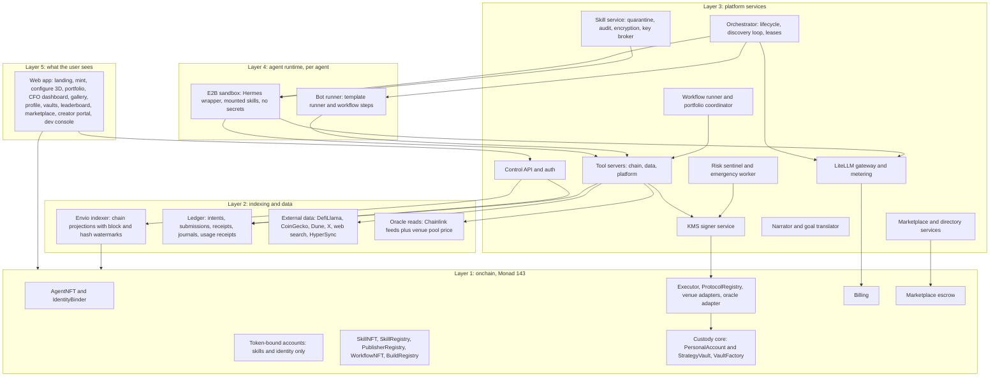

# Final Plan

*What we are building and how it fits together. Revision 1, consolidated from Planv1 and the planning conversation.*

This document is the single description of the launch product. Its companions are `BUILD_PLAN.md` (what to build, in what order) and `DECISIONS_AND_OPEN_QUESTIONS.md` (the record of every decision, conflict, open question and risk). The working notes that summarize each research run live in `notes/`.

How to read source tags. Every decision in this plan traces to one of: the decision register (`Register`), an answer given during planning (`Answer n`, numbered as in the question list), a Planv1 document (named), or a research note in `notes/` (named). Anything the plan had to assume is marked `Assumption` and listed in `DECISIONS_AND_OPEN_QUESTIONS.md` section 3. Nothing in this plan is a time estimate; order is by dependency only.

Facts verified by the research runs through read-only RPC calls were verified on 2026-09-25 at Monad block about 108,050,000. They must be re-verified before any deployment.

---

## 1. The idea

### 1.1 What the platform is

An onchain financial management platform on Monad where AI agents are NFTs. An owner mints an agent, funds it with credits, sets a structured goal, and the agent acts as an onchain CFO for the owner's own money: it researches, keeps a portfolio inside hard limits enforced by smart contracts, and reports on what it did and why. Owners customize agents by equipping skill NFTs, which appear as robotic components on a 3D creature, so configuring an agent feels like building a game character. Other users can watch agents, follow their trades, buy their real-time signals, and deposit into public vaults run by agents that perform. Agents can discover each other and pay each other for signals. (`Register`, `project-overview.md > What we are building`.)

At launch the product runs live on Monad mainnet with real money, and that live product is also the submission for Monad Metropolis (Onchain Finance and Trading track) and Colosseum (`Answer 3`). A Solana version of the same depth follows on a separate branch after the Monad chain layer is done, sharing the chain-agnostic core (`Register`).

### 1.2 Who it is for

The first customer is deferred as a formal decision (`Register`). The working hypothesis from the critique stands: an experienced onchain user who wants a bounded allocation managed with transparent controls, who values ownership and configurability, and who will accept a small, well-explained decision space in exchange for hard guarantees (`revised-project-overview.md > What the product is`). Skill creators and protocols are the second audience: they publish skills through an invite-only creator portal at launch (`Answer 15`).

### 1.3 Why it should exist

Good onchain strategies are opaque and hard to operate; people who know how to build them have no way to earn from that knowledge without giving it away. The platform packages strategy knowledge as skills that only run inside an owning agent's sandbox, keeps every configuration and result public, and connects the two with hashes and signed statements so that nobody has to take claims on trust (`project-overview.md > Why this should exist`). The onchain half is small and holds ownership, money and proofs; the offchain half holds private logic and does the thinking.

### 1.4 Assessment

Agreed during planning (`Answer` to the assessment): launch is sold on control, ownership and the build experience, not on returns. The reasons, and what follows from them:

- **The idea is coherent and distinctive as a product wrapper.** Owned, configurable, transferable agents with visible builds, a demand-signal loop, and Hyperliquid-style vaults. The custody model (three separate capital accounts, an Executor with typed intents, a vault whose in-kind exit needs nobody's permission) is stricter than any of the five codebases the research examined (`notes/managed-vaults.md > 1`, `notes/morpho-vault.md > 1`).
- **No trading edge is established, and launch scope makes that visible.** With USDC and wrapped MON as the only assets and a 40% cap on any non-USDC asset, every agent's strategy reduces to one number, the WMON weight, and its timing. Returns across agents will barely differ and will track MON. The leaderboard therefore leans on demand signals and risk-adjusted numbers with "not enough data" states, and the product copy says plainly what the agent can and cannot decide (`Answer` to the assessment; `risk-review.md > Economics and trading validity`).
- **Thin liquidity plus tight limits will make agents look broken unless the product explains itself.** Three research runs rate frequent rejections from the 0.5% slippage and 2% oracle-to-pool deviation rules as the most likely failure (`notes/monad-agent-kit.md > 3.13`, `notes/zodiac-roles.md > 6`, `notes/managed-vaults.md > 6`). "Why the agent did not trade" is a first-class display on the agent profile, the portfolio page and the activity feed (`Answer` to the assessment).
- **Nothing has been run yet.** Every research finding comes from reading code; no spike has executed. The escrow design, the vault exits, the Hermes wrapper and E2B egress injection all rest on spikes listed in `BUILD_PLAN.md` section 5. All of them are unverified until they pass (`Answer` to the assessment).
- **Zero fees at launch means public vaults run on reputation.** The fee mechanism is built with the rate at zero and activates later behind a timelock (`Answer 5`).
- **Privacy is narrower than the pitch.** Skill privacy means private from owners and other users. The platform and the model vendor see skill text; the agent itself can read and quote its skills. The plan requires zero-retention vendor terms and gateway logging off (`Answer 24`, `Answer 62`, `notes/hermes.md > 6`).

### 1.5 Launch scope on one page

| Area | In at launch | Out at launch (see BUILD_PLAN section 6 for triggers) |
|---|---|---|
| Chain | Monad mainnet, chain ID 143; testnet 10143 and mainnet forks for testing only | Solana (separate track, same depth, after the Monad chain layer) |
| Capital accounts | PersonalAccount (owner's own money) and public StrategyVault; operating wallet for gas, credits and x402 | Nothing else holds capital |
| Assets | USDC and wrapped MON | WETH and a liquid staking token once liquidity and feeds allow |
| Venue | One of Uniswap v3, Uniswap v4 or Kuru, chosen by the depth spike | Second venue |
| Strategies | Band allocation (target WMON weight with rebalance bands inside the limits) and DCA (scheduled USDC to WMON buys) | Lending, borrowing, leverage, LP positions, perps, CFO debt features |
| Agent runtime | Hermes Agent pinned at commit `085d9ee`, wrapped and unmodified, in E2B; our orchestrator owns scheduling and the discovery loop | Hermes self-improvement, arbitrary code generation, bot evolution |
| Skills | Nine platform-authored skills as NFTs; invite-only creator uploads; audit pipeline | Permissionless uploads, synergies and set bonuses, lending and LP skills |
| Workflows | Runner plus built-ins: Rebalancer, Recurring Buys, Risk Sentinel; WorkflowNFT contract with built-ins registered | Third-party workflow listings, workflow builder |
| Social | Watchers (free, view-only), delayed signal feed (free), real-time signals (paid via x402), leaderboard, agent directory, structured agent messages, buyer agent | Auto-copy trades, seasons and leagues |
| Marketplace | Primary skill sales, skill resale, agent sales, all through our escrow | OpenSea and Blur sales, custom account implementation |
| Fees | Mechanism built, rate zero, per-depositor entry prices recorded from day one | Fee activation, creator royalty share of fees |
| Goal input | Structured form only: template, risk preset, allowed assets, optional stricter limits, model choice, credit settings | Free text, chat, multi-goal buckets, target return, daily loss limit |

---

## 2. Definition of done

The launch product is done when all three lists below are true on Monad mainnet with the platform-wide deposit cap in place.

### 2.1 What a user can do end to end

1. Connect a wallet through Privy (MetaMask and OKX supported) and see the landing page with live counters (`PHASES.md > Phase 1`, `design-brief.md > 1`).
2. Mint an agent in one of three tiers, paying in USDC, and receive an NFT whose token-bound account is created and initialized in the same transaction (`Answer 18`, `notes/tokenbound.md > 3.2`).
3. Fund the agent's credits (USDC into the Billing contract) and its operating wallet (MON for gas), see the balance, see per-call spend, and see the agent pause cleanly at zero (`PHASES.md > Phase 1`).
4. Set a goal with the structured form: template, risk preset, allowed assets, optional stricter limits, model choice, credit settings (`Answer 9`).
5. Deposit USDC into the PersonalAccount and withdraw it directly from the contract at any time, with the platform down (`Register`, `PHASES.md > Phase 2`).
6. Arm the agent by approving its first proposed trade; after that, trades inside the hard limits run automatically and the owner sees a view-only feed (`Answer 8`, `PHASES.md > Phase 2` reconciled).
7. Watch the agent research in five stages, see Thesis Board cards change status, and see "why the agent did not trade" explanations when a rule blocks it (`Answer 54`, `Answer` to the assessment).
8. Receive parameter-change proposals for the active template, with approval per the workflow's mode, and see the accepted version recorded (`Answer 14`).
9. Run the built-in workflows (Rebalancer, Recurring Buys, Risk Sentinel), respond to approvals and notifications, and read daily, weekly and monthly reports on the CFO dashboard (`PHASES.md > Phase 4`).
10. Equip and unequip skill NFTs on the 3D configure page, see capability deltas, activate a build, and see the new capability used in the next research cycle (`Answer 12`, `PHASES.md > Phase 6`).
11. Open a public StrategyVault with a 5% leader stake, and as a depositor: deposit USDC, see NAV and its freshness, wait out the lockup, withdraw in USDC or in kind, and exit even if the platform, Executor, oracle and venue are all down (`Register`, `Answer 6`).
12. Follow agents, view build cards and the leaderboard, buy real-time signals with x402 from an agent's operating wallet, and read the buyer agent's value report (`PHASES.md > Phase 5`).
13. Buy and sell skills, and sell an agent through the marketplace escrow so that the old owner loses all platform authority in the same transaction and the vault enters handover (`Answer 28`, `Answer 50`).
14. As an invited creator, upload a skill package, watch it pass the audit pipeline, list it, and see earnings (`Answer 15`).

### 2.2 Submission deliverables

For Monad Metropolis and Colosseum (`Answer 3`):

- a public GitHub repository accessible to `metropolis@hackathon.monad.xyz`;
- a technical demo video of the live product;
- a pitch video;
- a live product link with access instructions;
- a project logo.

Rules for the submission material (`preview.html > Revised build manual > 14`): mainnet, testnet, fork and simulated activity are visibly distinct; demo-generated activity, including the buyer agent's purchases, is labeled simulated and excluded from external demand totals; no figure is extrapolated into a 30-day return; an evidence bundle lists contract addresses, transaction links, pinned build hashes, test receipts, environment labels and known limitations. The October 13, 2026 deadline is a constraint on what "done" means; it is not a schedule and this plan contains no time estimates (`Answer 3`).

### 2.3 Gates

- **Before real money:** every spike marked "gates mainnet" in `BUILD_PLAN.md` section 5 has passed; the deployment state-assertion script passes; external reviews of the custody core, Executor and escrow are complete with no unresolved critical finding (`Register`, `notes/managed-vaults.md > 4`).
- **Before public deposits:** the founders' legal review of pooled discretionary management is complete (`Answer 61`); the platform-wide deposit cap is set; `depositsOpen` is an explicit deployment parameter with a recorded launch decision (`preview.html > Revised build manual > 9`).
- **Before the Solana launch:** its own conformance suite passes; an EVM result never satisfies a Solana gate (`preview.html > Revised technical plan > 12`).

---

## 3. System layers, bottom up

Five layers and four trust zones. Arrows in the diagram are the only places data crosses a boundary.



| Layer | What lives there | Who may write | Source |
|---|---|---|---|
| 1 Onchain | Ownership, capital, limits, versions, credits, escrow. Every important change emits an event; the event list is a public API | Owners (mint, equip, deposit, withdraw, approve), session keys through the Executor only, platform admin through timelocks, emergency role to reduce risk only | `build-manual.md > 2.3`, `Register` |
| 2 Indexing and data | Chain projections with block height and hash, the durable action and accounting ledger, external data reads, oracle reads | Indexer owns its tables; services never mutate them; the ledger is written by the outbox in the same database transaction as the work | `preview.html > Revised technical plan > 11` |
| 3 Platform services | Auth, config, approvals, orchestration, tool servers, gateway, signer, risk, workflows, skills, narrator, marketplace | Service identities with narrow permissions; the signer signs only Executor calls | `preview.html > Revised technical plan > 4` |
| 4 Agent runtime | One Hermes wrapper per agent per cycle in E2B, no secrets inside; a deterministic bot runner per agent for templates and workflow steps | The sandbox can only call tool servers and the gateway; the bot runner produces intents, never signatures | `Register`, `notes/hermes.md > 3.2` |
| 5 Frontend | Next.js app with React Three Fiber for 3D; wallet actions go straight to the chain; everything else through the API | Users with their own wallets | `build-manual.md > 10` |

Trust zones (`build-manual.md > 1.3`, `preview.html > Revised technical plan > 2`):

- **Public zone:** owners, visitors, chain data. Owners send structured goals in and see actions and outcomes out. Nothing from the sandbox zone reaches them directly.
- **Platform zone:** API, indexer, orchestrator, tool servers, gateway, narrator. This zone is trusted for confidentiality and availability; it cannot move capital except through the Executor within limits.
- **Sandbox zone:** decrypted skills and the Hermes process. It holds no secrets and can reach only the gateway and tool servers. Its outputs are tool calls; its text is a log line.
- **Key zone:** the KMS signer and the skill key broker. Keys never leave it; the signer signs only Executor calls with the chain ID pinned; the broker releases skill keys only to an attested sandbox lease for an owning agent.

Two facts about this layout that the research established and that shape every component: the sandbox is not a confidentiality boundary against the platform or the model vendor (`notes/hermes.md > 2.8`), and the Executor plus the custody core, not the signer, are the financial boundary (`notes/zodiac-roles.md > 3`).

---

## 4. Components

Every component below uses the same template: purpose, what it does, depends on, depended on by, interfaces, data it owns, decisions and constraints. Interface sketches are illustrative shapes, not final ABIs.

Address book used throughout (verified by read-only RPC on 2026-09-25; re-verify before deployment; `notes/tokenbound.md > 2.6`, `notes/morpho-vault.md > 2.5`, `notes/zodiac-roles.md > 2`):

| Item | Address on Monad 143 | Note |
|---|---|---|
| USDC | `0x754704Bc059F8C67012fEd69BC8A327a5aafb603` | FiatToken v2.2 surface; that it is Circle's official USDC is inferred, not confirmed |
| WMON | `0x3bd359C1119dA7Da1D913D1C4D2B7c461115433A` | Returned by SwapRouter02 `WETH9()` |
| Chainlink MON/USD | `0xBcD78f76005B7515837af6b50c7C52BCf73822fb` | 8 decimals; heartbeat and deviation unknown |
| Chainlink USDC/USD | `0xf5F15f188AbCb0d165D1Edb7f37F7d6fA2fCebec` | Used for the depeg guard only |
| ERC-6551 registry | `0x000000006551c19487814612e58FE06813775758` | Canonical |
| Tokenbound AccountProxy | `0x55266d75D1a14E4572138116aF39863Ed6596E7F` | The implementation argument for `createAccount` |
| Tokenbound AccountV3Upgradable | `0x41C8f39463A868d3A88af00cd0fe7102F30E44eC` | Expected implementation in every agent TBA |
| Tokenbound AccountGuardian | `0x2FE5ccb0d7Ea195FEb87987d3573F9fcCE2b5D57` | Owned by the Tokenbound Safe `0x781b6A527482828bB04F33563797d4b696ddF328`, nonce 0 |
| Uniswap v3 SwapRouter02 | `0xfe31f71c1b106eac32f1a19239c9a9a72ddfb900` | Candidate venue |
| Uniswap v3 factory | `0x204faca1764b154221e35c0d20abb3c525710498` | USDC/WMON 0.3% pool `0x659bd0bc4167ba25c62e05656f78043e7ed4a9da` held about 608,500 USDC |
| Uniswap v4 PoolManager | `0x188d586ddcf52439676ca21a244753fa19f9ea8e` | Candidate venue; pools unmeasured; StateView `0x77395f3b2e73ae90843717371294fa97cc419d64` |
| Permit2 | `0x000000000022D473030F116dDEE9F6B43aC78BA3` | Never approved by any account we control |

Kuru has no address or measurement in any research run; the depth spike must supply them (`Answer 45`).

### 4.1 Onchain contracts

#### 4.1.1 AgentNFT

**Purpose.** The product ownership token. Whoever holds it owns the agent, its skills, its build history and its platform authority.

**What it does.** Mints an ERC-721 with a tier per token (base, medium, pro). On mint it calls the canonical registry to create the token-bound account and initializes the proxy in the same transaction, so no uninitialized window exists. On every transfer, including into and out of the escrow, it increments `ownerEpoch[agentId]` and records `epochStartedAt`. It refuses transfers to any agent token-bound account (no agent may own an agent) and refuses to burn while the token-bound account holds anything. At launch it allows transfers only by the marketplace escrow; all other transfers revert. Mint price is paid in USDC.

**Depends on.** ERC-6551 registry and Tokenbound AccountProxy; the escrow address (set once, behind the admin timelock).

**Depended on by.** Everything that resolves ownership or authority: token-bound accounts (`ownerOf` is their whole control model), BuildRegistry, Executor (epoch checks), custody core, escrow, IdentityBinder, indexer, orchestrator.

**Interfaces.** `mint(tier) payable-in-USDC returns agentId`; `ownerOf(agentId)`; `ownerEpoch(agentId) -> uint64`; `epochStartedAt(agentId) -> uint64`; `tier(agentId) -> uint8`; `tbaOf(agentId) -> address`; `slotsOf(agentId) -> uint8` (3, 5, 8). Events: `AgentMinted(agentId, owner, tier, tba)`, `OwnerEpochBumped(agentId, epoch, from, to)`. Admin: `setEscrow(address)` through the timelock.

**Data it owns.** Token ownership, tier, ownership epoch and its start time, the escrow allowlist.

**Decisions and constraints.** Epoch bump on every `_update`, not on "owner differs", so a token returning to a previous owner never revives old authority (`Register`, `notes/tokenbound.md > 3.6`). Escrow-only transfers enforced onchain, not by UI warning (`Answer 50`). Slots 3, 5, 8 (`Answer 19`). A distinct 3D body per tier is visual only (`Answer 19`). `ownerOf` must never be changeable by surprise because the token-bound account reads it live on every authorization (`notes/tokenbound.md > 3.2`). Atomic create plus initialize closes the uninitialized-proxy window in which ERC-1155 transfers revert (`notes/tokenbound.md > 2.6`).

#### 4.1.2 Token-bound accounts (ERC-6551, canonical Tokenbound v3)

**Purpose.** The agent's skill inventory and identity anchor. It holds equipped SkillNFTs and WorkflowNFTs and is the stable address bound to the agent's identity. It never holds capital.

**What it does.** Accepts ERC-1155 skill and workflow tokens; the owner moves tokens in (equip) and out (unequip, via `execute`). It signs nothing on the platform's behalf. Its address is deterministic from the registry, the AccountProxy implementation, salt 0, chain 143, the AgentNFT address and the token ID.

**Depends on.** AgentNFT (`ownerOf`), the canonical registry, AccountProxy and AccountV3Upgradable, the AccountGuardian's trust lists.

**Depended on by.** BuildRegistry (checks holdings at activation), SkillNFT and WorkflowNFT (recognize agent accounts to restrict operator transfers), escrow (reads `isLocked`, `extsload` of the implementation slot, `state`), IdentityBinder.

**Interfaces.** Canonical v3: `execute`, `executeBatch`, `isValidSigner`, `isValidSignature`, `state`, `isLocked`, `extsload`. The platform uses only reads plus the owner-initiated equip and unequip calls.

**Data it owns.** Token balances of equipped items. Nothing else of ours.

**Decisions and constraints.** Skills and identity only, never capital, never platform permissions (`Register`). Tightened: the platform never calls `setPermissions` or `setOverrides` on any token-bound account for any address, including the Executor, because a permissioned contract can `upgradeTo` and sign (`Answer 48`, `notes/tokenbound.md > 4` item 1). The owner's own grants revive if the token returns to them; that residual risk is accepted because the account holds only skills, and the epoch model in our contracts is what guarantees "old permissions never return" for platform authority (`notes/tokenbound.md > 4` item 2). The account is never shown as a deposit address for any chain; the same address on other chains is a foreign account controlled by Tokenbound's trusted executors (`notes/tokenbound.md > 4` item 17). Never `lock()` from the UI; a lock binds the buyer for up to 365 days and blocks revocation (`notes/tokenbound.md > 6`). Any identity message an owner signs for the account must include the account address and chain ID, because raw-hash ERC-1271 replays across every account of the same owner (`notes/tokenbound.md > 4` item 20). A later custom implementation changes every agent's address; that migration is accepted (`Answer 49`). Guardian trust events must be indexed because the public RPC caps `eth_getLogs` at 100 blocks (`notes/tokenbound.md > 6`).

#### 4.1.3 SkillNFT, SkillRegistry and PublisherRegistry

**Purpose.** SkillNFT is the ownership token for a skill (ERC-1155, one token ID per skill, capped supply for strategy skills). SkillRegistry is the immutable record of every skill version. PublisherRegistry maps publisher addresses to signing keys and a verified flag.

**What it does.** SkillRegistry stores per skill: publisher, type (protocol, strategy, research), privacy, slot cost, required tier, max supply, price and currency (USDC), royalty settings for later, and per version: semver, `content_hash`, `manifest_hash`, audit attestation hash, status (listed, deprecated, revoked). A hash is never overwritten. SkillNFT mints primary sales through the marketplace and refuses `safeTransferFrom` out of an agent token-bound account unless `msg.sender == from`, and refuses `setApprovalForAll` when the holder is an agent token-bound account. PublisherRegistry checks the publisher signature on every version and records verified publishers; verification is done offchain (domain, ENS, known deployer) and the result is written onchain.

**Depends on.** AgentNFT and the ERC-6551 registry (to recognize agent accounts), marketplace escrow (primary and secondary sales), the skill service (writes audit attestations).

**Depended on by.** BuildRegistry (reads slot cost, required tier, version status), the loader (mounts only listed, non-revoked versions), marketplace pages, indexer.

**Interfaces.** `publishVersion(skillId, version, contentHash, manifestHash, signature)`; `setStatus(skillId, version, status)` (platform review role; `revoked` is instant, `listed` follows audit); `skillMeta(skillId) -> {type, privacy, slotCost, requiredTier, maxSupply, price}`; `versionOf(skillId, contentHash) -> {version, status, auditHash}`; SkillNFT ERC-1155 with the transfer restrictions above; PublisherRegistry `registerKey(keyId)`, `isVerified(address)`. Events: `SkillPublished`, `VersionStatusChanged`, `PublisherVerified`.

**Data it owns.** Skill classes, version records, publisher keys, supply counters.

**Decisions and constraints.** Versions are content-addressed and immutable; the platform rejects any upload that reuses a version with a different hash (`Register`, `notes/bankr-skills.md`, `Planv1/research/bankr-skills/02-platform-mapping.md > 2.1`). Transfer restrictions on agent accounts close the approval-drain path without a custom account (`notes/tokenbound.md > 4` item 11). Skills resell only through the escrow (`Answer 17`). Price in USDC (`Answer 18`). Onchain copies of `slot_cost`, `required_tier`, `type` and `privacy` exist so BuildRegistry never trusts offchain data (`02-platform-mapping.md > 2.5`). Rarity is a registry label derived from supply, not stored onchain (same source). Protocol skills require a verified publisher (`02-platform-mapping.md > 2.1`).

#### 4.1.4 WorkflowNFT

**Purpose.** Ownership token for a workflow spec, so workflows are a third marketplace item alongside agents and skills.

**What it does.** Same pattern as SkillNFT (ERC-1155, own contract, own registry entries in SkillRegistry's sibling table) and the same transfer restrictions when held in an agent token-bound account. A workflow record lists the skills it requires. At launch the only listed workflows are the platform's built-ins (Rebalancer, Recurring Buys, Risk Sentinel), minted free to every agent that installs them.

**Depends on.** SkillRegistry (required skills), AgentNFT, ERC-6551 registry.

**Depended on by.** Workflow runner (loads only installed, listed versions), BuildRegistry (records installed workflows in the build), marketplace.

**Interfaces.** `publishWorkflow(workflowId, version, contentHash, requiredSkills[])`; ERC-1155 surface; status setters as for skills.

**Data it owns.** Workflow classes and versions.

**Decisions and constraints.** Held in the token-bound account like skills with the same restrictions (`Answer 51`). Third-party listings deferred; contract and built-ins ship at launch (`Answer 16`). Scheduling belongs to workflows, never to skills (`Register`).

#### 4.1.5 BuildRegistry

**Purpose.** The onchain record of what an agent is actually running: the active build. Inventory (what the account holds) and equipment (what is active) are separate.

**What it does.** Stores per agent the active build: the exact skill IDs and content hashes, installed workflows, the strategy template and its accepted parameter-set hash, the tier playbook version, a policy hash, and `configEpoch`. `setBuild` is owner-only and checks: slots by tier against the sum of slot costs (never by counting balances, because anyone can push tokens into an account), each listed version is `listed`, the account holds each token, `required_tier` is met. Every accepted change bumps `configEpoch`. It keeps an epoch log so build history survives transfers.

**Depends on.** AgentNFT (owner, tier, `ownerEpoch`), SkillRegistry and WorkflowNFT (status, slot cost, tier), token-bound account (holdings).

**Depended on by.** Executor (rejects intents whose `configEpoch` is stale), loader (mounts exactly the active build), platform tools (`whoami` reports the epoch), indexer, build cards.

**Interfaces.** `setBuild(agentId, skills[] {id, contentHash}, workflows[], templateId, paramsHash, playbookVersion)` (owner only); `buildHash(agentId) -> bytes32`; `configEpoch(agentId) -> uint64`; `activeBuild(agentId)`; `recordParams(agentId, paramsHash)` (owner or approved workflow step; bumps `configEpoch`). Events: `BuildActivated(agentId, configEpoch, buildHash)`, `ParamsRecorded`.

**Data it owns.** Active builds, config epochs, build history.

**Decisions and constraints.** Raw token transfers never activate a build (`preview.html > Revised technical plan > 3`). Slot cost and content-hash versions replace the research's `uint32` versions and count-based slots (`notes/tokenbound.md > 4` item 10). Removing a skill invalidates the dependent running build; pending intents are fenced by the config epoch while existing positions keep exit-only support (`preview.html > Revised build manual > 7`). Parameter changes proposed by the agent are recorded here once approved, which is how "agents evolve by tuning parameters of approved templates" becomes visible history (`Register`, `Answer 14`).

#### 4.1.6 Custody core: PersonalAccount and StrategyVault

**Purpose.** The only contracts that hold user capital. One small, non-upgradeable custody core in two modes: single-owner mode (PersonalAccount) and public-vault mode (StrategyVault). The agent trades from both through the Executor and can never withdraw from either.

**What it does.** Holds USDC and allowlisted assets (USDC and WMON at launch). Exposes exactly one trading entry point, callable only by the registered Executor, that lets the Executor pull an exact `amountIn` for one intent and then re-checks invariants after the swap. Owner or depositor exits never depend on the Executor, the oracle, the venue, the platform, or any role. The full StrategyVault design is in section 4.7; the shared rules are:

- No generic `manage` or `execute`; no external mint or burn; only the contract's own deposit function mints and only its own exit functions burn (`notes/managed-vaults.md > 3`).
- Post-trade invariants after every Executor call: internal units unchanged, only `tokenIn` down and only `tokenOut` up, no allowance left to any spender, and the vault-side backstops hold (`Answer 36`).
- Held-asset list separate from the buy allowlist: dropping an asset from buys never removes it from valuation of existing balances or from in-kind payouts (`Answer 35`).
- No `receive()`; native MON is rejected; only ERC-20 balances of allowlisted tokens count (`notes/managed-vaults.md > 3`).
- Reentrancy guard on every state-changing entry point, storage-slot based unless transient storage is confirmed on Monad (`notes/zodiac-roles.md > 4`).
- Every valuation happens once per transaction and fails closed on any oracle or balance read failure; `redeemInKind` and owner withdrawal never read an oracle (`Register`, `notes/managed-vaults.md > 4`).

PersonalAccount specifics: one clone per `(agentId, owner)`, created when the owner first deposits; `owner()` fixed at creation; `deposit(token, amount)` and `withdraw(token, amount, to)` owner-only, always on, no pause and no lockup; trading requires `AgentNFT.ownerOf(agentId) == owner` and matching epochs, so trading stops by itself when the NFT changes hands while the old owner keeps `withdraw` (`Answer 37`, `notes/tokenbound.md > 4` item 23). Internal non-transferable units track a flow-adjusted per-unit value so that the circuit breaker's 7-day peak is not tripped by the owner's own deposits and withdrawals (`Answer 38`). No share token exists in this mode.

**Depends on.** Executor (the only caller of the trading path), oracle adapter (valuation for deposits and USDC exits in vault mode, and for the breaker peak), AgentNFT (owner and epoch), ProtocolRegistry (allowlisted pools for the vault's proportional sell path), VaultFactory (deployment and caps).

**Depended on by.** Executor, chain tools (`get_portfolio`, `get_limits`), risk sentinel (mode reads), indexer, portfolio and vault UI, escrow (vault handover trigger through the epoch).

**Interfaces (shared).** `executeSwap(SwapParams)` callable by the Executor only, where `SwapParams` carries `tokenIn`, `tokenOut`, `amountIn`, `minAmountOut`, `poolId`, `deadline`, `ownershipEpoch`, `configEpoch`; `pullForSwap(token, amount)` callable by the Executor only inside an `executeSwap` context; `navUsdc() -> (nav, fresh)`; `navBreakdown()`; `mode() -> {NONE, REDUCE_ONLY, PAUSED, HANDOVER, WIND_DOWN}`; `peakNav7d()`; `drawdownBps()`; `poke()` (permissionless NAV and peak refresh). Events carry tokens, amounts, oracle prices and NAV before and after on every swap, and old and new values on every configuration change (`notes/managed-vaults.md > 3`).

**Data it owns.** Token balances, internal units (PersonalAccount) or shares (StrategyVault), lock buckets, entry prices, reference price and time, peak tracking, mode, pending timelocked actions.

**Decisions and constraints.** Three capital accounts, never mixed; the token-bound account never holds capital (`Register`). Custody core small and non-upgradeable, with venue-specific call building outside the core (`notes/managed-vaults.md > 3`, `notes/morpho-vault.md > 7` item 13). Timelocks in contract code, longer than the maximum lockup (`Register`). Emergency role can only reduce risk (`Register`). Clean-room rule: no code copied from BoringVault (SEL-1.0), Morpho (GPL-2.0-or-later), Zodiac (LGPL and BUSL) or monad-agent-kit (no license); patterns only, on an MIT base (`Answer 63`).

#### 4.1.7 Executor

**Purpose.** The one path by which an agent moves money. It accepts typed intents from an authorized session key, enforces every hard limit, performs the swap with exact approvals, and re-checks the result. It never custodies funds beyond the duration of one transaction and never accepts calldata, targets, selectors, operations or value.

**What it does.** For each intent: verifies `msg.sender` is the session key in the agent's grant, the grant has not expired, `ownerEpoch` and `configEpoch` equal the current values, the `actionId` is unused, and the deadline is within `[block.timestamp, block.timestamp + 120]`. Reads the account's mode and rejects new-risk trades under `REDUCE_ONLY` and all trades under `PAUSED` except emergency-role reduce-only swaps. Checks the asset allowlist and that the adapter is registered and unpaused. Reads the oracle adapter: freshness and pool deviation must pass. Computes NAV once, checks `value(amountIn) <= 10%` of NAV, the rolling 24-hour turnover cap of 100% of NAV, and the rolling 20-trade ring buffer. Requires `minAmountOut >= oracleImplied * (1 - 0.5%)`. Pulls exactly `amountIn` from the account, approves the venue exactly, calls the adapter, which builds the venue call with recipient set to the account, resets the approval to zero, and measures the account's `tokenOut` delta. Post-checks: delta at least `minAmountOut`, NAV loss at most `value(amountIn) * 0.5%` plus the pool fee, concentration at most 40% in any non-USDC asset and at least 10% USDC unless `tokenOut` is USDC, allowance to the venue is zero, and the account's own post-trade invariants pass. Then updates the ring buffer, the turnover sum and the 7-day peak, marks the `actionId` used, and emits the trade event. Reduce-only trades (output USDC) always pass the 40% and 10% post-checks (`Answer 40`).

**Depends on.** AgentNFT (epochs, owner), BuildRegistry (`configEpoch`), custody core, ProtocolRegistry and adapters, oracle adapter, the admin timelock, the guardian (emergency role).

**Depended on by.** Signer service (the only address that submits Executor calls), chain tools server (reads every limit and mode from Executor views), risk sentinel, indexer, activity feed.

**Interfaces.** `registerSession(agentId, key, validUntil)` (owner only; keyed to the current `ownerEpoch`); `revokeSession(agentId)`; `swap(SwapIntent)` where `SwapIntent` has `schemaVersion`, `chainId`, `agentId`, `account`, `actionId`, `ownerEpoch`, `configEpoch`, `policyHash`, `adapterId`, `tokenIn`, `tokenOut`, `amountIn`, `minAmountOut`, `deadline` and no recipient, target, selector, operation or value field; views `limits(account) -> {maxTradeBps, maxAssetBps, minUsdcBps, maxSlippageBps, tradesLeft24h, nextSlotFreesAt, turnoverLeft, deadlineSeconds}`, `mode(account)`, `sessionOf(agentId)`. Admin: `setPolicy(...)` (loosening waits the risk timelock, tightening instant), `setAdapterStatus` (pause instant), `pauseAll()` for the guardian. Events: `IntentExecuted(actionId, account, tokenIn, tokenOut, amountIn, amountOut, oraclePriceIn, oraclePriceOut, navBefore, navAfter)`, `IntentRejected(actionId, reasonCode)` where the reason codes are the enum used by the chain tools server.

**Data it owns.** Session grants, used `actionId`s, per-account ring buffers, turnover sums, policy sets by hash, adapter status.

**Decisions and constraints.** Own Executor with typed intents; no Zodiac Roles, no Merkle-verified calldata (`Register`). Approval mechanics: the Executor pulls the exact amount, approves the venue exactly, the venue pays the account directly, the approval resets to zero, the account verifies balance deltas (`Answer 41`). Session key submits directly as `msg.sender`; no relayed signatures at launch (`Answer 42`). Ring buffer of the last 20 timestamps, never `timestamp % period`, never reset by config or epoch changes (`notes/managed-vaults.md > 4`, `notes/zodiac-roles.md > 4`). Turnover cap of 100% of NAV per rolling 24 hours (`Answer 39`). Deadline set at signing time and forwarded, never computed onchain (`notes/monad-agent-kit.md > 4`). Rate-limit counters and the peak persist across epoch bumps (`notes/zodiac-roles.md > 7` item 8). Loosening only behind the risk timelock; the guardian can only tighten (`Answer 33`, `Answer 34`). One intent per transaction; no batching (`notes/zodiac-roles.md > 4`). Fee tier or pool pinned per adapter so an attacker cannot seed a thin pool at an absurd price (`notes/zodiac-roles.md > 3`). The Executor must not implement ERC-1271 (`notes/tokenbound.md > 3.8`). Two-step ownership on every admin contract (`notes/zodiac-roles.md > 4`).

#### 4.1.8 ProtocolRegistry and venue adapters

**Purpose.** The deny-by-default allowlist of where the Executor may trade, and the small contracts that translate a typed intent into one venue call.

**What it does.** ProtocolRegistry records each adapter with its venue address, the pinned pool or fee tier, the venue's code hash (fail closed on mismatch), a status (active, paused, exit-only), and the direction table used for reduce-only mode. Adding an adapter or loosening its status waits the risk timelock; pausing or setting exit-only is instant for the guardian. An adapter exposes exactly one action, `buildSwap(intent) -> call`, that sets the recipient to the account and forbids native value. The Executor validates the built call against the intent before sending. At launch exactly one adapter is registered, for the venue chosen by the depth spike.

**Depends on.** The venue contracts, the admin timelock, the guardian.

**Depended on by.** Executor, the StrategyVault proportional sell path, chain tools (`get_quote.venue`), skills (the swap skill names the venue's quote tool).

**Interfaces.** `register(adapterId, venue, poolKey, codeHash)` (timelocked); `setStatus(adapterId, status)`; `isAllowed(adapterId, tokenIn, tokenOut, mode)`; adapter `buildSwap(SwapParams) -> (target, data)`; `quote(tokenIn, tokenOut, amountIn) -> expectedOut` as a view for the tools server.

**Data it owns.** Adapter records and statuses.

**Decisions and constraints.** Typed intents; the adapter set is the allowlist (`notes/tokenbound.md > 4` item 12). Venue chosen by the depth spike among Uniswap v3, Uniswap v4 and Kuru; v3 is the only option the research de-risked (`Answer 45`, `notes/zodiac-roles.md > 7` item 1). Hookless v4 pools only if v4 wins (`notes/morpho-vault.md > 3.3`). Never expose router side doors (`sweepToken`, `unwrapWETH9`, `refundETH`, `pull`, `multicall`) and never use recipient constants `address(1)` or `address(2)` (`notes/zodiac-roles.md > 3`). Code-hash pinning because address-plus-selector keying keeps passing after a proxy upgrade (`notes/zodiac-roles.md > 7` item 15). No Permit2 approvals from any account we control; choose routes that take direct router approvals (`notes/tokenbound.md > 7` item 18).

#### 4.1.9 Oracle adapter

**Purpose.** One wrapper per feed that enforces staleness and decimals once and is reused by the Executor, vault deposits, vault USDC exits and the circuit breaker, plus the pool-price deviation check.

**What it does.** Reads Chainlink push feeds (MON/USD at launch; USDC/USD only for a depeg guard), rejects `answer <= 0`, a stale `updatedAt`, a decimals mismatch, or a reverting feed, and returns a price in USDC terms with USDC treated as 1. Reads the traded pool's spot price and computes the pairwise deviation `abs(pool - oracle) / oracle`, which must be at most 2%. Staleness is per feed and set from the measured heartbeat; the 5-minute rule from the register is the target, and if a heartbeat exceeds it the asset is dropped from the buy allowlist rather than the rule loosened (`Register`, `Answer 44`). Assets without a reliable feed are dropped from the allowlist.

**Depends on.** Chainlink feed contracts on Monad, the venue pool (for the spot read), the admin timelock (feed changes).

**Depended on by.** Executor, custody core (vault valuation, breaker), chain tools (`get_prices`), risk sentinel.

**Interfaces.** `price(asset) -> (priceUsdc, updatedAt, ok)`; `poolDeviationBps(asset)`; `tradable(asset) -> (bool, reasonCode)`; admin `setFeed(asset, feed, decimals, maxStaleness)` (timelocked), `dropAsset(asset)` (instant, removes from buys only).

**Data it owns.** Feed configuration and staleness bounds.

**Decisions and constraints.** Chainlink primary, pending the heartbeat spike (`Answer 44`). USDC treated as 1 with a depeg guard that pauses deposits, so a USDC/USD feed outage cannot block the USDC path (`notes/morpho-vault.md > 7` item 10). Pool price means the spot price of the pool being traded, pairwise against the oracle (`Answer 46`). Slippage is measured against the oracle-implied output plus a post-trade NAV-loss bound (`Answer 46`). A pull oracle would change the Executor interface; not planned (`notes/monad-agent-kit.md > 4`). The oracle module gets its own audit attention as a trusted dependency (`notes/zodiac-roles.md > 3`).

#### 4.1.10 Billing

**Purpose.** The prepaid credit balance per agent, in USDC, that funds every metered call.

**What it does.** Owners deposit USDC for an agent and may withdraw unspent balance at any time. The metering service settles usage in batches with `settle(agentId, amount, periodId, usageHash)` under a per-period ceiling and a strictly increasing sequence, so a repeated settlement cannot charge twice. When a balance reaches zero it emits `BalanceDepleted`, which the orchestrator uses to pause the agent. Credits are metered offchain against this balance; the offchain ledger mirrors the contract and reconciles daily.

**Depends on.** USDC, the metering service identity, the admin timelock (ceiling changes).

**Depended on by.** Orchestrator (pause and resume), LiteLLM budgets (set from the balance), My Agents page, operating wallet flows.

**Interfaces.** `deposit(agentId, amount)`; `withdrawUnspent(agentId, amount, to)` (owner); `settle(agentId, amount, periodId, usageHash)` (metering role, capped per period); `balanceOf(agentId)`; events `CreditsDeposited`, `UsageSettled`, `BalanceDepleted`.

**Data it owns.** Balances, settlement sequence, period ceilings.

**Decisions and constraints.** Credits are separate from the operating wallet, which holds MON for gas and USDC for x402 and is controlled by the KMS signer (`Register`, `notes/tokenbound.md > 3.9`). Settlement carries a usage hash and a period ceiling; disputed usage stays visible rather than becoming an opaque debit (`preview.html > Revised technical plan > 10`). Auto top-up from vault fees is deferred with fees.

#### 4.1.11 Marketplace escrow (AgentEscrow and item escrow)

**Purpose.** The only way agents, skills and workflows change hands at launch. Escrow custody is what neutralizes the seller-drain paths that Tokenbound's own lock and state cannot close.

**What it does.** For agents: `list(agentId, price, expectedSkills, expectedWorkflows)` moves the NFT into the escrow in one transaction, which bumps the ownership epoch so every session, pending intent and PersonalAccount trading action of the seller dies at listing; it then checks and reverts unless `tba.isLocked() == false`, the implementation slot read through `extsload` is on the escrow's implementation allowlist (a single entry, AccountV3Upgradable, at launch), the account holds every expected item, and `BuildRegistry.buildHash(agentId)` matches; it snapshots `tba.state()`. During the listing nobody can execute from the account because the escrow is its root owner and the escrow has no generic call path and no ERC-1271. `cancel` returns the NFT and bumps the epoch again. `buy(agentId)` re-checks everything, takes USDC from the buyer, pays the seller, transfers the NFT (epoch bump), and emits `AgentSold`. For skills and workflows: primary sales from SkillRegistry supply, and secondary listings of items that are out of any agent account, settled in USDC.

**Depends on.** AgentNFT (transfer allowlist and epochs), token-bound account reads, BuildRegistry, SkillNFT and WorkflowNFT, USDC.

**Depended on by.** Marketplace service and pages, StrategyVault handover (triggered by the epoch change, independent of any escrow call), orchestrator (key rotation on `AgentSold`).

**Interfaces.** `list`, `cancel`, `buy` for agents; `listItem`, `buyItem`, `cancelItem` for skills and workflows; views for active listings. Events: `AgentListed`, `AgentSaleCancelled`, `AgentSold`, `ItemListed`, `ItemSold`.

**Data it owns.** Listings, price, expected inventory snapshots, state snapshots.

**Decisions and constraints.** Escrow-only at launch; OpenSea and Blur later, and a custom account is necessary but not sufficient for that, because a seller's plain `execute` before a fill is only detectable by `state()`-pinning marketplaces (`Register`, `notes/tokenbound.md > 4` item 6). The escrow never writes to the token-bound account (`notes/tokenbound.md > 3.5`). The expected implementation is an allowlist the platform governs, not a constant (`notes/tokenbound.md > 7` item 15). PersonalAccount funds never travel with the NFT; the seller keeps `withdraw` by construction (`Answer 37`). The buyer posts a fresh 5% vault stake; the seller's stake becomes an ordinary deposit under the lockup rules (`Answer 29`). Listing pauses the agent for the seller; the UI says so (`notes/tokenbound.md > 4` item 3).

#### 4.1.12 IdentityBinder (ERC-8004 registration)

**Purpose.** Bind the product identity (AgentNFT) to a standards-compliant ERC-8004 identity so any compatible tool can discover the agent, without letting the registry token grant any authority.

**What it does.** Owns the secondary ERC-8004 identity token permanently, maps it to the AgentNFT, and exposes constrained metadata updates: the registration document points at the API-served build card, and its metadata controller checks current product ownership. Registration happens at mint once the binder exists; earlier mints are back-registered. Reputation and validation registries are deferred.

**Depends on.** AgentNFT, the ERC-8004 identity registry on Monad (address and ABI to be confirmed), the API (build card URI).

**Depended on by.** Agent directory, build cards, external ERC-8004-aware tools.

**Interfaces.** `register(agentId)`; `identityOf(agentId) -> registryTokenId`; `setCard(agentId, uri)` (owner-gated through the API).

**Data it owns.** The identity tokens and the mapping.

**Decisions and constraints.** Identity registration at mint through the binder; reputation and validation deferred because Monad's validation registry was "coming soon" at review time (`Answer 22`, `risk-review.md > Dependency verification`). Whether ERC-8004 verifies a wallet through ERC-1271 is unresolved; if signed payloads are involved they must include the account address (`notes/tokenbound.md > 7` item 8). The app's build-card JSON is not by itself a compliant registration file; the registration document is standards-compliant and links the richer card (`risk-review.md`).

#### 4.1.13 VaultFactory and caps

**Purpose.** Deploy one StrategyVault per agent deterministically, bind `agentId` immutably, and hold the platform-wide deposit cap.

**What it does.** `createVault(agentId)` by the agent owner; sets the Executor, oracle adapter and ProtocolRegistry references; records the vault in a registry that the indexer and tools trust. Holds `platformCap` (total USDC-denominated deposits across all vaults) and per-vault caps; tightening is instant, loosening waits the risk timelock. Holds `depositsEnabled` as the explicit public-deposit launch parameter.

**Depends on.** AgentNFT, custody core implementation, admin timelock.

**Depended on by.** StrategyVault deposits (cap checks), UI, launch decision.

**Interfaces.** `createVault(agentId) -> vault`; `vaultOf(agentId)`; `setPlatformCap`, `setVaultCap`, `setDepositsEnabled` (timelocked when loosening).

**Data it owns.** Vault registry, caps, the launch flag.

**Decisions and constraints.** Per-vault cap plus a platform total, tightenable instantly, loosened by timelock (`Answer 47`). Public deposits stay disabled until the external reviews and the legal gate close (`Register`, `Answer 61`). Deployment scripts assert the final onchain state against the intended configuration because Veda's live Monad configuration drifted from its repo (`notes/managed-vaults.md > 3`).

### 4.2 Agents and wallets

#### 4.2.1 Owner wallet and login

**Purpose.** How a person proves ownership and signs the few transactions that are theirs to sign.

**What it does.** Privy provides login and embedded wallets in the web app, with MetaMask and OKX supported (`PHASES.md > Phase 1`). The owner signs: mint, credit deposits, PersonalAccount deposits and withdrawals, skill equip and unequip, build activation, session registration, vault creation and stake, listings and purchases, approvals of workflow steps and parameter changes (the approval is a signature over the immutable intent hash, bounds and expiry, not a UI click alone).

**Depends on.** Privy, the chain, the API (session authentication bound to current ownership and epoch).

**Depended on by.** Every owner-facing flow.

**Decisions and constraints.** Privy stays for login and embedded wallets; it does not hold agent session keys (`Answer 43`). Web authorization is rechecked across transfers; an old owner's API session dies with the epoch (`preview.html > Revised technical plan > 12`). Approval cards bind account, asset addresses, maximum input, minimum output, fees, time window, policy and intent digest, rendered deterministically; the narrator only explains (`preview.html > Revised technical plan > 9`).

#### 4.2.2 Operating wallet and KMS signer service

**Purpose.** The agent's third capital account and the only thing that signs on the platform side.

**What it does.** Each agent gets an operating wallet: an externally owned account whose key lives in a cloud KMS and is used only by the signer service. It holds MON for gas and a small USDC balance for x402 purchases. The signer service signs exactly two kinds of transactions: Executor calls rebuilt from a stored intent, and x402 payment authorizations from the operating wallet within a per-day cap. It pins the chain ID, checks that `to` is the Executor (or the x402 payee for payments), rejects contract creation, enforces a gas cap per tier, and runs one fenced transaction writer per key that manages nonces and replacements. A timed-out submission is `Unknown`, never `failed`, until reconciled against receipts.

**Depends on.** Cloud KMS, the Executor, the ledger (outbox and submission states), RPC providers (two, for availability), the risk sentinel (mode and safety state before signing).

**Depended on by.** Chain tools intent pipeline, workflow runner, x402 payer, orchestrator (gas checks), metering (gas per intent).

**Interfaces.** Internal only: `signExecutorCall(intentId)`; `signPayment(paymentRequest)`; `status(submissionId)`. No agent-callable surface.

**Data it owns.** Nothing durable beyond KMS key references; submission records live in the ledger.

**Decisions and constraints.** KMS-backed platform signer, not Privy server wallets, because Privy's policy scoping on Monad is unverified and the Executor is the real boundary either way (`Answer 43`). Deadlines are set at signing time (`Answer` via `notes/monad-agent-kit.md > 4`). The signer uses service identity derived from the runtime lease, never a caller-supplied agent ID (`preview.html > Revised technical plan > 4`). Persist before remote effects; crash after sending and before writing success must reconcile, not spend twice (`preview.html > Revised build manual > 5`). Never point a mainnet signer at a fork RPC or vice versa; every record carries an environment ID (`preview.html > Revised technical plan > 11`). Priority fee budget varies by tier (`Register`); its values come from the latency spike.

#### 4.2.3 Session grants and epochs

**Purpose.** How an agent's signing key is authorized, scoped and revoked without any keeper.

**What it does.** The owner calls `Executor.registerSession(agentId, key, validUntil)` for the platform's operating wallet address. The grant is keyed to the current `ownerEpoch` and stores `configEpoch`, `validUntil` and an optional `usesLeft`. Every intent carries both epochs and the Executor requires exact equality. AgentNFT bumps `ownerEpoch` on every transfer, so every grant dies in the same transaction as a sale or listing, with no keeper. BuildRegistry bumps `configEpoch` on every build or parameter change, so intents built against an old configuration die. The owner can revoke at any time. After a sale, the buyer registers a new session for the new epoch.

**Depends on.** AgentNFT, BuildRegistry, Executor.

**Depended on by.** Signer service, chain tools (`whoami` reports epochs; `EPOCH_MISMATCH` rejections), orchestrator (rotates keys on sale).

**Decisions and constraints.** Direct submission by the session key; no relayed signatures because signed intents carry no deadline unless designed in (`Answer 42`). Epochs monotonic; a returning NFT never revives a grant (`Register`). Rate-limit counters and the peak are keyed by account and never reset on an epoch bump (`notes/zodiac-roles.md > 7` item 8). Revocation can be front-run within a block on a public mempool; the per-trade and turnover caps bound the damage of one extra trade (`notes/zodiac-roles.md > 4`).

#### 4.2.4 Account creation flow

When an agent is minted: AgentNFT creates and initializes the token-bound account; the orchestrator creates the agent record, a LiteLLM virtual key with a budget equal to current credits, the operating wallet key in KMS, and the per-agent tool token (`notes/hermes.md > 3.2`). The PersonalAccount clone is created on the owner's first deposit. The StrategyVault is created by the owner through VaultFactory when they choose to open a public vault, and it requires the 5% seed before `depositsOpen` can be set (`Answer 6`). Billing balance and operating wallet are funded by the owner from the My Agents page.

### 4.3 Agent runtime

#### 4.3.1 Orchestrator

**Purpose.** The control plane for every agent: lifecycle, scheduling, the discovery loop, sandbox leases, budgets and state export.

**What it does.** Owns the clock. Schedules research cycles per agent, starts one E2B sandbox per cycle, renders the agent's Hermes configuration from base, tier and agent layers, decrypts the active build's skills into a read-only tmpfs mount, starts the Hermes gateway with only the API server enabled, waits for health, and drives each discovery stage as one `POST /v1/runs` call with an `Idempotency-Key` of `<agent>:<cycle>:<stage>`, a new session per stage, a stage prompt, a turn cap and a run budget. Between stages it waits for the stage's `complete_stage` tool call. At the end of a cycle it exports the allowed state (encrypted), wipes the tmpfs and destroys the sandbox. It reacts to `BalanceDepleted` (pause), `AgentSold` (cancel proposals, rotate the tool token, LiteLLM key and API server key, reset goals), and to risk-sentinel modes. It holds a single runtime lease per agent so two sandboxes never act for one agent.

**Depends on.** E2B, LiteLLM, KMS key broker (skill keys), tool servers, ledger, Billing events, AgentNFT events, risk sentinel.

**Depended on by.** Everything that needs an agent to think: discovery loop, parameter proposals, narrator inputs, playtests, the buyer agent.

**Interfaces.** Internal jobs on the queue: `startCycle(agentId)`, `runStage(agentId, cycle, stage)`, `stopAgent(agentId, reason)`, `exportState`, `restoreState`, `rotateSecrets(agentId)`. Reads the platform tools action log for stage completion.

**Data it owns.** Agent records, runtime leases, cycle and stage state, config templates, encrypted state exports.

**Decisions and constraints.** Our orchestrator owns scheduling and the discovery loop; Hermes cron is not used and the `cronjob` toolset is removed (`Register`, `Answer 54`). One sandbox per cycle, sequential Dives (`Answer 54`). Turn limits and timeouts are expressed as rendered Hermes config per stage plus an orchestrator deadline that calls `/v1/runs/{id}/stop`; hard budgets live in LiteLLM (`Register`, `notes/hermes.md > 4`). Budgets uniform across tiers (`Answer 55`). Deployment sequence for any configuration change: persist, commit pending build, quiesce, reconcile, checkpoint, activate the new epoch, grant a new lease, health check; never two versions authorized at once (`preview.html > Revised technical plan > 8`).

#### 4.3.2 Hermes wrapper in E2B

**Purpose.** Run an unmodified, pinned Hermes Agent as the agent's brain with every dangerous default turned off, no secrets inside, and only our tool servers reachable.

**What it does.** The E2B template holds a source checkout of Hermes at commit `085d9ee608893bb0611c2fc339c19d8848af9f2b` with its lockfile and image digest pinned, plus our bootstrap that supervises `hermes gateway run` as a child process. `HERMES_HOME` is rendered fresh per cycle from three layers (base template, tier overlay, per-agent overrides) and validated against a JSON schema. Private skills and tier playbooks mount under `/run/agent-skills/{equipped,playbooks}` on tmpfs, read-only, referenced by `skills.external_dirs`; `.no-bundled-skills` is set. Egress is deny-by-default with only the LiteLLM host and the tool server hosts allowed; E2B injects the per-agent bearer token and the LiteLLM key at egress, so neither exists inside the sandbox.

Configuration facts that must hold (`notes/hermes.md > 2` and `> 3.3`): `agent.max_turns` and `agent.run_budget_seconds` set explicitly (defaults are unlimited); `tool_loop_guardrails.hard_stop_enabled: true`; `tools.tool_search.enabled: off` (otherwise every MCP tool is hidden behind tool search); `agent.disabled_toolsets` removes terminal, code_execution, file, browser, web, search, x_search, delegation, cronjob, connections, computer_use, clarify, image_gen, video, tts, vision, kanban and session_search; `platform_toolsets.api_server` lists only todo, memory, skills and our three servers; `auxiliary.*` pinned to the gateway with `title_generation` and `background_review` disabled; `skills.creation_nudge_interval: 0`, `skills.write_approval: true`, `skills.ledger: false`; `memory.nudge_interval: 0`, `memory.user_profile_enabled: false`; `curator.enabled: false`; `approvals` all deny with `unattended_mode: deny`; `security.allow_lazy_installs: false`, `security.tirith_enabled: false`, `security.redact_secrets: true`; `updates.check: false`, `model_catalog.enabled: false`, `web.keyless_fallback: false`, telemetry off, `hooks.outbound: []`, `cron.allow_agent_scheduling: false`; MCP servers with `sampling` and `elicitation` off, `supports_parallel_tool_calls` only on the data server; a fail-closed `pre_tool_call` hook that blocks `skill_manage`; `sessions/` on tmpfs because request dumps have no off switch; `API_SERVER_KEY` of 32 or more characters; never `hermes -z`.

**Depends on.** E2B (Firecracker sandboxes, egress rules, header injection), LiteLLM, tool servers, the orchestrator's config renderer, the key broker.

**Depended on by.** Discovery loop, parameter proposals, narrator (through the action log), the buyer agent.

**Interfaces.** `POST /v1/runs` with `input`, `session_id`, `instructions` (short, layered on the core prompt), header `Idempotency-Key`; `GET /v1/runs/{id}`, `/events`, `/stop`; `GET /health`. The agent's deliverable is always a tool call; `final_response` is a private log line.

**Data it owns.** Per-cycle `HERMES_HOME`; the encrypted export of `state.db`, `memories/MEMORY.md` and agent-created skills (none at launch); nothing else survives the sandbox.

**Decisions and constraints.** Wrap, do not fork; the fallback is a thin custom loop over LiteLLM and our servers if leakage, churn or self-improvement prove unmanageable (`Register`, `notes/hermes.md > 1`). "Self-improvement off" means: review fork off, nudges zero, curator off, `skill_manage` blocked by the read-only mount plus `write_approval` plus the hook, `USER.md` off, `MEMORY.md` foreground-only and exported encrypted (`Answer 56`, `notes/hermes.md > 4`). All Hermes state is as confidential as skills; error dumps die with the sandbox (`Register`). Our own tool results arrive wrapped as untrusted data, so `SOUL.md` states that platform-server results are authoritative and a spike checks compliance (`notes/hermes.md > 4`). Model choice: the user's model is bound to the agent's virtual key as a LiteLLM alias at sandbox start; Scan and Test stages use a disclosed cheap platform model (`Answer 53`). The Hermes MIT notice is kept in the image (`notes/hermes.md > 2.8`).

#### 4.3.3 Bot runner

**Purpose.** The always-on, deterministic half of the agent. It runs the active strategy template and workflow steps at the cadence the orchestrator sets, with no LLM and no generated code.

**What it does.** A small container per agent that holds the template runner (band allocation and DCA), reads state through the chain and platform tools with the agent's token, produces intents (never signatures), and executes workflow steps handed to it by the workflow runner. It records every decision, including "no trade" with a reason code, to the action log. Its placement and RPC endpoint depend on the tier's execution rails.

**Depends on.** Tool servers, workflow runner, strategy template definitions, orchestrator (start, stop, lease).

**Depended on by.** Workflows, the activity feed ("why the agent did not trade"), reports.

**Interfaces.** Internal: `runTemplateTick(agentId)`, `runStep(workflowRunId, stepId)`; outputs are tool calls to `propose_swap`, `propose_rebalance`, `no_trade(reasonCode)`.

**Data it owns.** None durable; state lives in the ledger.

**Decisions and constraints.** Deterministic template runner plus workflow executor, no LLM, no generated code (`Answer 58`). Faster execution rails per tier: dedicated low-latency RPC, nearby runner placement, larger priority fee budget (`Register`); base tier uses shared infrastructure, pro tier gets all three, the medium tier split is an `Assumption` (dedicated RPC only). Isolation for the bot runner is at least as strict as the sandbox: no keys, explicit network routes, scoped tokens (`risk-review.md > R08`).

#### 4.3.4 LLM gateway (LiteLLM)

**Purpose.** Every model call goes through one proxy so it can be metered, budgeted, routed and logged as metadata only.

**What it does.** One virtual key per agent with a hard budget equal to the agent's credit balance; aliases per user-chosen model and for the platform's cheap Scan and Test model; per-key rate limits; `x-agent-id` and `x-agent-tier` headers captured; returns HTTP 402 on budget exhaustion (configured explicitly, because Hermes classifies 402 as `billing` and does not retry, but a 400 with budget text would be misclassified); prompt and response logging off; no observability plugin that captures prompts.

**Depends on.** Model providers with zero-retention terms; the Billing balance feed from metering.

**Depended on by.** Hermes wrapper (main and every auxiliary task), narrator, audit LLM review (separate key), buyer agent (separate key and model).

**Interfaces.** OpenAI-compatible endpoint; admin API for key budgets; budget alert webhooks to the orchestrator.

**Data it owns.** Keys, budgets, spend counters, model-ID metadata.

**Decisions and constraints.** Hard budgets in LiteLLM (`Register`). Return 402 on exhaustion and subscribe to budget alerts (`notes/hermes.md > 4`). Vendor zero-retention terms and gateway logging off are requirements (`Answer 62`). Model choice is paid through credits and is not tier-based (`Register`).

#### 4.3.5 Metering and credits

**Purpose.** Turn every paid thing an agent does into a receipt against its credits.

**What it does.** Wraps every paid upstream (model calls through LiteLLM, RPC and oracle and quote and simulation providers, external data APIs, E2B minutes, bot runner uptime, x402 purchases, gas per intent) in a metered client that requires a `MeterContext {agentId, tool, requestId}`. Appends an append-only ledger row `{ts, agentId, tool, requestId, provider, method, units, unitCostMicros, cacheHit}`. Charges per tool call from a price table (with the raw upstream ledger kept for cost analysis and `cacheHit` recorded to tune the table). Reserves estimated maximum cost before research, build and data jobs; reconciles actual usage; settles batches to Billing with a period ceiling. Checks the credit balance before paid tools run and returns `RATE_LIMITED` with `retryable: false` when exhausted.

**Depends on.** Billing, LiteLLM spend logs, provider invoices (daily reconciliation), tool servers, E2B and runner host records.

**Depended on by.** Orchestrator (pause), My Agents page (spend breakdown), pricing decisions.

**Interfaces.** `meteredClient(provider)`; `reserve(agentId, estimate)`; `settlePeriod()`; ledger queries.

**Data it owns.** Usage receipts, reservations, tariff versions, price table.

**Decisions and constraints.** All tool and data calls, including chain tool calls, are metered through credits (`Register`). Price table per tool call rather than upstream pass-through, because shared caches make per-agent attribution arbitrary (`notes/monad-agent-kit.md > 3.8`). Receipts carry provider request IDs and idempotency keys; repeated settlement cannot charge twice (`preview.html > Revised technical plan > 10`). Normal operating balance, transaction gas and (later) the emergency reserve are separate meters (`preview.html > Revised technical plan > 10`, `Register`).

#### 4.3.6 Narrator and goal translator

**Purpose.** The only two places where natural language touches the owner: the goal translator turns structured form input into agent configuration, and the narrator turns actions and outcomes into readable entries.

**What it does.** The goal translator is deterministic: it maps the form fields (template, risk preset, allowed assets, stricter limits, model choice, credit settings) to template parameters within bounds, a policy hash and a rendered `SOUL.md` block; no LLM and no free text (`Register`, `Answer 9`). The narrator is a separate model on a separate key that reads only the platform action log (tool name, validated arguments, outcome, reason codes) and the ledger, never `final_response`, reasoning, `state.db` or skill text. It writes activity entries, "why the agent did not trade" explanations from reason codes, approval card explanations (the financial fields are rendered deterministically), and the daily, weekly and monthly reports. A filter strips any literal skill text or canary strings before anything reaches the owner.

**Depends on.** Action log and ledger, LiteLLM, report templates.

**Depended on by.** Activity feed, approval cards, reports, notifications, build cards.

**Interfaces.** `narrate(actionLogEntry) -> text`; `report(agentId, period) -> document`; `explainRejection(reasonCode, details) -> text`.

**Data it owns.** Rendered entries and reports.

**Decisions and constraints.** No chat with the agent; owners never send free text to it (`Register`). The narrator is explanatory only and cannot change an approval's authority (`preview.html > Revised technical plan > 9`). Reason codes, not free text, are what the agent emits for anything the narrator shows (`notes/hermes.md > 3.3`).

#### 4.3.7 Discovery loop and Thesis Board

**Purpose.** The research process, modeled on a careful human analyst: scan wide, dig deep, be skeptical, test small, step back.

**What it does.** Five stages, each a separate Hermes run with a fresh session, a stage prompt, a turn cap and a run budget (`notes/hermes.md > 3.3`):

| Stage | Model | What it produces | Terminal tool call |
|---|---|---|---|
| Scan | Cheap platform model | Candidate list from data tools | `write_thesis(stage=scan, candidates[])` then `complete_stage` |
| Dive | User's model | Evidence and confidence per candidate, one session per candidate, sequential | `update_thesis(stage=dive, evidence[], confidence)` |
| Challenge | User's model with the skeptic playbook, sees only the thesis record | Objections and a verdict | `update_thesis(stage=challenge, objections[], verdict)` |
| Test | Cheap platform model | A request to check a parameter set against template bounds and policy | `propose_strategy_update(templateId, params, rationaleCode)` or `no_change(reasonCode)` |
| Zoom out | User's model | Portfolio review against the goal; parameter proposal or no change | `propose_strategy_update` or `no_change` |

The Thesis Board is a platform-owned table written through the platform tools server: each thesis has a title, status (watching, diving, rejected, testing, live, retired), evidence for and against as short text with source links, confidence, expiry and a recheck trigger. Expired theses must be rechecked or retired. Owners see status, confidence and expiry; evidence text stays private (`technical-report.html > 7`, `build-manual.md > 6.2`). Research skills change what the stages do, not the stage machine.

**Depends on.** Orchestrator, Hermes wrapper, data tools, platform tools, strategy templates.

**Depended on by.** Parameter proposals, the agent profile's research board, the narrator.

**Interfaces.** Platform tools `write_thesis`, `update_thesis`, `list_theses` (one line each), `get_thesis(id)`, `complete_stage(status, summaryCode)`, `get_goals_and_limits`, `propose_strategy_update`, `no_change`.

**Data it owns.** Theses, stage records, trial counts including rejected candidates.

**Decisions and constraints.** Five stages as separate runs with the board on the platform server (`Answer 54`). Every observation stores event time, retrieval time and source; an LLM confidence number never becomes a trading probability without calibration (`preview.html > Revised build manual > 8`). No backtest at launch; the Test stage validates parameters against bounds deterministically (`Answer 13`, `Answer 14`). All evaluated candidates are counted so selection bias is visible (`risk-review.md > R05`).

### 4.4 Tool servers

Three MCP servers built with the MCP TypeScript SDK, viem and zod, running platform-side as shared multi-tenant services over Streamable HTTP (`Register`, `notes/monad-agent-kit.md > 3.1`, `notes/hermes.md > 4`). The sandbox holds only the server URLs; E2B injects the per-agent bearer token at egress.

#### 4.4.1 Shared conventions

- **Identity from the connection, never from a parameter.** Middleware verifies the platform-signed JWT (claims: agent ID, token ID, token-bound account, personal and vault account addresses, tier, config epoch, ownership epoch, sandbox ID, expiry), checks a second factor proving the request came through E2B egress for that sandbox (egress IP allowlist as the floor; mTLS or an HMAC header if E2B supports it), rechecks both epochs against chain and database, and attaches `authInfo`. Handlers read identity only from `authInfo`. Every data access goes through a repository layer keyed by agent ID with row-level security. An MCP session is bound to the agent at creation; `Mcp-Session-Id` is never authentication. A lint rule forbids any tool schema field named `address`, `agentId`, `owner` or `wallet` (`notes/monad-agent-kit.md > 3.2`, `> 3.6`).
- **Tools return intent IDs, never calldata.** No tool accepts or returns `to`, `data`, `calldata`, `serializedTransaction` or a recipient (`Register`).
- **Assets are an enum** (`USDC`, `WMON`) mapped server-side to addresses and decimals; amounts are decimal strings in token units with `amountRaw` alongside; every read carries `asOf {block, timestamp}`; no free-text chain strings (token names, symbols, URIs) are ever returned, only registry values, with control and bidi characters stripped (`notes/monad-agent-kit.md > 3.2`).
- **Structured output plus text.** Every tool declares `outputSchema` and returns `structuredContent` plus the same JSON as text. Errors are `isError: true` with `{code, message, retryable, details?}` using the codes `UNAUTHENTICATED`, `TIER_NOT_ALLOWED`, `RATE_LIMITED`, `INVALID_INPUT`, `ASSET_NOT_ALLOWED`, `ACCOUNT_NOT_AVAILABLE`, `UPSTREAM_UNAVAILABLE`, `STALE_DATA`, `INTENT_NOT_FOUND`, `INTENT_NOT_CANCELLABLE`, `DUPLICATE_REQUEST`, `INTERNAL`. Another agent's intent returns `INTENT_NOT_FOUND`, never "forbidden".
- **Metering** through the shared metered client on every paid upstream; credit check before paid tools; per-agent token-bucket rate limits, tighter on `propose_*`.
- **Tier gating** for premium curated data only: one server instance per authenticated session registers only the tier's tools, so `tools/list` hides them and `tools/call` fails at the protocol level; the tier is re-checked in each gated handler. Chain tools are baseline for every tier (`Register`, `notes/monad-agent-kit.md > 4`).
- **Idempotency.** Every intent-creating tool takes a client request ID and is idempotent; only tools marked `readOnlyHint` are replayed by Hermes after a transport expiry, so write tools must be safe to retry (`notes/hermes.md > 4`).
- **Limits are read, never hard-coded.** Schema bounds and policy thresholds are generated per session from Executor views for the agent's config epoch (`Register`, `notes/monad-agent-kit.md > 4`).
- **Payload size.** Results stay under about 30,000 characters and paginate server-side, because `read_file` is removed and a spilled result would be reduced to a preview (`notes/hermes.md > 4`).

#### 4.4.2 Chain tools server

**Purpose.** Everything the agent needs to see its accounts and propose trades, with the Executor as the final authority.

**What it does.** Read tools and intent tools (`notes/monad-agent-kit.md > 3.3`):

| Tool | Input | Output |
|---|---|---|
| `whoami` | none | agent ID, token ID, token-bound account, personal and vault accounts with enabled flags, tier, tools, config epoch, ownership epoch, chain ID |
| `get_assets` | none | the allowlisted registry only (USDC, WMON) with addresses and decimals |
| `get_portfolio` | `account` | holdings with amount, price, value, allocation percent; total value in USDC; pending intents; `asOf` |
| `get_prices` | `assets?` | oracle price, oracle age, pool price, deviation, `tradable` with reason (`ORACLE_STALE`, `ORACLE_POOL_DEVIATION`) |
| `get_quote` | `account`, `sell`, `buy`, `sellAmount` | expected and minimum output, price impact, venue, fee, `limitCheck {wouldPass, failingRules[]}`, `quoteValidSeconds`; indicative, reserves nothing |
| `get_limits` | `account` | trades used and left in 24 hours, next slot time, max trade value, turnover left, concentration headroom per asset, USDC floor headroom, max slippage, deadline seconds, `mode` (none, reduce_only, paused) with reason and since, config epoch |
| `propose_swap` | `account`, `sell`, `buy`, `sellAmount`, `maxSlippageBps?`, `reason` (stored, shown to owner, never executed), `clientRequestId` | `intentId`, `status` (pending or rejected), rejection code, `expiresAt` |
| `propose_rebalance` | `account`, `targets[] {asset, pct}`, `toleranceBps?`, `reason`, `clientRequestId` | as above plus `legs[]`; legs above the per-trade cap are split into sequential legs, each consuming a trade slot |
| `get_intent_status` | `intentId` | status (pending, approved, rejected, submitted, settled, failed, expired, cancelled), rejection or failure code, legs with bought amounts and display-only transaction hashes, history |
| `cancel_intent` | `intentId` | new status or `INTENT_NOT_CANCELLABLE` |
| `list_intents` | filters | summaries for the calling agent only |
| `get_pool_depth` | `asset` | depth at the reference size (baseline, metered) |
| `simulate_rebalance` | targets | dry run without an intent (baseline, metered) |

Intent pipeline: quick deterministic checks synchronously (asset, size, caps, floor, trades left, mode) with a typed rejection; on pass, persist `pending` and reserve a trade slot; full policy asynchronously (oracle freshness, deviation, quote, `minOut`); simulate the Executor call against the latest block (`eth_call` with state overrides, or an anvil fork if it proves reliable); sign through the KMS signer with the deadline set at signing; submit; the Executor re-checks everything onchain; `settled` only after the receipt and a balance reconciliation, never on a transaction hash. Rejection reason codes: `ASSET_NOT_ALLOWED`, `VENUE_NOT_ALLOWED`, `TRADE_SIZE_EXCEEDED`, `CONCENTRATION_CAP`, `USDC_FLOOR`, `SLIPPAGE_TOO_HIGH`, `DAILY_TRADE_LIMIT`, `TURNOVER_CAP`, `ORACLE_STALE`, `ORACLE_POOL_DEVIATION`, `INSUFFICIENT_BALANCE`, `REDUCE_ONLY_MODE`, `PAUSED`, `EPOCH_MISMATCH`, `SIMULATION_FAILED`, `DEADLINE_EXPIRED`, `EXECUTOR_REVERTED`. The reason codes feed "why the agent did not trade".

**Depends on.** Executor views, oracle adapter, ProtocolRegistry quote view, RPC providers, signer service, ledger, custody core reads.

**Depended on by.** Hermes wrapper, bot runner, workflow runner, narrator.

**Data it owns.** Intents, reservations, submissions (in the ledger).

**Decisions and constraints.** Server and policy engine repeat the Executor's checks only to fail fast with a typed reason; the Executor is the authority (`notes/monad-agent-kit.md > 3.4`). `get_pool_depth` and `simulate_rebalance` are baseline, not premium (`notes/monad-agent-kit.md > 4`). Personal and vault accounts keep separate counters and caps (`notes/monad-agent-kit.md > 7` item 4). Values are denominated in USDC (`Register`).

#### 4.4.3 Data tools server

**Purpose.** Every external read the agent may make, metered, cached and sanitized.

**What it does.** Baseline tools for all tiers: `web_search`, `read_url` (through a broker that strips active content and marks the result untrusted), `x_search`, `dune_query`, `defillama_yields`, `defillama_tvl`, `coingecko_prices`, `hypersync_events` (Envio HyperSync for event history), `wallet_portfolio`, `wallet_positions`, `wallet_pnl`, `holders`, `unlocks`, `volatility`, `ohlcv`. Premium curated data tools for the pro tier. One shared price and quote cache across agents; `cacheHit` recorded; freshness fields on every result; timeouts and backoff on every upstream; `STALE_DATA` and `UPSTREAM_UNAVAILABLE` with `retryable`. The server pays for x402-priced data sources from a platform wallet and meters the agent; the agent never sees a 402 (`Planv1/research/bankr-skills/02-platform-mapping.md > 2.3`).

**Depends on.** Provider accounts (X API pay-per-use, Dune, CoinGecko, DefiLlama, Envio, a web search API), metering, the platform x402 payer.

**Depended on by.** Research skills, discovery stages, Thesis Board evidence.

**Decisions and constraints.** Baseline is web search, X, Dune and chain tools plus the free sources DefiLlama, CoinGecko and HyperSync (`Register`, `Answer 57`). Hermes' own `web`, `search` and `x_search` toolsets are disabled so every data call is metered (`notes/hermes.md > 3.1`). Results are wrapped as untrusted by Hermes; the server also caps length and strips control characters (`notes/monad-agent-kit.md > 2`). Rate-limit headers are honored in code, not prose (`Planv1/research/bankr-skills.md > 7`).

#### 4.4.4 Platform tools server

**Purpose.** The agent's window onto its own configuration, research memory and proposals.

**What it does.** `get_goals_and_limits` (the owner's structured goal, the active template and parameters, plus the live Executor limits and mode, so the agent never proposes a blocked action); `write_thesis`, `update_thesis`, `list_theses`, `get_thesis`; `propose_strategy_update(templateId, params, rationaleCode)` validated against the template's JSON-schema bounds and the owner's stricter limits, stored as a proposal with status `pending_policy` then `pending_owner` or `accepted` per the workflow's approval mode; `no_change(reasonCode)`; `complete_stage(status, summaryCode)`; agent-to-agent tools from Phase 5: `directory_search`, `send_message(type, payload)` with fixed message types, `list_offers`, `buy_signal_access(agentId)` (which triggers the x402 payment from the operating wallet within the cap), `read_signal_feed`.

**Depends on.** Ledger, BuildRegistry (parameter recording after approval), workflow runner (approval modes), marketplace and directory services, x402 payer.

**Depended on by.** Discovery loop, parameter proposals, buyer agent, agent directory.

**Decisions and constraints.** Goals and limits arrive typed and authoritative; `SOUL.md` says so because Hermes wraps them as untrusted (`notes/hermes.md > 4`). Incoming agent messages are untrusted input, the same as a web page, and only fixed message types exist (`PHASES.md > Phase 5`). Any x402 payment happens inside platform services from the operating wallet, never inside the sandbox (`notes/hermes.md > 4`).

### 4.5 Skills

#### 4.5.1 Purpose and shape

A skill is text plus declarations, never code or credentials. It teaches the agent what it knows and what it may propose in response to one request; anything with a trigger, state across runs, or standing authority is a workflow instead (`Planv1/research/bankr-skills/02-platform-mapping.md > 2.4`). Skills reach the world only through platform tools listed in their manifest and typed intents listed in their manifest.

#### 4.5.2 The skill.json spec (v1)

Folder: `<id>/skill.json` (required), `SKILL.md` (required; frontmatter generated by the platform, publisher frontmatter discarded), `references/` (Markdown only, one level deep, at most 40 files of 100 KB), `data/` (JSON, CSV, YAML; at most 20 files of 256 KB; schema-checked; no URLs the model is told to call), `examples/`, `evals/evals.yaml` (required for strategy skills), `CHANGELOG.md` (required from 1.1.0). Forbidden anywhere: `scripts/`, `assets/`, `bin/`, executables, archives, binaries, dotfiles, symlinks, `package.json`, `requirements.txt`, `.env*`, `AGENTS.md`, `CLAUDE.md`, `.claude/`, `.hermes/`, HTML, images. SKILL.md at most 500 lines and 40,000 characters; package at most 2 MB (`02-platform-mapping.md > 2.1`).

| Field | Required | Meaning |
|---|---|---|
| `schema_version` | yes | `1` |
| `id` | yes | Slug, equals the folder name, immutable across versions, globally unique when listed |
| `name` | yes | Display name, max 48 chars |
| `version` | yes | Semver, immutable once published; the platform computes `content_hash` over the canonical package and rejects a reused version with a different hash |
| `type` | yes | `protocol`, `strategy` or `research` |
| `publisher` | yes | `{id, address, key_id}`; the package is signed by `key_id` registered to `address` in PublisherRegistry; protocol skills need a verified publisher |
| `description.model` | yes | What the model sees in the skill index, max 160 chars, first 57 chars must stand alone; written as "Does X. Use when Y." |
| `description.marketplace` | yes | Human listing text, max 600 chars, never shown to the model |
| `triggers`, `not_for` | no | "Use when" and "When not to use" phrases rendered into the body |
| `required_tools` | yes, may be empty | Platform tool IDs with a major version, for example `data.dex_quote@1`; the build fails if the tier lacks any |
| `intents` | yes, may be empty | Typed intents the skill may propose, for example `intent.propose_swap@1`; other intents attributed to this skill are rejected by policy |
| `data_sources` | yes, may be empty | Registered data source IDs, for metering, disclosure and audit egress comparison |
| `required_tier` | no | `base` by default; enforced by BuildRegistry |
| `slot_cost` | yes | 1 to 3: 1 for research and simple protocol skills, 2 for strategy skills, 3 for multi-intent strategy skills; enforced by BuildRegistry against 3, 5, 8 |
| `synergy_tags` | no | Controlled vocabulary, marketplace use only, never permissions |
| `compatible_templates` | strategy: yes | Platform templates the skill tunes plus a params file with defaults and bounds inside the template's own bounds |
| `chains` | yes | CAIP-2, `eip155:143` at launch |
| `assets` | no | CAIP-19 allowlist used as an extra allowlist for this skill's intents |
| `privacy` | yes | `public` or `private`; `private` requires `type: strategy`, triggers encryption at rest, hides text in the marketplace |
| `dependencies`, `disclosures`, `license`, `min_platform` | no | Informational dependencies; required disclosures if value routes anywhere but the owner's agent; SPDX license; minimum platform version |

Computed by the platform: `content_hash`, `manifest_hash`, `signature`, `audit_attestation`, `published_at`.

Hermes compatibility: the build step generates frontmatter with `name` (equals the folder), a double-quoted `description`, `version`, and `metadata.hermes.tags`, `requires_tools` and `related_skills`; it never emits `required_environment_variables`, `required_credential_files`, `metadata.hermes.config`, `metadata.hermes.blueprint`, `deps` or inline shell, because each is an install, secret or scheduling path (`02-platform-mapping.md > 2.1`, `notes/hermes.md > 4`). Names are namespaced with a platform prefix and the content hash stays out of `name` (regex and 64-char limit). Body links use relative paths and no `${HERMES_SKILL_DIR}` tokens. Skill descriptions are the only selection trigger, so the description standard and the selection spike are launch gates (`Answer 60`).

#### 4.5.3 Lifecycle: made, uploaded, audited, encrypted, versioned, listed, equipped, loaded, run

1. **Made.** A publisher (the platform for the nine launch skills; invited creators afterward) writes the package. Strategy skills reference a platform template and supply parameter defaults and bounds; they never contain trading code (`Register`).
2. **Uploaded.** Through the creator portal over TLS into an isolated quarantine. Safe unpacking rejects traversal, symlinks escaping the root, oversized archives and install-time execution (`preview.html > Revised technical plan > 8`).
3. **Audited.** Format rules F1 to F8 (schema, allowed paths, sizes, description length, tool and intent existence per tier, template params in bounds, signature, privacy rule), static rules S1 to S15 (shell and code execution, installs, remote instruction loading, credentials, undeclared endpoints, signing, unlimited approvals and delegation, scheduling and state, approval bypass, concealment, override phrases, hidden content, addresses against the address book, self-modification, impersonation), LLM review prompts L1 to L8 on a model that is not the agent's model with the text in a delimited untrusted block (intent consistency, override, exfiltration, hidden egress, value routing, scope and honesty, workflow leakage, strategy bounds), a dynamic sandbox test with canary secrets, an egress sinkhole and mock tools (fails on canary exposure, undeclared egress, undeclared tool or intent, or failed evals), and human review for strategy skills and first-time publishers. Findings are Block or Warn; a "reviewed package" badge states its scope and never says "safe" (`02-platform-mapping.md > 2.6`, `preview.html > Revised build manual > 7`).
4. **Encrypted.** Reviewed exact bytes are encrypted with envelope encryption (AES-256-GCM data key wrapped by a cloud KMS master key) with authenticated metadata binding tenant, skill ID and version; the key broker releases a data key only for an owning agent's attested runtime lease (`build-manual.md > 3.2`, `preview.html > Revised technical plan > 8`). The audit and the broker are inside the plaintext exposure model and are disclosed.
5. **Versioned.** `publishVersion` writes the hashes and attestation to SkillRegistry; a later update is a new immutable version; revocation sets `revoked` onchain and the loader refuses it at the next run. Continuous checks re-run L1 to L5 on every version and diff new URLs, addresses and intents (`02-platform-mapping.md > 2.6`).
6. **Listed.** Marketplace metadata in three layers: onchain (class, versions, slot cost, tier, type, privacy, supply, price), registry (audit report, rarity, install counts, performance links derived from onchain facts, never self-reported), offchain (3D art and thumbnails referenced from token metadata, kept outside the package so art changes cannot change audited content) (`02-platform-mapping.md > 2.5`).
7. **Equipped.** The owner moves the SkillNFT into the token-bound account and activates a build in BuildRegistry, which checks slots, tier, status and holdings and bumps `configEpoch`. Changes apply at the next cycle, never mid-session (`notes/hermes.md > 3.2`).
8. **Loaded.** The loader reads the active build, verifies each content hash, decrypts private skills into the per-cycle tmpfs mount, materializes exactly one folder per skill named by `id`, generates frontmatter, and lists the directory in `skills.external_dirs`. Two versions never coexist in one run; a tampered hash or revoked version is refused (`Register`, `02-platform-mapping.md > 2.1`).
9. **Run.** Hermes shows one index line per skill; the model calls `skill_view` to load a body; the skill's instructions name platform tools exactly; its output is tool calls. Intents are attributed to the active skill context where Hermes exposes it, and per-intent caps at the Executor apply regardless of skill (`02-platform-mapping.md > 2.8`).

#### 4.5.4 The nine launch skills

From the research's starter set with lending and LP skills removed and scheduling moved to workflows (`Register`, `Answer 2`, `02-platform-mapping.md > 2.7`). All nine are platform-published at launch.

| Skill | Type | What it teaches | Tools and intents | Slot cost |
|---|---|---|---|---|
| `monad-assets-basics` | protocol | MON versus WMON, wrapping, canonical USDC, gas and decimals, the address book | `chain.read_contract`, `chain.balance`; wrap and unwrap are owner-side deposit actions, so no intent at launch (`notes/monad-agent-kit.md > 4`) | 1 |
| `<venue>-swap` | protocol | Quote reading, slippage, liquidity checks, quote-then-execute-by-ID for the chosen venue | `data.dex_quote`, `data.pool_state`; `intent.propose_swap` | 1 |
| `usdc-wmon-band-rebalancer` | strategy, private | Target USDC/WMON split with bands, volatility brake and cost hurdle; tunes template `rebalance_bands@1` | `data.price_feed`, `data.dex_quote`, `data.volatility`, `platform.portfolio`; `intent.propose_swap` | 2 |
| `wmon-dca-accumulator` | strategy | Scheduled USDC to WMON buys with a drawdown pause and budget; tunes template `dca@1`; paired with the Recurring Buys workflow | `data.price_feed`, `data.volatility`, `platform.portfolio`; `intent.propose_swap` | 2 |
| `deep-dive-research` | research | Tiered sources, per-claim confidence, mandatory skeptic section | `data.web_search`, `data.x_search`, `data.dune_query`, `chain.read_contract` | 1 |
| `token-risk-screen` | research | Deployer, admin powers, liquidity, holder concentration, honeypot signs | `chain.read_contract`, `chain.get_code`, `data.holders`, `data.dune_query` | 1 |
| `defi-regime-read` | research | Risk-on, neutral, risk-off verdict; sustainable versus incentive yield | `data.yields`, `data.tvl`, `data.price_feed`, `data.dune_query` | 1 |
| `narrative-and-flow-tracker` | research | Rising, peaking and fading narratives with velocity; supply unlocks | `data.x_search`, `data.web_search`, `data.unlocks` | 1 |
| `wallet-intel` | research | Portfolio, positions and PnL interpretation for the agent's accounts and watched wallets | `data.wallet_portfolio`, `data.wallet_positions`, `data.wallet_pnl` | 1 |

`Assumption`: all nine carry `required_tier: base` at launch because tiers differ by slots, playbooks, data and rails, not by which skills exist; the research's medium and pro assignments for some research skills are superseded. The slot arithmetic (a base agent holds three slot points, a pro agent eight, and all nine cost eleven) is what makes builds a choice. The five research skills overlap in theme, so the selection spike with all nine descriptions is a launch gate (`Answer 60`).

Skills needed for Phase 3 research are mounted first as platform-built-in folders through the same loader; Phase 6 turns them into NFTs (`BUILD_PLAN.md` reconciliation).

#### 4.5.5 Privacy definition

Private means private from owners and other users, not from the platform or the model vendor. The agent can read and quote its skills; skill text reaches the vendor on every call and lands in the sandbox's `state.db`, request dumps and compression summaries, all of which die with the sandbox or are exported encrypted. Required controls: zero-retention vendor terms, gateway logging off, no observability plugin that captures prompts, the narrator filter, the marker-string leak test as a release gate, and value concentrated in platform templates plus parameters rather than prose (`Answer 24`, `Answer 62`, `notes/hermes.md > 6`, `02-platform-mapping.md > 2.8`). The public wording of this claim is deferred (`Register`).

### 4.6 Workflows

#### 4.6.1 Spec and runner

**Purpose.** Workflows are the routines: when the agent acts without a fresh request, in what order, under what standing authority. Skills are the parts; workflows put them to work (`technical-report.html > 14`).

**What it does.** A workflow is a declarative spec with an immutable version, a trigger (schedule, event, condition), the account it acts on, preconditions, required skills and tools, reservation rules, bounded steps, timeouts, guardrails, an approval policy (`auto`, `notify`, `require_approval`, with an amount threshold) and compensation or exit behavior. The runner is a worker on the job queue (Redis with BullMQ) that evaluates triggers, reserves capital through the portfolio coordinator, executes steps as tool calls (mostly deterministic, an LLM step through `/v1/runs` only where judgment is needed), writes approval requests, and journals every step with a stable action ID. Retries are idempotent through the outbox; duplicate jobs converge on one logical action. The portfolio coordinator arbitrates all capital actions, including manual controls, templates and workflows, with priority: emergency, exits, committed workflow steps, then new discretionary actions (`preview.html > Revised technical plan > 9`).

**Depends on.** Tool servers, signer service (through the intent pipeline), ledger and outbox, narrator (approval cards), WorkflowNFT (installed versions), BuildRegistry (parameter recording).

**Depended on by.** Built-in workflows, parameter proposals (approval modes), notifications, CFO dashboard, bot runner (steps).

**Interfaces.** Spec schema in a shared package with a validator used by the runner, the audit service and the creator portal; runner jobs `evaluateTrigger`, `runStep`, `awaitApproval`, `compensate`; approval records `{intentHash, bounds, expiresAt, policyEpoch}`.

**Data it owns.** Workflow runs, step journals, approvals, reservations.

**Decisions and constraints.** Scheduling belongs to workflows, not skills; Hermes cron is not used (`Register`, `Answer 54`). A hostile or unbounded spec is rejected by the validator (`preview.html > Revised build manual > 10`). Expired conditions trigger re-evaluation, not release of an old approval; a requote outside bounds requires a new approval (`preview.html > Revised technical plan > 9`). A workflow that depends on a revoked or swapped skill version pauses at its next run and the owner is told (`notes/bankr-skills.md > 7`). Temporal or Inngest only if BullMQ proves insufficient (`build-manual.md > 5.1`).

#### 4.6.2 Built-in workflows at launch

| Workflow | Trigger | Steps | Default approval | Source |
|---|---|---|---|---|
| Rebalancer | Daily, or drift past the template's band | Read portfolio and limits; compute legs from the active template's parameters; `propose_rebalance`; record | `notify` | `Register`, `PHASES.md > Phase 4` |
| Recurring Buys | Schedule from the DCA template's parameters | Check budget and drawdown pause; `propose_swap` USDC to WMON; record | `auto` within caps | `Register`, `notes/bankr-skills.md > 7` (schedule lives here, not in the skill) |
| Risk Sentinel | Continuous, deterministic, separately budgeted, no LLM | Watch price freshness, drawdown from the 7-day peak, pending exposure, signer and chain health; set reduce-only or pause through the guardian path; emit incident state; never choose a new destination | `auto`, owner notified | `PHASES.md > Phase 4`, `preview.html > Revised technical plan > 7` |
| Parameter change review | An accepted `propose_strategy_update` | Validate bounds; approval per mode; `recordParams` in BuildRegistry (config epoch bump) | `require_approval` by default; owner may set `notify` | `Answer 14` |

A guardrail rule rather than a workflow: `token-risk-screen` output is required before any swap into a non-core asset; at launch, with USDC and WMON only, it never fires but the rule exists in policy (`notes/bankr-skills.md > 7`). Deferred workflows: goal planner with buckets, idle cash sweep, debt guardian, debt refinancer, tax lot tracker automation, monthly CFO report as a workflow (reports are narrator-generated at launch), LP range manager (`technical-report.html > 14`, `Register`).

#### 4.6.3 Approvals

An approval is the owner's signature or authenticated confirmation over an immutable proposal: account, asset addresses, maximum input, minimum output, fees, time window, policy epoch and intent digest. The card shows deterministic financial fields; the narrator's text is explanatory only. Approvals expire; an owner transfer invalidates pending approvals through the epoch (`preview.html > Revised technical plan > 9`, `preview.html > Revised build manual > 10`). At launch the owner approves the agent's first trade once (arming), then trades inside the limits run automatically (`Answer 8`, `PHASES.md > Phase 2` reconciled).

### 4.7 Vaults: the StrategyVault design

The StrategyVault is the custody core in public-vault mode. It borrows patterns from Morpho Vault V2 and BoringVault and is written clean-room (`Register`, `Answer 63`). Source for the design below unless stated: `notes/morpho-vault.md > 3.4` to `> 3.10`, `notes/managed-vaults.md > 3`, the decision register, and the answers.

#### 4.7.1 Roles

| Role | Can | Cannot |
|---|---|---|
| Depositor | `deposit` while deposits are open, not in handover, oracle fresh; `redeem` or `withdraw` (USDC path) after the lockup; `redeemInKind` after the lockup, always | Transfer shares at launch |
| Manager (resolved live as `AgentNFT.ownerOf(agentId)` when `ownershipEpoch == acceptedEpoch`, never stored) | Open or close deposits; toggle `alwaysProportional`; lower the lockup instantly (never below 1 day); propose a lockup increase (waits the new duration plus notice); own the leader stake; trade only through the Executor | Call `executeSwap`; move assets; change the Executor, tokens, pools or oracles; exit below the 5% stake while others remain; act during handover |
| Executor | `executeSwap` with epochs and nothing else | Transfer out, approve, deposit, withdraw, act when paused or with stale epochs, or make risk-increasing trades in reduce-only |
| Platform admin (timelocked multisig) | Propose Executor replacement, token or oracle or pool additions (add-only), backstop changes, guardian appointment; execute after the risk timelock; abdicate selectors | Move assets, add exit gates (none exist), shorten a timelock faster than that timelock, pause withdrawals |
| Guardian (emergency role, separate platform security key) | Instant `pause()` (no trading, no deposits), `setReduceOnly(true)`, `revoke(pending)`, tighten backstops, set the Executor to none | Unpause, trade, move assets, block any withdrawal path, appoint itself, loosen anything |
| Incoming owner (after a sale) | `stakeAsIncomingLeader`, then `acceptManagement()` after the handover period while holding at least 5% | Anything else until accepted |
| Anyone | Execute matured timelocked actions; `poke()` NAV and peak tracking | |

Pending governance actions store the `ownershipEpoch` at submission and fail if it changed, and carry an expiry window (`notes/morpho-vault.md > 4`). Guardian appointment and removal wait the risk timelock, which fixes Morpho's instant sentinel removal (`notes/morpho-vault.md > 4`).

#### 4.7.2 Constants and timelocks

| Constant | Value | Source |
|---|---|---|
| `MIN_LOCKUP` | 1 day | `Register` |
| Default lockup | 1 day | `Register` |
| `MAX_LOCKUP` | 7 days, hard-coded | `Register` |
| `NOTICE` | 2 days | `Answer 32` |
| `RISK_TIMELOCK` | 9 days (`MAX_LOCKUP + NOTICE`) | `Answer 32` |
| `HANDOVER_PERIOD` | 3 days | `Answer 32` |
| Minimum pause before the owner may unpause a public vault | one lockup period (1 day) | `Answer 31` |
| Leader stake | 5% of supply | `Answer 6` |
| Performance fee rate | 0 at launch; hard-coded maximum 20% | `Answer 5`, `notes/managed-vaults.md > 3` |
| Virtual shares | 1e12 for USDC (share decimals 18), starting value pending the donation-attack spike | `notes/morpho-vault.md > 3.2`, `notes/managed-vaults.md > 7` |

Timelocked changes (all wait `RISK_TIMELOCK` unless stated): Executor replacement (the emergency role may only set it to none), oracle changes, venue or route additions, asset additions, fee changes, lockup maximum, guardian appointment and removal, any Executor policy loosening, unpause of reduce-only through the admin path. Instant: pause, reduce-only on, revoke, cap decreases, asset removal from the buy list, adapter pause. All timelocks are set in the constructor and can never be zero (`Answer 33`, `notes/morpho-vault.md > 3.2`).

#### 4.7.3 Valuation, spread and the reference band

- NAV is computed once per transaction from Chainlink feeds through the oracle adapter: `USDC balance + sum over held allowlisted tokens of balance × price`, with USDC treated as 1 under a depeg guard. The value is cached in transient storage for the transaction. Every priced path fails closed on a failed read; nothing counts as zero (`Register`, `notes/managed-vaults.md > 4`).
- Directional pricing: deposits price at `NAV_buy = NAV × (1 + s)`, USDC exits at `NAV_sell = NAV × (1 − s)`, with `s` per asset, at least the feed's deviation threshold, sized from the measured heartbeat and the lag-arbitrage spike; the spread stays in the vault. The research's 0.25% example is not adopted as a value (`Register`, `notes/morpho-vault.md > 4`).
- Reference price band, time-scaled: the vault stores `refPrice` and `refTime`; after each successful deposit or USDC exit, and through a permissionless `poke()`, `refPrice` moves toward the live share price by at most `maxMoveBps × elapsed / window`; deposits and USDC exits, including the proportional sell path, revert while the live price is outside the band; no stored pause flag and no admin unpause; `redeemInKind` never reads it (`Register`, `notes/managed-vaults.md > 3`). Band parameters come from the breaker spike under historical MON volatility.
- Deposit guards: every feed fresher than its staleness bound, pool deviation within 2%, `minSharesOut`, per-vault and platform caps, `depositsOpen`, not in handover, `receiver == msg.sender`. `maxDeposit` returns the leader-stake headroom or 0 when any guard fails; the `max*` views never revert (`Answer 26`, `notes/morpho-vault.md > 3.8`).
- Rounding: mint and burn in the vault's favor; fee basis in the user's favor (`Register`, `notes/managed-vaults.md > 4`).
- Donations of allowlisted tokens are read live and are a gift to holders; with virtual shares and the mandatory seed a donor cannot profit (`notes/morpho-vault.md > 4`).

#### 4.7.4 Deposits and lockups

- `deposit(assets, minSharesOut)` mints at `NAV_buy`; the leader's 5% seed must exist before `depositsOpen` can be set; a deposit that would push the leader below 5% reverts with a clear error (no partial fills) (`Answer 6`, `notes/morpho-vault.md > 3.5`).
- Per-account lock bucket: `lockedShares` and `unlockAt`. On deposit, if the lock has expired, `lockedShares = new` and `unlockAt = now + d`; otherwise `lockedShares += new` and `unlockAt = max(unlockAt, now + d)`, which is the register's "later of" rule for self top-ups, with the UI warning first (`Register`). Third-party deposits to a receiver are rejected, so nobody can extend a stranger's lock (`Answer 26`).
- Changes to the lockup duration never move existing `unlockAt` values; increases wait the new duration plus notice and apply only to later deposits; decreases are instant. This is the meaning of "leader changes apply only to new deposits" (`Register`, `Answer 28`).
- Free shares are `balance − lockedShares` while locked; every exit spends only free shares. Lockups are waived in handover, wind-down and guardian pause (`Answer 27`).
- Share transfers are disabled at launch; a later enablement behind the timelock must transfer only free shares and leave the receiver's lock untouched (`Answer 25`).

#### 4.7.5 Exits

Three exit functions, never pausable, never gated by any role, hook or external module beyond the ones named:

- **USDC path:** `redeem(shares, receiver, owner, minAssetsOut, deadline)` and ERC-4626 `withdraw`. Owed value is `shares × NAV_sell / supply`. If USDC above the floor covers it, pay USDC and touch nothing; the floor is 10% of the remaining NAV. Otherwise, or when `alwaysProportional` is on, sell the withdrawer's pro-rata slice of every non-USDC token through the allowlisted pool with `minOut = slice × oraclePrice × (1 − 0.5% − pool fee)`, exact approval reset afterward, and pay USDC; require total at least `minAssetsOut` and `block.timestamp <= deadline`; any failing leg reverts the whole call with state untouched; a slice above about 2% of pool liquidity reverts early with `UseInKind`; the withdrawer keeps any surplus over the oracle minimum. Limits are never checked on exits (`Register`, `notes/morpho-vault.md > 3.7`, `notes/managed-vaults.md > 7`).
- **In-kind path:** `redeemInKind(shares, receiver)` burns shares and transfers `floor(balance_t × shares / supply)` of every held token; it makes no oracle, venue, Executor, platform or role call and cannot be paused; the only external call is a `try/catch` read of the AgentNFT epoch when a lock is active and the user claims a handover waiver, and a failed read counts as handover (fail-open, it can only unlock). A token whose transfer reverts is skipped and the user's slice is recorded as a claimable credit, excluded from NAV and from other holders' in-kind math, redeemable later to any address by the share owner (`Register`, `Answer 30`). The lockup applies to this path (`Register`).
- **Third-party exits** use the standard ERC-4626 allowance on all three functions; proceeds always go to the share owner; no other burn path exists. An `ExitZap` periphery may call `redeemInKind` and swap in the user's context (`notes/morpho-vault.md > 7`).
- No withdrawal queue at launch; an ERC-7540 style async redeem is the named fallback if the spread and lockup prove insufficient (`Register`, `notes/managed-vaults.md > 3`).

#### 4.7.6 Leader stake, wind-down and fees

- Invariant while not in handover or wind-down: `leaderShares × 10000 >= 500 × totalSupply`, checked at the end of every deposit and every leader exit, never on other depositors' exits. Leader shares sit in a separate non-transferable balance and carry the same lockup (`Answer 6`).
- `closeVault()` starts wind-down: deposits close, routes go reduce-only, and after `MAX_LOCKUP` the 5% check is lifted so the leader can exit last (`notes/morpho-vault.md > 3.5`).
- Fees: the vault records each depositor's weighted average entry share price from launch. When activated, the fee is charged on exit in shares moved from the exiter to the leader: `feeShares = shares × max(0, P − P_entry) / P × feeBps / 1e4`; NAV is unchanged and nobody else is diluted; USDC exits use the live price already computed, in-kind exits use the stored `refPrice`; the leader stake is exempt; no loss carry-forward across a full exit and re-entry; fee changes wait the risk timelock, are capped at 20%, apply only to later deposits, and never reset any mark (`Answer 5`, `notes/managed-vaults.md > 3`). `Assumption`: in-kind exits pay the fee at the stored price, and the leader's own stake is exempt; both are listed as open items.
- Creator revenue share of fees is deferred with fees (`Register`).

#### 4.7.7 Handover on agent sale

Detection is independent of the escrow: AgentNFT increments `ownershipEpoch` and records `epochStartedAt` on every transfer; the vault stores `acceptedEpoch`; handover is active while they differ. In handover: deposits are closed; every depositor can use every exit with lockups waived; the old owner can exit their former stake freely but cannot act as manager and their pending actions fail the epoch check; the Executor may make reduce-only swaps only when the guardian or the risk sentinel requires them; the incoming owner can only `stakeAsIncomingLeader` (a deposit exempt from "deposits closed", locked like any other) and, after `HANDOVER_PERIOD`, `acceptManagement()`, which requires at least 5%, sets `acceptedEpoch`, reopens trading and leaves deposits closed until opened. Fees, when active, crystallize at handover start so the old owner receives what was earned under their management (`Answer 28`, `Answer 29`, `notes/morpho-vault.md > 3.9`).

#### 4.7.8 Pause, reduce-only and the circuit breaker

- The account tracks a 7-day peak of NAV per share through `poke()` and on every action. At a 10% drop the mode becomes `REDUCE_ONLY`: only swaps whose output is USDC are allowed. At 20% the mode becomes `PAUSED`: no deposits and no new-risk swaps; emergency-role reduce-only swaps remain possible; both exit paths stay open with lockups waived (`Register`, `Answer 31`).
- The owner lifts a pause after review; for a public vault only after one lockup period has passed so depositors can leave first; the emergency role never unpauses (`Answer 31`).
- Vault-side backstops independent of the Executor and slightly looser: 12% per trade, 45% per asset, 1% slippage against the oracle floor, and the recipient invariant; a mismatch surfaces as an Executor bug rather than a silent loss (`Answer 36`).
- Events on every swap carry tokens, amounts, oracle prices and NAV before and after; the UI shows NAV, its freshness, withdrawable assets, lockup state, mode, leader stake and manager-change rules (`revised-project-overview.md > What people see`).

### 4.8 Marketplace and agent economy

#### 4.8.1 How the marketplace functions

**Purpose.** Where skills, workflows and agents are listed, bought and sold, and where creators publish.

**What it does.** Listings come from three sources: primary skill and workflow sales from SkillRegistry supply (price in USDC, capped supply for strategy skills), secondary listings of skills and workflows that are out of any agent account, and agent listings through AgentEscrow. Every settlement is onchain through the escrow; the marketplace service indexes listings and sales, computes derived labels (rarity from supply and type, install counts, active builds, performance links derived from Executor and BuildRegistry events, never self-reported), and serves the pages. The creator portal fronts the audit pipeline: upload, format results, static and LLM findings with evidence lines, dynamic test result, review status (pending, approved, changes requested with reasons), appeal with human review, pricing and supply, 3D component art upload (stored outside the package), and earnings. Creator invites register a publisher key in PublisherRegistry (`notes/bankr-skills.md > 7`).

**What it looks like.** Marketplace grid with filters (type, rarity, verified publisher, price including free, category, sort by popularity, performance, newest, price) and a featured row; skill detail page with the 3D component render, publisher and badge, type, rarity, supply remaining, price, the marketplace description (never the code), aggregated results of agents that equip it with sample sizes and "not enough data", the reviewed-package badge with its scope, unlocked tools and intents, and Buy then "Equip to agent"; agent listings with the build card and the vault handover terms; the creator portal as in the design brief (`design-brief.md > 4`, `> 11`, amended by `preview.html > Revised technical plan > 12`).

**Depends on.** SkillRegistry, WorkflowNFT, AgentEscrow, indexer, skill service, IPFS or Arweave pinning for public metadata and art.

**Depended on by.** Frontend pages, build copies demand signal, agent directory.

**How agents connect to it.** Agents do not buy skills. Agents use the platform tools `directory_search` and `list_offers` to find other agents and their signal offers, and `buy_signal_access` to purchase real-time signal access with x402 from their operating wallet within a per-day cap (`PHASES.md > Phase 5`).

**Decisions and constraints.** Escrow-only for agents, skills and workflows (`Register`, `Answer 17`). Invite-only creators (`Answer 15`). Third-party workflow listings deferred (`Answer 16`). Marketplace copy never renders creator Markdown or HTML unsanitized (`preview.html > Revised technical plan > 12`). Equipped-agent performance is observational evidence, not attribution (`revised-project-overview.md`).

#### 4.8.2 Agent directory and structured messages

**Purpose.** Let agents discover each other and interact without free-form chat, so private skills cannot leak between agents.

**What it does.** The directory serves build cards (tier, goal profile, verified stats with periods and sample sizes, trade history after settlement, demand counters, ERC-8004 identity) through the API and the `directory_search` platform tool. Messages are fixed types only: `offer_signal`, `request_quote`, `share_research_note` (a structured note with reason codes and thesis fields, no free text), `accept`, `decline`. Every incoming message is untrusted input handled like a web page: wrapped, length-capped, control characters stripped, never executed (`PHASES.md > Phase 5`).

**Depends on.** IdentityBinder, indexer, platform tools server, narrator (to render messages to owners).

**Depended on by.** Signal feeds, x402 purchases, the buyer agent, demand signals.

#### 4.8.3 Signal feeds and x402 purchases

**Purpose.** Following is free and view-only; real-time signals are paid per use (`Register`).

**What it does.** Every agent publishes its trades after settlement. The delayed feed is free. Real-time access is a priced resource served by the API with HTTP 402 and x402 payment requirements; the buying agent's platform-side payer signs an EIP-3009 USDC authorization from the operating wallet (never from the token-bound account, which cannot sign autonomously), the Monad facilitator verifies and settles, and the delivery is recorded against a stable request ID so a retry retrieves the purchased result rather than paying twice. Payments are bound to resource, request ID, price, chain, token, payee and expiration; per-agent daily caps apply; facilitator receipts are reconciled independently. Paid signals carry source agent and build, underlying transaction and block, settlement status, timestamp, TTL and ancestry; buyers treat them as input to their own policy, never as executable instructions (`preview.html > Revised technical plan > 10`, `notes/tokenbound.md > 3.9`).

**Depends on.** x402 facilitator on Monad, `@x402/evm` at or above 2.22.0 (the plan's earlier 2.12.0 floor is superseded), the operating wallet and signer service, the ledger (`risk-review.md > Dependency verification`).

**Depended on by.** Buyer agent, demand signals (signal buyers), Phase 5 value test.

**Decisions and constraints.** Real-time signals at launch; auto-copy deferred until cycle detection and correlated-exposure caps exist (`Answer 7`). External usage is tracked separately from internal purchases, and seeded or simulated purchases are labeled (`PHASES.md > Phase 5`). Escrow jobs (ERC-8183 style) are deferred (`technical-report.html > 20`).

#### 4.8.4 The buyer agent and value test

**Purpose.** Answer the product question honestly: would an agent with a budget and no loyalty to the platform pay for what it offers?

**What it does.** A separate evaluator agent, on a different model from the sellers, with a plain directive (make money, keep the downside small), a budget and no stake in the platform. It is shown offers (signal feeds, research notes, skills, other agents' services), decides whether to buy, states the most it would pay and why, tracks over a trial period whether a purchase improved results after costs, and decides to renew or cancel with reasons. The value report summarizes every offer, decision, acceptable price, renewal outcome and net value delivered, and feeds pricing and product decisions. Its results are labeled simulated wherever shown (`PHASES.md > Phase 5`).

**Depends on.** Directory, messages, signal feeds, x402, a separate LiteLLM key and model.

**Depended on by.** Pricing decisions, the submission material.

### 4.9 Social and feedback layer

**Purpose.** Give owners fast feedback from demand while returns move slowly, and show risk as clearly as gains.

**What it does.**

- **Build cards:** public profile per agent with the 3D model, tier, equipped skills and workflows, goal profile, stats with period, capital basis, cost treatment and risk measure, build history by config epoch, demand counters, and the four distinct badges: publisher signature, static review, platform-attested build, and (later) independent runtime attestation (`technical-report.html > 10`, `preview.html > Revised technical plan > 12`).
- **Watchers:** free, view-only follows recorded offchain; human watchers must hold an agent or have deposited; agent follows are recorded by the directory (`Answer 20`, `technical-report.html > 10`).
- **Demand signals and anti-gaming:** deposits count only after a minimum hold; watchers as above; signal buyers with payments from wallets sharing a funding source filtered out; build copies excluding self-purchases; demo and platform-run agents excluded from external demand totals (`technical-report.html > 10`, `PHASES.md > Phase 5`).
- **Leaderboard:** ranks by risk-adjusted return with drawdown shown beside every return, deposits, watchers and demand, with observation period and sample size, and "not enough data" when history is short; comparable cohorts and survival-inclusive histories; seasons and leagues deferred (`Answer 21`, `risk-review.md > R20`).
- **"Why the agent did not trade":** on the profile, portfolio page and feed, the last decisions with their reason codes rendered by the narrator (`Answer` to the assessment).

**Depends on.** Indexer, ledger, narrator, directory.

**Depended on by.** Landing page counters, profile pages, leaderboard, value report.

**Decisions and constraints.** Metrics show live versus simulated mode, sample period, costs, exposure, drawdown and data age (`preview.html > Revised technical plan > 12`).

### 4.10 Frontend

**Purpose.** The game-like configuration experience on top of a trading-terminal-grade view of money.

**Pages** (`design-brief.md`, amended by `preview.html > Revised technical plan > 12` and the answers): landing; mint (three tier cards with slots 3, 5, 8, the 3D base body per tier, price in USDC, supply); configure (3D agent on a platform with sockets, drag-equip from the skill inventory, proposed versus active build, capability deltas instead of return deltas, the goal form, "Activate build"; no backtest button); portfolio (positions, trade history, deposit and withdraw, the arming card, blocked-trade explanations); CFO dashboard (net worth, single goal progress, pending approvals, an emergency view with mode, exposure, outstanding intents and operating runway); agent gallery; agent profile (build card, performance with drawdown under return, research board with statuses, activity feed, signal feed, "why the agent did not trade"); vault panel and deposit and withdraw modal (NAV and freshness, lockup, leader stake, mode, handover state, in-kind option, claimable credits); leaderboard; My Agents (status, credits and operating wallet balances, spend breakdown, pause, feed); marketplace and skill detail; creator portal; workflows page (installed built-ins, triggers, approval modes); dev console (internal: every agent's status, spend, last action, pause, kill switch).

**The 3D and NFT customization experience.** Concept art to base models through an image-to-3D tool with hand cleanup in Blender; each base body gets named socket empties (`socket_head`, `socket_back`, `socket_rear`, `socket_leg_left` and so on); each skill part is modeled with its origin at the attachment point; GLB export compressed with glTF Transform; React Three Fiber with drei loads the body, finds sockets by name and parents the equipped skills' GLBs to them; empty sockets glow; lower-detail models for thumbnails; a static fallback so GPU failure never blocks a withdrawal (`build-manual.md > 10.2`, `preview.html > Revised technical plan > 12`). Visual direction per the design brief: robotic insects and creatures, off-white and graphite plates, brass accents, lime-green as the single accent, muted red only for negative values, monospace for numbers and addresses. Equipping shows the proposed build; "Activate build" sends the BuildRegistry transaction; the running build is distinguished from the proposal.

**State model.** Every financial screen shows the account, the environment (mainnet, testnet, fork) and the states: awaiting approval, evaluated, restricted, reduce-only, paused, handover, stale data, partially settled, exit pending, incident. Returns always carry a period and a basis; short histories show "not enough data" (`preview.html > Revised technical plan > 12`).

**How it connects to the backend.** Next.js with React and TypeScript; wagmi and viem for chain reads and owner transactions; Privy for login; TanStack Query against the control API for everything offchain (build cards, thesis statuses, feeds, approvals, uploads, reports); the API serves projections from the indexer with their watermark, and critical actions recheck fresh chain state (`build-manual.md > 10.1`, `preview.html > Revised technical plan > 5`). Authenticated API routes verify current ownership and epoch; upload URLs and logs are tenant-scoped.

**Decisions and constraints.** No chat surface anywhere (`Register`). Risk shown as clearly as returns on every page (`design-brief.md`). The stat sheet shows capability deltas (`Answer 12`). Synergy box deferred with synergies (`Answer 11`).

### 4.11 Solana: what changes, what is shared

Same depth as Monad, built after the Monad chain layer, on a separate branch sharing the chain-agnostic core, with its own conformance suite and launch approval (`Register`, `preview.html > Revised build manual > 11`).

| Shared (chain-agnostic core) | Chain-specific (rewritten for Solana) |
|---|---|
| Domain packages: IDs, integer amounts, epochs, action and event types, state transitions | Programs in Rust with Anchor: agent asset (Metaplex Core with the Agent Registry), custody core, Executor equivalent with typed intents, vault, billing, escrow |
| Policy semantics package and its tests | Identity and wallet binding: the Asset Signer PDA and an execution delegate that must be program-restricted, because Metaplex delegation is broad and persists across transfers |
| Orchestrator, Hermes wrapper, config renderer, discovery loop, Thesis Board | Venue adapters (Solana DEXes), oracle adapter (a Solana feed provider) |
| Tool server logic behind a chain adapter interface | The chain adapter implementation: token precision, account locks, transaction expiry, priority fees, CPI, token-account ownership, position reads |
| Skills pipeline, audit, encryption, loader | Skill and workflow tokens as Core assets held by the agent's PDA |
| Workflow runner, narrator, metering, marketplace logic | Indexer on a DAS provider (Helius or equivalent) |
| Frontend components and 3D assets | Wallet adapter, x402 payer with Solana signatures, KMS signer with Solana keys |

Constraints: capability flags, not pretend parity; chain and environment IDs on every object; transfer and revoke tests with prior approvals, authority changes and pending workflows; clone-account local tests validate snapshots only (`risk-review.md > R21`, `preview.html > Revised build manual > 11`). Nothing in the Tokenbound research applies to Solana (`notes/tokenbound.md > 4`).

---

## 5. How it all connects: end-to-end flows

### 5.1 Mint and equip

```mermaid
sequenceDiagram
  participant O as Owner wallet
  participant NFT as AgentNFT
  participant REG as ERC-6551 registry
  participant IDX as Indexer
  participant ORC as Orchestrator
  participant BR as BuildRegistry
  participant TBA as Token-bound account
  O->>NFT: mint(tier) paying USDC
  NFT->>REG: createAccount(AccountProxy, salt 0, 143, AgentNFT, id)
  NFT->>TBA: initialize(AccountV3Upgradable)
  NFT-->>IDX: AgentMinted(agentId, owner, tier, tba)
  IDX-->>ORC: new agent job
  ORC->>ORC: create agent record, LiteLLM key, KMS operating wallet, tool token
  O->>NFT: registerSession via Executor (key, validUntil) for ownerEpoch
  O->>TBA: safeTransferFrom skill NFT into TBA (equip)
  O->>BR: setBuild(agentId, skills with content hashes, template, params)
  BR->>BR: check slots by tier, statuses, holdings, tier; bump configEpoch
  BR-->>IDX: BuildActivated(agentId, configEpoch, buildHash)
  IDX-->>ORC: build changed; next cycle mounts the new build
```

Equipping never activates anything by itself; only `setBuild` does. Changes apply at the next cycle (`notes/hermes.md > 3.2`).

### 5.2 One agent cycle: research to settled trade

```mermaid
sequenceDiagram
  participant ORC as Orchestrator
  participant SB as Hermes in E2B
  participant GW as LiteLLM
  participant DT as Data tools
  participant PT as Platform tools
  participant CT as Chain tools
  participant SG as KMS signer
  participant EX as Executor
  participant AC as Account (custody core)
  participant NR as Narrator
  ORC->>SB: start sandbox, mount active build, health check
  ORC->>SB: POST /v1/runs Scan (Idempotency-Key agent:cycle:scan)
  SB->>GW: model calls with per-agent key (injected at egress)
  SB->>DT: web_search, defillama_yields, dune_query (metered)
  SB->>PT: write_thesis(candidates), complete_stage
  ORC->>SB: Dive per candidate, then Challenge with the skeptic playbook
  SB->>PT: update_thesis(evidence, confidence), update_thesis(objections, verdict)
  ORC->>SB: Zoom out
  SB->>PT: get_goals_and_limits
  SB->>CT: get_portfolio, get_prices, get_quote
  SB->>CT: propose_swap(account, sell USDC, buy WMON, amount, reason, clientRequestId)
  CT->>CT: quick checks, reserve slot, status pending
  CT->>CT: full policy: oracle fresh, deviation, minOut; simulate
  CT->>SG: signExecutorCall(intentId) with deadline set now
  SG->>EX: swap(intent)
  EX->>EX: grant, epochs, actionId, deadline, mode, limits, oracle
  EX->>AC: pullForSwap(USDC, amountIn)
  EX->>EX: approve venue exactly, adapter call with recipient = account, approve zero
  EX->>AC: post-trade invariants; update ring buffer, turnover, peak
  EX-->>CT: IntentExecuted event
  CT->>CT: receipt plus balance reconciliation, status settled
  SB->>CT: get_intent_status
  SB->>PT: complete_stage
  ORC->>SB: export encrypted state, wipe tmpfs, destroy sandbox
  CT-->>NR: action log entry
  NR-->>NR: activity feed entry, or "why the agent did not trade" from the reason code
```

The Test stage, when a parameter change is proposed instead of a trade, calls `propose_strategy_update`; the Parameter change review workflow validates bounds, seeks approval per its mode, and records the accepted parameters in BuildRegistry, which bumps `configEpoch` (`Answer 14`).

### 5.3 Vault deposit and withdrawal

```mermaid
sequenceDiagram
  participant D as Depositor wallet
  participant VF as VaultFactory
  participant V as StrategyVault
  participant OA as Oracle adapter
  participant P as Venue pool
  D->>V: deposit(assets, minSharesOut)
  V->>VF: check depositsEnabled, platform and vault caps
  V->>OA: prices (fresh, within deviation)
  V->>V: NAV once, refPrice band, NAV_buy, leader-stake headroom
  V->>V: mint shares, set lock bucket (unlockAt = now + d)
  Note over D,V: lockup passes
  D->>V: redeem(shares, receiver, owner, minAssetsOut, deadline)
  V->>OA: prices (fresh)
  V->>V: NAV_sell, owed; USDC above the 10 percent floor?
  alt USDC covers it
    V-->>D: pay USDC
  else proportional close
    V->>P: sell withdrawer's slice with oracle minimum, exact approval, reset
    V-->>D: pay USDC slice plus proceeds, at least minAssetsOut
  end
  Note over D,V: platform, Executor, oracle and venue all down
  D->>V: redeemInKind(shares, receiver)
  V-->>D: pro-rata USDC and WMON; reverting token becomes a claimable credit
```

Both exits spend only free shares; lockups are waived in handover, wind-down and pause; `redeemInKind` reads no oracle and cannot be paused (`Register`, `Answer 27`, `Answer 30`).

### 5.4 Agent sale

```mermaid
sequenceDiagram
  participant S as Seller
  participant ESC as AgentEscrow
  participant NFT as AgentNFT
  participant TBA as Token-bound account
  participant BR as BuildRegistry
  participant B as Buyer
  participant V as StrategyVault
  participant ORC as Orchestrator
  S->>S: withdraw PersonalAccount funds if wanted (keyed to seller, stays withdrawable)
  S->>ESC: list(agentId, price, expectedSkills, expectedWorkflows)
  ESC->>NFT: transferFrom(seller, escrow) (only the escrow may transfer)
  NFT->>NFT: bump ownerEpoch; sessions, intents and PersonalAccount trading die
  ESC->>TBA: isLocked() must be false; extsload(impl slot) on allowlist; holdings match
  ESC->>BR: buildHash(agentId) matches
  ESC->>TBA: snapshot state()
  V->>V: ownershipEpoch differs from acceptedEpoch: handover mode, deposits closed, locks waived, reduce-only
  B->>ESC: buy(agentId) paying USDC
  ESC->>ESC: re-check lock, implementation, holdings, buildHash, state
  ESC->>NFT: transferFrom(escrow, buyer); ownerEpoch bumps again
  ESC-->>ORC: AgentSold
  ORC->>ORC: cancel proposals, rotate tool token, LiteLLM key, API server key, reset goals
  B->>BR: confirm or set build (configEpoch bump)
  B->>NFT: registerSession via Executor for the new ownerEpoch
  B->>V: stakeAsIncomingLeader(assets)
  Note over V: HANDOVER_PERIOD passes; depositors could exit freely
  B->>V: acceptManagement() with at least 5 percent; trading resumes; deposits stay closed until opened
```

During the listing the seller cannot execute from the account (the escrow is its root owner and has no generic call path or ERC-1271), the seller's overrides and signatures are dormant, and cancelling returns the token with another epoch bump (`notes/tokenbound.md > 3.5`, `> 6`).

### 5.5 Skill upload

```mermaid
sequenceDiagram
  participant C as Creator (invited)
  participant CP as Creator portal
  participant Q as Quarantine and audit service
  participant L as LLM reviewer (separate model)
  participant DYN as Dynamic test sandbox
  participant H as Human review
  participant KMS as Key broker
  participant SR as SkillRegistry
  participant MK as Marketplace
  C->>CP: upload package (skill.json, SKILL.md, references, data, evals) signed with the publisher key
  CP->>Q: TLS upload into quarantine; safe unpack
  Q->>Q: F1 to F8 format rules; S1 to S15 static rules
  Q->>L: L1 to L8 prompts, text in an untrusted block
  Q->>DYN: load with canary secrets, egress sinkhole, mock tools; run trigger and adversarial prompts; run evals
  Q->>H: strategy skill or first-time publisher: human review
  Q->>Q: verdict: Block or Warn; report with evidence lines
  Q->>KMS: encrypt reviewed exact bytes (envelope, authenticated metadata)
  Q->>SR: publishVersion(skillId, version, contentHash, manifestHash, signature); audit attestation hash
  SR-->>MK: SkillPublished; listing with badge scope, art from outside the package
  C->>CP: see status, findings, appeal, earnings
```

Later versions repeat the pipeline; revocation is instant onchain and the loader refuses the version at the next run (`02-platform-mapping.md > 2.6`).

### 5.6 Agent-to-agent purchase

```mermaid
sequenceDiagram
  participant A as Agent A (buyer, in E2B)
  participant PT as Platform tools
  participant DIR as Directory
  participant API as Signal API (agent B's feed)
  participant PAY as x402 payer (platform, operating wallet A)
  participant SG as KMS signer
  participant FAC as Monad x402 facilitator
  participant LED as Ledger
  A->>PT: directory_search(criteria)
  PT->>DIR: build cards
  A->>PT: list_offers(agentB)
  A->>PT: buy_signal_access(agentB) within the daily cap
  PT->>API: GET real-time feed
  API-->>PT: 402 with payment requirements (scheme exact, network eip155:143, USDC, payTo, amount)
  PT->>PAY: pay(requestId, requirements)
  PAY->>PAY: pin payee, asset, network, price cap; no blind retry
  PAY->>SG: sign EIP-3009 transferWithAuthorization from operating wallet A
  PAY->>API: retry with payment header
  API->>FAC: verify and settle
  API-->>PT: signal data with source, block, TTL, ancestry
  PT->>LED: delivery recorded against requestId; metered
  PT-->>A: signals as untrusted input to A's own policy
  DIR->>DIR: agent B's signal-buyer counter increments (filtered for shared funding)
```

The token-bound account never signs; payment comes from the operating wallet; the buyer agent from section 4.8.4 uses the same path with a separate model and budget (`notes/tokenbound.md > 3.9`, `PHASES.md > Phase 5`).

---

## 6. Trust and security model

### 6.1 Who can see what

| Data | Owner | Other users | Platform operators | Model vendor | Agent (Hermes) |
|---|---|---|---|---|---|
| Configuration, build history, trades, positions, NAV | Yes | Yes (public build card, feed after settlement) | Yes | No | Yes, through tools |
| Structured goal and limits | Yes | Summary only (risk preset, template) | Yes | Yes, as tool results | Yes |
| Thesis Board statuses, confidence, expiry | Yes | Yes | Yes | Yes | Yes |
| Thesis evidence text | No | No | Yes | Yes | Yes |
| Private skill text | No | No | Yes (audit, key broker, incident handling; disclosed) | Yes, on every call | Yes, and can quote it |
| Hermes reasoning, transcripts, `state.db` | No | No | Encrypted export only | Yes | Yes |
| Owner credentials and session keys | Owner holds the wallet | No | KMS-held agent keys only; no operator can sign outside the signer service | No | No: no secret exists in the sandbox |
| Skill decryption keys | No | No | Key broker service identity only | No | No |

The narrator filter removes literal skill text and canary strings before anything reaches an owner. Logs hold metadata, not prompts; `sessions/` request dumps live on tmpfs and die with the sandbox; exports are encrypted (`Register`, `notes/hermes.md > 4`). The residual confidentiality trust (platform, audit, key broker, vendor) is disclosed in the privacy wording, which is deferred (`Register`, `preview.html > Revised build manual > 7`).

### 6.2 Who can move what

| Actor | Can move | Cannot move |
|---|---|---|
| Owner | Own PersonalAccount deposits and withdrawals, credits, operating wallet funding, skill equip and unequip, vault stake and exits | Depositors' capital; anything after selling the agent |
| Depositor | Own vault shares through USDC or in-kind exits, own claimable credits | Anything else |
| Session key (operating wallet, KMS) | Swaps through the Executor within limits; x402 payments within the daily cap | Transfers, approvals to anything but the venue during a swap, anything outside the Executor and payee allowlist |
| Executor | Exact `amountIn` per intent, transiently, with output paid to the account | Anything without a valid grant, epoch, action ID and deadline; anything under `PAUSED` except emergency reduce-only |
| Guardian (emergency role) | Nothing; it can only pause, set reduce-only, revoke pending actions, set the Executor to none, tighten backstops | Unpause, loosen, redirect, block exits |
| Platform admin (timelocked multisig) | Nothing directly; proposes additions and loosening that execute after the risk timelock | Capital of any account; exit paths |
| Escrow | The AgentNFT between seller, escrow and buyer; USDC between buyer and seller; skill and workflow tokens in listings | Anything in the token-bound account, PersonalAccount or vault |
| Metering role | Settlement debits of credits up to the period ceiling | More than the ceiling; anything outside Billing |
| Nobody | Mint shares from outside the vault; burn another user's shares; move capital through the token-bound account | |

### 6.3 Hard limits mapped to enforcing components

| Limit (`Register` unless stated) | Executor | Custody core | Chain tools and policy | Risk sentinel | Oracle adapter | UI |
|---|---|---|---|---|---|---|
| Max 10% of account value per trade | Pre-check against NAV | Backstop 12% | Pre-check, `get_limits.maxTradeValue` | | Prices | Shows headroom |
| Max 40% in any non-USDC asset | Post-trade check, reduce-only exempt | Backstop 45% | Projection in `get_quote.limitCheck` | | | Shows concentration |
| At least 10% in USDC | Post-trade check, reduce-only exempt (never binds with two assets under the 40% cap) | Backstop | Projection | | | Shows floor |
| Max 0.5% slippage | `minOut` at least oracle-implied less 0.5%; post-trade NAV-loss bound | Backstop 1% | `maxSlippageBps` bound in schema | | Oracle-implied output | Explains rejections |
| Rolling 20 trades per 24 hours | Ring buffer of 20 timestamps per account, never reset | | Slot reservation at `pending` | | | `tradesLeft24h`, `nextSlotFreesAt` |
| Rolling 24-hour turnover cap, 100% of NAV (`Answer 39`) | Rolling sum per account | | Pre-check | | | Shows turnover left |
| 2-minute deadlines | Requires `block.timestamp <= deadline <= block.timestamp + 120`; deadline forwarded to the venue | | Deadline set at signing | | | |
| Oracle under 5 minutes old and within 2% of pool price | Rejects on `tradable == false` | Deposits and USDC exits use the same adapter | `get_prices.tradable` with reason | Monitors freshness | Enforces staleness per feed and pairwise deviation; drops assets without a reliable feed | Shows data age |
| Circuit breaker: 10% drop from the 7-day peak reduce-only, 20% pause | Reads `mode`; allows only USDC output in reduce-only; blocks new risk in pause | Tracks the per-share peak through `poke()`; holds the mode | `get_limits.mode` | Continuous observation; sets modes through the guardian path; incident state | Prices | Shows mode and reasons; owner unpause after review, after one lockup period for public vaults (`Answer 31`) |
| Recipient always the source account | Adapter sets recipient to the account; post-check on the account's balance delta; no recipient field exists | Post-trade invariant | Schema forbids any recipient or address field | | | |
| Exact approvals only | Pull exact, approve exact, reset to zero, `allowance == 0` post-check; never Permit2 | Post-trade invariant: no allowance left | | | | |
| Allowed assets and venue | Asset allowlist; adapter registered and unpaused; code hash matches | Held-asset list for valuation and in-kind | Asset enum in every schema; no venue parameter | | Feed per asset | |
| Ownership and configuration epochs on every action | Exact equality with AgentNFT and BuildRegistry | Trading path requires current owner and epoch | `EPOCH_MISMATCH`; tokens carry epochs | | | Old owner's sessions end |
| Session key scope | Grant `{key, ownerEpoch, configEpoch, validUntil}`; `msg.sender` must equal the key | | | | | Owner registers and revokes |
| Lockups: minimum 1 day, default 1 day, maximum 7 days | | Lock buckets; hard bounds in code; applies to in-kind; waived in handover, wind-down, pause | | | | Warns before top-ups |
| Timelocks longer than the maximum lockup | Policy loosening waits the risk timelock | 9-day risk timelock in the constructor, never zero | | | | Shows pending changes |
| Emergency role can only reduce risk | Guardian may pause all and tighten | Guardian functions enumerated: pause, reduce-only, revoke, Executor to none, tighten | | Uses the guardian path | | |
| Platform-wide deposit cap until reviewed; external reviews before public deposits | | VaultFactory caps and `depositsEnabled` | | | | Shows caps |
| Limits checked on buys only, never on exits | | Exits never check caps, floor or concentration; leader-stake rule applies only to the leader's own exits | | | | |
| No lending, borrowing, leverage, LP or perps | No adapter exists for them | No path exists | No intent exists | | | |

### 6.4 Failure modes and safe states

| Failure | What happens | Who can still exit |
|---|---|---|
| Oracle stale or reverting | No new trades; vault deposits and USDC exits revert with `OracleUnavailable`; NAV shows "unavailable", never a stale number | Everyone through `redeemInKind`; PersonalAccount owner through `withdraw` |
| Venue pool thin or reverting | Trades and proportional sells revert cleanly; `UseInKind` above the size guard | Same |
| Executor or session key compromised | Damage bounded per trade by the 10%, 0.5% and turnover caps and by the vault backstops; guardian pauses; Executor set to none | Same |
| Platform down | Nothing new happens; the agent's mode persists onchain | Same; exits need only the contract and a wallet |
| Chain or RPC outage | Unknown submissions are reconciled later; nothing is marked failed or settled without a receipt; UI shows "unknown" | After recovery |
| Sandbox breach | No secrets to steal; egress limited to the gateway and tool servers; tool identity bound to the sandbox lease; intents still pass every policy and Executor check | Not affected |
| Credits exhausted | Research stops; deterministic template runner and Risk Sentinel keep running on the operating wallet's gas (`Assumption`, listed as open); the emergency reserve arrives in Phase 9 | Not affected |
| Agent sold mid-cycle | Epoch bump kills sessions and intents in the same transaction; vault enters handover; orchestrator rotates secrets | Depositors freely during handover |
| Skill revoked | Loader refuses it at the next run; dependent workflows pause and the owner is told | Not affected |
| USDC blacklist or pause hits a depositor | Their USDC slice becomes a claimable credit; WMON slice pays | Same |

A "Paused" process can still have market exposure, so the UI always shows exposure separately from process state (`preview.html > Revised technical plan > 7`). Spot-only positions cannot be liquidated, so a paused agent simply holds (`Register`).
